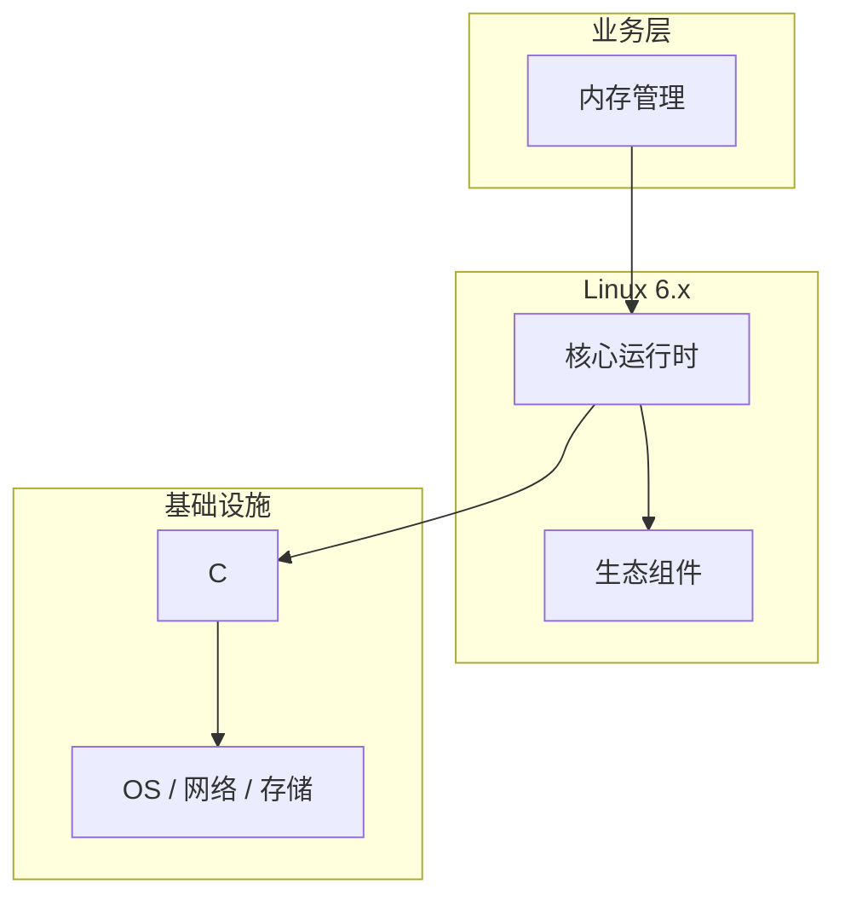

# 内存管理核心概念与原理

> **领域**：Linux内核 ｜ **模块**：内存管理 ｜ **难度**：进阶 ｜ **类型**：基础概念

## 导读

本章系统讲解 **Linux内核** 中 **内存管理** 的相关知识（基础概念）。本章建立 **内存管理** 的概念模型与工作原理，是后续专题章节的基础。内容基于主流框架与工程实践撰写，不依赖过时概念堆砌。

## 核心知识

内核通过伙伴系统管理页框、SLUB 分配内核对象、VMA 描述进程虚拟地址空间。缺页异常驱动按需分配与 page cache 填充。

### 核心知识

**1. 伙伴系统**

按 2^n 页合并空闲块；zone 区分 DMA、NORMAL、HIGHMEM 满足不同寻址需求。

**2. SLUB**

内核对象高速缓存，per-CPU slab 降低锁争用，kmalloc 最终来源。

**3. VMA 与页表**

vm_area_struct 描述区间；四级页表 PGD→PUD→PMD→PTE 完成地址翻译。

**4. 页缓存**

文件读入 page cache，writeback 按 pdflush 策略刷脏页到块设备。

**5. OOM Killer**

内存耗尽按 badness 选进程终止，oom_score_adj 可保护关键服务。

## 架构与流程

## 技术详解

### 基础理解

内核通过伙伴系统管理页框、SLUB 分配内核对象、VMA 描述进程虚拟地址空间。缺页异常驱动按需分配与 page cache 填充。

vm.swappiness 调换出；numactl 绑内存节点；监控 /proc/meminfo 与 smaps PSS。

## 原理与实现

### 工作机制

首次访问触发缺页，handle_pte_fault 分配页框建 PTE；文件映射 MAP_SHARED 多进程共享 page cache 页。

### 内部实现

reverse mapping 支持回收；kswapd 回收 LRU 链表；THP 减少 TLB miss 但可能增延迟尖刺。

## 操作流程与实践

### 操作流程

vm.swappiness 调换出；numactl 绑内存节点；监控 /proc/meminfo 与 smaps PSS。

### 配置要点

vm.overcommit_memory、vm.min_free_kbytes；cgroup memory.max；/sys/kernel/mm/hugepages/。

## 性能、安全与排查

### 性能优化

hugetlbfs 大页减 TLB 压力；避免跨 NUMA 远程访问；控制 mmap 数量防 VMA 爆炸。

### 安全注意

KASLR 随机化布局；USERFAULTFD 需防滥用；mlock 敏感数据防换出到磁盘。

### 调试排错

/proc/PID/smaps 分析 PSS；perf mem 记录缺页；kmemleak 检测内核泄漏。

## 案例与选型

### 案例复盘

Redis 因 THP 延迟毛刺，设 transparent_hugepage=madvise 后 P99 稳定。

### 方案对比

jemalloc 多线程扩展性好于 glibc malloc；mmap 大块适合生命周期明确对象。

### 常见误区与纠正

**忽视 swap**

RSS 不高但 swap 满仍严重抖动，需同时看 si/so。

**THP 一律开启**

数据库等延迟敏感场景 THP 合并可能阻塞毫秒级。

**OOM 误杀**

未调 oom_score_adj 导致关键进程被杀引发雪崩。

### 最佳实践

1. 关键进程设 memory.low 或 mlock
2. 监控 pgmajfault
3. 容器设 memory.max 留宿主机余量
4. 大页池启动早期预留

## 巩固建议

建议结合 **Linux内核** 官方文档与小型实验，亲手验证 **内存管理** 的默认行为与边界条件；将本章要点整理为检查清单或 ADR，便于评审与团队 onboarding。

### 本章小结

学完本章，你应能独立说明 **内存管理** 在 Linux内核 中的角色，理解其核心机制，规避常见误区，并在项目中正确运用。

## 延伸学习

- 内存管理的实现机制详解
- 内存管理的关键技术点
- 内存管理的源码级分析
- 内存管理的配置与使用
- 内存管理的常见问题与解决方案

### 延伸阅读

- Linux Kernel: vm/index.rst
- Understanding the Linux Kernel
- man mmap(2), madvise(2)

---
*章节 ID: 041 ｜ 领域: Linux内核*