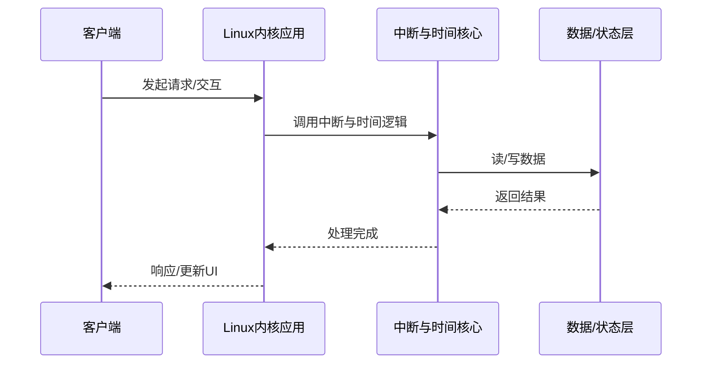

# 中断与时间的底层原理剖析

> **领域**：Linux内核 ｜ **模块**：中断与时间 ｜ **难度**：进阶 ｜ **类型**：底层原理

## 导读

本章属于 **Linux内核** 教程的 **中断与时间** 模块，难度为 **进阶**。阅读重点在于建立清晰的概念模型与工程判断能力，而非死记细节。

## 核心概念

Linux 内核管理进程调度、内存、文件系统、网络与设备驱动，理解内核有助于性能调优、驱动开发与问题根因分析。

在 **Linux内核** 体系中，**中断与时间** 与上下游模块形成协作。技术栈以 **Linux 6.x** 为核心（C），生态包括 kprobe, ftrace, perf。

「中断与时间」是该领域的核心知识模块，理解其原理与边界是工程实践的基础。

### 概念精讲

**中断与时间的基本概念与定义**

从定义出发：它解决什么问题、不解决什么问题，边界在哪里。 在 中断与时间 语境下，这一点直接影响设计决策与故障排查思路。

**中断与时间在Linux内核中的作用与地位**

从结构出发：核心组成部分是什么，彼此如何协作。 在 中断与时间 语境下，这一点直接影响设计决策与故障排查思路。

**中断与时间的核心数据结构**

从流程出发：一次完整调用或生命周期经历哪些阶段。 在 中断与时间 语境下，这一点直接影响设计决策与故障排查思路。

**中断与时间的关键算法与流程**

从数据出发：输入输出是什么格式，状态如何变迁。 在 中断与时间 语境下，这一点直接影响设计决策与故障排查思路。

**中断与时间与其他模块的关系**

从关系出发：它与上下游模块的依赖与接口契约。 在 中断与时间 语境下，这一点直接影响设计决策与故障排查思路。

## 架构与流程

以下框图帮助你在宏观层面把握模块协作关系与处理流向：

## 深度讲解

### 底层视角

中断与时间 最终转化为内存读写、系统调用、网络 I/O、线程调度。页大小、锁粒度、网络 RTT 等约束依然存在。

### 内存与资源

关注分配模式、对象池、临时对象风暴、大对象存储。资源泄漏缓慢累积，看趋势而非瞬时值。

### 硬件协同

缓存友好性、NUMA、顺序读 vs 随机读，影响极限负载表现。

### 落地检查清单

- **掌握中断与时间的调优技巧与最佳实践**：落地时需明确验收标准与回滚方案。
- **了解中断与时间在实际项目中的应用案例**：落地时需明确验收标准与回滚方案。
- **理解中断与时间的设计思想与适用场景**：落地时需明确验收标准与回滚方案。
- **掌握中断与时间的核心API与配置项**：落地时需明确验收标准与回滚方案。

### 常见误区与应对

**误区：对中断与时间的概念理解不深入导致误用**

**应对**：回到官方定义画一张概念图，与同事讲解一遍，确保能用自己的话复述。

**误区：忽略中断与时间的性能边界与限制条件**

**应对**：用 Profiler 或压测建立基线，对比优化前后数据，避免凭感觉优化。

**误区：中断与时间配置不当引发的问题**

**应对**：核对环境变量、配置文件与部署清单是否一致，使用配置 diff 工具排查。

**误区：缺乏对中断与时间底层原理的理解**

**应对**：阅读官方文档与一篇深度文章，结合小实验验证理解。

**误区：中断与时间与其他模块集成时的兼容性问题**

**应对**：列出依赖版本矩阵，在 CI 中跑集成测试覆盖主要组合。

### 最佳实践

1. **遵循中断与时间的官方推荐用法与规范** — 落地方式：写入团队 Wiki 并纳入 Code Review 检查项。

2. **在理解原理的基础上合理使用中断与时间** — 落地方式：配置静态检查或 CI 规则自动拦截违规写法。

3. **建立完善的中断与时间监控与告警机制** — 落地方式：在新人 onboarding 中作为必修内容讲解。

4. **编写充分的测试用例覆盖中断与时间的各种场景** — 落地方式：每季度回顾一次，对照社区最佳实践更新。

5. **持续关注中断与时间的版本更新与最佳实践演进** — 落地方式：用真实项目案例演示正确与错误对比。

### 本章小结

学完本章，你应能：

- 说清 **中断与时间的底层原理剖析** 在 Linux内核/中断与时间 中的定位。
- 描述核心流程与关键概念，能用自己的话复述。
- 识别常见误区并采取预防与排查手段。
- 在项目中做出与场景匹配的工程决策。

类型：**底层原理**。建议完成小练习或复盘笔记，将阅读转化为能力。

## 延伸学习

建议结合以下同模块章节继续阅读，构建完整知识链：

- 中断与时间的实战案例分析
- 中断与时间的设计思想与演进
- 中断与时间的调试与排错
- 中断与时间的安全注意事项

### 参考资料

- Linux内核官方文档 - 中断与时间章节
- 《Linux内核权威指南》相关章节
- 中断与时间源码实现与注释
- Linux内核社区最佳实践文章
- 中断与时间相关技术博客与教程

---
*章节 ID: 072 ｜ 领域: Linux内核 ｜ 版本: 2.0*