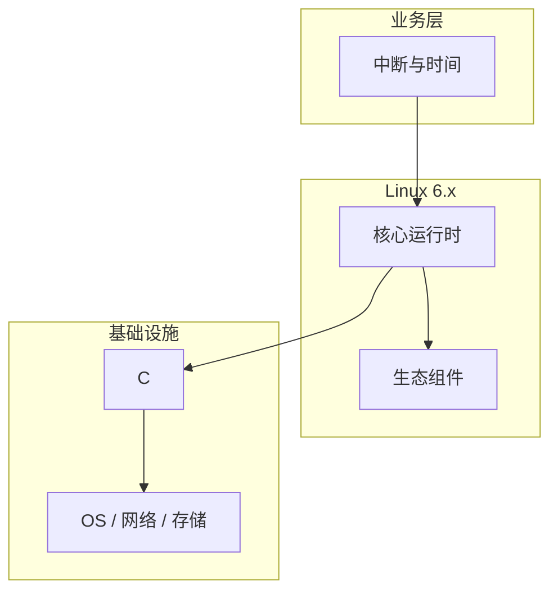

# 原理剖析：中断与时间在Linux内核中的应用

> **领域**：Linux内核 ｜ **模块**：中断与时间 ｜ **难度**：进阶 ｜ **类型**：底层原理

## 导读

本章系统讲解 **Linux内核** 中 **中断与时间** 的相关知识（底层原理）。本章从底层原理出发拆解 **中断与时间** 与运行时、内核或协议栈的交互。内容基于主流框架与工程实践撰写，不依赖过时概念堆砌。

## 核心知识

硬件通过中断通知 CPU；Linux 将处理拆为硬中断顶半部与 softirq/tasklet/工作队列底半部。时钟源与 hrtimer 驱动调度与定时器。

### 核心知识

**1. 软中断**

NET_RX、TIMER 等在内核上下文批量处理，ksoftirqd 线程辅助。

**2. IRQ 处理**

request_irq 注册 handler；顶半部快速应答，耗时工作 deferred 到底半部。

**3. 时钟源**

TSC/HPET/arch_timer 经 clocksource 框架选择；jiffies 为全局节拍。

**4. hrtimer**

纳秒级高精度定时器，支撑 nanosleep、itimer 与多媒体同步。

## 架构与流程

## 技术详解

### 底层原理

设备断言 IRQ→do_IRQ 调用 handler→软中断或 threaded IRQ 处理数据；NAPI 网卡收包典型路径。

## 原理与实现

### 工作机制

设备断言 IRQ→do_IRQ 调用 handler→软中断或 threaded IRQ 处理数据；NAPI 网卡收包典型路径。

### 内部实现

local_irq_save 防重入；IRQ affinity 绑核分散负载；NTP 调整 timekeeping。

## 操作流程与实践

### 操作流程

echo CPU mask > /proc/irq/N/smp_affinity；chrony 同步；clock_gettime(CLOCK_MONOTONIC) 测间隔。

### 配置要点

/proc/interrupts 观察分布；threadirqs 内核参数；ethtool 中断合并参数。

## 性能、安全与排查

### 性能优化

中断合并降低 PPS 但增延迟；RPS/RFS 分散软中断到处理 CPU。

### 安全注意

中断风暴可致锁死；rate limit 未知 IRQ；限制 timer_create 滥用。

### 调试排错

trace_irqsoff 找关中断过长；ftrace irq 事件；cat /proc/interrupts 对比各 CPU。

## 案例与选型

### 案例复盘

10GbE 中断全在 CPU0，配置 RSS 与 irqbalance 后吞吐提升 40%。

### 方案对比

tickless 适合 idle 多的服务器；实时系统可能固定 tick 便于确定性采样。

### 常见误区与纠正

**硬中断做重活**

IRQ handler 里持锁过久导致丢包与 watchdog 超时。

**NTP 时间回拨**

未用 monotonic 时钟，step 导致定时器错乱。

**IRQ 全堆一核**

未设 affinity，网络与磁盘中断争用单核。

### 最佳实践

1. 网卡开启 NAPI 与合理 coalescing
2. 生产用 chrony 监控 offset
3. 延迟测量用 MONOTONIC_RAW
4. 高 PPS 评估 XDP

## 巩固建议

建议结合 **Linux内核** 官方文档与小型实验，亲手验证 **中断与时间** 的默认行为与边界条件；将本章要点整理为检查清单或 ADR，便于评审与团队 onboarding。

### 本章小结

学完本章，你应能独立说明 **中断与时间** 在 Linux内核 中的角色，理解其核心机制，规避常见误区，并在项目中正确运用。

## 延伸学习

- 中断与时间核心概念与原理
- 中断与时间的实现机制详解
- 中断与时间的关键技术点
- 中断与时间的源码级分析
- 中断与时间的配置与使用

### 延伸阅读

- Linux Kernel: core-api/interrupts.rst
- Documentation/timers/NO_HZ.txt
- man clock_gettime(3)

---
*章节 ID: 078 ｜ 领域: Linux内核*