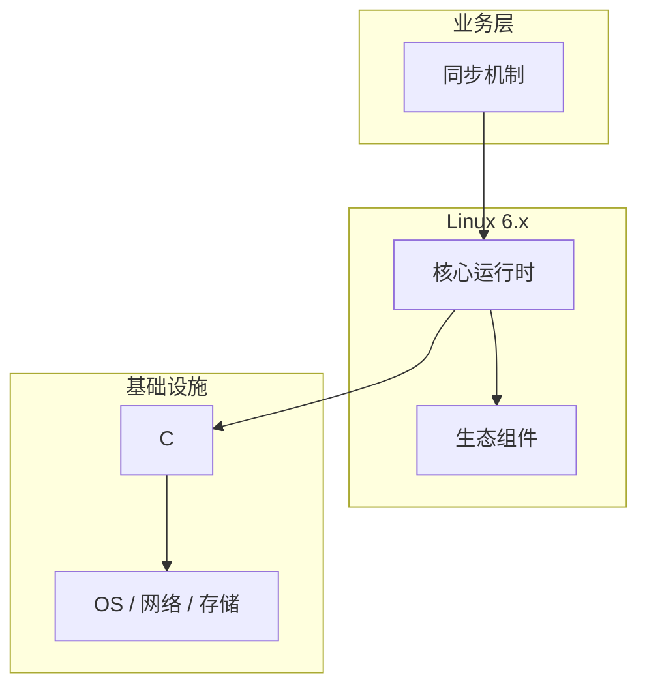

# 同步机制的调试与排错

> **领域**：Linux内核 ｜ **模块**：同步机制 ｜ **难度**：进阶 ｜ **类型**：调试排错

## 导读

本章系统讲解 **Linux内核** 中 **同步机制** 的相关知识（调试排错）。本章提供 **同步机制** 的调试工具链、日志/trace 解读与最小复现方法。内容基于主流框架与工程实践撰写，不依赖过时概念堆砌。

## 核心知识

多核并发访问共享数据需自旋锁、mutex、rwsem、RCU 等原语，在正确性与性能间权衡，并配合内存屏障防止 CPU 重排。

### 核心知识

**1. spinlock**

忙等适合极短临界区；不可在可能睡眠的硬中断上下文用 mutex。

**2. mutex**

睡眠锁，争用线程入队阻塞，适合持锁时间较长的路径。

**3. rwsem**

读者共享写者独占，读多写少降低争用。

**4. RCU**

读侧无锁，写者延迟释放，适合以遍历为主的数据结构。

## 架构与流程

## 技术详解

### 调试排错

锁争用导致 cache line bouncing；per-CPU 变量减少共享；RCU grace period 后安全 kfree。

## 原理与实现

### 工作机制

锁争用导致 cache line bouncing；per-CPU 变量减少共享；RCU grace period 后安全 kfree。

### 内部实现

futex 支撑用户态 pthread mutex；lockdep 检测死锁；PREEMPT_RT 将部分 spinlock 转 mutex。

## 操作流程与实践

### 操作流程

内核 spin_lock_irqsave；用户态 pthread_mutex；定义全局锁顺序防 AB-BA 死锁。

### 配置要点

CONFIG_PROVE_LOCKING、CONFIG_KCSAN 调试构建；应用 -fsanitize=thread。

## 性能、安全与排查

### 性能优化

缩小临界区、读写分离、per-CPU 缓存；RCU 读多写少最优。

### 安全注意

竞态可导致权限提升；HARDENED_USERCOPY 缓解堆溢出；锁未初始化是 CVE 常见根因。

### 调试排错

perf lock 统计争用；/proc/lockdep；ftrace 跟踪 mutex_lock 慢路径。

## 案例与选型

### 案例复盘

全局计数器改 per-CPU 累加后汇总，锁争用消失，QPS 提升 15%。

### 方案对比

spinlock 不可睡眠；RCU 读扩展性好但写延迟高；seqlock 适合 jiffies 等低频写。

### 常见误区与纠正

**中断上下文用 mutex**

触发 sleeping in invalid context 内核崩溃。

**锁粒度过大**

大锁限制多核扩展，应拆分或改用 RCU。

**RCU 过早释放**

未 synchronize_rcu 即 kfree 导致 use-after-free。

### 最佳实践

1. 文档化锁获取顺序
2. 读多写少用 RCU
3. 测试内核开 lockdep
4. 热点用无锁环形队列

## 巩固建议

建议结合 **Linux内核** 官方文档与小型实验，亲手验证 **同步机制** 的默认行为与边界条件；将本章要点整理为检查清单或 ADR，便于评审与团队 onboarding。

### 本章小结

学完本章，你应能独立说明 **同步机制** 在 Linux内核 中的角色，理解其核心机制，规避常见误区，并在项目中正确运用。

## 延伸学习

- 同步机制核心概念与原理
- 同步机制的实现机制详解
- 同步机制的关键技术点
- 同步机制的源码级分析
- 同步机制的配置与使用

### 延伸阅读

- Linux Kernel: RCU/index.rst
- Is Parallel Programming Hard
- man pthread_mutex(3)

---
*章节 ID: 093 ｜ 领域: Linux内核*