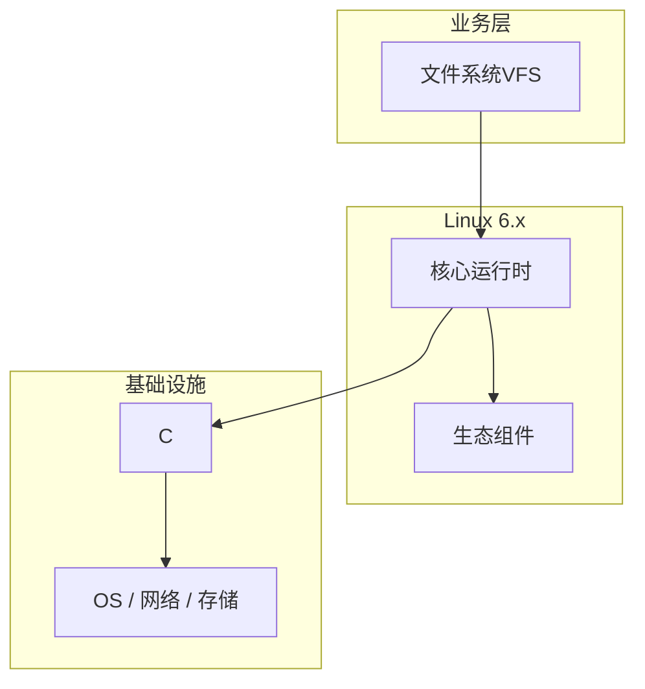

# 源码解读：文件系统VFS在Linux内核中的应用

> **领域**：Linux内核 ｜ **模块**：文件系统VFS ｜ **难度**：高级 ｜ **类型**：源码分析

## 导读

本章系统讲解 **Linux内核** 中 **文件系统VFS** 的相关知识（源码分析）。本章沿源码与调用链剖析 **文件系统VFS** 的实现，适合需要排障或二次开发的读者。内容基于主流框架与工程实践撰写，不依赖过时概念堆砌。

## 核心知识

VFS 统一 inode、dentry、file 抽象，ext4/xfs/btrfs 实现 super_block 操作表。路径解析与页缓存协作完成读写。

### 核心知识

**1. dentry 缓存**

目录项哈希加速路径查找；negative dentry 缓存不存在路径。

**2. inode**

文件元数据：权限、大小、时间戳；i_mapping 指向 page cache 地址空间。

**3. file 对象**

打开文件实例，f_op 读写；与进程 fd 表通过 struct file 关联。

**4. ext4 日志**

journal 保证元数据一致性，ordered 模式兼顾性能与安全。

## 架构与流程

## 技术详解

### 源码与实现

open 经 path_lookup 遍历 dentry→inode_permission 检查→read 命中 page cache 或 read_folio 读盘。

## 原理与实现

### 工作机制

open 经 path_lookup 遍历 dentry→inode_permission 检查→read 命中 page cache 或 read_folio 读盘。

### 内部实现

bio 提交块层；ext4 extent 树管理映射；overlayfs 联合挂载容器镜像层。

## 操作流程与实践

### 操作流程

挂载 noatime、discard；fstrim 回收 SSD；数据库目录单独挂载调优。

### 配置要点

fstab 选项；sysctl fs.aio-max-nr；/sys/block/*/queue 调度器。

## 性能、安全与排查

### 性能优化

顺序写与 readahead；XFS 大文件并行扩展性好；避免过度 fsync。

### 安全注意

nosuid、nodev 挂载；SELinux 文件上下文；fscrypt 静态加密。

### 调试排错

strace open/stat；blktrace；iostat -x 看 await 与 util。

## 案例与选型

### 案例复盘

日志服务迁 XFS 并调队列深度，磁盘 util 降 30%。

### 方案对比

ext4 通用；xfs 大文件优；btrfs 快照校验但运维复杂。

## 本章聚焦

源码阅读 **文件系统VFS** 宜采用「由外向内」：先跟一次主路径请求，再展开分支与错误处理，避免陷入细节迷失主线。

### 常见误区与纠正

**忽视 atime**

数据库目录应 noatime 减写放大。

**DIO 未对齐**

O_DIRECT 要求扇区对齐否则失败。

**dentry 撑爆内存**

海量小文件遍历耗尽 RAM，调 vfs_cache_pressure。

### 最佳实践

1. 关键数据目录单独挂载
2. 定期 fstrim
3. 理解 journal 模式
4. 容器注意 overlay 写层性能

## 巩固建议

建议结合 **Linux内核** 官方文档与小型实验，亲手验证 **文件系统VFS** 的默认行为与边界条件；将本章要点整理为检查清单或 ADR，便于评审与团队 onboarding。

### 本章小结

学完本章，你应能独立说明 **文件系统VFS** 在 Linux内核 中的角色，理解其核心机制，规避常见误区，并在项目中正确运用。

## 延伸学习

- 文件系统VFS核心概念与原理
- 文件系统VFS的实现机制详解
- 文件系统VFS的关键技术点
- 文件系统VFS的源码级分析
- 文件系统VFS的配置与使用

### 延伸阅读

- Linux Kernel: filesystems/vfs.rst
- ext4.wiki.kernel.org
- man open(2), mount(8)

---
*章节 ID: 120 ｜ 领域: Linux内核*