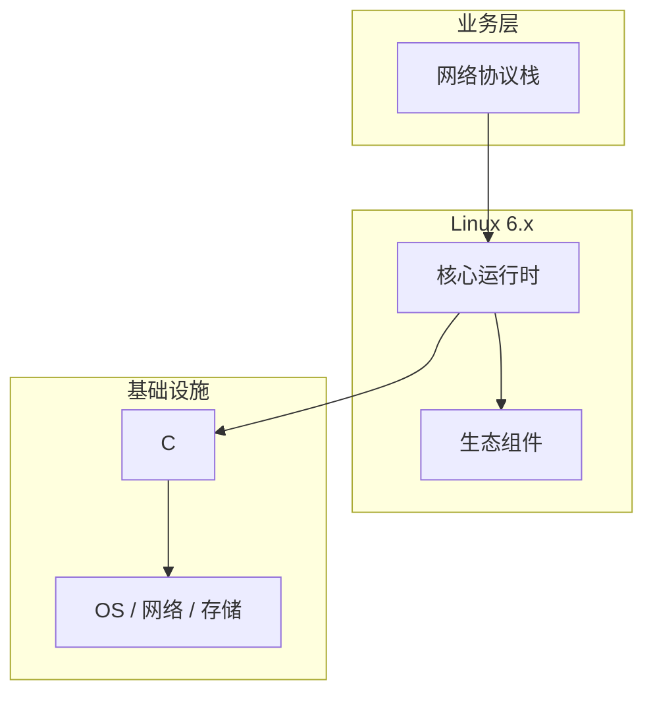

# 网络协议栈的关键技术点

> **领域**：Linux内核 ｜ **模块**：网络协议栈 ｜ **难度**：高级 ｜ **类型**：关键技术

## 导读

本章系统讲解 **Linux内核** 中 **网络协议栈** 的相关知识（关键技术）。本章归纳 **网络协议栈** 在生产环境中最常用、最易出错的关键技术点。内容基于主流框架与工程实践撰写，不依赖过时概念堆砌。

## 核心知识

内核网络栈自 socket 经 TCP/IP 到 NIC 驱动分层处理，sk_buff 贯穿各层，NAPI 与 GRO 提升收包效率。

### 核心知识

**1. TCP 状态机**

三次握手、滑动窗口；拥塞控制 Reno/CUBIC/BBR 调节发送速率。

**2. sk_buff**

网络包描述符，head/data/tail/end 指针支持协议头推拉。

**3. struct sock**

协议无关 socket；connect/sendmsg 进入 TCP/UDP 实现。

**4. FIB 路由**

最长前缀匹配选路；ARP/NDISC 解析下一跳 L2 地址。

## 架构与流程

## 技术详解

### 关键技术

收包 NIC DMA→硬中断 NAPI poll→协议栈解析→socket 接收队列；发包经 qdisc 排队驱动 DMA。

## 原理与实现

### 工作机制

收包 NIC DMA→硬中断 NAPI poll→协议栈解析→socket 接收队列；发包经 qdisc 排队驱动 DMA。

### 内部实现

tcp_congestion_control 可插拔；XDP 驱动入口早期过滤；kTLS 内核态 TLS 卸载。

## 操作流程与实践

### 操作流程

sysctl net.core/net.ipv4；ss -tin 看缓冲区；ethtool -g 调 ring；BBR 需 fq qdisc。

### 配置要点

sysctl.d 网络调优；tc qdisc；tcp_congestion_control 切换。

## 性能、安全与排查

### 性能优化

调 rmem/wmem；TSO/GSO；RPS 分散软中断；本机转发评估 sockmap。

### 安全注意

SYN cookie；rp_filter 反欺骗；nft 限速；TLS 保护数据面。

### 调试排错

tcpdump；ss -s；dropwatch；bpftrace 跟踪内核网络事件。

## 案例与选型

### 案例复盘

CDN 节点启用 BBR+fq，跨洲 RTT 200ms 吞吐较 cubic 提升约 25%。

### 方案对比

CUBIC 丢包驱动降窗；BBR 模型带宽延迟，需注意缓冲区膨胀与公平性。

## 本章聚焦

**网络协议栈** 的关键技术往往集中在默认配置与边界行为；生产问题多源于「以为懂了」的细节，应用 checklist 逐项验证。

### 常见误区与纠正

**半连接队列溢出**

somaxconn 与 sync backlog 过小致 connect 超时。

**rp_filter 误杀**

非对称路由环境丢合法包。

**未区分 GRO 与线速**

tcpdump 见大包是聚合结果非异常。

### 最佳实践

1. 调优前建 ss/nstat 基线
2. 长连接注意 keepalive
3. 多队列配 RSS/RPS
4. 防火墙处理 ESTABLISHED

## 巩固建议

建议结合 **Linux内核** 官方文档与小型实验，亲手验证 **网络协议栈** 的默认行为与边界条件；将本章要点整理为检查清单或 ADR，便于评审与团队 onboarding。

### 本章小结

学完本章，你应能独立说明 **网络协议栈** 在 Linux内核 中的角色，理解其核心机制，规避常见误区，并在项目中正确运用。

## 延伸学习

- 网络协议栈核心概念与原理
- 网络协议栈的实现机制详解
- 网络协议栈的源码级分析
- 网络协议栈的配置与使用
- 网络协议栈的常见问题与解决方案

### 延伸阅读

- Linux Kernel: networking/index.rst
- TCP/IP Illustrated Vol.1
- man tcp(7), ip(7)

---
*章节 ID: 123 ｜ 领域: Linux内核*