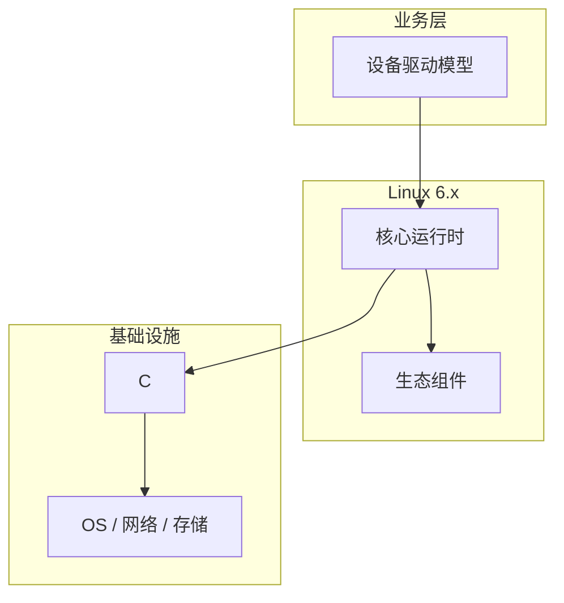

# 设备驱动模型的安全注意事项

> **领域**：Linux内核 ｜ **模块**：设备驱动模型 ｜ **难度**：高级 ｜ **类型**：安全实践

## 导读

本章系统讲解 **Linux内核** 中 **设备驱动模型** 的相关知识（安全实践）。本章说明 **设备驱动模型** 相关的威胁面、防护基线与合规注意点。内容基于主流框架与工程实践撰写，不依赖过时概念堆砌。

## 核心知识

Linux 设备模型用 bus、device、driver 与 class 统一枚举匹配，sysfs 暴露属性，uevent 通知 udev 创建设备节点。

### 核心知识

**1. kobject/sysfs**

内核对象与 sysfs 目录对应，供 udev 与调试读写属性。

**2. 总线匹配**

match 比较 id_table 与硬件 ID，probe 初始化，remove 释放资源。

**3. platform 设备**

板级固定资源，设备树 compatible 关联驱动。

**4. runtime PM**

按需启停时钟与电源域，system PM 配合休眠唤醒。

## 架构与流程

## 技术详解

### 安全实践

设备注册后遍历驱动列表调用 probe；driver core 维护 devices_kset 与 module 引用计数。

## 原理与实现

### 工作机制

设备注册后遍历驱动列表调用 probe；driver core 维护 devices_kset 与 module 引用计数。

### 内部实现

设备树 reg/interrupts 描述资源；defer probe 等待依赖提供者就绪。

## 操作流程与实践

### 操作流程

编写 platform_driver；lspci -k 查看绑定；modprobe 加载模块；udev rules 设权限。

### 配置要点

/etc/modprobe.d；udev rules；设备树 overlay 动态加载。

## 性能、安全与排查

### 性能优化

MSI 优于共享 IRQ；probe 避免长 sleep；threaded IRQ 降硬中断延迟。

### 安全注意

sysfs 写属性需权限检查；DMA 经 IOMMU 映射；ioctl 校验 capability。

### 调试排错

dynamic_debug；debugfs 寄存器 dump；ftrace probe 函数。

## 案例与选型

### 案例复盘

I2C 传感器按 binding 填 compatible，probe 读 chip ID 失败打印明确错误加速联调。

### 方案对比

platform/PCI/USB 资源发现方式不同，probe/remove 生命周期类似。

## 本章聚焦

**设备驱动模型** 的安全基线包括：最小权限、输入校验、敏感数据保护、审计日志与依赖漏洞跟踪；变更前做威胁建模，避免在日志中泄露密钥或 PII。

### 常见误区与纠正

**probe 顺序依赖**

未 defer 依赖时钟/GPIO 导致随机失败。

**sysfs 滥写**

无权限 writable attribute 可被本地提权。

**probe 泄漏资源**

错误路径未 devres 管理导致泄漏。

### 最佳实践

1. 遵循 devicetree bindings
2. probe 用 dev_info 分级日志
3. 实现 runtime suspend
4. 提交前 checkpatch

## 巩固建议

建议结合 **Linux内核** 官方文档与小型实验，亲手验证 **设备驱动模型** 的默认行为与边界条件；将本章要点整理为检查清单或 ADR，便于评审与团队 onboarding。

### 本章小结

学完本章，你应能独立说明 **设备驱动模型** 在 Linux内核 中的角色，理解其核心机制，规避常见误区，并在项目中正确运用。

## 延伸学习

- 设备驱动模型核心概念与原理
- 设备驱动模型的实现机制详解
- 设备驱动模型的关键技术点
- 设备驱动模型的源码级分析
- 设备驱动模型的配置与使用

### 延伸阅读

- Linux Kernel: driver-api/index.rst
- Linux Device Drivers 3e
- Documentation/ABI/stable/sysfs-*

---
*章节 ID: 154 ｜ 领域: Linux内核*