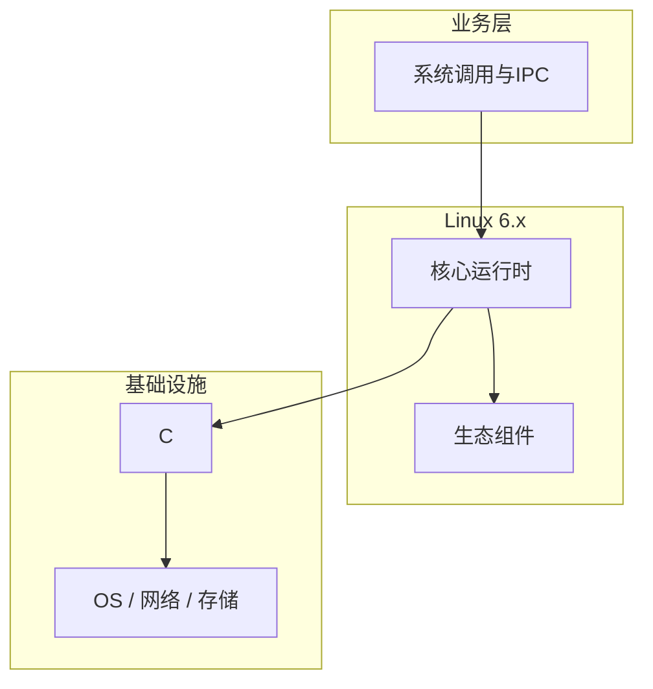

# 系统调用与IPC的调试与排错

> **领域**：Linux内核 ｜ **模块**：系统调用与IPC ｜ **难度**：实战 ｜ **类型**：调试排错

## 导读

本章系统讲解 **Linux内核** 中 **系统调用与IPC** 的相关知识（调试排错）。本章提供 **系统调用与IPC** 的调试工具链、日志/trace 解读与最小复现方法。内容基于主流框架与工程实践撰写，不依赖过时概念堆砌。

## 核心知识

系统调用是用户态进入内核网关，经 syscall 指令触发。IPC 含管道、信号、共享内存、消息队列与 Unix domain socket。

### 核心知识

**1. syscall 入口**

x86_64 syscall 指令查 sys_call_table 分发，保存 pt_regs。

**2. VDSO**

用户态映射内核页，gettimeofday 等无需陷入。

**3. pipe/FIFO**

pipe 单向字节流；mkfifo 命名管道供无关进程通信。

**4. 共享内存**

shmget/shmat 映射同页，需信号量或 mutex 同步。

## 架构与流程

## 技术详解

### 调试排错

libc 包装 syscall；seccomp 过滤；copy_from_user 防非法指针访问。

## 原理与实现

### 工作机制

libc 包装 syscall；seccomp 过滤；copy_from_user 防非法指针访问。

### 内部实现

futex 支撑 pthread；eventfd/signalfd 与 epoll 集成；pidfd 进程管理新接口。

## 操作流程与实践

### 操作流程

strace 观察；pipe 父子通信；mmap MAP_SHARED 大数据；socketpair 全双工。

### 配置要点

kernel.yama.ptrace_scope；RLIMIT_MSGQUEUE；seccomp 配置文件。

## 性能、安全与排查

### 性能优化

批量 read/write；splice 零拷贝；sendmmsg 批量网络 I/O。

### 安全注意

seccomp-bpf 白名单；user namespace 隔离 IPC；ptrace_scope 限制调试。

### 调试排错

strace -f -tt；perf trace；auditd 记录敏感 syscall。

## 案例与选型

### 案例复盘

日志代理用 splice 零拷贝 pipe 到 socket，CPU 降半。

### 方案对比

pipe 简单单向；socket 可全双工传 fd；shm 最快需自管同步。

### 常见误区与纠正

**TOCTOU**

access 与 open 之间文件被替换，应 O_NOFOLLOW。

**共享内存无锁**

多写者数据损坏。

**seccomp 过宽**

允许 execve 使沙箱失效。

### 最佳实践

1. 大块数据用 mmap
2. 容器审阅默认 seccomp
3. Unix socket 做进程通知
4. strace 仅排障用

## 巩固建议

建议结合 **Linux内核** 官方文档与小型实验，亲手验证 **系统调用与IPC** 的默认行为与边界条件；将本章要点整理为检查清单或 ADR，便于评审与团队 onboarding。

### 本章小结

学完本章，你应能独立说明 **系统调用与IPC** 在 Linux内核 中的角色，理解其核心机制，规避常见误区，并在项目中正确运用。

## 延伸学习

- 系统调用与IPC核心概念与原理
- 系统调用与IPC的实现机制详解
- 系统调用与IPC的关键技术点
- 系统调用与IPC的源码级分析
- 系统调用与IPC的配置与使用

### 延伸阅读

- Linux Kernel: core-api/syscall-api.rst
- man syscalls(2), unix(7)
- seccomp(2)

---
*章节 ID: 173 ｜ 领域: Linux内核*