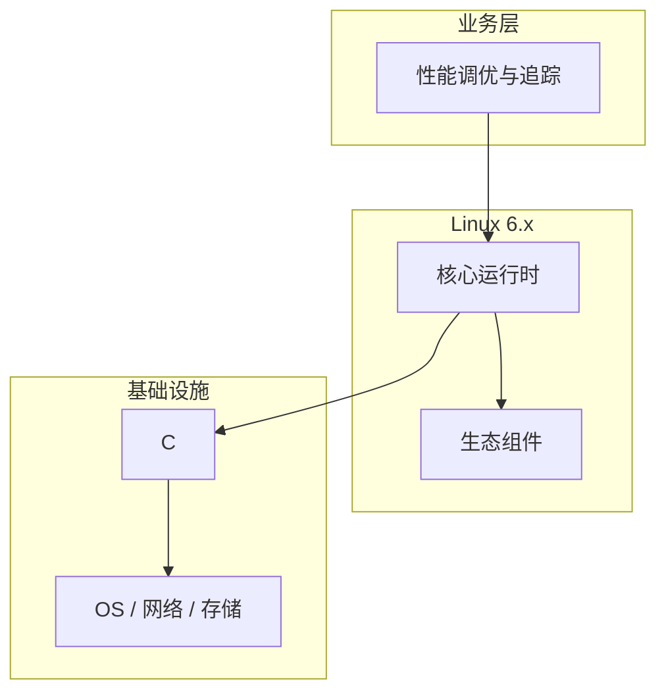

# 性能调优与追踪的配置与使用

> **领域**：Linux内核 ｜ **模块**：性能调优与追踪 ｜ **难度**：实战 ｜ **类型**：配置实践

## 导读

本章系统讲解 **Linux内核** 中 **性能调优与追踪** 的相关知识（配置实践）。本章讲解 **性能调优与追踪** 的配置项含义、环境差异与验证方法，强调可重复部署。内容基于主流框架与工程实践撰写，不依赖过时概念堆砌。

## 核心知识

内核提供 perf、ftrace、bcc/eBPF 观测与调优，从 PMU 计数到动态追踪函数与内核态可编程分析。

### 核心知识

**1. perf_event**

PMU 采样 CPU cycles、cache miss、page fault 等事件。

**2. ftrace**

函数图、irqsoff、调度跟踪，tracefs 控制。

**3. eBPF**

验证后加载字节码，kprobe/tracepoint 聚合指标或 XDP 处理。

**4. kprobes**

动态插桩内核函数，需控制 overhead。

## 架构与流程

## 技术详解

### 配置实践

perf mmap 环形缓冲读样本；eBPF verifier 保证安全，map 与用户态交互。

## 原理与实现

### 工作机制

perf mmap 环形缓冲读样本；eBPF verifier 保证安全，map 与用户态交互。

### 内部实现

BPF JIT 编译本地指令；uprobes 用户态插桩；ring buffer 多 CPU 无锁。

## 操作流程与实践

### 操作流程

perf record/report；bpftrace 一行脚本；trace-cmd 录制；调优前建 baseline。

### 配置要点

kernel.perf_event_paranoid；挂载 debugfs、bpffs。

## 性能、安全与排查

### 性能优化

先算法与 I/O 优化；off-CPU 分析锁与等待；NUMA 本地性。

### 安全注意

eBPF 需 CAP_BPF；kprobes 误用可崩内核；生产控制采样率。

### 调试排错

perf sched timehist；bpftrace -e；function_graph tracer。

## 案例与选型

### 案例复盘

perf 显示 mutex 热点，改无锁队列后 P99 降 60%。

### 方案对比

perf 通用采样；eBPF 可定制聚合与内核过滤，适合生产常驻。

## 本章聚焦

**性能调优与追踪** 配置应外部化并分环境管理；关键项在文档中注明默认值、取值范围与生产推荐值，纳入 Code Review。

### 常见误区与纠正

**只盯 CPU**

iowait 高时优化算法无效。

**追踪开销过大**

100% 采样 Heisenberg 效应。

**符号未解析**

缺 debuginfo 火焰图仅见地址。

### 最佳实践

1. linux-tools 匹配内核版本
2. CI perf stat 回归
3. eBPF 检测内核能力
4. on+off CPU 火焰图结合

## 巩固建议

建议结合 **Linux内核** 官方文档与小型实验，亲手验证 **性能调优与追踪** 的默认行为与边界条件；将本章要点整理为检查清单或 ADR，便于评审与团队 onboarding。

### 本章小结

学完本章，你应能独立说明 **性能调优与追踪** 在 Linux内核 中的角色，理解其核心机制，规避常见误区，并在项目中正确运用。

## 延伸学习

- 性能调优与追踪核心概念与原理
- 性能调优与追踪的实现机制详解
- 性能调优与追踪的关键技术点
- 性能调优与追踪的源码级分析
- 性能调优与追踪的常见问题与解决方案

### 延伸阅读

- perf.wiki.kernel.org
- BPF Performance Tools (Gregg)
- Documentation/trace/ftrace.rst

---
*章节 ID: 185 ｜ 领域: Linux内核*
> 已合并至 csdn-merged/Linux内核-性能调优与追踪完整篇.md（2026-09-03）
