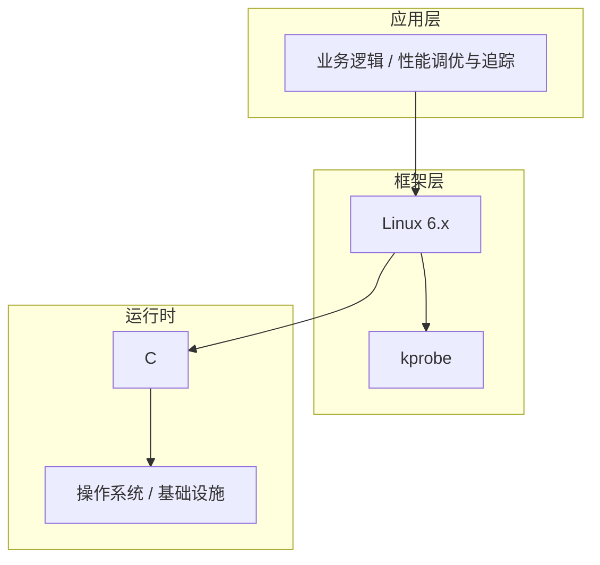

# 性能调优与追踪的高级应用场景

> **领域**：Linux内核 ｜ **模块**：性能调优与追踪 ｜ **难度**：实战 ｜ **类型**：高级应用

## 导读

本章属于 **Linux内核** 教程的 **性能调优与追踪** 模块，难度为 **实战**。阅读重点在于建立清晰的概念模型与工程判断能力，而非死记细节。

## 核心概念

Linux 内核管理进程调度、内存、文件系统、网络与设备驱动，理解内核有助于性能调优、驱动开发与问题根因分析。

在 **Linux内核** 体系中，**性能调优与追踪** 与上下游模块形成协作。技术栈以 **Linux 6.x** 为核心（C），生态包括 kprobe, ftrace, perf。

「性能调优与追踪」是该领域的核心知识模块，理解其原理与边界是工程实践的基础。

### 概念精讲

**性能调优与追踪的基本概念与定义**

从实践出发：典型应用场景与反模式（不该用的场景）。 在 性能调优与追踪 语境下，这一点直接影响设计决策与故障排查思路。

**性能调优与追踪在Linux内核中的作用与地位**

从演进出发：历史上为何出现、未来可能如何变化。 在 性能调优与追踪 语境下，这一点直接影响设计决策与故障排查思路。

**性能调优与追踪的核心数据结构**

从度量出发：如何评估它是否工作正常、性能是否达标。 在 性能调优与追踪 语境下，这一点直接影响设计决策与故障排查思路。

**性能调优与追踪的关键算法与流程**

从定义出发：它解决什么问题、不解决什么问题，边界在哪里。 在 性能调优与追踪 语境下，这一点直接影响设计决策与故障排查思路。

**性能调优与追踪与其他模块的关系**

从结构出发：核心组成部分是什么，彼此如何协作。 在 性能调优与追踪 语境下，这一点直接影响设计决策与故障排查思路。

## 架构与流程

以下框图帮助你在宏观层面把握模块协作关系与处理流向：

## 深度讲解

### 进阶场景

高并发、多租户、跨区域、强合规或极端资源约束下，性能调优与追踪 的默认配置往往不够，需深入理解底层。

### 架构模式

分层解耦、异步削峰、缓存分层、多活容灾（定义 RTO/RPO 与 failover）。

### 演进路径

先正确性与可观测，再性能与成本；每步保留回滚能力。

### 落地检查清单

- **理解性能调优与追踪的设计思想与适用场景**：落地时需明确验收标准与回滚方案。
- **掌握性能调优与追踪的核心API与配置项**：落地时需明确验收标准与回滚方案。
- **分析性能调优与追踪的源码实现与调用流程**：落地时需明确验收标准与回滚方案。
- **了解性能调优与追踪的性能特点与瓶颈**：落地时需明确验收标准与回滚方案。

### 常见误区与应对

**误区：对性能调优与追踪的概念理解不深入导致误用**

**应对**：回到官方定义画一张概念图，与同事讲解一遍，确保能用自己的话复述。

**误区：忽略性能调优与追踪的性能边界与限制条件**

**应对**：用 Profiler 或压测建立基线，对比优化前后数据，避免凭感觉优化。

**误区：性能调优与追踪配置不当引发的问题**

**应对**：用 Profiler 或压测建立基线，对比优化前后数据，避免凭感觉优化。

**误区：缺乏对性能调优与追踪底层原理的理解**

**应对**：用 Profiler 或压测建立基线，对比优化前后数据，避免凭感觉优化。

**误区：性能调优与追踪与其他模块集成时的兼容性问题**

**应对**：用 Profiler 或压测建立基线，对比优化前后数据，避免凭感觉优化。

### 最佳实践

1. **遵循性能调优与追踪的官方推荐用法与规范** — 落地方式：写入团队 Wiki 并纳入 Code Review 检查项。

2. **在理解原理的基础上合理使用性能调优与追踪** — 落地方式：配置静态检查或 CI 规则自动拦截违规写法。

3. **建立完善的性能调优与追踪监控与告警机制** — 落地方式：在新人 onboarding 中作为必修内容讲解。

4. **编写充分的测试用例覆盖性能调优与追踪的各种场景** — 落地方式：每季度回顾一次，对照社区最佳实践更新。

5. **持续关注性能调优与追踪的版本更新与最佳实践演进** — 落地方式：用真实项目案例演示正确与错误对比。

### 本章小结

学完本章，你应能：

- 说清 **性能调优与追踪的高级应用场景** 在 Linux内核/性能调优与追踪 中的定位。
- 描述核心流程与关键概念，能用自己的话复述。
- 识别常见误区并采取预防与排查手段。
- 在项目中做出与场景匹配的工程决策。

类型：**高级应用**。建议完成小练习或复盘笔记，将阅读转化为能力。

## 延伸学习

建议结合以下同模块章节继续阅读，构建完整知识链：

- 性能调优与追踪的性能优化技巧
- 性能调优与追踪的最佳实践指南
- 性能调优与追踪的实战案例分析
- 性能调优与追踪的设计思想与演进

### 参考资料

- Linux内核官方文档 - 性能调优与追踪章节
- 《Linux内核权威指南》相关章节
- 性能调优与追踪源码实现与注释
- Linux内核社区最佳实践文章
- 性能调优与追踪相关技术博客与教程

---
*章节 ID: 189 ｜ 领域: Linux内核 ｜ 版本: 2.0*