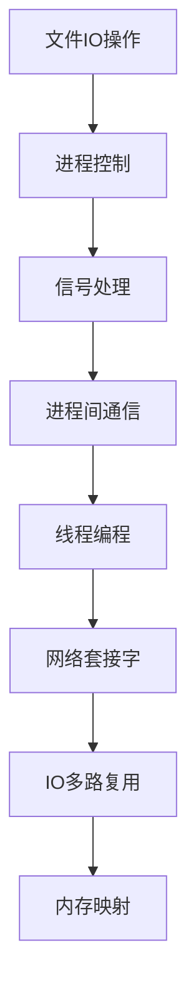

# Linux系统编程 学习指南

> **分类**：系统底层 ｜ **章节总数**：120 ｜ **技术栈**：POSIX

## 领域概述

Linux系统编程是系统底层领域的重要技术方向，本系列从基础到高级逐步深入，涵盖10个核心模块：文件IO操作、进程控制、信号处理、进程间通信、线程编程等。每个知识点作为独立章节，包含原理讲解、实现要点、常见陷阱和最佳实践，配合源码分析和架构图，帮助读者建立完整的Linux系统编程知识体系。

本教程基于 **C** 与 **POSIX** 生态编写，涵盖 glibc, epoll 等主流工具与框架。每章独立成篇，文字精炼、逻辑清晰，适合系统学习与按需查阅。

## 你将学到什么

完成本系列后，你将能够：

- 系统理解 **Linux系统编程** 的核心概念与模块划分。
- 按难度递进掌握从入门到实战的完整知识路径。
- 在工程实践中做出合理的技术判断与问题排查。
- 通过章节索引快速定位所需知识点。

## 前置知识

- 编程基础
- 数据结构
- 计算机基础
- 系统底层基础概念

## 推荐学习路径

1. **文件IO操作**
2. **进程控制**
3. **信号处理**
4. **进程间通信**
5. **线程编程**
6. **网络套接字**
7. **IO多路复用**
8. **内存映射**

## 模块体系

本领域按以下模块组织，难度由浅入深：

- **文件IO操作**
- **进程控制**
- **信号处理**
- **进程间通信**
- **线程编程**
- **网络套接字**
- **IO多路复用**
- **内存映射**
- **终端编程**
- **守护进程与服务**

## 难度分布

| 难度 | 章节数 | 占比 |
|------|--------|------|
| 入门 | 24 | 20% |
| 实战 | 24 | 20% |
| 进阶 | 36 | 30% |
| 高级 | 36 | 30% |

## 章节索引

点击章节标题进入对应教程：

### 文件IO操作

- [文件IO操作核心概念与原理](chapters/001-文件IO操作核心概念与原理.md) ｜ 入门
- [文件IO操作的实现机制详解](chapters/002-文件IO操作的实现机制详解.md) ｜ 入门
- [文件IO操作的关键技术点](chapters/003-文件IO操作的关键技术点.md) ｜ 入门
- [文件IO操作的源码级分析](chapters/004-文件IO操作的源码级分析.md) ｜ 入门
- [文件IO操作的配置与使用](chapters/005-文件IO操作的配置与使用.md) ｜ 入门
- [文件IO操作的常见问题与解决方案](chapters/006-文件IO操作的常见问题与解决方案.md) ｜ 入门
- [文件IO操作的性能优化技巧](chapters/007-文件IO操作的性能优化技巧.md) ｜ 入门
- [文件IO操作的最佳实践指南](chapters/008-文件IO操作的最佳实践指南.md) ｜ 入门
- [文件IO操作的高级应用场景](chapters/009-文件IO操作的高级应用场景.md) ｜ 入门
- [文件IO操作的实战案例分析](chapters/010-文件IO操作的实战案例分析.md) ｜ 入门
- [文件IO操作的设计思想与演进](chapters/011-文件IO操作的设计思想与演进.md) ｜ 入门
- [文件IO操作的底层原理剖析](chapters/012-文件IO操作的底层原理剖析.md) ｜ 入门

### 进程控制

- [进程控制核心概念与原理](chapters/013-进程控制核心概念与原理.md) ｜ 入门
- [进程控制的实现机制详解](chapters/014-进程控制的实现机制详解.md) ｜ 入门
- [进程控制的关键技术点](chapters/015-进程控制的关键技术点.md) ｜ 入门
- [进程控制的源码级分析](chapters/016-进程控制的源码级分析.md) ｜ 入门
- [进程控制的配置与使用](chapters/017-进程控制的配置与使用.md) ｜ 入门
- [进程控制的常见问题与解决方案](chapters/018-进程控制的常见问题与解决方案.md) ｜ 入门
- [进程控制的性能优化技巧](chapters/019-进程控制的性能优化技巧.md) ｜ 入门
- [进程控制的最佳实践指南](chapters/020-进程控制的最佳实践指南.md) ｜ 入门
- [进程控制的高级应用场景](chapters/021-进程控制的高级应用场景.md) ｜ 入门
- [进程控制的实战案例分析](chapters/022-进程控制的实战案例分析.md) ｜ 入门
- [进程控制的设计思想与演进](chapters/023-进程控制的设计思想与演进.md) ｜ 入门
- [进程控制的底层原理剖析](chapters/024-进程控制的底层原理剖析.md) ｜ 入门

### 信号处理

- [信号处理核心概念与原理](chapters/025-信号处理核心概念与原理.md) ｜ 进阶
- [信号处理的实现机制详解](chapters/026-信号处理的实现机制详解.md) ｜ 进阶
- [信号处理的关键技术点](chapters/027-信号处理的关键技术点.md) ｜ 进阶
- [信号处理的源码级分析](chapters/028-信号处理的源码级分析.md) ｜ 进阶
- [信号处理的配置与使用](chapters/029-信号处理的配置与使用.md) ｜ 进阶
- [信号处理的常见问题与解决方案](chapters/030-信号处理的常见问题与解决方案.md) ｜ 进阶
- [信号处理的性能优化技巧](chapters/031-信号处理的性能优化技巧.md) ｜ 进阶
- [信号处理的最佳实践指南](chapters/032-信号处理的最佳实践指南.md) ｜ 进阶
- [信号处理的高级应用场景](chapters/033-信号处理的高级应用场景.md) ｜ 进阶
- [信号处理的实战案例分析](chapters/034-信号处理的实战案例分析.md) ｜ 进阶
- [信号处理的设计思想与演进](chapters/035-信号处理的设计思想与演进.md) ｜ 进阶
- [信号处理的底层原理剖析](chapters/036-信号处理的底层原理剖析.md) ｜ 进阶

### 进程间通信

- [进程间通信核心概念与原理](chapters/037-进程间通信核心概念与原理.md) ｜ 进阶
- [进程间通信的实现机制详解](chapters/038-进程间通信的实现机制详解.md) ｜ 进阶
- [进程间通信的关键技术点](chapters/039-进程间通信的关键技术点.md) ｜ 进阶
- [进程间通信的源码级分析](chapters/040-进程间通信的源码级分析.md) ｜ 进阶
- [进程间通信的配置与使用](chapters/041-进程间通信的配置与使用.md) ｜ 进阶
- [进程间通信的常见问题与解决方案](chapters/042-进程间通信的常见问题与解决方案.md) ｜ 进阶
- [进程间通信的性能优化技巧](chapters/043-进程间通信的性能优化技巧.md) ｜ 进阶
- [进程间通信的最佳实践指南](chapters/044-进程间通信的最佳实践指南.md) ｜ 进阶
- [进程间通信的高级应用场景](chapters/045-进程间通信的高级应用场景.md) ｜ 进阶
- [进程间通信的实战案例分析](chapters/046-进程间通信的实战案例分析.md) ｜ 进阶
- [进程间通信的设计思想与演进](chapters/047-进程间通信的设计思想与演进.md) ｜ 进阶
- [进程间通信的底层原理剖析](chapters/048-进程间通信的底层原理剖析.md) ｜ 进阶

### 线程编程

- [线程编程核心概念与原理](chapters/049-线程编程核心概念与原理.md) ｜ 进阶
- [线程编程的实现机制详解](chapters/050-线程编程的实现机制详解.md) ｜ 进阶
- [线程编程的关键技术点](chapters/051-线程编程的关键技术点.md) ｜ 进阶
- [线程编程的源码级分析](chapters/052-线程编程的源码级分析.md) ｜ 进阶
- [线程编程的配置与使用](chapters/053-线程编程的配置与使用.md) ｜ 进阶
- [线程编程的常见问题与解决方案](chapters/054-线程编程的常见问题与解决方案.md) ｜ 进阶
- [线程编程的性能优化技巧](chapters/055-线程编程的性能优化技巧.md) ｜ 进阶
- [线程编程的最佳实践指南](chapters/056-线程编程的最佳实践指南.md) ｜ 进阶
- [线程编程的高级应用场景](chapters/057-线程编程的高级应用场景.md) ｜ 进阶
- [线程编程的实战案例分析](chapters/058-线程编程的实战案例分析.md) ｜ 进阶
- [线程编程的设计思想与演进](chapters/059-线程编程的设计思想与演进.md) ｜ 进阶
- [线程编程的底层原理剖析](chapters/060-线程编程的底层原理剖析.md) ｜ 进阶

### 网络套接字

- [网络套接字核心概念与原理](chapters/061-网络套接字核心概念与原理.md) ｜ 高级
- [网络套接字的实现机制详解](chapters/062-网络套接字的实现机制详解.md) ｜ 高级
- [网络套接字的关键技术点](chapters/063-网络套接字的关键技术点.md) ｜ 高级
- [网络套接字的源码级分析](chapters/064-网络套接字的源码级分析.md) ｜ 高级
- [网络套接字的配置与使用](chapters/065-网络套接字的配置与使用.md) ｜ 高级
- [网络套接字的常见问题与解决方案](chapters/066-网络套接字的常见问题与解决方案.md) ｜ 高级
- [网络套接字的性能优化技巧](chapters/067-网络套接字的性能优化技巧.md) ｜ 高级
- [网络套接字的最佳实践指南](chapters/068-网络套接字的最佳实践指南.md) ｜ 高级
- [网络套接字的高级应用场景](chapters/069-网络套接字的高级应用场景.md) ｜ 高级
- [网络套接字的实战案例分析](chapters/070-网络套接字的实战案例分析.md) ｜ 高级
- [网络套接字的设计思想与演进](chapters/071-网络套接字的设计思想与演进.md) ｜ 高级
- [网络套接字的底层原理剖析](chapters/072-网络套接字的底层原理剖析.md) ｜ 高级

### IO多路复用

- [IO多路复用核心概念与原理](chapters/073-IO多路复用核心概念与原理.md) ｜ 高级
- [IO多路复用的实现机制详解](chapters/074-IO多路复用的实现机制详解.md) ｜ 高级
- [IO多路复用的关键技术点](chapters/075-IO多路复用的关键技术点.md) ｜ 高级
- [IO多路复用的源码级分析](chapters/076-IO多路复用的源码级分析.md) ｜ 高级
- [IO多路复用的配置与使用](chapters/077-IO多路复用的配置与使用.md) ｜ 高级
- [IO多路复用的常见问题与解决方案](chapters/078-IO多路复用的常见问题与解决方案.md) ｜ 高级
- [IO多路复用的性能优化技巧](chapters/079-IO多路复用的性能优化技巧.md) ｜ 高级
- [IO多路复用的最佳实践指南](chapters/080-IO多路复用的最佳实践指南.md) ｜ 高级
- [IO多路复用的高级应用场景](chapters/081-IO多路复用的高级应用场景.md) ｜ 高级
- [IO多路复用的实战案例分析](chapters/082-IO多路复用的实战案例分析.md) ｜ 高级
- [IO多路复用的设计思想与演进](chapters/083-IO多路复用的设计思想与演进.md) ｜ 高级
- [IO多路复用的底层原理剖析](chapters/084-IO多路复用的底层原理剖析.md) ｜ 高级

### 内存映射

- [内存映射核心概念与原理](chapters/085-内存映射核心概念与原理.md) ｜ 高级
- [内存映射的实现机制详解](chapters/086-内存映射的实现机制详解.md) ｜ 高级
- [内存映射的关键技术点](chapters/087-内存映射的关键技术点.md) ｜ 高级
- [内存映射的源码级分析](chapters/088-内存映射的源码级分析.md) ｜ 高级
- [内存映射的配置与使用](chapters/089-内存映射的配置与使用.md) ｜ 高级
- [内存映射的常见问题与解决方案](chapters/090-内存映射的常见问题与解决方案.md) ｜ 高级
- [内存映射的性能优化技巧](chapters/091-内存映射的性能优化技巧.md) ｜ 高级
- [内存映射的最佳实践指南](chapters/092-内存映射的最佳实践指南.md) ｜ 高级
- [内存映射的高级应用场景](chapters/093-内存映射的高级应用场景.md) ｜ 高级
- [内存映射的实战案例分析](chapters/094-内存映射的实战案例分析.md) ｜ 高级
- [内存映射的设计思想与演进](chapters/095-内存映射的设计思想与演进.md) ｜ 高级
- [内存映射的底层原理剖析](chapters/096-内存映射的底层原理剖析.md) ｜ 高级

### 终端编程

- [终端编程核心概念与原理](chapters/097-终端编程核心概念与原理.md) ｜ 实战
- [终端编程的实现机制详解](chapters/098-终端编程的实现机制详解.md) ｜ 实战
- [终端编程的关键技术点](chapters/099-终端编程的关键技术点.md) ｜ 实战
- [终端编程的源码级分析](chapters/100-终端编程的源码级分析.md) ｜ 实战
- [终端编程的配置与使用](chapters/101-终端编程的配置与使用.md) ｜ 实战
- [终端编程的常见问题与解决方案](chapters/102-终端编程的常见问题与解决方案.md) ｜ 实战
- [终端编程的性能优化技巧](chapters/103-终端编程的性能优化技巧.md) ｜ 实战
- [终端编程的最佳实践指南](chapters/104-终端编程的最佳实践指南.md) ｜ 实战
- [终端编程的高级应用场景](chapters/105-终端编程的高级应用场景.md) ｜ 实战
- [终端编程的实战案例分析](chapters/106-终端编程的实战案例分析.md) ｜ 实战
- [终端编程的设计思想与演进](chapters/107-终端编程的设计思想与演进.md) ｜ 实战
- [终端编程的底层原理剖析](chapters/108-终端编程的底层原理剖析.md) ｜ 实战

### 守护进程与服务

- [守护进程与服务核心概念与原理](chapters/109-守护进程与服务核心概念与原理.md) ｜ 实战
- [守护进程与服务的实现机制详解](chapters/110-守护进程与服务的实现机制详解.md) ｜ 实战
- [守护进程与服务的关键技术点](chapters/111-守护进程与服务的关键技术点.md) ｜ 实战
- [守护进程与服务的源码级分析](chapters/112-守护进程与服务的源码级分析.md) ｜ 实战
- [守护进程与服务的配置与使用](chapters/113-守护进程与服务的配置与使用.md) ｜ 实战
- [守护进程与服务的常见问题与解决方案](chapters/114-守护进程与服务的常见问题与解决方案.md) ｜ 实战
- [守护进程与服务的性能优化技巧](chapters/115-守护进程与服务的性能优化技巧.md) ｜ 实战
- [守护进程与服务的最佳实践指南](chapters/116-守护进程与服务的最佳实践指南.md) ｜ 实战
- [守护进程与服务的高级应用场景](chapters/117-守护进程与服务的高级应用场景.md) ｜ 实战
- [守护进程与服务的实战案例分析](chapters/118-守护进程与服务的实战案例分析.md) ｜ 实战
- [守护进程与服务的设计思想与演进](chapters/119-守护进程与服务的设计思想与演进.md) ｜ 实战
- [守护进程与服务的底层原理剖析](chapters/120-守护进程与服务的底层原理剖析.md) ｜ 实战

## 学习方法建议

1. **先读概述再读章节**：用本指南建立全局地图，避免迷失在细节中。
2. **按模块递进**：同一模块内章节有前后关联，顺序阅读效果更好。
3. **主动复述**：每章读完后，用三五句话概括「是什么、为什么、怎么用」。
4. **关联阅读**：利用章节底部的「延伸学习」在同模块内构建知识网络。
5. **对照官方文档**：本教程提供结构化视角，细节以官方文档为准。

---
*领域: Linux系统编程 ｜ 版本: 2.0 ｜ 共 120 章*