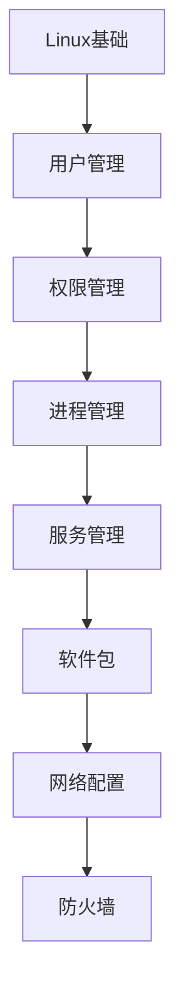

# Linux运维 学习指南

> **分类**：DevOps ｜ **技术生态**：systemd、Ansible、Prometheus node_exporter、ELK

## 领域定位

Linux 运维涵盖用户权限、systemd 服务、网络防火墙、磁盘与日志，是后端与 SRE 的日常操作系统。

覆盖 Shell 脚本、性能监控（top/iostat/ss）与故障排查方法论。

本领域常用技术栈与工具包括：systemd、Ansible、Prometheus node_exporter、ELK。

## 学习目标

- 能管理 systemd 与 journalctl
- 能配置 firewalld/iptables
- 能分析磁盘与 inode 使用
- 能编写 cron 与自动化脚本

## 前置知识

- 基本 Linux 命令
- TCP/IP 入门

## 学习路径

1. **Linux基础**
2. **用户管理**
3. **权限管理**
4. **进程管理**
5. **服务管理**
6. **软件包**
7. **网络配置**
8. **防火墙**

## 模块体系

- **Linux基础**
- **用户管理**
- **权限管理**
- **进程管理**
- **服务管理**
- **软件包**
- **网络配置**
- **防火墙**
- **磁盘管理**
- **文件系统**
- **日志管理**
- **定时任务**
- **Shell脚本**
- **性能监控**
- **故障排查**
- **安全加固**
- **Linux运维最佳实践**

## 难度分布

| 入门 | 24 | 24% |
| 实战 | 22 | 22% |
| 进阶 | 24 | 24% |
| 高级 | 30 | 30% |

## 章节索引

### Linux基础

- [Linux基础核心概念与原理](chapters/001-Linux基础核心概念与原理.md) ｜ 入门
- [Linux基础的实现机制详解](chapters/002-Linux基础的实现机制详解.md) ｜ 入门
- [Linux基础的关键技术点](chapters/003-Linux基础的关键技术点.md) ｜ 入门
- [Linux基础的源码级分析](chapters/004-Linux基础的源码级分析.md) ｜ 入门
- [Linux基础的配置与使用](chapters/005-Linux基础的配置与使用.md) ｜ 入门
- [Linux基础的常见问题与解决方案](chapters/006-Linux基础的常见问题与解决方案.md) ｜ 入门

### 用户管理

- [用户管理核心概念与原理](chapters/007-用户管理核心概念与原理.md) ｜ 入门
- [用户管理的实现机制详解](chapters/008-用户管理的实现机制详解.md) ｜ 入门
- [用户管理的关键技术点](chapters/009-用户管理的关键技术点.md) ｜ 入门
- [用户管理的源码级分析](chapters/010-用户管理的源码级分析.md) ｜ 入门
- [用户管理的配置与使用](chapters/011-用户管理的配置与使用.md) ｜ 入门
- [用户管理的常见问题与解决方案](chapters/012-用户管理的常见问题与解决方案.md) ｜ 入门

### 权限管理

- [权限管理核心概念与原理](chapters/013-权限管理核心概念与原理.md) ｜ 入门
- [权限管理的实现机制详解](chapters/014-权限管理的实现机制详解.md) ｜ 入门
- [权限管理的关键技术点](chapters/015-权限管理的关键技术点.md) ｜ 入门
- [权限管理的源码级分析](chapters/016-权限管理的源码级分析.md) ｜ 入门
- [权限管理的配置与使用](chapters/017-权限管理的配置与使用.md) ｜ 入门
- [权限管理的常见问题与解决方案](chapters/018-权限管理的常见问题与解决方案.md) ｜ 入门

### 进程管理

- [进程管理核心概念与原理](chapters/019-进程管理核心概念与原理.md) ｜ 入门
- [进程管理的实现机制详解](chapters/020-进程管理的实现机制详解.md) ｜ 入门
- [进程管理的关键技术点](chapters/021-进程管理的关键技术点.md) ｜ 入门
- [进程管理的源码级分析](chapters/022-进程管理的源码级分析.md) ｜ 入门
- [进程管理的配置与使用](chapters/023-进程管理的配置与使用.md) ｜ 入门
- [进程管理的常见问题与解决方案](chapters/024-进程管理的常见问题与解决方案.md) ｜ 入门

### 服务管理

- [服务管理核心概念与原理](chapters/025-服务管理核心概念与原理.md) ｜ 进阶
- [服务管理的实现机制详解](chapters/026-服务管理的实现机制详解.md) ｜ 进阶
- [服务管理的关键技术点](chapters/027-服务管理的关键技术点.md) ｜ 进阶
- [服务管理的源码级分析](chapters/028-服务管理的源码级分析.md) ｜ 进阶
- [服务管理的配置与使用](chapters/029-服务管理的配置与使用.md) ｜ 进阶
- [服务管理的常见问题与解决方案](chapters/030-服务管理的常见问题与解决方案.md) ｜ 进阶

### 软件包

- [软件包核心概念与原理](chapters/031-软件包核心概念与原理.md) ｜ 进阶
- [软件包的实现机制详解](chapters/032-软件包的实现机制详解.md) ｜ 进阶
- [软件包的关键技术点](chapters/033-软件包的关键技术点.md) ｜ 进阶
- [软件包的源码级分析](chapters/034-软件包的源码级分析.md) ｜ 进阶
- [软件包的配置与使用](chapters/035-软件包的配置与使用.md) ｜ 进阶
- [软件包的常见问题与解决方案](chapters/036-软件包的常见问题与解决方案.md) ｜ 进阶

### 网络配置

- [网络配置核心概念与原理](chapters/037-网络配置核心概念与原理.md) ｜ 进阶
- [网络配置的实现机制详解](chapters/038-网络配置的实现机制详解.md) ｜ 进阶
- [网络配置的关键技术点](chapters/039-网络配置的关键技术点.md) ｜ 进阶
- [网络配置的源码级分析](chapters/040-网络配置的源码级分析.md) ｜ 进阶
- [网络配置的配置与使用](chapters/041-网络配置的配置与使用.md) ｜ 进阶
- [网络配置的常见问题与解决方案](chapters/042-网络配置的常见问题与解决方案.md) ｜ 进阶

### 防火墙

- [防火墙核心概念与原理](chapters/043-防火墙核心概念与原理.md) ｜ 进阶
- [防火墙的实现机制详解](chapters/044-防火墙的实现机制详解.md) ｜ 进阶
- [防火墙的关键技术点](chapters/045-防火墙的关键技术点.md) ｜ 进阶
- [防火墙的源码级分析](chapters/046-防火墙的源码级分析.md) ｜ 进阶
- [防火墙的配置与使用](chapters/047-防火墙的配置与使用.md) ｜ 进阶
- [防火墙的常见问题与解决方案](chapters/048-防火墙的常见问题与解决方案.md) ｜ 进阶

### 磁盘管理

- [磁盘管理核心概念与原理](chapters/049-磁盘管理核心概念与原理.md) ｜ 高级
- [磁盘管理的实现机制详解](chapters/050-磁盘管理的实现机制详解.md) ｜ 高级
- [磁盘管理的关键技术点](chapters/051-磁盘管理的关键技术点.md) ｜ 高级
- [磁盘管理的源码级分析](chapters/052-磁盘管理的源码级分析.md) ｜ 高级
- [磁盘管理的配置与使用](chapters/053-磁盘管理的配置与使用.md) ｜ 高级
- [磁盘管理的常见问题与解决方案](chapters/054-磁盘管理的常见问题与解决方案.md) ｜ 高级

### 文件系统

- [文件系统核心概念与原理](chapters/055-文件系统核心概念与原理.md) ｜ 高级
- [文件系统的实现机制详解](chapters/056-文件系统的实现机制详解.md) ｜ 高级
- [文件系统的关键技术点](chapters/057-文件系统的关键技术点.md) ｜ 高级
- [文件系统的源码级分析](chapters/058-文件系统的源码级分析.md) ｜ 高级
- [文件系统的配置与使用](chapters/059-文件系统的配置与使用.md) ｜ 高级
- [文件系统的常见问题与解决方案](chapters/060-文件系统的常见问题与解决方案.md) ｜ 高级

### 日志管理

- [日志管理核心概念与原理](chapters/061-日志管理核心概念与原理.md) ｜ 高级
- [日志管理的实现机制详解](chapters/062-日志管理的实现机制详解.md) ｜ 高级
- [日志管理的关键技术点](chapters/063-日志管理的关键技术点.md) ｜ 高级
- [日志管理的源码级分析](chapters/064-日志管理的源码级分析.md) ｜ 高级
- [日志管理的配置与使用](chapters/065-日志管理的配置与使用.md) ｜ 高级
- [日志管理的常见问题与解决方案](chapters/066-日志管理的常见问题与解决方案.md) ｜ 高级

### 定时任务

- [定时任务核心概念与原理](chapters/067-定时任务核心概念与原理.md) ｜ 高级
- [定时任务的实现机制详解](chapters/068-定时任务的实现机制详解.md) ｜ 高级
- [定时任务的关键技术点](chapters/069-定时任务的关键技术点.md) ｜ 高级
- [定时任务的源码级分析](chapters/070-定时任务的源码级分析.md) ｜ 高级
- [定时任务的配置与使用](chapters/071-定时任务的配置与使用.md) ｜ 高级
- [定时任务的常见问题与解决方案](chapters/072-定时任务的常见问题与解决方案.md) ｜ 高级

### Shell脚本

- [Shell脚本核心概念与原理](chapters/073-Shell脚本核心概念与原理.md) ｜ 高级
- [Shell脚本的实现机制详解](chapters/074-Shell脚本的实现机制详解.md) ｜ 高级
- [Shell脚本的关键技术点](chapters/075-Shell脚本的关键技术点.md) ｜ 高级
- [Shell脚本的源码级分析](chapters/076-Shell脚本的源码级分析.md) ｜ 高级
- [Shell脚本的配置与使用](chapters/077-Shell脚本的配置与使用.md) ｜ 高级
- [Shell脚本的常见问题与解决方案](chapters/078-Shell脚本的常见问题与解决方案.md) ｜ 高级

### 性能监控

- [性能监控核心概念与原理](chapters/079-性能监控核心概念与原理.md) ｜ 实战
- [性能监控的实现机制详解](chapters/080-性能监控的实现机制详解.md) ｜ 实战
- [性能监控的关键技术点](chapters/081-性能监控的关键技术点.md) ｜ 实战
- [性能监控的源码级分析](chapters/082-性能监控的源码级分析.md) ｜ 实战
- [性能监控的配置与使用](chapters/083-性能监控的配置与使用.md) ｜ 实战
- [性能监控的常见问题与解决方案](chapters/084-性能监控的常见问题与解决方案.md) ｜ 实战

### 故障排查

- [故障排查核心概念与原理](chapters/085-故障排查核心概念与原理.md) ｜ 实战
- [故障排查的实现机制详解](chapters/086-故障排查的实现机制详解.md) ｜ 实战
- [故障排查的关键技术点](chapters/087-故障排查的关键技术点.md) ｜ 实战
- [故障排查的源码级分析](chapters/088-故障排查的源码级分析.md) ｜ 实战
- [故障排查的配置与使用](chapters/089-故障排查的配置与使用.md) ｜ 实战
- [故障排查的常见问题与解决方案](chapters/090-故障排查的常见问题与解决方案.md) ｜ 实战

### 安全加固

- [安全加固核心概念与原理](chapters/091-安全加固核心概念与原理.md) ｜ 实战
- [安全加固的实现机制详解](chapters/092-安全加固的实现机制详解.md) ｜ 实战
- [安全加固的关键技术点](chapters/093-安全加固的关键技术点.md) ｜ 实战
- [安全加固的源码级分析](chapters/094-安全加固的源码级分析.md) ｜ 实战
- [安全加固的配置与使用](chapters/095-安全加固的配置与使用.md) ｜ 实战

### Linux运维最佳实践

- [Linux运维最佳实践核心概念与原理](chapters/096-Linux运维最佳实践核心概念与原理.md) ｜ 实战
- [Linux运维最佳实践的实现机制详解](chapters/097-Linux运维最佳实践的实现机制详解.md) ｜ 实战
- [Linux运维最佳实践的关键技术点](chapters/098-Linux运维最佳实践的关键技术点.md) ｜ 实战
- [Linux运维最佳实践的源码级分析](chapters/099-Linux运维最佳实践的源码级分析.md) ｜ 实战
- [Linux运维最佳实践的配置与使用](chapters/100-Linux运维最佳实践的配置与使用.md) ｜ 实战

---
*领域: Linux运维*