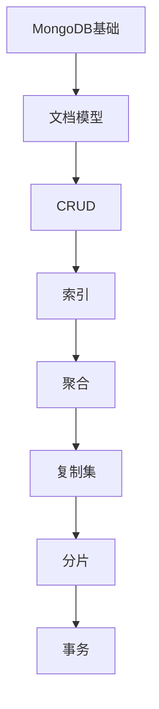

# MongoDB 学习指南

> **分类**：数据存储 ｜ **章节总数**：80 ｜ **技术栈**：MongoDB 7

## 领域概述

MongoDB是数据存储领域的重要技术方向，本系列从基础到高级逐步深入，涵盖12个核心模块：MongoDB基础、文档模型、CRUD、索引、聚合等。每个知识点作为独立章节，包含原理讲解、实现要点、常见陷阱和最佳实践，配合源码分析和架构图，帮助读者建立完整的MongoDB知识体系。

本教程基于 **JavaScript/SQL** 与 **MongoDB 7** 生态编写，涵盖 mongosh, Compass 等主流工具与框架。每章独立成篇，文字精炼、逻辑清晰，适合系统学习与按需查阅。

## 你将学到什么

完成本系列后，你将能够：

- 系统理解 **MongoDB** 的核心概念与模块划分。
- 按难度递进掌握从入门到实战的完整知识路径。
- 在工程实践中做出合理的技术判断与问题排查。
- 通过章节索引快速定位所需知识点。

## 前置知识

- 编程基础
- 数据结构
- 计算机基础
- 数据存储基础概念

## 推荐学习路径

1. **MongoDB基础**
2. **文档模型**
3. **CRUD**
4. **索引**
5. **聚合**
6. **复制集**
7. **分片**
8. **事务**

## 模块体系

本领域按以下模块组织，难度由浅入深：

- **MongoDB基础**
- **文档模型**
- **CRUD**
- **索引**
- **聚合**
- **复制集**
- **分片**
- **事务**
- **性能优化**
- **安全**
- **备份恢复**
- **MongoDB最佳实践**

## 难度分布

| 难度 | 章节数 | 占比 |
|------|--------|------|
| 入门 | 21 | 26% |
| 实战 | 18 | 22% |
| 进阶 | 21 | 26% |
| 高级 | 20 | 25% |

## 章节索引

点击章节标题进入对应教程：

### MongoDB基础

- [MongoDB基础核心概念与原理](chapters/001-MongoDB基础核心概念与原理.md) ｜ 入门
- [MongoDB基础的实现机制详解](chapters/002-MongoDB基础的实现机制详解.md) ｜ 入门
- [MongoDB基础的关键技术点](chapters/003-MongoDB基础的关键技术点.md) ｜ 入门
- [MongoDB基础的源码级分析](chapters/004-MongoDB基础的源码级分析.md) ｜ 入门
- [MongoDB基础的配置与使用](chapters/005-MongoDB基础的配置与使用.md) ｜ 入门
- [MongoDB基础的常见问题与解决方案](chapters/006-MongoDB基础的常见问题与解决方案.md) ｜ 入门
- [MongoDB基础的性能优化技巧](chapters/007-MongoDB基础的性能优化技巧.md) ｜ 入门

### 文档模型

- [文档模型核心概念与原理](chapters/008-文档模型核心概念与原理.md) ｜ 入门
- [文档模型的实现机制详解](chapters/009-文档模型的实现机制详解.md) ｜ 入门
- [文档模型的关键技术点](chapters/010-文档模型的关键技术点.md) ｜ 入门
- [文档模型的源码级分析](chapters/011-文档模型的源码级分析.md) ｜ 入门
- [文档模型的配置与使用](chapters/012-文档模型的配置与使用.md) ｜ 入门
- [文档模型的常见问题与解决方案](chapters/013-文档模型的常见问题与解决方案.md) ｜ 入门
- [文档模型的性能优化技巧](chapters/014-文档模型的性能优化技巧.md) ｜ 入门

### CRUD

- [CRUD核心概念与原理](chapters/015-CRUD核心概念与原理.md) ｜ 入门
- [CRUD的实现机制详解](chapters/016-CRUD的实现机制详解.md) ｜ 入门
- [CRUD的关键技术点](chapters/017-CRUD的关键技术点.md) ｜ 入门
- [CRUD的源码级分析](chapters/018-CRUD的源码级分析.md) ｜ 入门
- [CRUD的配置与使用](chapters/019-CRUD的配置与使用.md) ｜ 入门
- [CRUD的常见问题与解决方案](chapters/020-CRUD的常见问题与解决方案.md) ｜ 入门
- [CRUD的性能优化技巧](chapters/021-CRUD的性能优化技巧.md) ｜ 入门

### 索引

- [索引核心概念与原理](chapters/022-索引核心概念与原理.md) ｜ 进阶
- [索引的实现机制详解](chapters/023-索引的实现机制详解.md) ｜ 进阶
- [索引的关键技术点](chapters/024-索引的关键技术点.md) ｜ 进阶
- [索引的源码级分析](chapters/025-索引的源码级分析.md) ｜ 进阶
- [索引的配置与使用](chapters/026-索引的配置与使用.md) ｜ 进阶
- [索引的常见问题与解决方案](chapters/027-索引的常见问题与解决方案.md) ｜ 进阶
- [索引的性能优化技巧](chapters/028-索引的性能优化技巧.md) ｜ 进阶

### 聚合

- [聚合核心概念与原理](chapters/029-聚合核心概念与原理.md) ｜ 进阶
- [聚合的实现机制详解](chapters/030-聚合的实现机制详解.md) ｜ 进阶
- [聚合的关键技术点](chapters/031-聚合的关键技术点.md) ｜ 进阶
- [聚合的源码级分析](chapters/032-聚合的源码级分析.md) ｜ 进阶
- [聚合的配置与使用](chapters/033-聚合的配置与使用.md) ｜ 进阶
- [聚合的常见问题与解决方案](chapters/034-聚合的常见问题与解决方案.md) ｜ 进阶
- [聚合的性能优化技巧](chapters/035-聚合的性能优化技巧.md) ｜ 进阶

### 复制集

- [复制集核心概念与原理](chapters/036-复制集核心概念与原理.md) ｜ 进阶
- [复制集的实现机制详解](chapters/037-复制集的实现机制详解.md) ｜ 进阶
- [复制集的关键技术点](chapters/038-复制集的关键技术点.md) ｜ 进阶
- [复制集的源码级分析](chapters/039-复制集的源码级分析.md) ｜ 进阶
- [复制集的配置与使用](chapters/040-复制集的配置与使用.md) ｜ 进阶
- [复制集的常见问题与解决方案](chapters/041-复制集的常见问题与解决方案.md) ｜ 进阶
- [复制集的性能优化技巧](chapters/042-复制集的性能优化技巧.md) ｜ 进阶

### 分片

- [分片核心概念与原理](chapters/043-分片核心概念与原理.md) ｜ 高级
- [分片的实现机制详解](chapters/044-分片的实现机制详解.md) ｜ 高级
- [分片的关键技术点](chapters/045-分片的关键技术点.md) ｜ 高级
- [分片的源码级分析](chapters/046-分片的源码级分析.md) ｜ 高级
- [分片的配置与使用](chapters/047-分片的配置与使用.md) ｜ 高级
- [分片的常见问题与解决方案](chapters/048-分片的常见问题与解决方案.md) ｜ 高级
- [分片的性能优化技巧](chapters/049-分片的性能优化技巧.md) ｜ 高级

### 事务

- [事务核心概念与原理](chapters/050-事务核心概念与原理.md) ｜ 高级
- [事务的实现机制详解](chapters/051-事务的实现机制详解.md) ｜ 高级
- [事务的关键技术点](chapters/052-事务的关键技术点.md) ｜ 高级
- [事务的源码级分析](chapters/053-事务的源码级分析.md) ｜ 高级
- [事务的配置与使用](chapters/054-事务的配置与使用.md) ｜ 高级
- [事务的常见问题与解决方案](chapters/055-事务的常见问题与解决方案.md) ｜ 高级
- [事务的性能优化技巧](chapters/056-事务的性能优化技巧.md) ｜ 高级

### 性能优化

- [性能优化核心概念与原理](chapters/057-性能优化核心概念与原理.md) ｜ 高级
- [性能优化的实现机制详解](chapters/058-性能优化的实现机制详解.md) ｜ 高级
- [性能优化的关键技术点](chapters/059-性能优化的关键技术点.md) ｜ 高级
- [性能优化的源码级分析](chapters/060-性能优化的源码级分析.md) ｜ 高级
- [性能优化的配置与使用](chapters/061-性能优化的配置与使用.md) ｜ 高级
- [性能优化的常见问题与解决方案](chapters/062-性能优化的常见问题与解决方案.md) ｜ 高级

### 安全

- [安全核心概念与原理](chapters/063-安全核心概念与原理.md) ｜ 实战
- [安全的实现机制详解](chapters/064-安全的实现机制详解.md) ｜ 实战
- [安全的关键技术点](chapters/065-安全的关键技术点.md) ｜ 实战
- [安全的源码级分析](chapters/066-安全的源码级分析.md) ｜ 实战
- [安全的配置与使用](chapters/067-安全的配置与使用.md) ｜ 实战
- [安全的常见问题与解决方案](chapters/068-安全的常见问题与解决方案.md) ｜ 实战

### 备份恢复

- [备份恢复核心概念与原理](chapters/069-备份恢复核心概念与原理.md) ｜ 实战
- [备份恢复的实现机制详解](chapters/070-备份恢复的实现机制详解.md) ｜ 实战
- [备份恢复的关键技术点](chapters/071-备份恢复的关键技术点.md) ｜ 实战
- [备份恢复的源码级分析](chapters/072-备份恢复的源码级分析.md) ｜ 实战
- [备份恢复的配置与使用](chapters/073-备份恢复的配置与使用.md) ｜ 实战
- [备份恢复的常见问题与解决方案](chapters/074-备份恢复的常见问题与解决方案.md) ｜ 实战

### MongoDB最佳实践

- [MongoDB最佳实践核心概念与原理](chapters/075-MongoDB最佳实践核心概念与原理.md) ｜ 实战
- [MongoDB最佳实践的实现机制详解](chapters/076-MongoDB最佳实践的实现机制详解.md) ｜ 实战
- [MongoDB最佳实践的关键技术点](chapters/077-MongoDB最佳实践的关键技术点.md) ｜ 实战
- [MongoDB最佳实践的源码级分析](chapters/078-MongoDB最佳实践的源码级分析.md) ｜ 实战
- [MongoDB最佳实践的配置与使用](chapters/079-MongoDB最佳实践的配置与使用.md) ｜ 实战
- [MongoDB最佳实践的常见问题与解决方案](chapters/080-MongoDB最佳实践的常见问题与解决方案.md) ｜ 实战

## 学习方法建议

1. **先读概述再读章节**：用本指南建立全局地图，避免迷失在细节中。
2. **按模块递进**：同一模块内章节有前后关联，顺序阅读效果更好。
3. **主动复述**：每章读完后，用三五句话概括「是什么、为什么、怎么用」。
4. **关联阅读**：利用章节底部的「延伸学习」在同模块内构建知识网络。
5. **对照官方文档**：本教程提供结构化视角，细节以官方文档为准。

---
*领域: MongoDB ｜ 版本: 2.0 ｜ 共 80 章*