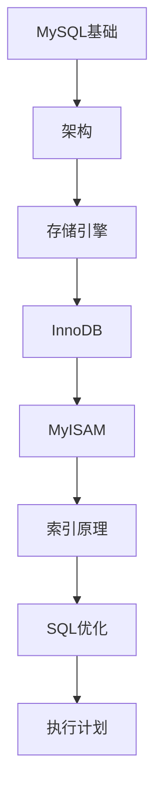

# MySQL 学习指南

> **分类**：数据存储 ｜ **章节总数**：200 ｜ **技术栈**：MySQL 8

## 领域概述

MySQL是数据存储领域的重要技术方向，本系列从基础到高级逐步深入，涵盖19个核心模块：MySQL基础、架构、存储引擎、InnoDB、MyISAM等。每个知识点作为独立章节，包含原理讲解、实现要点、常见陷阱和最佳实践，配合源码分析和架构图，帮助读者建立完整的MySQL知识体系。

本教程基于 **SQL** 与 **MySQL 8** 生态编写，涵盖 InnoDB, Percona, ProxySQL 等主流工具与框架。每章独立成篇，文字精炼、逻辑清晰，适合系统学习与按需查阅。

## 你将学到什么

完成本系列后，你将能够：

- 系统理解 **MySQL** 的核心概念与模块划分。
- 按难度递进掌握从入门到实战的完整知识路径。
- 在工程实践中做出合理的技术判断与问题排查。
- 通过章节索引快速定位所需知识点。

## 前置知识

- 编程基础
- 数据结构
- 计算机基础
- 数据存储基础概念

## 推荐学习路径

1. **MySQL基础**
2. **架构**
3. **存储引擎**
4. **InnoDB**
5. **MyISAM**
6. **索引原理**
7. **SQL优化**
8. **执行计划**

## 模块体系

本领域按以下模块组织，难度由浅入深：

- **MySQL基础**
- **架构**
- **存储引擎**
- **InnoDB**
- **MyISAM**
- **索引原理**
- **SQL优化**
- **执行计划**
- **事务**
- **锁**
- **主从复制**
- **读写分离**
- **分库分表**
- **高可用**
- **备份恢复**
- **性能调优**
- **监控**
- **安全**
- **MySQL最佳实践**

## 难度分布

| 难度 | 章节数 | 占比 |
|------|--------|------|
| 入门 | 44 | 22% |
| 实战 | 40 | 20% |
| 进阶 | 55 | 27% |
| 高级 | 61 | 30% |

## 章节索引

点击章节标题进入对应教程：

### MySQL基础

- [MySQL基础核心概念与原理](chapters/001-MySQL基础核心概念与原理.md) ｜ 入门
- [MySQL基础的实现机制详解](chapters/002-MySQL基础的实现机制详解.md) ｜ 入门
- [MySQL基础的关键技术点](chapters/003-MySQL基础的关键技术点.md) ｜ 入门
- [MySQL基础的源码级分析](chapters/004-MySQL基础的源码级分析.md) ｜ 入门
- [MySQL基础的配置与使用](chapters/005-MySQL基础的配置与使用.md) ｜ 入门
- [MySQL基础的常见问题与解决方案](chapters/006-MySQL基础的常见问题与解决方案.md) ｜ 入门
- [MySQL基础的性能优化技巧](chapters/007-MySQL基础的性能优化技巧.md) ｜ 入门
- [MySQL基础的最佳实践指南](chapters/008-MySQL基础的最佳实践指南.md) ｜ 入门
- [MySQL基础的高级应用场景](chapters/009-MySQL基础的高级应用场景.md) ｜ 入门
- [MySQL基础的实战案例分析](chapters/010-MySQL基础的实战案例分析.md) ｜ 入门
- [MySQL基础的设计思想与演进](chapters/011-MySQL基础的设计思想与演进.md) ｜ 入门

### 架构

- [架构核心概念与原理](chapters/012-架构核心概念与原理.md) ｜ 入门
- [架构的实现机制详解](chapters/013-架构的实现机制详解.md) ｜ 入门
- [架构的关键技术点](chapters/014-架构的关键技术点.md) ｜ 入门
- [架构的源码级分析](chapters/015-架构的源码级分析.md) ｜ 入门
- [架构的配置与使用](chapters/016-架构的配置与使用.md) ｜ 入门
- [架构的常见问题与解决方案](chapters/017-架构的常见问题与解决方案.md) ｜ 入门
- [架构的性能优化技巧](chapters/018-架构的性能优化技巧.md) ｜ 入门
- [架构的最佳实践指南](chapters/019-架构的最佳实践指南.md) ｜ 入门
- [架构的高级应用场景](chapters/020-架构的高级应用场景.md) ｜ 入门
- [架构的实战案例分析](chapters/021-架构的实战案例分析.md) ｜ 入门
- [架构的设计思想与演进](chapters/022-架构的设计思想与演进.md) ｜ 入门

### 存储引擎

- [存储引擎核心概念与原理](chapters/023-存储引擎核心概念与原理.md) ｜ 入门
- [存储引擎的实现机制详解](chapters/024-存储引擎的实现机制详解.md) ｜ 入门
- [存储引擎的关键技术点](chapters/025-存储引擎的关键技术点.md) ｜ 入门
- [存储引擎的源码级分析](chapters/026-存储引擎的源码级分析.md) ｜ 入门
- [存储引擎的配置与使用](chapters/027-存储引擎的配置与使用.md) ｜ 入门
- [存储引擎的常见问题与解决方案](chapters/028-存储引擎的常见问题与解决方案.md) ｜ 入门
- [存储引擎的性能优化技巧](chapters/029-存储引擎的性能优化技巧.md) ｜ 入门
- [存储引擎的最佳实践指南](chapters/030-存储引擎的最佳实践指南.md) ｜ 入门
- [存储引擎的高级应用场景](chapters/031-存储引擎的高级应用场景.md) ｜ 入门
- [存储引擎的实战案例分析](chapters/032-存储引擎的实战案例分析.md) ｜ 入门
- [存储引擎的设计思想与演进](chapters/033-存储引擎的设计思想与演进.md) ｜ 入门

### InnoDB

- [InnoDB核心概念与原理](chapters/034-InnoDB核心概念与原理.md) ｜ 入门
- [InnoDB的实现机制详解](chapters/035-InnoDB的实现机制详解.md) ｜ 入门
- [InnoDB的关键技术点](chapters/036-InnoDB的关键技术点.md) ｜ 入门
- [InnoDB的源码级分析](chapters/037-InnoDB的源码级分析.md) ｜ 入门
- [InnoDB的配置与使用](chapters/038-InnoDB的配置与使用.md) ｜ 入门
- [InnoDB的常见问题与解决方案](chapters/039-InnoDB的常见问题与解决方案.md) ｜ 入门
- [InnoDB的性能优化技巧](chapters/040-InnoDB的性能优化技巧.md) ｜ 入门
- [InnoDB的最佳实践指南](chapters/041-InnoDB的最佳实践指南.md) ｜ 入门
- [InnoDB的高级应用场景](chapters/042-InnoDB的高级应用场景.md) ｜ 入门
- [InnoDB的实战案例分析](chapters/043-InnoDB的实战案例分析.md) ｜ 入门
- [InnoDB的设计思想与演进](chapters/044-InnoDB的设计思想与演进.md) ｜ 入门

### MyISAM

- [MyISAM核心概念与原理](chapters/045-MyISAM核心概念与原理.md) ｜ 进阶
- [MyISAM的实现机制详解](chapters/046-MyISAM的实现机制详解.md) ｜ 进阶
- [MyISAM的关键技术点](chapters/047-MyISAM的关键技术点.md) ｜ 进阶
- [MyISAM的源码级分析](chapters/048-MyISAM的源码级分析.md) ｜ 进阶
- [MyISAM的配置与使用](chapters/049-MyISAM的配置与使用.md) ｜ 进阶
- [MyISAM的常见问题与解决方案](chapters/050-MyISAM的常见问题与解决方案.md) ｜ 进阶
- [MyISAM的性能优化技巧](chapters/051-MyISAM的性能优化技巧.md) ｜ 进阶
- [MyISAM的最佳实践指南](chapters/052-MyISAM的最佳实践指南.md) ｜ 进阶
- [MyISAM的高级应用场景](chapters/053-MyISAM的高级应用场景.md) ｜ 进阶
- [MyISAM的实战案例分析](chapters/054-MyISAM的实战案例分析.md) ｜ 进阶
- [MyISAM的设计思想与演进](chapters/055-MyISAM的设计思想与演进.md) ｜ 进阶

### 索引原理

- [索引原理核心概念与原理](chapters/056-索引原理核心概念与原理.md) ｜ 进阶
- [索引原理的实现机制详解](chapters/057-索引原理的实现机制详解.md) ｜ 进阶
- [索引原理的关键技术点](chapters/058-索引原理的关键技术点.md) ｜ 进阶
- [索引原理的源码级分析](chapters/059-索引原理的源码级分析.md) ｜ 进阶
- [索引原理的配置与使用](chapters/060-索引原理的配置与使用.md) ｜ 进阶
- [索引原理的常见问题与解决方案](chapters/061-索引原理的常见问题与解决方案.md) ｜ 进阶
- [索引原理的性能优化技巧](chapters/062-索引原理的性能优化技巧.md) ｜ 进阶
- [索引原理的最佳实践指南](chapters/063-索引原理的最佳实践指南.md) ｜ 进阶
- [索引原理的高级应用场景](chapters/064-索引原理的高级应用场景.md) ｜ 进阶
- [索引原理的实战案例分析](chapters/065-索引原理的实战案例分析.md) ｜ 进阶
- [索引原理的设计思想与演进](chapters/066-索引原理的设计思想与演进.md) ｜ 进阶

### SQL优化

- [SQL优化核心概念与原理](chapters/067-SQL优化核心概念与原理.md) ｜ 进阶
- [SQL优化的实现机制详解](chapters/068-SQL优化的实现机制详解.md) ｜ 进阶
- [SQL优化的关键技术点](chapters/069-SQL优化的关键技术点.md) ｜ 进阶
- [SQL优化的源码级分析](chapters/070-SQL优化的源码级分析.md) ｜ 进阶
- [SQL优化的配置与使用](chapters/071-SQL优化的配置与使用.md) ｜ 进阶
- [SQL优化的常见问题与解决方案](chapters/072-SQL优化的常见问题与解决方案.md) ｜ 进阶
- [SQL优化的性能优化技巧](chapters/073-SQL优化的性能优化技巧.md) ｜ 进阶
- [SQL优化的最佳实践指南](chapters/074-SQL优化的最佳实践指南.md) ｜ 进阶
- [SQL优化的高级应用场景](chapters/075-SQL优化的高级应用场景.md) ｜ 进阶
- [SQL优化的实战案例分析](chapters/076-SQL优化的实战案例分析.md) ｜ 进阶
- [SQL优化的设计思想与演进](chapters/077-SQL优化的设计思想与演进.md) ｜ 进阶

### 执行计划

- [执行计划核心概念与原理](chapters/078-执行计划核心概念与原理.md) ｜ 进阶
- [执行计划的实现机制详解](chapters/079-执行计划的实现机制详解.md) ｜ 进阶
- [执行计划的关键技术点](chapters/080-执行计划的关键技术点.md) ｜ 进阶
- [执行计划的源码级分析](chapters/081-执行计划的源码级分析.md) ｜ 进阶
- [执行计划的配置与使用](chapters/082-执行计划的配置与使用.md) ｜ 进阶
- [执行计划的常见问题与解决方案](chapters/083-执行计划的常见问题与解决方案.md) ｜ 进阶
- [执行计划的性能优化技巧](chapters/084-执行计划的性能优化技巧.md) ｜ 进阶
- [执行计划的最佳实践指南](chapters/085-执行计划的最佳实践指南.md) ｜ 进阶
- [执行计划的高级应用场景](chapters/086-执行计划的高级应用场景.md) ｜ 进阶
- [执行计划的实战案例分析](chapters/087-执行计划的实战案例分析.md) ｜ 进阶
- [执行计划的设计思想与演进](chapters/088-执行计划的设计思想与演进.md) ｜ 进阶

### 事务

- [事务核心概念与原理](chapters/089-事务核心概念与原理.md) ｜ 进阶
- [事务的实现机制详解](chapters/090-事务的实现机制详解.md) ｜ 进阶
- [事务的关键技术点](chapters/091-事务的关键技术点.md) ｜ 进阶
- [事务的源码级分析](chapters/092-事务的源码级分析.md) ｜ 进阶
- [事务的配置与使用](chapters/093-事务的配置与使用.md) ｜ 进阶
- [事务的常见问题与解决方案](chapters/094-事务的常见问题与解决方案.md) ｜ 进阶
- [事务的性能优化技巧](chapters/095-事务的性能优化技巧.md) ｜ 进阶
- [事务的最佳实践指南](chapters/096-事务的最佳实践指南.md) ｜ 进阶
- [事务的高级应用场景](chapters/097-事务的高级应用场景.md) ｜ 进阶
- [事务的实战案例分析](chapters/098-事务的实战案例分析.md) ｜ 进阶
- [事务的设计思想与演进](chapters/099-事务的设计思想与演进.md) ｜ 进阶

### 锁

- [锁核心概念与原理](chapters/100-锁核心概念与原理.md) ｜ 高级
- [锁的实现机制详解](chapters/101-锁的实现机制详解.md) ｜ 高级
- [锁的关键技术点](chapters/102-锁的关键技术点.md) ｜ 高级
- [锁的源码级分析](chapters/103-锁的源码级分析.md) ｜ 高级
- [锁的配置与使用](chapters/104-锁的配置与使用.md) ｜ 高级
- [锁的常见问题与解决方案](chapters/105-锁的常见问题与解决方案.md) ｜ 高级
- [锁的性能优化技巧](chapters/106-锁的性能优化技巧.md) ｜ 高级
- [锁的最佳实践指南](chapters/107-锁的最佳实践指南.md) ｜ 高级
- [锁的高级应用场景](chapters/108-锁的高级应用场景.md) ｜ 高级
- [锁的实战案例分析](chapters/109-锁的实战案例分析.md) ｜ 高级
- [锁的设计思想与演进](chapters/110-锁的设计思想与演进.md) ｜ 高级

### 主从复制

- [主从复制核心概念与原理](chapters/111-主从复制核心概念与原理.md) ｜ 高级
- [主从复制的实现机制详解](chapters/112-主从复制的实现机制详解.md) ｜ 高级
- [主从复制的关键技术点](chapters/113-主从复制的关键技术点.md) ｜ 高级
- [主从复制的源码级分析](chapters/114-主从复制的源码级分析.md) ｜ 高级
- [主从复制的配置与使用](chapters/115-主从复制的配置与使用.md) ｜ 高级
- [主从复制的常见问题与解决方案](chapters/116-主从复制的常见问题与解决方案.md) ｜ 高级
- [主从复制的性能优化技巧](chapters/117-主从复制的性能优化技巧.md) ｜ 高级
- [主从复制的最佳实践指南](chapters/118-主从复制的最佳实践指南.md) ｜ 高级
- [主从复制的高级应用场景](chapters/119-主从复制的高级应用场景.md) ｜ 高级
- [主从复制的实战案例分析](chapters/120-主从复制的实战案例分析.md) ｜ 高级

### 读写分离

- [读写分离核心概念与原理](chapters/121-读写分离核心概念与原理.md) ｜ 高级
- [读写分离的实现机制详解](chapters/122-读写分离的实现机制详解.md) ｜ 高级
- [读写分离的关键技术点](chapters/123-读写分离的关键技术点.md) ｜ 高级
- [读写分离的源码级分析](chapters/124-读写分离的源码级分析.md) ｜ 高级
- [读写分离的配置与使用](chapters/125-读写分离的配置与使用.md) ｜ 高级
- [读写分离的常见问题与解决方案](chapters/126-读写分离的常见问题与解决方案.md) ｜ 高级
- [读写分离的性能优化技巧](chapters/127-读写分离的性能优化技巧.md) ｜ 高级
- [读写分离的最佳实践指南](chapters/128-读写分离的最佳实践指南.md) ｜ 高级
- [读写分离的高级应用场景](chapters/129-读写分离的高级应用场景.md) ｜ 高级
- [读写分离的实战案例分析](chapters/130-读写分离的实战案例分析.md) ｜ 高级

### 分库分表

- [分库分表核心概念与原理](chapters/131-分库分表核心概念与原理.md) ｜ 高级
- [分库分表的实现机制详解](chapters/132-分库分表的实现机制详解.md) ｜ 高级
- [分库分表的关键技术点](chapters/133-分库分表的关键技术点.md) ｜ 高级
- [分库分表的源码级分析](chapters/134-分库分表的源码级分析.md) ｜ 高级
- [分库分表的配置与使用](chapters/135-分库分表的配置与使用.md) ｜ 高级
- [分库分表的常见问题与解决方案](chapters/136-分库分表的常见问题与解决方案.md) ｜ 高级
- [分库分表的性能优化技巧](chapters/137-分库分表的性能优化技巧.md) ｜ 高级
- [分库分表的最佳实践指南](chapters/138-分库分表的最佳实践指南.md) ｜ 高级
- [分库分表的高级应用场景](chapters/139-分库分表的高级应用场景.md) ｜ 高级
- [分库分表的实战案例分析](chapters/140-分库分表的实战案例分析.md) ｜ 高级

### 高可用

- [高可用核心概念与原理](chapters/141-高可用核心概念与原理.md) ｜ 高级
- [高可用的实现机制详解](chapters/142-高可用的实现机制详解.md) ｜ 高级
- [高可用的关键技术点](chapters/143-高可用的关键技术点.md) ｜ 高级
- [高可用的源码级分析](chapters/144-高可用的源码级分析.md) ｜ 高级
- [高可用的配置与使用](chapters/145-高可用的配置与使用.md) ｜ 高级
- [高可用的常见问题与解决方案](chapters/146-高可用的常见问题与解决方案.md) ｜ 高级
- [高可用的性能优化技巧](chapters/147-高可用的性能优化技巧.md) ｜ 高级
- [高可用的最佳实践指南](chapters/148-高可用的最佳实践指南.md) ｜ 高级
- [高可用的高级应用场景](chapters/149-高可用的高级应用场景.md) ｜ 高级
- [高可用的实战案例分析](chapters/150-高可用的实战案例分析.md) ｜ 高级

### 备份恢复

- [备份恢复核心概念与原理](chapters/151-备份恢复核心概念与原理.md) ｜ 高级
- [备份恢复的实现机制详解](chapters/152-备份恢复的实现机制详解.md) ｜ 高级
- [备份恢复的关键技术点](chapters/153-备份恢复的关键技术点.md) ｜ 高级
- [备份恢复的源码级分析](chapters/154-备份恢复的源码级分析.md) ｜ 高级
- [备份恢复的配置与使用](chapters/155-备份恢复的配置与使用.md) ｜ 高级
- [备份恢复的常见问题与解决方案](chapters/156-备份恢复的常见问题与解决方案.md) ｜ 高级
- [备份恢复的性能优化技巧](chapters/157-备份恢复的性能优化技巧.md) ｜ 高级
- [备份恢复的最佳实践指南](chapters/158-备份恢复的最佳实践指南.md) ｜ 高级
- [备份恢复的高级应用场景](chapters/159-备份恢复的高级应用场景.md) ｜ 高级
- [备份恢复的实战案例分析](chapters/160-备份恢复的实战案例分析.md) ｜ 高级

### 性能调优

- [性能调优核心概念与原理](chapters/161-性能调优核心概念与原理.md) ｜ 实战
- [性能调优的实现机制详解](chapters/162-性能调优的实现机制详解.md) ｜ 实战
- [性能调优的关键技术点](chapters/163-性能调优的关键技术点.md) ｜ 实战
- [性能调优的源码级分析](chapters/164-性能调优的源码级分析.md) ｜ 实战
- [性能调优的配置与使用](chapters/165-性能调优的配置与使用.md) ｜ 实战
- [性能调优的常见问题与解决方案](chapters/166-性能调优的常见问题与解决方案.md) ｜ 实战
- [性能调优的性能优化技巧](chapters/167-性能调优的性能优化技巧.md) ｜ 实战
- [性能调优的最佳实践指南](chapters/168-性能调优的最佳实践指南.md) ｜ 实战
- [性能调优的高级应用场景](chapters/169-性能调优的高级应用场景.md) ｜ 实战
- [性能调优的实战案例分析](chapters/170-性能调优的实战案例分析.md) ｜ 实战

### 监控

- [监控核心概念与原理](chapters/171-监控核心概念与原理.md) ｜ 实战
- [监控的实现机制详解](chapters/172-监控的实现机制详解.md) ｜ 实战
- [监控的关键技术点](chapters/173-监控的关键技术点.md) ｜ 实战
- [监控的源码级分析](chapters/174-监控的源码级分析.md) ｜ 实战
- [监控的配置与使用](chapters/175-监控的配置与使用.md) ｜ 实战
- [监控的常见问题与解决方案](chapters/176-监控的常见问题与解决方案.md) ｜ 实战
- [监控的性能优化技巧](chapters/177-监控的性能优化技巧.md) ｜ 实战
- [监控的最佳实践指南](chapters/178-监控的最佳实践指南.md) ｜ 实战
- [监控的高级应用场景](chapters/179-监控的高级应用场景.md) ｜ 实战
- [监控的实战案例分析](chapters/180-监控的实战案例分析.md) ｜ 实战

### 安全

- [安全核心概念与原理](chapters/181-安全核心概念与原理.md) ｜ 实战
- [安全的实现机制详解](chapters/182-安全的实现机制详解.md) ｜ 实战
- [安全的关键技术点](chapters/183-安全的关键技术点.md) ｜ 实战
- [安全的源码级分析](chapters/184-安全的源码级分析.md) ｜ 实战
- [安全的配置与使用](chapters/185-安全的配置与使用.md) ｜ 实战
- [安全的常见问题与解决方案](chapters/186-安全的常见问题与解决方案.md) ｜ 实战
- [安全的性能优化技巧](chapters/187-安全的性能优化技巧.md) ｜ 实战
- [安全的最佳实践指南](chapters/188-安全的最佳实践指南.md) ｜ 实战
- [安全的高级应用场景](chapters/189-安全的高级应用场景.md) ｜ 实战
- [安全的实战案例分析](chapters/190-安全的实战案例分析.md) ｜ 实战

### MySQL最佳实践

- [MySQL最佳实践核心概念与原理](chapters/191-MySQL最佳实践核心概念与原理.md) ｜ 实战
- [MySQL最佳实践的实现机制详解](chapters/192-MySQL最佳实践的实现机制详解.md) ｜ 实战
- [MySQL最佳实践的关键技术点](chapters/193-MySQL最佳实践的关键技术点.md) ｜ 实战
- [MySQL最佳实践的源码级分析](chapters/194-MySQL最佳实践的源码级分析.md) ｜ 实战
- [MySQL最佳实践的配置与使用](chapters/195-MySQL最佳实践的配置与使用.md) ｜ 实战
- [MySQL最佳实践的常见问题与解决方案](chapters/196-MySQL最佳实践的常见问题与解决方案.md) ｜ 实战
- [MySQL最佳实践的性能优化技巧](chapters/197-MySQL最佳实践的性能优化技巧.md) ｜ 实战
- [MySQL最佳实践的最佳实践指南](chapters/198-MySQL最佳实践的最佳实践指南.md) ｜ 实战
- [MySQL最佳实践的高级应用场景](chapters/199-MySQL最佳实践的高级应用场景.md) ｜ 实战
- [MySQL最佳实践的实战案例分析](chapters/200-MySQL最佳实践的实战案例分析.md) ｜ 实战

## 学习方法建议

1. **先读概述再读章节**：用本指南建立全局地图，避免迷失在细节中。
2. **按模块递进**：同一模块内章节有前后关联，顺序阅读效果更好。
3. **主动复述**：每章读完后，用三五句话概括「是什么、为什么、怎么用」。
4. **关联阅读**：利用章节底部的「延伸学习」在同模块内构建知识网络。
5. **对照官方文档**：本教程提供结构化视角，细节以官方文档为准。

---
*领域: MySQL ｜ 版本: 2.0 ｜ 共 200 章*