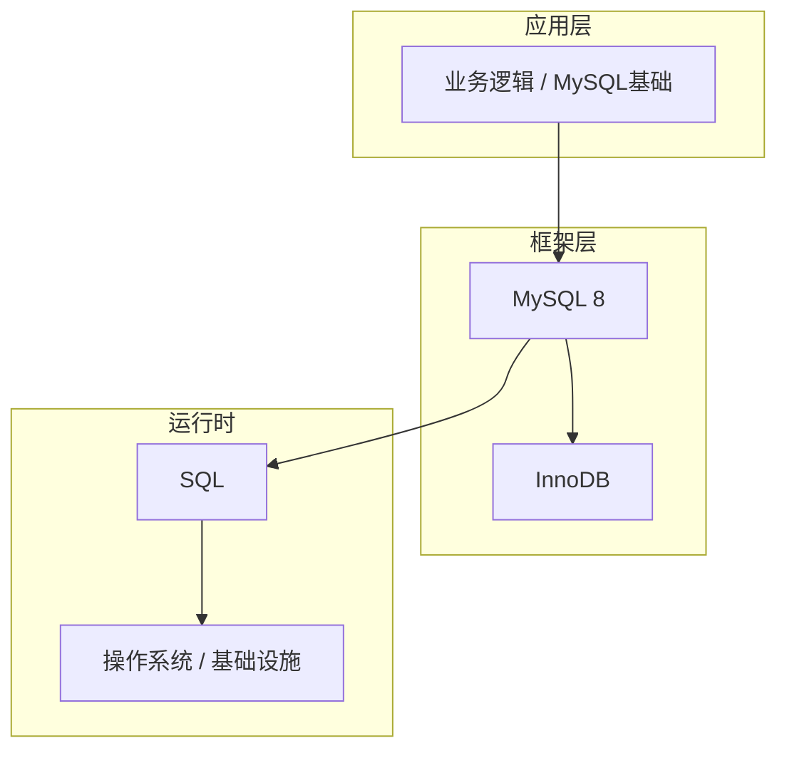

# MySQL基础的高级应用场景

> **领域**：MySQL ｜ **模块**：MySQL基础 ｜ **难度**：入门 ｜ **类型**：高级应用

## 导读

本章属于 **MySQL** 教程的 **MySQL基础** 模块，难度为 **入门**。阅读重点在于建立清晰的概念模型与工程判断能力，而非死记细节。

## 核心概念

MySQL 8 默认 InnoDB 引擎，支持事务、行级锁与 MVCC，B+树索引、执行计划优化与主从复制是生产运维的核心议题。

在 **MySQL** 体系中，**MySQL基础** 与上下游模块形成协作。技术栈以 **MySQL 8** 为核心（SQL），生态包括 InnoDB, Percona, ProxySQL。

「MySQL基础」是该领域的核心知识模块，理解其原理与边界是工程实践的基础。

### 概念精讲

**MySQL基础的基本概念与定义**

从结构出发：核心组成部分是什么，彼此如何协作。 在 MySQL基础 语境下，这一点直接影响设计决策与故障排查思路。

**MySQL基础在MySQL中的作用与地位**

从流程出发：一次完整调用或生命周期经历哪些阶段。 在 MySQL基础 语境下，这一点直接影响设计决策与故障排查思路。

**MySQL基础的核心数据结构**

从数据出发：输入输出是什么格式，状态如何变迁。 在 MySQL基础 语境下，这一点直接影响设计决策与故障排查思路。

**MySQL基础的关键算法与流程**

从关系出发：它与上下游模块的依赖与接口契约。 在 MySQL基础 语境下，这一点直接影响设计决策与故障排查思路。

**MySQL基础与其他模块的关系**

从实践出发：典型应用场景与反模式（不该用的场景）。 在 MySQL基础 语境下，这一点直接影响设计决策与故障排查思路。

## 架构与流程

以下框图帮助你在宏观层面把握模块协作关系与处理流向：

## 深度讲解

### 进阶场景

高并发、多租户、跨区域、强合规或极端资源约束下，MySQL基础 的默认配置往往不够，需深入理解底层。

### 架构模式

分层解耦、异步削峰、缓存分层、多活容灾（定义 RTO/RPO 与 failover）。

### 演进路径

先正确性与可观测，再性能与成本；每步保留回滚能力。

### 落地检查清单

- **理解MySQL基础的设计思想与适用场景**：落地时需明确验收标准与回滚方案。
- **掌握MySQL基础的核心API与配置项**：落地时需明确验收标准与回滚方案。
- **分析MySQL基础的源码实现与调用流程**：落地时需明确验收标准与回滚方案。
- **了解MySQL基础的性能特点与瓶颈**：落地时需明确验收标准与回滚方案。

### 常见误区与应对

**误区：对MySQL基础的概念理解不深入导致误用**

**应对**：回到官方定义画一张概念图，与同事讲解一遍，确保能用自己的话复述。

**误区：忽略MySQL基础的性能边界与限制条件**

**应对**：用 Profiler 或压测建立基线，对比优化前后数据，避免凭感觉优化。

**误区：MySQL基础配置不当引发的问题**

**应对**：核对环境变量、配置文件与部署清单是否一致，使用配置 diff 工具排查。

**误区：缺乏对MySQL基础底层原理的理解**

**应对**：阅读官方文档与一篇深度文章，结合小实验验证理解。

**误区：MySQL基础与其他模块集成时的兼容性问题**

**应对**：列出依赖版本矩阵，在 CI 中跑集成测试覆盖主要组合。

### 最佳实践

1. **遵循MySQL基础的官方推荐用法与规范** — 落地方式：写入团队 Wiki 并纳入 Code Review 检查项。

2. **在理解原理的基础上合理使用MySQL基础** — 落地方式：配置静态检查或 CI 规则自动拦截违规写法。

3. **建立完善的MySQL基础监控与告警机制** — 落地方式：在新人 onboarding 中作为必修内容讲解。

4. **编写充分的测试用例覆盖MySQL基础的各种场景** — 落地方式：每季度回顾一次，对照社区最佳实践更新。

5. **持续关注MySQL基础的版本更新与最佳实践演进** — 落地方式：用真实项目案例演示正确与错误对比。

### 本章小结

学完本章，你应能：

- 说清 **MySQL基础的高级应用场景** 在 MySQL/MySQL基础 中的定位。
- 描述核心流程与关键概念，能用自己的话复述。
- 识别常见误区并采取预防与排查手段。
- 在项目中做出与场景匹配的工程决策。

类型：**高级应用**。建议完成小练习或复盘笔记，将阅读转化为能力。

## 延伸学习

建议结合以下同模块章节继续阅读，构建完整知识链：

- MySQL基础的性能优化技巧
- MySQL基础的最佳实践指南
- MySQL基础的实战案例分析
- MySQL基础的设计思想与演进

### 参考资料

- MySQL官方文档 - MySQL基础章节
- 《MySQL权威指南》相关章节
- MySQL基础源码实现与注释
- MySQL社区最佳实践文章
- MySQL基础相关技术博客与教程

---
*章节 ID: 009 ｜ 领域: MySQL ｜ 版本: 2.0*