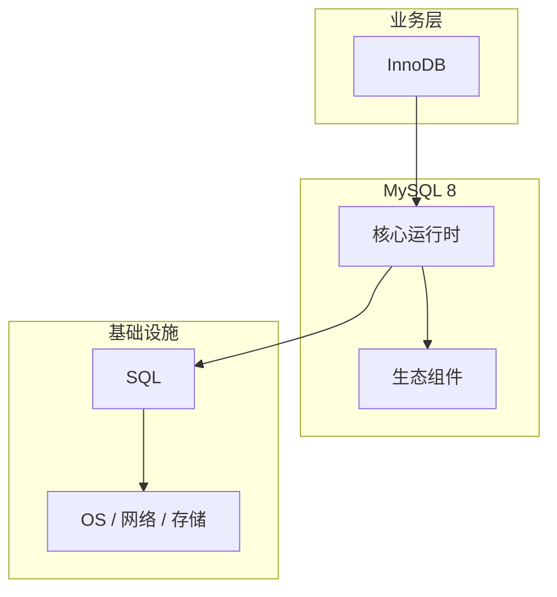

# InnoDB的关键技术点

> **领域**：MySQL ｜ **模块**：InnoDB ｜ **难度**：入门 ｜ **类型**：关键技术

## 导读

本章系统讲解 **MySQL** 中 **InnoDB** 的相关知识（关键技术）。本章归纳 **InnoDB** 在生产环境中最常用、最易出错的关键技术点。内容基于主流框架与工程实践撰写，不依赖过时概念堆砌。

## 核心知识

InnoDB 是 MySQL 8 默认存储引擎，提供行级锁、MVCC 事务与崩溃恢复。数据按 **聚簇索引（B+树）** 组织：主键叶子节点存完整行，二级索引叶子存主键值需 **回表** 查聚簇索引。

### 核心知识

**1. B+树聚簇索引**

InnoDB 表数据即主键 B+树：非叶子节点仅存键用于导航，叶子节点通过双向链表连接支持范围扫描。页（Page，默认 16KB）是 IO 最小单位。插入可能导致页分裂（Split），删除可能合并（Merge）。

**2. Buffer Pool**

内存中缓存数据页与索引页，读写优先命中 Buffer Pool。LRU 变种管理热度；dirty page 由 redo log 保证持久化，checkpoint 刷脏。`innodb_buffer_pool_size` 通常设为物理内存 50–70%。

**3. MVCC 与 Read View**

每行有隐藏列 DB_TRX_ID、DB_ROLL_PTR 指向 undo log 版本链。READ COMMITTED / REPEATABLE READ 通过 Read View 判断版本可见性，实现非锁定一致性读。

## 架构与流程

## 技术详解

### 关键技术

写操作：更新 Buffer Pool 页 → 写 undo log（旧版本）→ 写 redo log（WAL）→ 事务提交时 redo fsync。崩溃恢复：redo log 前滚 + undo log 回滚未提交事务。

## 原理与实现

### 工作机制

写操作：更新 Buffer Pool 页 → 写 undo log（旧版本）→ 写 redo log（WAL）→ 事务提交时 redo fsync。崩溃恢复：redo log 前滚 + undo log 回滚未提交事务。

### 内部实现

表空间文件 .ibd 存 B+树；系统表空间存数据字典。Doublewrite buffer 防止 partial page write。Change Buffer 延迟更新非唯一二级索引页以提升写性能。

## 性能、安全与排查

### 性能优化

主键单调递增（雪花 ID、自增）减少页分裂；避免过长二级索引（多列+长 VARCHAR）。覆盖索引避免回表；`EXPLAIN ANALYZE` 观察实际行数。

### 安全注意

行级锁降低锁粒度；SELECT ... FOR UPDATE 显式加 X 锁防并发更新丢失。

### 调试排错

`SHOW ENGINE INNODB STATUS` 查看锁等待；Performance Schema 分析 buffer pool 命中率。

## 本章聚焦

**InnoDB** 的关键技术往往集中在默认配置与边界行为；生产问题多源于「以为懂了」的细节，应用 checklist 逐项验证。

### 常见误区与纠正

**无显式主键**

InnoDB 会选首个 UNIQUE NOT NULL 或隐式 6 字节 row_id，二级索引变大且性能差。

**长事务撑大 undo**

undo 段无法 purge 导致表空间膨胀与查询变慢，应控制事务时长。

### 最佳实践

1. 主键短且有序
2. 批量写调大 redo log 与 buffer pool
3. 监控 History list length

## 巩固建议

建议结合 **MySQL** 官方文档与小型实验，亲手验证 **InnoDB** 的默认行为与边界条件；将本章要点整理为检查清单或 ADR，便于评审与团队 onboarding。

### 本章小结

学完本章，你应能独立说明 **InnoDB** 在 MySQL 中的角色，理解其核心机制，规避常见误区，并在项目中正确运用。

## 延伸学习

- InnoDB核心概念与原理
- InnoDB的实现机制详解
- InnoDB的源码级分析
- InnoDB的配置与使用
- InnoDB的常见问题与解决方案

### 延伸阅读

- MySQL 8 Reference Manual - InnoDB
- 《MySQL 技术内幕：InnoDB 存储引擎》

---
*章节 ID: 036 ｜ 领域: MySQL*