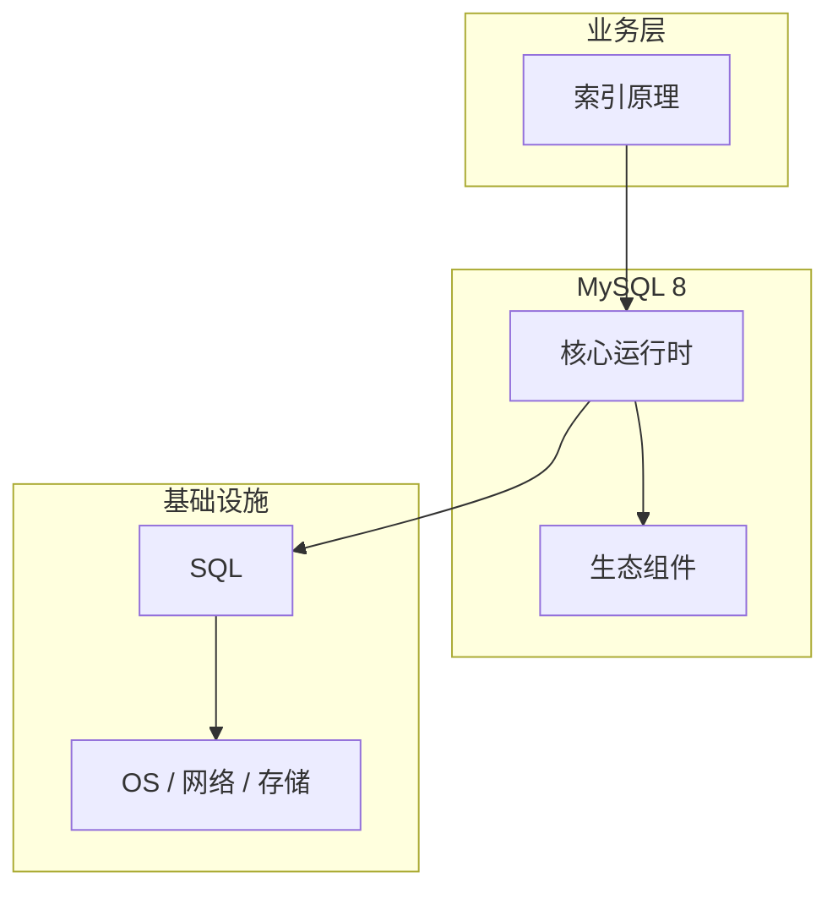

# 索引原理的源码级分析

> **领域**：MySQL ｜ **模块**：索引原理 ｜ **难度**：进阶 ｜ **类型**：源码分析

## 导读

本章系统讲解 **MySQL** 中 **索引原理** 的相关知识（源码分析）。本章沿源码与调用链剖析 **索引原理** 的实现，适合需要排障或二次开发的读者。内容基于主流框架与工程实践撰写，不依赖过时概念堆砌。

## 核心知识

InnoDB 索引结构为 B+树：矮胖结构使磁盘 IO 次数约为 log_{fanout}(N)。主键索引即聚簇索引；二级索引叶子节点存储索引列值 + 主键值。

### 核心知识

**1. 最左前缀原则**

联合索引 (a,b,c) 可用于 a、 (a,b)、 (a,b,c) 条件；跳过 leading column 无法利用 B+树有序性。

**2. 覆盖索引**

查询列全部在二级索引中即可 Index Only Scan，无需回表聚簇索引，显著降低 IO。

**3. 索引下推 ICP**

MySQL 5.6+ 在存储引擎层用索引列过滤，减少回表行数。

## 架构与流程

## 技术详解

### 源码与实现

优化器基于统计信息估算 cost，选择 ref/range/index 等 access type；Cardinality 影响选择。

## 原理与实现

### 工作机制

优化器基于统计信息估算 cost，选择 ref/range/index 等 access type；Cardinality 影响选择。

### 内部实现

Adaptive Hash Index 对热点页建内存哈希加速等值查询；不可手动控制，仅作内部优化。

## 性能、安全与排查

### 性能优化

避免函数包裹索引列（`WHERE YEAR(d)=2024` 无法走索引）；前缀索引节省空间但降低选择性。

## 本章聚焦

源码阅读 **索引原理** 宜采用「由外向内」：先跟一次主路径请求，再展开分支与错误处理，避免陷入细节迷失主线。

### 常见误区与纠正

**过多索引**

每次 INSERT/UPDATE 需维护所有相关 B+树，写放大明显。

**低选择性列单独建索引**

如 gender 列区分度低，优化器可能选择全表扫描。

### 最佳实践

1. 用 EXPLAIN 验证 type 与 key_len
2. 定期 ANALYZE TABLE 更新统计信息

## 巩固建议

建议结合 **MySQL** 官方文档与小型实验，亲手验证 **索引原理** 的默认行为与边界条件；将本章要点整理为检查清单或 ADR，便于评审与团队 onboarding。

### 本章小结

学完本章，你应能独立说明 **索引原理** 在 MySQL 中的角色，理解其核心机制，规避常见误区，并在项目中正确运用。

## 延伸学习

- 索引原理核心概念与原理
- 索引原理的实现机制详解
- 索引原理的关键技术点
- 索引原理的配置与使用
- 索引原理的常见问题与解决方案

### 延伸阅读

- MySQL EXPLAIN 文档
- Index Condition Pushdown

---
*章节 ID: 059 ｜ 领域: MySQL*