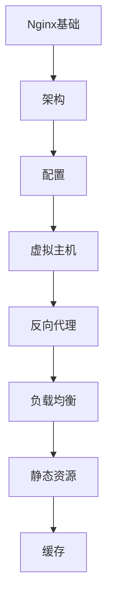

# Nginx 学习指南

> **分类**：DevOps ｜ **章节总数**：80 ｜ **技术栈**：Nginx 1.25+

## 领域概述

Nginx是DevOps领域的重要技术方向，本系列从基础到高级逐步深入，涵盖15个核心模块：Nginx基础、架构、配置、虚拟主机、反向代理等。每个知识点作为独立章节，包含原理讲解、实现要点、常见陷阱和最佳实践，配合源码分析和架构图，帮助读者建立完整的Nginx知识体系。

本教程基于 **Nginx配置** 与 **Nginx 1.25+** 生态编写，涵盖 OpenResty, Lua 等主流工具与框架。每章独立成篇，文字精炼、逻辑清晰，适合系统学习与按需查阅。

## 你将学到什么

完成本系列后，你将能够：

- 系统理解 **Nginx** 的核心概念与模块划分。
- 按难度递进掌握从入门到实战的完整知识路径。
- 在工程实践中做出合理的技术判断与问题排查。
- 通过章节索引快速定位所需知识点。

## 前置知识

- 编程基础
- 数据结构
- 计算机基础
- DevOps基础概念

## 推荐学习路径

1. **Nginx基础**
2. **架构**
3. **配置**
4. **虚拟主机**
5. **反向代理**
6. **负载均衡**
7. **静态资源**
8. **缓存**

## 模块体系

本领域按以下模块组织，难度由浅入深：

- **Nginx基础**
- **架构**
- **配置**
- **虚拟主机**
- **反向代理**
- **负载均衡**
- **静态资源**
- **缓存**
- **SSL/TLS**
- **HTTP/2**
- **限流**
- **访问控制**
- **日志**
- **性能优化**
- **Nginx最佳实践**

## 难度分布

| 难度 | 章节数 | 占比 |
|------|--------|------|
| 入门 | 18 | 22% |
| 实战 | 15 | 18% |
| 进阶 | 22 | 27% |
| 高级 | 25 | 31% |

## 章节索引

点击章节标题进入对应教程：

### Nginx基础

- [Nginx基础核心概念与原理](chapters/001-Nginx基础核心概念与原理.md) ｜ 入门
- [Nginx基础的实现机制详解](chapters/002-Nginx基础的实现机制详解.md) ｜ 入门
- [Nginx基础的关键技术点](chapters/003-Nginx基础的关键技术点.md) ｜ 入门
- [Nginx基础的源码级分析](chapters/004-Nginx基础的源码级分析.md) ｜ 入门
- [Nginx基础的配置与使用](chapters/005-Nginx基础的配置与使用.md) ｜ 入门
- [Nginx基础的常见问题与解决方案](chapters/006-Nginx基础的常见问题与解决方案.md) ｜ 入门

### 架构

- [架构核心概念与原理](chapters/007-架构核心概念与原理.md) ｜ 入门
- [架构的实现机制详解](chapters/008-架构的实现机制详解.md) ｜ 入门
- [架构的关键技术点](chapters/009-架构的关键技术点.md) ｜ 入门
- [架构的源码级分析](chapters/010-架构的源码级分析.md) ｜ 入门
- [架构的配置与使用](chapters/011-架构的配置与使用.md) ｜ 入门
- [架构的常见问题与解决方案](chapters/012-架构的常见问题与解决方案.md) ｜ 入门

### 配置

- [配置核心概念与原理](chapters/013-配置核心概念与原理.md) ｜ 入门
- [配置的实现机制详解](chapters/014-配置的实现机制详解.md) ｜ 入门
- [配置的关键技术点](chapters/015-配置的关键技术点.md) ｜ 入门
- [配置的源码级分析](chapters/016-配置的源码级分析.md) ｜ 入门
- [配置的配置与使用](chapters/017-配置的配置与使用.md) ｜ 入门
- [配置的常见问题与解决方案](chapters/018-配置的常见问题与解决方案.md) ｜ 入门

### 虚拟主机

- [虚拟主机核心概念与原理](chapters/019-虚拟主机核心概念与原理.md) ｜ 进阶
- [虚拟主机的实现机制详解](chapters/020-虚拟主机的实现机制详解.md) ｜ 进阶
- [虚拟主机的关键技术点](chapters/021-虚拟主机的关键技术点.md) ｜ 进阶
- [虚拟主机的源码级分析](chapters/022-虚拟主机的源码级分析.md) ｜ 进阶
- [虚拟主机的配置与使用](chapters/023-虚拟主机的配置与使用.md) ｜ 进阶
- [虚拟主机的常见问题与解决方案](chapters/024-虚拟主机的常见问题与解决方案.md) ｜ 进阶

### 反向代理

- [反向代理核心概念与原理](chapters/025-反向代理核心概念与原理.md) ｜ 进阶
- [反向代理的实现机制详解](chapters/026-反向代理的实现机制详解.md) ｜ 进阶
- [反向代理的关键技术点](chapters/027-反向代理的关键技术点.md) ｜ 进阶
- [反向代理的源码级分析](chapters/028-反向代理的源码级分析.md) ｜ 进阶
- [反向代理的配置与使用](chapters/029-反向代理的配置与使用.md) ｜ 进阶
- [反向代理的常见问题与解决方案](chapters/030-反向代理的常见问题与解决方案.md) ｜ 进阶

### 负载均衡

- [负载均衡核心概念与原理](chapters/031-负载均衡核心概念与原理.md) ｜ 进阶
- [负载均衡的实现机制详解](chapters/032-负载均衡的实现机制详解.md) ｜ 进阶
- [负载均衡的关键技术点](chapters/033-负载均衡的关键技术点.md) ｜ 进阶
- [负载均衡的源码级分析](chapters/034-负载均衡的源码级分析.md) ｜ 进阶
- [负载均衡的配置与使用](chapters/035-负载均衡的配置与使用.md) ｜ 进阶

### 静态资源

- [静态资源核心概念与原理](chapters/036-静态资源核心概念与原理.md) ｜ 进阶
- [静态资源的实现机制详解](chapters/037-静态资源的实现机制详解.md) ｜ 进阶
- [静态资源的关键技术点](chapters/038-静态资源的关键技术点.md) ｜ 进阶
- [静态资源的源码级分析](chapters/039-静态资源的源码级分析.md) ｜ 进阶
- [静态资源的配置与使用](chapters/040-静态资源的配置与使用.md) ｜ 进阶

### 缓存

- [缓存核心概念与原理](chapters/041-缓存核心概念与原理.md) ｜ 高级
- [缓存的实现机制详解](chapters/042-缓存的实现机制详解.md) ｜ 高级
- [缓存的关键技术点](chapters/043-缓存的关键技术点.md) ｜ 高级
- [缓存的源码级分析](chapters/044-缓存的源码级分析.md) ｜ 高级
- [缓存的配置与使用](chapters/045-缓存的配置与使用.md) ｜ 高级

### SSL/TLS

- [SSL/TLS核心概念与原理](chapters/046-SSLTLS核心概念与原理.md) ｜ 高级
- [SSL/TLS的实现机制详解](chapters/047-SSLTLS的实现机制详解.md) ｜ 高级
- [SSL/TLS的关键技术点](chapters/048-SSLTLS的关键技术点.md) ｜ 高级
- [SSL/TLS的源码级分析](chapters/049-SSLTLS的源码级分析.md) ｜ 高级
- [SSL/TLS的配置与使用](chapters/050-SSLTLS的配置与使用.md) ｜ 高级

### HTTP/2

- [HTTP/2核心概念与原理](chapters/051-HTTP2核心概念与原理.md) ｜ 高级
- [HTTP/2的实现机制详解](chapters/052-HTTP2的实现机制详解.md) ｜ 高级
- [HTTP/2的关键技术点](chapters/053-HTTP2的关键技术点.md) ｜ 高级
- [HTTP/2的源码级分析](chapters/054-HTTP2的源码级分析.md) ｜ 高级
- [HTTP/2的配置与使用](chapters/055-HTTP2的配置与使用.md) ｜ 高级

### 限流

- [限流核心概念与原理](chapters/056-限流核心概念与原理.md) ｜ 高级
- [限流的实现机制详解](chapters/057-限流的实现机制详解.md) ｜ 高级
- [限流的关键技术点](chapters/058-限流的关键技术点.md) ｜ 高级
- [限流的源码级分析](chapters/059-限流的源码级分析.md) ｜ 高级
- [限流的配置与使用](chapters/060-限流的配置与使用.md) ｜ 高级

### 访问控制

- [访问控制核心概念与原理](chapters/061-访问控制核心概念与原理.md) ｜ 高级
- [访问控制的实现机制详解](chapters/062-访问控制的实现机制详解.md) ｜ 高级
- [访问控制的关键技术点](chapters/063-访问控制的关键技术点.md) ｜ 高级
- [访问控制的源码级分析](chapters/064-访问控制的源码级分析.md) ｜ 高级
- [访问控制的配置与使用](chapters/065-访问控制的配置与使用.md) ｜ 高级

### 日志

- [日志核心概念与原理](chapters/066-日志核心概念与原理.md) ｜ 实战
- [日志的实现机制详解](chapters/067-日志的实现机制详解.md) ｜ 实战
- [日志的关键技术点](chapters/068-日志的关键技术点.md) ｜ 实战
- [日志的源码级分析](chapters/069-日志的源码级分析.md) ｜ 实战
- [日志的配置与使用](chapters/070-日志的配置与使用.md) ｜ 实战

### 性能优化

- [性能优化核心概念与原理](chapters/071-性能优化核心概念与原理.md) ｜ 实战
- [性能优化的实现机制详解](chapters/072-性能优化的实现机制详解.md) ｜ 实战
- [性能优化的关键技术点](chapters/073-性能优化的关键技术点.md) ｜ 实战
- [性能优化的源码级分析](chapters/074-性能优化的源码级分析.md) ｜ 实战
- [性能优化的配置与使用](chapters/075-性能优化的配置与使用.md) ｜ 实战

### Nginx最佳实践

- [Nginx最佳实践核心概念与原理](chapters/076-Nginx最佳实践核心概念与原理.md) ｜ 实战
- [Nginx最佳实践的实现机制详解](chapters/077-Nginx最佳实践的实现机制详解.md) ｜ 实战
- [Nginx最佳实践的关键技术点](chapters/078-Nginx最佳实践的关键技术点.md) ｜ 实战
- [Nginx最佳实践的源码级分析](chapters/079-Nginx最佳实践的源码级分析.md) ｜ 实战
- [Nginx最佳实践的配置与使用](chapters/080-Nginx最佳实践的配置与使用.md) ｜ 实战

## 学习方法建议

1. **先读概述再读章节**：用本指南建立全局地图，避免迷失在细节中。
2. **按模块递进**：同一模块内章节有前后关联，顺序阅读效果更好。
3. **主动复述**：每章读完后，用三五句话概括「是什么、为什么、怎么用」。
4. **关联阅读**：利用章节底部的「延伸学习」在同模块内构建知识网络。
5. **对照官方文档**：本教程提供结构化视角，细节以官方文档为准。

---
*领域: Nginx ｜ 版本: 2.0 ｜ 共 80 章*