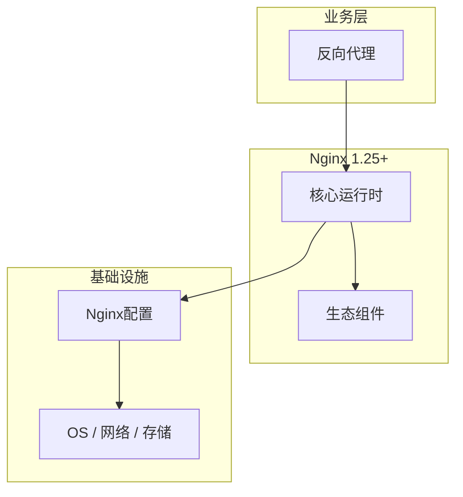

# 反向代理的关键技术点

> **领域**：Nginx ｜ **模块**：反向代理 ｜ **难度**：进阶 ｜ **类型**：关键技术

## 导读

本章系统讲解 **Nginx** 中 **反向代理** 的相关知识（关键技术）。本章归纳 **反向代理** 在生产环境中最常用、最易出错的关键技术点。内容基于主流框架与工程实践撰写，不依赖过时概念堆砌。

## 核心知识

Nginx 反向代理将客户端请求转发至 upstream 服务器群，基于 **事件驱动 epoll/kqueue** 单 worker 处理数万并发连接。proxy_pass 修改 Host、X-Forwarded-* 头传递客户端真实信息。

### 核心知识

**1. upstream 与负载均衡**

round-robin、least_conn、ip_hash、hash $request_uri consistent；健康检查需 nginx-plus 或 openresty。

**2. proxy_buffering**

默认缓冲 upstream 响应再发给客户端；流式/SSE 需 proxy_buffering off。

**3. keepalive 连接池**

upstream 块配置 keepalive N 复用到后端 TCP，降低握手开销。

## 架构与流程

## 技术详解

### 关键技术

请求 → location 匹配 → proxy_pass URI 拼接规则 → 选 upstream peer → 转发 → 回写响应。

## 原理与实现

### 工作机制

请求 → location 匹配 → proxy_pass URI 拼接规则 → 选 upstream peer → 转发 → 回写响应。

## 性能、安全与排查

### 性能优化

worker_processes auto；sendfile on；gzip 压缩文本；调整 worker_connections。

## 本章聚焦

**反向代理** 的关键技术往往集中在默认配置与边界行为；生产问题多源于「以为懂了」的细节，应用 checklist 逐项验证。

### 常见误区与纠正

**URI 被截断**

proxy_pass 带 URI 路径时 location 匹配部分会被替换，需注意 trailing slash。

### 最佳实践

1. 传递 X-Forwarded-For 与 Proto
2. 设置 proxy_read_timeout
3. upstream 失败重试策略

## 巩固建议

建议结合 **Nginx** 官方文档与小型实验，亲手验证 **反向代理** 的默认行为与边界条件；将本章要点整理为检查清单或 ADR，便于评审与团队 onboarding。

### 本章小结

学完本章，你应能独立说明 **反向代理** 在 Nginx 中的角色，理解其核心机制，规避常见误区，并在项目中正确运用。

## 延伸学习

- 反向代理核心概念与原理
- 反向代理的实现机制详解
- 反向代理的源码级分析
- 反向代理的配置与使用
- 反向代理的常见问题与解决方案

### 延伸阅读

- Nginx ngx_http_proxy_module
- Nginx 性能调优指南

---
*章节 ID: 027 ｜ 领域: Nginx*