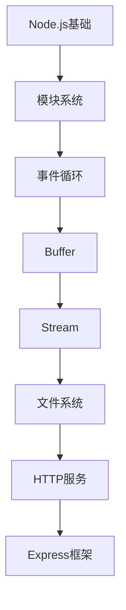

# Node.js 学习指南

> **分类**：前端开发 ｜ **技术生态**：Node LTS、Express、Koa、Fastify、Prisma、PM2、Jest

## 领域定位

Node.js 将 V8 与 libuv 结合，使 JavaScript 可编写高性能 I/O 密集型服务端。事件循环、Stream 与 HTTP 框架是核心。

覆盖模块系统、事件循环、Express/Koa、数据库认证、进程管理与性能调优。

本领域常用技术栈与工具包括：Node LTS、Express、Koa、Fastify、Prisma、PM2、Jest。

## 学习目标

- 理解事件循环各阶段
- 构建 REST API 与中间件
- Stream 与数据库集成
- PM2 部署与性能分析

## 前置知识

- JavaScript 核心
- HTTP 基础
- 命令行 npm

## 学习路径

1. **Node.js基础**
2. **模块系统**
3. **事件循环**
4. **Buffer**
5. **Stream**
6. **文件系统**
7. **HTTP服务**
8. **Express框架**

## 模块体系

- **Node.js基础**
- **模块系统**
- **事件循环**
- **Buffer**
- **Stream**
- **文件系统**
- **HTTP服务**
- **Express框架**
- **Koa框架**
- **中间件**
- **数据库操作**
- **认证授权**
- **进程管理**
- **异步编程**
- **性能优化**
- **调试与测试**
- **Node.js最佳实践**

## 难度分布

| 入门 | 29 | 24% |
| 实战 | 28 | 23% |
| 进阶 | 28 | 23% |
| 高级 | 35 | 29% |

## 章节索引

### Node.js基础

- [Node.js基础核心概念与原理](chapters/001-Node.js基础核心概念与原理.md) ｜ 入门
- [Node.js基础的实现机制详解](chapters/002-Node.js基础的实现机制详解.md) ｜ 入门
- [Node.js基础的关键技术点](chapters/003-Node.js基础的关键技术点.md) ｜ 入门
- [Node.js基础的源码级分析](chapters/004-Node.js基础的源码级分析.md) ｜ 入门
- [Node.js基础的配置与使用](chapters/005-Node.js基础的配置与使用.md) ｜ 入门
- [Node.js基础的常见问题与解决方案](chapters/006-Node.js基础的常见问题与解决方案.md) ｜ 入门
- [Node.js基础的性能优化技巧](chapters/007-Node.js基础的性能优化技巧.md) ｜ 入门
- [Node.js基础的最佳实践指南](chapters/008-Node.js基础的最佳实践指南.md) ｜ 入门

### 模块系统

- [模块系统核心概念与原理](chapters/009-模块系统核心概念与原理.md) ｜ 入门
- [模块系统的实现机制详解](chapters/010-模块系统的实现机制详解.md) ｜ 入门
- [模块系统的关键技术点](chapters/011-模块系统的关键技术点.md) ｜ 入门
- [模块系统的源码级分析](chapters/012-模块系统的源码级分析.md) ｜ 入门
- [模块系统的配置与使用](chapters/013-模块系统的配置与使用.md) ｜ 入门
- [模块系统的常见问题与解决方案](chapters/014-模块系统的常见问题与解决方案.md) ｜ 入门
- [模块系统的性能优化技巧](chapters/015-模块系统的性能优化技巧.md) ｜ 入门

### 事件循环

- [事件循环核心概念与原理](chapters/016-事件循环核心概念与原理.md) ｜ 入门
- [事件循环的实现机制详解](chapters/017-事件循环的实现机制详解.md) ｜ 入门
- [事件循环的关键技术点](chapters/018-事件循环的关键技术点.md) ｜ 入门
- [事件循环的源码级分析](chapters/019-事件循环的源码级分析.md) ｜ 入门
- [事件循环的配置与使用](chapters/020-事件循环的配置与使用.md) ｜ 入门
- [事件循环的常见问题与解决方案](chapters/021-事件循环的常见问题与解决方案.md) ｜ 入门
- [事件循环的性能优化技巧](chapters/022-事件循环的性能优化技巧.md) ｜ 入门

### Buffer

- [Buffer核心概念与原理](chapters/023-Buffer核心概念与原理.md) ｜ 入门
- [Buffer的实现机制详解](chapters/024-Buffer的实现机制详解.md) ｜ 入门
- [Buffer的关键技术点](chapters/025-Buffer的关键技术点.md) ｜ 入门
- [Buffer的源码级分析](chapters/026-Buffer的源码级分析.md) ｜ 入门
- [Buffer的配置与使用](chapters/027-Buffer的配置与使用.md) ｜ 入门
- [Buffer的常见问题与解决方案](chapters/028-Buffer的常见问题与解决方案.md) ｜ 入门
- [Buffer的性能优化技巧](chapters/029-Buffer的性能优化技巧.md) ｜ 入门

### Stream

- [Stream核心概念与原理](chapters/030-Stream核心概念与原理.md) ｜ 进阶
- [Stream的实现机制详解](chapters/031-Stream的实现机制详解.md) ｜ 进阶
- [Stream的关键技术点](chapters/032-Stream的关键技术点.md) ｜ 进阶
- [Stream的源码级分析](chapters/033-Stream的源码级分析.md) ｜ 进阶
- [Stream的配置与使用](chapters/034-Stream的配置与使用.md) ｜ 进阶
- [Stream的常见问题与解决方案](chapters/035-Stream的常见问题与解决方案.md) ｜ 进阶
- [Stream的性能优化技巧](chapters/036-Stream的性能优化技巧.md) ｜ 进阶

### 文件系统

- [文件系统核心概念与原理](chapters/037-文件系统核心概念与原理.md) ｜ 进阶
- [文件系统的实现机制详解](chapters/038-文件系统的实现机制详解.md) ｜ 进阶
- [文件系统的关键技术点](chapters/039-文件系统的关键技术点.md) ｜ 进阶
- [文件系统的源码级分析](chapters/040-文件系统的源码级分析.md) ｜ 进阶
- [文件系统的配置与使用](chapters/041-文件系统的配置与使用.md) ｜ 进阶
- [文件系统的常见问题与解决方案](chapters/042-文件系统的常见问题与解决方案.md) ｜ 进阶
- [文件系统的性能优化技巧](chapters/043-文件系统的性能优化技巧.md) ｜ 进阶

### HTTP服务

- [HTTP服务核心概念与原理](chapters/044-HTTP服务核心概念与原理.md) ｜ 进阶
- [HTTP服务的实现机制详解](chapters/045-HTTP服务的实现机制详解.md) ｜ 进阶
- [HTTP服务的关键技术点](chapters/046-HTTP服务的关键技术点.md) ｜ 进阶
- [HTTP服务的源码级分析](chapters/047-HTTP服务的源码级分析.md) ｜ 进阶
- [HTTP服务的配置与使用](chapters/048-HTTP服务的配置与使用.md) ｜ 进阶
- [HTTP服务的常见问题与解决方案](chapters/049-HTTP服务的常见问题与解决方案.md) ｜ 进阶
- [HTTP服务的性能优化技巧](chapters/050-HTTP服务的性能优化技巧.md) ｜ 进阶

### Express框架

- [Express框架核心概念与原理](chapters/051-Express框架核心概念与原理.md) ｜ 进阶
- [Express框架的实现机制详解](chapters/052-Express框架的实现机制详解.md) ｜ 进阶
- [Express框架的关键技术点](chapters/053-Express框架的关键技术点.md) ｜ 进阶
- [Express框架的源码级分析](chapters/054-Express框架的源码级分析.md) ｜ 进阶
- [Express框架的配置与使用](chapters/055-Express框架的配置与使用.md) ｜ 进阶
- [Express框架的常见问题与解决方案](chapters/056-Express框架的常见问题与解决方案.md) ｜ 进阶
- [Express框架的性能优化技巧](chapters/057-Express框架的性能优化技巧.md) ｜ 进阶

### Koa框架

- [Koa框架核心概念与原理](chapters/058-Koa框架核心概念与原理.md) ｜ 高级
- [Koa框架的实现机制详解](chapters/059-Koa框架的实现机制详解.md) ｜ 高级
- [Koa框架的关键技术点](chapters/060-Koa框架的关键技术点.md) ｜ 高级
- [Koa框架的源码级分析](chapters/061-Koa框架的源码级分析.md) ｜ 高级
- [Koa框架的配置与使用](chapters/062-Koa框架的配置与使用.md) ｜ 高级
- [Koa框架的常见问题与解决方案](chapters/063-Koa框架的常见问题与解决方案.md) ｜ 高级
- [Koa框架的性能优化技巧](chapters/064-Koa框架的性能优化技巧.md) ｜ 高级

### 中间件

- [中间件核心概念与原理](chapters/065-中间件核心概念与原理.md) ｜ 高级
- [中间件的实现机制详解](chapters/066-中间件的实现机制详解.md) ｜ 高级
- [中间件的关键技术点](chapters/067-中间件的关键技术点.md) ｜ 高级
- [中间件的源码级分析](chapters/068-中间件的源码级分析.md) ｜ 高级
- [中间件的配置与使用](chapters/069-中间件的配置与使用.md) ｜ 高级
- [中间件的常见问题与解决方案](chapters/070-中间件的常见问题与解决方案.md) ｜ 高级
- [中间件的性能优化技巧](chapters/071-中间件的性能优化技巧.md) ｜ 高级

### 数据库操作

- [数据库操作核心概念与原理](chapters/072-数据库操作核心概念与原理.md) ｜ 高级
- [数据库操作的实现机制详解](chapters/073-数据库操作的实现机制详解.md) ｜ 高级
- [数据库操作的关键技术点](chapters/074-数据库操作的关键技术点.md) ｜ 高级
- [数据库操作的源码级分析](chapters/075-数据库操作的源码级分析.md) ｜ 高级
- [数据库操作的配置与使用](chapters/076-数据库操作的配置与使用.md) ｜ 高级
- [数据库操作的常见问题与解决方案](chapters/077-数据库操作的常见问题与解决方案.md) ｜ 高级
- [数据库操作的性能优化技巧](chapters/078-数据库操作的性能优化技巧.md) ｜ 高级

### 认证授权

- [认证授权核心概念与原理](chapters/079-认证授权核心概念与原理.md) ｜ 高级
- [认证授权的实现机制详解](chapters/080-认证授权的实现机制详解.md) ｜ 高级
- [认证授权的关键技术点](chapters/081-认证授权的关键技术点.md) ｜ 高级
- [认证授权的源码级分析](chapters/082-认证授权的源码级分析.md) ｜ 高级
- [认证授权的配置与使用](chapters/083-认证授权的配置与使用.md) ｜ 高级
- [认证授权的常见问题与解决方案](chapters/084-认证授权的常见问题与解决方案.md) ｜ 高级
- [认证授权的性能优化技巧](chapters/085-认证授权的性能优化技巧.md) ｜ 高级

### 进程管理

- [进程管理核心概念与原理](chapters/086-进程管理核心概念与原理.md) ｜ 高级
- [进程管理的实现机制详解](chapters/087-进程管理的实现机制详解.md) ｜ 高级
- [进程管理的关键技术点](chapters/088-进程管理的关键技术点.md) ｜ 高级
- [进程管理的源码级分析](chapters/089-进程管理的源码级分析.md) ｜ 高级
- [进程管理的配置与使用](chapters/090-进程管理的配置与使用.md) ｜ 高级
- [进程管理的常见问题与解决方案](chapters/091-进程管理的常见问题与解决方案.md) ｜ 高级
- [进程管理的性能优化技巧](chapters/092-进程管理的性能优化技巧.md) ｜ 高级

### 异步编程

- [异步编程核心概念与原理](chapters/093-异步编程核心概念与原理.md) ｜ 实战
- [异步编程的实现机制详解](chapters/094-异步编程的实现机制详解.md) ｜ 实战
- [异步编程的关键技术点](chapters/095-异步编程的关键技术点.md) ｜ 实战
- [异步编程的源码级分析](chapters/096-异步编程的源码级分析.md) ｜ 实战
- [异步编程的配置与使用](chapters/097-异步编程的配置与使用.md) ｜ 实战
- [异步编程的常见问题与解决方案](chapters/098-异步编程的常见问题与解决方案.md) ｜ 实战
- [异步编程的性能优化技巧](chapters/099-异步编程的性能优化技巧.md) ｜ 实战

### 性能优化

- [性能优化核心概念与原理](chapters/100-性能优化核心概念与原理.md) ｜ 实战
- [性能优化的实现机制详解](chapters/101-性能优化的实现机制详解.md) ｜ 实战
- [性能优化的关键技术点](chapters/102-性能优化的关键技术点.md) ｜ 实战
- [性能优化的源码级分析](chapters/103-性能优化的源码级分析.md) ｜ 实战
- [性能优化的配置与使用](chapters/104-性能优化的配置与使用.md) ｜ 实战
- [性能优化的常见问题与解决方案](chapters/105-性能优化的常见问题与解决方案.md) ｜ 实战
- [性能优化的性能优化技巧](chapters/106-性能优化的性能优化技巧.md) ｜ 实战

### 调试与测试

- [调试与测试核心概念与原理](chapters/107-调试与测试核心概念与原理.md) ｜ 实战
- [调试与测试的实现机制详解](chapters/108-调试与测试的实现机制详解.md) ｜ 实战
- [调试与测试的关键技术点](chapters/109-调试与测试的关键技术点.md) ｜ 实战
- [调试与测试的源码级分析](chapters/110-调试与测试的源码级分析.md) ｜ 实战
- [调试与测试的配置与使用](chapters/111-调试与测试的配置与使用.md) ｜ 实战
- [调试与测试的常见问题与解决方案](chapters/112-调试与测试的常见问题与解决方案.md) ｜ 实战
- [调试与测试的性能优化技巧](chapters/113-调试与测试的性能优化技巧.md) ｜ 实战

### Node.js最佳实践

- [Node.js最佳实践核心概念与原理](chapters/114-Node.js最佳实践核心概念与原理.md) ｜ 实战
- [Node.js最佳实践的实现机制详解](chapters/115-Node.js最佳实践的实现机制详解.md) ｜ 实战
- [Node.js最佳实践的关键技术点](chapters/116-Node.js最佳实践的关键技术点.md) ｜ 实战
- [Node.js最佳实践的源码级分析](chapters/117-Node.js最佳实践的源码级分析.md) ｜ 实战
- [Node.js最佳实践的配置与使用](chapters/118-Node.js最佳实践的配置与使用.md) ｜ 实战
- [Node.js最佳实践的常见问题与解决方案](chapters/119-Node.js最佳实践的常见问题与解决方案.md) ｜ 实战
- [Node.js最佳实践的性能优化技巧](chapters/120-Node.js最佳实践的性能优化技巧.md) ｜ 实战

---
*领域: Node.js*