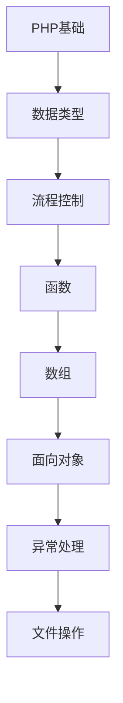

# PHP 学习指南

> **分类**：编程语言 ｜ **技术生态**：见正文

## 领域定位

PHP 是当前技术生态中的重要方向。

系统学习 PHP 需兼顾原理与工程实践，本指南按模块组织章节，由浅入深。

建议结合官方文档与社区主流工具链同步学习。

## 学习目标

- 系统掌握 PHP 核心模块与协作关系
- 能独立分析常见问题并给出可验证的解决方案
- 能在真实项目中做出合理的技术选型与架构决策
- 能阅读官方文档与源码定位关键实现路径

## 前置知识

- 无硬性前置，按章节难度循序渐进即可

## 学习路径

1. **PHP基础**
2. **数据类型**
3. **流程控制**
4. **函数**
5. **数组**
6. **面向对象**
7. **异常处理**
8. **文件操作**

## 模块体系

- **PHP基础**
- **数据类型**
- **流程控制**
- **函数**
- **数组**
- **面向对象**
- **异常处理**
- **文件操作**
- **数据库操作**
- **PHP7+新特性**
- **Composer**
- **Laravel基础**
- **性能优化**
- **安全编程**
- **PHP最佳实践**

## 难度分布

| 入门 | 18 | 22% |
| 实战 | 15 | 18% |
| 进阶 | 22 | 27% |
| 高级 | 25 | 31% |

## 章节索引

### PHP基础

- [PHP基础核心概念与原理](chapters/001-PHP基础核心概念与原理.md) ｜ 入门
- [PHP基础的实现机制详解](chapters/002-PHP基础的实现机制详解.md) ｜ 入门
- [PHP基础的关键技术点](chapters/003-PHP基础的关键技术点.md) ｜ 入门
- [PHP基础的源码级分析](chapters/004-PHP基础的源码级分析.md) ｜ 入门
- [PHP基础的配置与使用](chapters/005-PHP基础的配置与使用.md) ｜ 入门
- [PHP基础的常见问题与解决方案](chapters/006-PHP基础的常见问题与解决方案.md) ｜ 入门

### 数据类型

- [数据类型核心概念与原理](chapters/007-数据类型核心概念与原理.md) ｜ 入门
- [数据类型的实现机制详解](chapters/008-数据类型的实现机制详解.md) ｜ 入门
- [数据类型的关键技术点](chapters/009-数据类型的关键技术点.md) ｜ 入门
- [数据类型的源码级分析](chapters/010-数据类型的源码级分析.md) ｜ 入门
- [数据类型的配置与使用](chapters/011-数据类型的配置与使用.md) ｜ 入门
- [数据类型的常见问题与解决方案](chapters/012-数据类型的常见问题与解决方案.md) ｜ 入门

### 流程控制

- [流程控制核心概念与原理](chapters/013-流程控制核心概念与原理.md) ｜ 入门
- [流程控制的实现机制详解](chapters/014-流程控制的实现机制详解.md) ｜ 入门
- [流程控制的关键技术点](chapters/015-流程控制的关键技术点.md) ｜ 入门
- [流程控制的源码级分析](chapters/016-流程控制的源码级分析.md) ｜ 入门
- [流程控制的配置与使用](chapters/017-流程控制的配置与使用.md) ｜ 入门
- [流程控制的常见问题与解决方案](chapters/018-流程控制的常见问题与解决方案.md) ｜ 入门

### 函数

- [函数核心概念与原理](chapters/019-函数核心概念与原理.md) ｜ 进阶
- [函数的实现机制详解](chapters/020-函数的实现机制详解.md) ｜ 进阶
- [函数的关键技术点](chapters/021-函数的关键技术点.md) ｜ 进阶
- [函数的源码级分析](chapters/022-函数的源码级分析.md) ｜ 进阶
- [函数的配置与使用](chapters/023-函数的配置与使用.md) ｜ 进阶
- [函数的常见问题与解决方案](chapters/024-函数的常见问题与解决方案.md) ｜ 进阶

### 数组

- [数组核心概念与原理](chapters/025-数组核心概念与原理.md) ｜ 进阶
- [数组的实现机制详解](chapters/026-数组的实现机制详解.md) ｜ 进阶
- [数组的关键技术点](chapters/027-数组的关键技术点.md) ｜ 进阶
- [数组的源码级分析](chapters/028-数组的源码级分析.md) ｜ 进阶
- [数组的配置与使用](chapters/029-数组的配置与使用.md) ｜ 进阶
- [数组的常见问题与解决方案](chapters/030-数组的常见问题与解决方案.md) ｜ 进阶

### 面向对象

- [面向对象核心概念与原理](chapters/031-面向对象核心概念与原理.md) ｜ 进阶
- [面向对象的实现机制详解](chapters/032-面向对象的实现机制详解.md) ｜ 进阶
- [面向对象的关键技术点](chapters/033-面向对象的关键技术点.md) ｜ 进阶
- [面向对象的源码级分析](chapters/034-面向对象的源码级分析.md) ｜ 进阶
- [面向对象的配置与使用](chapters/035-面向对象的配置与使用.md) ｜ 进阶

### 异常处理

- [异常处理核心概念与原理](chapters/036-异常处理核心概念与原理.md) ｜ 进阶
- [异常处理的实现机制详解](chapters/037-异常处理的实现机制详解.md) ｜ 进阶
- [异常处理的关键技术点](chapters/038-异常处理的关键技术点.md) ｜ 进阶
- [异常处理的源码级分析](chapters/039-异常处理的源码级分析.md) ｜ 进阶
- [异常处理的配置与使用](chapters/040-异常处理的配置与使用.md) ｜ 进阶

### 文件操作

- [文件操作核心概念与原理](chapters/041-文件操作核心概念与原理.md) ｜ 高级
- [文件操作的实现机制详解](chapters/042-文件操作的实现机制详解.md) ｜ 高级
- [文件操作的关键技术点](chapters/043-文件操作的关键技术点.md) ｜ 高级
- [文件操作的源码级分析](chapters/044-文件操作的源码级分析.md) ｜ 高级
- [文件操作的配置与使用](chapters/045-文件操作的配置与使用.md) ｜ 高级

### 数据库操作

- [数据库操作核心概念与原理](chapters/046-数据库操作核心概念与原理.md) ｜ 高级
- [数据库操作的实现机制详解](chapters/047-数据库操作的实现机制详解.md) ｜ 高级
- [数据库操作的关键技术点](chapters/048-数据库操作的关键技术点.md) ｜ 高级
- [数据库操作的源码级分析](chapters/049-数据库操作的源码级分析.md) ｜ 高级
- [数据库操作的配置与使用](chapters/050-数据库操作的配置与使用.md) ｜ 高级

### PHP7+新特性

- [PHP7+新特性核心概念与原理](chapters/051-PHP7+新特性核心概念与原理.md) ｜ 高级
- [PHP7+新特性的实现机制详解](chapters/052-PHP7+新特性的实现机制详解.md) ｜ 高级
- [PHP7+新特性的关键技术点](chapters/053-PHP7+新特性的关键技术点.md) ｜ 高级
- [PHP7+新特性的源码级分析](chapters/054-PHP7+新特性的源码级分析.md) ｜ 高级
- [PHP7+新特性的配置与使用](chapters/055-PHP7+新特性的配置与使用.md) ｜ 高级

### Composer

- [Composer核心概念与原理](chapters/056-Composer核心概念与原理.md) ｜ 高级
- [Composer的实现机制详解](chapters/057-Composer的实现机制详解.md) ｜ 高级
- [Composer的关键技术点](chapters/058-Composer的关键技术点.md) ｜ 高级
- [Composer的源码级分析](chapters/059-Composer的源码级分析.md) ｜ 高级
- [Composer的配置与使用](chapters/060-Composer的配置与使用.md) ｜ 高级

### Laravel基础

- [Laravel基础核心概念与原理](chapters/061-Laravel基础核心概念与原理.md) ｜ 高级
- [Laravel基础的实现机制详解](chapters/062-Laravel基础的实现机制详解.md) ｜ 高级
- [Laravel基础的关键技术点](chapters/063-Laravel基础的关键技术点.md) ｜ 高级
- [Laravel基础的源码级分析](chapters/064-Laravel基础的源码级分析.md) ｜ 高级
- [Laravel基础的配置与使用](chapters/065-Laravel基础的配置与使用.md) ｜ 高级

### 性能优化

- [性能优化核心概念与原理](chapters/066-性能优化核心概念与原理.md) ｜ 实战
- [性能优化的实现机制详解](chapters/067-性能优化的实现机制详解.md) ｜ 实战
- [性能优化的关键技术点](chapters/068-性能优化的关键技术点.md) ｜ 实战
- [性能优化的源码级分析](chapters/069-性能优化的源码级分析.md) ｜ 实战
- [性能优化的配置与使用](chapters/070-性能优化的配置与使用.md) ｜ 实战

### 安全编程

- [安全编程核心概念与原理](chapters/071-安全编程核心概念与原理.md) ｜ 实战
- [安全编程的实现机制详解](chapters/072-安全编程的实现机制详解.md) ｜ 实战
- [安全编程的关键技术点](chapters/073-安全编程的关键技术点.md) ｜ 实战
- [安全编程的源码级分析](chapters/074-安全编程的源码级分析.md) ｜ 实战
- [安全编程的配置与使用](chapters/075-安全编程的配置与使用.md) ｜ 实战

### PHP最佳实践

- [PHP最佳实践核心概念与原理](chapters/076-PHP最佳实践核心概念与原理.md) ｜ 实战
- [PHP最佳实践的实现机制详解](chapters/077-PHP最佳实践的实现机制详解.md) ｜ 实战
- [PHP最佳实践的关键技术点](chapters/078-PHP最佳实践的关键技术点.md) ｜ 实战
- [PHP最佳实践的源码级分析](chapters/079-PHP最佳实践的源码级分析.md) ｜ 实战
- [PHP最佳实践的配置与使用](chapters/080-PHP最佳实践的配置与使用.md) ｜ 实战

---
*领域: PHP*