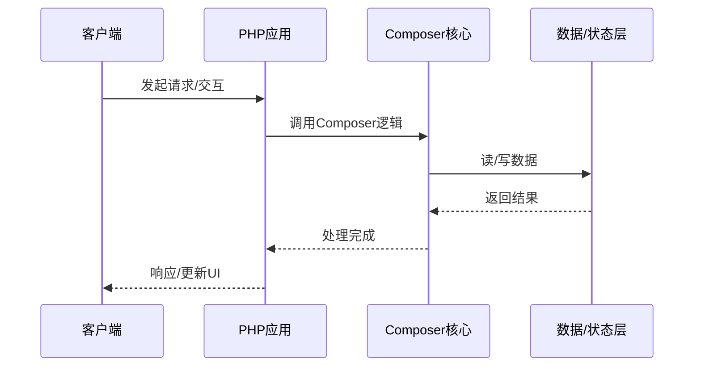

# Composer的源码级分析

> **领域**：PHP ｜ **模块**：Composer ｜ **难度**：高级 ｜ **类型**：源码分析

## 导读

本章属于 **PHP** 教程的 **Composer** 模块，难度为 **高级**。阅读重点在于建立清晰的概念模型与工程判断能力，而非死记细节。

## 核心概念

PHP 是当前技术生态中的重要方向，系统学习需兼顾概念、原理与工程实践。

在 **PHP** 体系中，**Composer** 与上下游模块形成协作。技术栈以 **PHP 8.3** 为核心（PHP），生态包括 Composer, Laravel。

「Composer」是该领域的核心知识模块，理解其原理与边界是工程实践的基础。

### 概念精讲

**Composer的基本概念与定义**

从数据出发：输入输出是什么格式，状态如何变迁。 在 Composer 语境下，这一点直接影响设计决策与故障排查思路。

**Composer在PHP中的作用与地位**

从关系出发：它与上下游模块的依赖与接口契约。 在 Composer 语境下，这一点直接影响设计决策与故障排查思路。

**Composer的核心数据结构**

从实践出发：典型应用场景与反模式（不该用的场景）。 在 Composer 语境下，这一点直接影响设计决策与故障排查思路。

**Composer的关键算法与流程**

从演进出发：历史上为何出现、未来可能如何变化。 在 Composer 语境下，这一点直接影响设计决策与故障排查思路。

**Composer与其他模块的关系**

从度量出发：如何评估它是否工作正常、性能是否达标。 在 Composer 语境下，这一点直接影响设计决策与故障排查思路。

## 架构与流程

以下框图帮助你在宏观层面把握模块协作关系与处理流向：

## 深度讲解

### 源码阅读路径

分析 PHP 8.3 中 Composer 相关实现：

1. 从公开 API 入口定位首次调用函数。
2. 阅读核心数据结构，字段含义揭示设计意图。
3. 梳理正常路径与异常路径，注意错误传播。
4. 识别扩展点（钩子、插件），理解内核如何保持稳定。

### 文档与实现差异

记录文档未覆盖的边界行为，形成团队「已知行为清单」，避免把实现细节误当作公开契约。

### 工程决策

读懂实现后，能更准确评估定制代价、升级风险与性能瓶颈位置。

### 落地检查清单

- **掌握Composer的调优技巧与最佳实践**：落地时需明确验收标准与回滚方案。
- **了解Composer在实际项目中的应用案例**：落地时需明确验收标准与回滚方案。
- **理解Composer的设计思想与适用场景**：落地时需明确验收标准与回滚方案。
- **掌握Composer的核心API与配置项**：落地时需明确验收标准与回滚方案。

### 常见误区与应对

**误区：对Composer的概念理解不深入导致误用**

**应对**：回到官方定义画一张概念图，与同事讲解一遍，确保能用自己的话复述。

**误区：忽略Composer的性能边界与限制条件**

**应对**：用 Profiler 或压测建立基线，对比优化前后数据，避免凭感觉优化。

**误区：Composer配置不当引发的问题**

**应对**：核对环境变量、配置文件与部署清单是否一致，使用配置 diff 工具排查。

**误区：缺乏对Composer底层原理的理解**

**应对**：阅读官方文档与一篇深度文章，结合小实验验证理解。

**误区：Composer与其他模块集成时的兼容性问题**

**应对**：列出依赖版本矩阵，在 CI 中跑集成测试覆盖主要组合。

### 最佳实践

1. **遵循Composer的官方推荐用法与规范** — 落地方式：写入团队 Wiki 并纳入 Code Review 检查项。

2. **在理解原理的基础上合理使用Composer** — 落地方式：配置静态检查或 CI 规则自动拦截违规写法。

3. **建立完善的Composer监控与告警机制** — 落地方式：在新人 onboarding 中作为必修内容讲解。

4. **编写充分的测试用例覆盖Composer的各种场景** — 落地方式：每季度回顾一次，对照社区最佳实践更新。

5. **持续关注Composer的版本更新与最佳实践演进** — 落地方式：用真实项目案例演示正确与错误对比。

### 本章小结

学完本章，你应能：

- 说清 **Composer的源码级分析** 在 PHP/Composer 中的定位。
- 描述核心流程与关键概念，能用自己的话复述。
- 识别常见误区并采取预防与排查手段。
- 在项目中做出与场景匹配的工程决策。

类型：**源码分析**。建议完成小练习或复盘笔记，将阅读转化为能力。

## 延伸学习

建议结合以下同模块章节继续阅读，构建完整知识链：

- Composer的实现机制详解
- Composer的关键技术点
- Composer的配置与使用

### 参考资料

- PHP官方文档 - Composer章节
- 《PHP权威指南》相关章节
- Composer源码实现与注释
- PHP社区最佳实践文章
- Composer相关技术博客与教程

---
*章节 ID: 059 ｜ 领域: PHP ｜ 版本: 2.0*