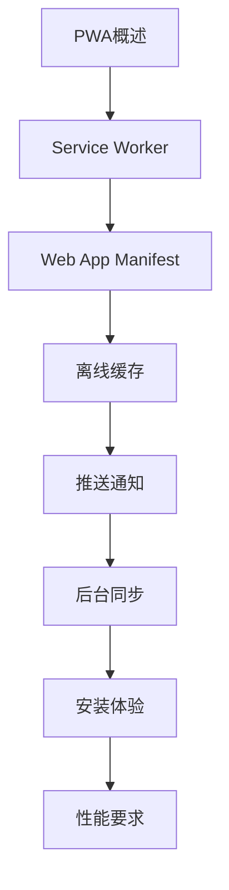

# PWA 学习指南

> **分类**：前端开发 ｜ **章节总数**：60 ｜ **技术栈**：PWA

## 领域概述

PWA是前端开发领域的重要技术方向，本系列从基础到高级逐步深入，涵盖10个核心模块：PWA概述、Service Worker、Web App Manifest、离线缓存、推送通知等。每个知识点作为独立章节，包含原理讲解、实现要点、常见陷阱和最佳实践，配合源码分析和架构图，帮助读者建立完整的PWA知识体系。

本教程基于 **通用** 与 **PWA** 生态编写，涵盖 行业标准工具链 等主流工具与框架。每章独立成篇，文字精炼、逻辑清晰，适合系统学习与按需查阅。

## 你将学到什么

完成本系列后，你将能够：

- 系统理解 **PWA** 的核心概念与模块划分。
- 按难度递进掌握从入门到实战的完整知识路径。
- 在工程实践中做出合理的技术判断与问题排查。
- 通过章节索引快速定位所需知识点。

## 前置知识

- 编程基础
- 数据结构
- 计算机基础
- 前端开发基础概念

## 推荐学习路径

1. **PWA概述**
2. **Service Worker**
3. **Web App Manifest**
4. **离线缓存**
5. **推送通知**
6. **后台同步**
7. **安装体验**
8. **性能要求**

## 模块体系

本领域按以下模块组织，难度由浅入深：

- **PWA概述**
- **Service Worker**
- **Web App Manifest**
- **离线缓存**
- **推送通知**
- **后台同步**
- **安装体验**
- **性能要求**
- **安全要求**
- **PWA最佳实践**

## 难度分布

| 难度 | 章节数 | 占比 |
|------|--------|------|
| 入门 | 12 | 20% |
| 实战 | 12 | 20% |
| 进阶 | 18 | 30% |
| 高级 | 18 | 30% |

## 章节索引

点击章节标题进入对应教程：

### PWA概述

- [PWA概述核心概念与原理](chapters/001-PWA概述核心概念与原理.md) ｜ 入门
- [PWA概述的实现机制详解](chapters/002-PWA概述的实现机制详解.md) ｜ 入门
- [PWA概述的关键技术点](chapters/003-PWA概述的关键技术点.md) ｜ 入门
- [PWA概述的源码级分析](chapters/004-PWA概述的源码级分析.md) ｜ 入门
- [PWA概述的配置与使用](chapters/005-PWA概述的配置与使用.md) ｜ 入门
- [PWA概述的常见问题与解决方案](chapters/006-PWA概述的常见问题与解决方案.md) ｜ 入门

### Service Worker

- [Service Worker核心概念与原理](chapters/007-Service-Worker核心概念与原理.md) ｜ 入门
- [Service Worker的实现机制详解](chapters/008-Service-Worker的实现机制详解.md) ｜ 入门
- [Service Worker的关键技术点](chapters/009-Service-Worker的关键技术点.md) ｜ 入门
- [Service Worker的源码级分析](chapters/010-Service-Worker的源码级分析.md) ｜ 入门
- [Service Worker的配置与使用](chapters/011-Service-Worker的配置与使用.md) ｜ 入门
- [Service Worker的常见问题与解决方案](chapters/012-Service-Worker的常见问题与解决方案.md) ｜ 入门

### Web App Manifest

- [Web App Manifest核心概念与原理](chapters/013-Web-App-Manifest核心概念与原理.md) ｜ 进阶
- [Web App Manifest的实现机制详解](chapters/014-Web-App-Manifest的实现机制详解.md) ｜ 进阶
- [Web App Manifest的关键技术点](chapters/015-Web-App-Manifest的关键技术点.md) ｜ 进阶
- [Web App Manifest的源码级分析](chapters/016-Web-App-Manifest的源码级分析.md) ｜ 进阶
- [Web App Manifest的配置与使用](chapters/017-Web-App-Manifest的配置与使用.md) ｜ 进阶
- [Web App Manifest的常见问题与解决方案](chapters/018-Web-App-Manifest的常见问题与解决方案.md) ｜ 进阶

### 离线缓存

- [离线缓存核心概念与原理](chapters/019-离线缓存核心概念与原理.md) ｜ 进阶
- [离线缓存的实现机制详解](chapters/020-离线缓存的实现机制详解.md) ｜ 进阶
- [离线缓存的关键技术点](chapters/021-离线缓存的关键技术点.md) ｜ 进阶
- [离线缓存的源码级分析](chapters/022-离线缓存的源码级分析.md) ｜ 进阶
- [离线缓存的配置与使用](chapters/023-离线缓存的配置与使用.md) ｜ 进阶
- [离线缓存的常见问题与解决方案](chapters/024-离线缓存的常见问题与解决方案.md) ｜ 进阶

### 推送通知

- [推送通知核心概念与原理](chapters/025-推送通知核心概念与原理.md) ｜ 进阶
- [推送通知的实现机制详解](chapters/026-推送通知的实现机制详解.md) ｜ 进阶
- [推送通知的关键技术点](chapters/027-推送通知的关键技术点.md) ｜ 进阶
- [推送通知的源码级分析](chapters/028-推送通知的源码级分析.md) ｜ 进阶
- [推送通知的配置与使用](chapters/029-推送通知的配置与使用.md) ｜ 进阶
- [推送通知的常见问题与解决方案](chapters/030-推送通知的常见问题与解决方案.md) ｜ 进阶

### 后台同步

- [后台同步核心概念与原理](chapters/031-后台同步核心概念与原理.md) ｜ 高级
- [后台同步的实现机制详解](chapters/032-后台同步的实现机制详解.md) ｜ 高级
- [后台同步的关键技术点](chapters/033-后台同步的关键技术点.md) ｜ 高级
- [后台同步的源码级分析](chapters/034-后台同步的源码级分析.md) ｜ 高级
- [后台同步的配置与使用](chapters/035-后台同步的配置与使用.md) ｜ 高级
- [后台同步的常见问题与解决方案](chapters/036-后台同步的常见问题与解决方案.md) ｜ 高级

### 安装体验

- [安装体验核心概念与原理](chapters/037-安装体验核心概念与原理.md) ｜ 高级
- [安装体验的实现机制详解](chapters/038-安装体验的实现机制详解.md) ｜ 高级
- [安装体验的关键技术点](chapters/039-安装体验的关键技术点.md) ｜ 高级
- [安装体验的源码级分析](chapters/040-安装体验的源码级分析.md) ｜ 高级
- [安装体验的配置与使用](chapters/041-安装体验的配置与使用.md) ｜ 高级
- [安装体验的常见问题与解决方案](chapters/042-安装体验的常见问题与解决方案.md) ｜ 高级

### 性能要求

- [性能要求核心概念与原理](chapters/043-性能要求核心概念与原理.md) ｜ 高级
- [性能要求的实现机制详解](chapters/044-性能要求的实现机制详解.md) ｜ 高级
- [性能要求的关键技术点](chapters/045-性能要求的关键技术点.md) ｜ 高级
- [性能要求的源码级分析](chapters/046-性能要求的源码级分析.md) ｜ 高级
- [性能要求的配置与使用](chapters/047-性能要求的配置与使用.md) ｜ 高级
- [性能要求的常见问题与解决方案](chapters/048-性能要求的常见问题与解决方案.md) ｜ 高级

### 安全要求

- [安全要求核心概念与原理](chapters/049-安全要求核心概念与原理.md) ｜ 实战
- [安全要求的实现机制详解](chapters/050-安全要求的实现机制详解.md) ｜ 实战
- [安全要求的关键技术点](chapters/051-安全要求的关键技术点.md) ｜ 实战
- [安全要求的源码级分析](chapters/052-安全要求的源码级分析.md) ｜ 实战
- [安全要求的配置与使用](chapters/053-安全要求的配置与使用.md) ｜ 实战
- [安全要求的常见问题与解决方案](chapters/054-安全要求的常见问题与解决方案.md) ｜ 实战

### PWA最佳实践

- [PWA最佳实践核心概念与原理](chapters/055-PWA最佳实践核心概念与原理.md) ｜ 实战
- [PWA最佳实践的实现机制详解](chapters/056-PWA最佳实践的实现机制详解.md) ｜ 实战
- [PWA最佳实践的关键技术点](chapters/057-PWA最佳实践的关键技术点.md) ｜ 实战
- [PWA最佳实践的源码级分析](chapters/058-PWA最佳实践的源码级分析.md) ｜ 实战
- [PWA最佳实践的配置与使用](chapters/059-PWA最佳实践的配置与使用.md) ｜ 实战
- [PWA最佳实践的常见问题与解决方案](chapters/060-PWA最佳实践的常见问题与解决方案.md) ｜ 实战

## 学习方法建议

1. **先读概述再读章节**：用本指南建立全局地图，避免迷失在细节中。
2. **按模块递进**：同一模块内章节有前后关联，顺序阅读效果更好。
3. **主动复述**：每章读完后，用三五句话概括「是什么、为什么、怎么用」。
4. **关联阅读**：利用章节底部的「延伸学习」在同模块内构建知识网络。
5. **对照官方文档**：本教程提供结构化视角，细节以官方文档为准。

---
*领域: PWA ｜ 版本: 2.0 ｜ 共 60 章*