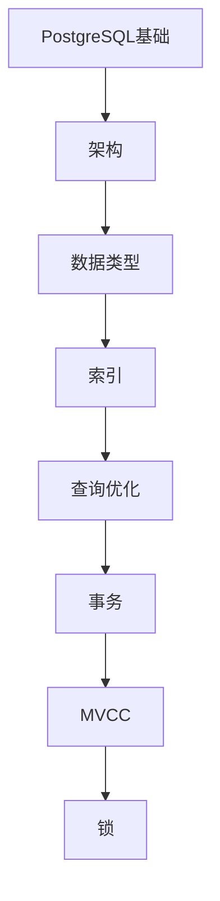

# PostgreSQL 学习指南

> **分类**：数据存储 ｜ **技术生态**：PostGIS、pgBouncer、Patroni、TimescaleDB

## 领域定位

PostgreSQL 是功能丰富的开源 ORDBMS，MVCC、扩展（PostGIS、pgvector）与严格 SQL 兼容是其优势。

覆盖类型系统、索引（B-tree/GiST/GIN）、复制与 JSONB，适合 GIS 与分析型混合负载。

本领域常用技术栈与工具包括：PostGIS、pgBouncer、Patroni、TimescaleDB。

## 学习目标

- 能使用 EXPLAIN ANALYZE
- 能配置流复制与 Patroni
- 能使用 JSONB 与全文检索
- 能安装扩展与调优 shared_buffers

## 前置知识

- SQL
- 事务概念

## 学习路径

1. **PostgreSQL基础**
2. **架构**
3. **数据类型**
4. **索引**
5. **查询优化**
6. **事务**
7. **MVCC**
8. **锁**

## 模块体系

- **PostgreSQL基础**
- **架构**
- **数据类型**
- **索引**
- **查询优化**
- **事务**
- **MVCC**
- **锁**
- **扩展**
- **全文检索**
- **JSON**
- **GIS**
- **复制**
- **高可用**
- **性能调优**
- **备份恢复**
- **PostgreSQL最佳实践**

## 难度分布

| 入门 | 24 | 24% |
| 实战 | 22 | 22% |
| 进阶 | 24 | 24% |
| 高级 | 30 | 30% |

## 章节索引

### PostgreSQL基础

- [PostgreSQL基础核心概念与原理](chapters/001-PostgreSQL基础核心概念与原理.md) ｜ 入门
- [PostgreSQL基础的实现机制详解](chapters/002-PostgreSQL基础的实现机制详解.md) ｜ 入门
- [PostgreSQL基础的关键技术点](chapters/003-PostgreSQL基础的关键技术点.md) ｜ 入门
- [PostgreSQL基础的源码级分析](chapters/004-PostgreSQL基础的源码级分析.md) ｜ 入门
- [PostgreSQL基础的配置与使用](chapters/005-PostgreSQL基础的配置与使用.md) ｜ 入门
- [PostgreSQL基础的常见问题与解决方案](chapters/006-PostgreSQL基础的常见问题与解决方案.md) ｜ 入门

### 架构

- [架构核心概念与原理](chapters/007-架构核心概念与原理.md) ｜ 入门
- [架构的实现机制详解](chapters/008-架构的实现机制详解.md) ｜ 入门
- [架构的关键技术点](chapters/009-架构的关键技术点.md) ｜ 入门
- [架构的源码级分析](chapters/010-架构的源码级分析.md) ｜ 入门
- [架构的配置与使用](chapters/011-架构的配置与使用.md) ｜ 入门
- [架构的常见问题与解决方案](chapters/012-架构的常见问题与解决方案.md) ｜ 入门

### 数据类型

- [数据类型核心概念与原理](chapters/013-数据类型核心概念与原理.md) ｜ 入门
- [数据类型的实现机制详解](chapters/014-数据类型的实现机制详解.md) ｜ 入门
- [数据类型的关键技术点](chapters/015-数据类型的关键技术点.md) ｜ 入门
- [数据类型的源码级分析](chapters/016-数据类型的源码级分析.md) ｜ 入门
- [数据类型的配置与使用](chapters/017-数据类型的配置与使用.md) ｜ 入门
- [数据类型的常见问题与解决方案](chapters/018-数据类型的常见问题与解决方案.md) ｜ 入门

### 索引

- [索引核心概念与原理](chapters/019-索引核心概念与原理.md) ｜ 入门
- [索引的实现机制详解](chapters/020-索引的实现机制详解.md) ｜ 入门
- [索引的关键技术点](chapters/021-索引的关键技术点.md) ｜ 入门
- [索引的源码级分析](chapters/022-索引的源码级分析.md) ｜ 入门
- [索引的配置与使用](chapters/023-索引的配置与使用.md) ｜ 入门
- [索引的常见问题与解决方案](chapters/024-索引的常见问题与解决方案.md) ｜ 入门

### 查询优化

- [查询优化核心概念与原理](chapters/025-查询优化核心概念与原理.md) ｜ 进阶
- [查询优化的实现机制详解](chapters/026-查询优化的实现机制详解.md) ｜ 进阶
- [查询优化的关键技术点](chapters/027-查询优化的关键技术点.md) ｜ 进阶
- [查询优化的源码级分析](chapters/028-查询优化的源码级分析.md) ｜ 进阶
- [查询优化的配置与使用](chapters/029-查询优化的配置与使用.md) ｜ 进阶
- [查询优化的常见问题与解决方案](chapters/030-查询优化的常见问题与解决方案.md) ｜ 进阶

### 事务

- [事务核心概念与原理](chapters/031-事务核心概念与原理.md) ｜ 进阶
- [事务的实现机制详解](chapters/032-事务的实现机制详解.md) ｜ 进阶
- [事务的关键技术点](chapters/033-事务的关键技术点.md) ｜ 进阶
- [事务的源码级分析](chapters/034-事务的源码级分析.md) ｜ 进阶
- [事务的配置与使用](chapters/035-事务的配置与使用.md) ｜ 进阶
- [事务的常见问题与解决方案](chapters/036-事务的常见问题与解决方案.md) ｜ 进阶

### MVCC

- [MVCC核心概念与原理](chapters/037-MVCC核心概念与原理.md) ｜ 进阶
- [MVCC的实现机制详解](chapters/038-MVCC的实现机制详解.md) ｜ 进阶
- [MVCC的关键技术点](chapters/039-MVCC的关键技术点.md) ｜ 进阶
- [MVCC的源码级分析](chapters/040-MVCC的源码级分析.md) ｜ 进阶
- [MVCC的配置与使用](chapters/041-MVCC的配置与使用.md) ｜ 进阶
- [MVCC的常见问题与解决方案](chapters/042-MVCC的常见问题与解决方案.md) ｜ 进阶

### 锁

- [锁核心概念与原理](chapters/043-锁核心概念与原理.md) ｜ 进阶
- [锁的实现机制详解](chapters/044-锁的实现机制详解.md) ｜ 进阶
- [锁的关键技术点](chapters/045-锁的关键技术点.md) ｜ 进阶
- [锁的源码级分析](chapters/046-锁的源码级分析.md) ｜ 进阶
- [锁的配置与使用](chapters/047-锁的配置与使用.md) ｜ 进阶
- [锁的常见问题与解决方案](chapters/048-锁的常见问题与解决方案.md) ｜ 进阶

### 扩展

- [扩展核心概念与原理](chapters/049-扩展核心概念与原理.md) ｜ 高级
- [扩展的实现机制详解](chapters/050-扩展的实现机制详解.md) ｜ 高级
- [扩展的关键技术点](chapters/051-扩展的关键技术点.md) ｜ 高级
- [扩展的源码级分析](chapters/052-扩展的源码级分析.md) ｜ 高级
- [扩展的配置与使用](chapters/053-扩展的配置与使用.md) ｜ 高级
- [扩展的常见问题与解决方案](chapters/054-扩展的常见问题与解决方案.md) ｜ 高级

### 全文检索

- [全文检索核心概念与原理](chapters/055-全文检索核心概念与原理.md) ｜ 高级
- [全文检索的实现机制详解](chapters/056-全文检索的实现机制详解.md) ｜ 高级
- [全文检索的关键技术点](chapters/057-全文检索的关键技术点.md) ｜ 高级
- [全文检索的源码级分析](chapters/058-全文检索的源码级分析.md) ｜ 高级
- [全文检索的配置与使用](chapters/059-全文检索的配置与使用.md) ｜ 高级
- [全文检索的常见问题与解决方案](chapters/060-全文检索的常见问题与解决方案.md) ｜ 高级

### JSON

- [JSON核心概念与原理](chapters/061-JSON核心概念与原理.md) ｜ 高级
- [JSON的实现机制详解](chapters/062-JSON的实现机制详解.md) ｜ 高级
- [JSON的关键技术点](chapters/063-JSON的关键技术点.md) ｜ 高级
- [JSON的源码级分析](chapters/064-JSON的源码级分析.md) ｜ 高级
- [JSON的配置与使用](chapters/065-JSON的配置与使用.md) ｜ 高级
- [JSON的常见问题与解决方案](chapters/066-JSON的常见问题与解决方案.md) ｜ 高级

### GIS

- [GIS核心概念与原理](chapters/067-GIS核心概念与原理.md) ｜ 高级
- [GIS的实现机制详解](chapters/068-GIS的实现机制详解.md) ｜ 高级
- [GIS的关键技术点](chapters/069-GIS的关键技术点.md) ｜ 高级
- [GIS的源码级分析](chapters/070-GIS的源码级分析.md) ｜ 高级
- [GIS的配置与使用](chapters/071-GIS的配置与使用.md) ｜ 高级
- [GIS的常见问题与解决方案](chapters/072-GIS的常见问题与解决方案.md) ｜ 高级

### 复制

- [复制核心概念与原理](chapters/073-复制核心概念与原理.md) ｜ 高级
- [复制的实现机制详解](chapters/074-复制的实现机制详解.md) ｜ 高级
- [复制的关键技术点](chapters/075-复制的关键技术点.md) ｜ 高级
- [复制的源码级分析](chapters/076-复制的源码级分析.md) ｜ 高级
- [复制的配置与使用](chapters/077-复制的配置与使用.md) ｜ 高级
- [复制的常见问题与解决方案](chapters/078-复制的常见问题与解决方案.md) ｜ 高级

### 高可用

- [高可用核心概念与原理](chapters/079-高可用核心概念与原理.md) ｜ 实战
- [高可用的实现机制详解](chapters/080-高可用的实现机制详解.md) ｜ 实战
- [高可用的关键技术点](chapters/081-高可用的关键技术点.md) ｜ 实战
- [高可用的源码级分析](chapters/082-高可用的源码级分析.md) ｜ 实战
- [高可用的配置与使用](chapters/083-高可用的配置与使用.md) ｜ 实战
- [高可用的常见问题与解决方案](chapters/084-高可用的常见问题与解决方案.md) ｜ 实战

### 性能调优

- [性能调优核心概念与原理](chapters/085-性能调优核心概念与原理.md) ｜ 实战
- [性能调优的实现机制详解](chapters/086-性能调优的实现机制详解.md) ｜ 实战
- [性能调优的关键技术点](chapters/087-性能调优的关键技术点.md) ｜ 实战
- [性能调优的源码级分析](chapters/088-性能调优的源码级分析.md) ｜ 实战
- [性能调优的配置与使用](chapters/089-性能调优的配置与使用.md) ｜ 实战
- [性能调优的常见问题与解决方案](chapters/090-性能调优的常见问题与解决方案.md) ｜ 实战

### 备份恢复

- [备份恢复核心概念与原理](chapters/091-备份恢复核心概念与原理.md) ｜ 实战
- [备份恢复的实现机制详解](chapters/092-备份恢复的实现机制详解.md) ｜ 实战
- [备份恢复的关键技术点](chapters/093-备份恢复的关键技术点.md) ｜ 实战
- [备份恢复的源码级分析](chapters/094-备份恢复的源码级分析.md) ｜ 实战
- [备份恢复的配置与使用](chapters/095-备份恢复的配置与使用.md) ｜ 实战

### PostgreSQL最佳实践

- [PostgreSQL最佳实践核心概念与原理](chapters/096-PostgreSQL最佳实践核心概念与原理.md) ｜ 实战
- [PostgreSQL最佳实践的实现机制详解](chapters/097-PostgreSQL最佳实践的实现机制详解.md) ｜ 实战
- [PostgreSQL最佳实践的关键技术点](chapters/098-PostgreSQL最佳实践的关键技术点.md) ｜ 实战
- [PostgreSQL最佳实践的源码级分析](chapters/099-PostgreSQL最佳实践的源码级分析.md) ｜ 实战
- [PostgreSQL最佳实践的配置与使用](chapters/100-PostgreSQL最佳实践的配置与使用.md) ｜ 实战

---
*领域: PostgreSQL*