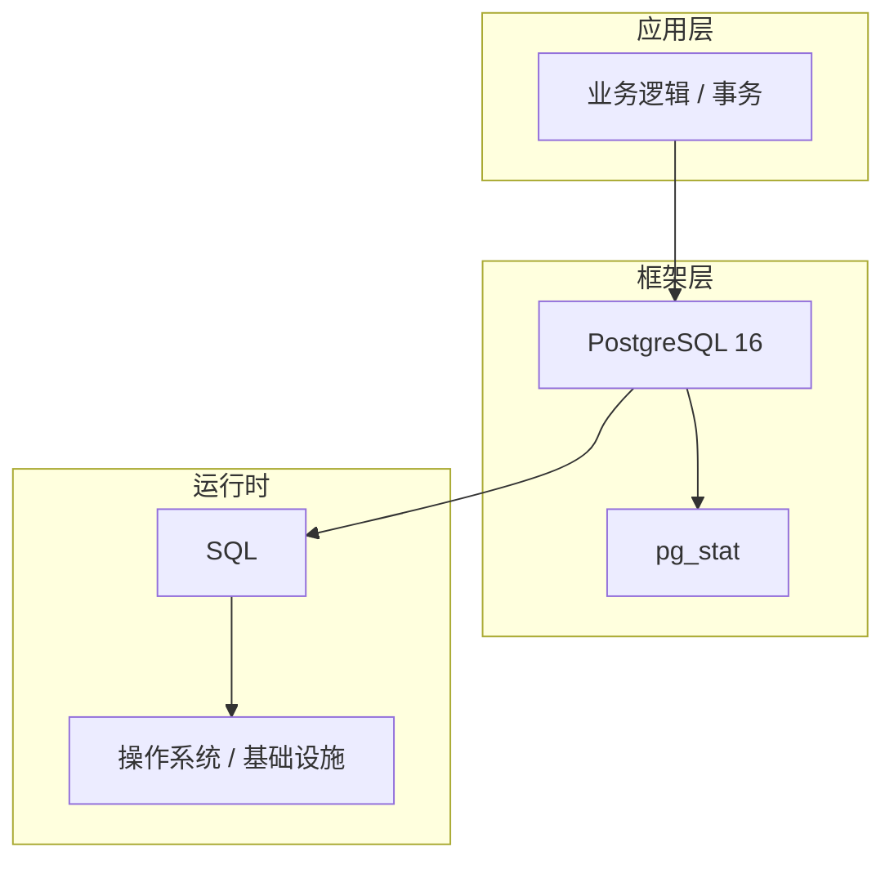

# 事务核心概念与原理

> **领域**：PostgreSQL ｜ **模块**：事务 ｜ **难度**：进阶 ｜ **类型**：基础概念

## 导读

本章属于 **PostgreSQL** 教程的 **事务** 模块，难度为 **进阶**。阅读重点在于建立清晰的概念模型与工程判断能力，而非死记细节。

## 核心概念

PostgreSQL 是当前技术生态中的重要方向，系统学习需兼顾概念、原理与工程实践。

在 **PostgreSQL** 体系中，**事务** 与上下游模块形成协作。技术栈以 **PostgreSQL 16** 为核心（SQL），生态包括 pg_stat, extensions。

事务保证原子性、一致性、隔离性、持久性（ACID）。隔离级别从读未提交到串行化逐级加强。MVCC 通过版本链实现非阻塞读。长事务占用锁与 undo 空间，应尽量避免。

### 概念精讲

**事务的基本概念与定义**

从度量出发：如何评估它是否工作正常、性能是否达标。 在 事务 语境下，这一点直接影响设计决策与故障排查思路。

**事务在PostgreSQL中的作用与地位**

从定义出发：它解决什么问题、不解决什么问题，边界在哪里。 在 事务 语境下，这一点直接影响设计决策与故障排查思路。

**事务的核心数据结构**

从结构出发：核心组成部分是什么，彼此如何协作。 在 事务 语境下，这一点直接影响设计决策与故障排查思路。

**事务的关键算法与流程**

从流程出发：一次完整调用或生命周期经历哪些阶段。 在 事务 语境下，这一点直接影响设计决策与故障排查思路。

**事务与其他模块的关系**

从数据出发：输入输出是什么格式，状态如何变迁。 在 事务 语境下，这一点直接影响设计决策与故障排查思路。

## 架构与流程

以下框图帮助你在宏观层面把握模块协作关系与处理流向：

## 深度讲解

### 为什么需要 事务

工程实践中，事务 解决的是「在 PostgreSQL 16 约束下，如何可靠、可维护地完成特定职责」的问题。初学者常只记 API 而不理解动机——场景变化时便无法判断该不该用、怎么用。

### 核心原理

事务 的设计遵循：**职责单一**、**接口稳定**、**可观测**。在 **进阶** 阶段，重点是把这三条映射到具体概念与操作上。

### 与周边模块的关系

向上为业务层提供能力；向下依赖运行时与基础设施。横向通过清晰的数据流或事件流衔接，避免循环依赖。

### 落地检查清单

- **理解事务的设计思想与适用场景**：落地时需明确验收标准与回滚方案。
- **掌握事务的核心API与配置项**：落地时需明确验收标准与回滚方案。
- **分析事务的源码实现与调用流程**：落地时需明确验收标准与回滚方案。
- **了解事务的性能特点与瓶颈**：落地时需明确验收标准与回滚方案。

### 常见误区与应对

**误区：对事务的概念理解不深入导致误用**

**应对**：回到官方定义画一张概念图，与同事讲解一遍，确保能用自己的话复述。

**误区：忽略事务的性能边界与限制条件**

**应对**：用 Profiler 或压测建立基线，对比优化前后数据，避免凭感觉优化。

**误区：事务配置不当引发的问题**

**应对**：核对环境变量、配置文件与部署清单是否一致，使用配置 diff 工具排查。

**误区：缺乏对事务底层原理的理解**

**应对**：阅读官方文档与一篇深度文章，结合小实验验证理解。

**误区：事务与其他模块集成时的兼容性问题**

**应对**：列出依赖版本矩阵，在 CI 中跑集成测试覆盖主要组合。

### 最佳实践

1. **遵循事务的官方推荐用法与规范** — 落地方式：写入团队 Wiki 并纳入 Code Review 检查项。

2. **在理解原理的基础上合理使用事务** — 落地方式：配置静态检查或 CI 规则自动拦截违规写法。

3. **建立完善的事务监控与告警机制** — 落地方式：在新人 onboarding 中作为必修内容讲解。

4. **编写充分的测试用例覆盖事务的各种场景** — 落地方式：每季度回顾一次，对照社区最佳实践更新。

5. **持续关注事务的版本更新与最佳实践演进** — 落地方式：用真实项目案例演示正确与错误对比。

### 本章小结

学完本章，你应能：

- 说清 **事务核心概念与原理** 在 PostgreSQL/事务 中的定位。
- 描述核心流程与关键概念，能用自己的话复述。
- 识别常见误区并采取预防与排查手段。
- 在项目中做出与场景匹配的工程决策。

类型：**基础概念**。建议完成小练习或复盘笔记，将阅读转化为能力。

## 延伸学习

建议结合以下同模块章节继续阅读，构建完整知识链：

- 事务的实现机制详解
- 事务的关键技术点

### 参考资料

- PostgreSQL官方文档 - 事务章节
- 《PostgreSQL权威指南》相关章节
- 事务源码实现与注释
- PostgreSQL社区最佳实践文章
- 事务相关技术博客与教程

---
*章节 ID: 031 ｜ 领域: PostgreSQL ｜ 版本: 2.0*