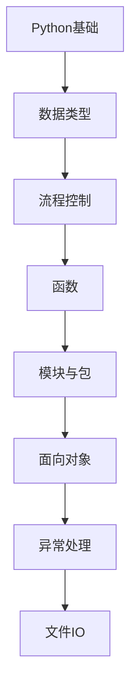

# Python核心 学习指南

> **分类**：编程语言 ｜ **技术生态**：见正文

## 领域定位

Python 以可读性与丰富标准库著称，3.12 持续优化性能与类型系统，是数据、Web、自动化等多场景的主流语言。

系统学习 Python核心 需兼顾原理与工程实践，本指南按模块组织章节，由浅入深。

建议结合官方文档与社区主流工具链同步学习。

## 学习目标

- 系统掌握 Python核心 核心模块与协作关系
- 能独立分析常见问题并给出可验证的解决方案
- 能在真实项目中做出合理的技术选型与架构决策
- 能阅读官方文档与源码定位关键实现路径

## 前置知识

- 无硬性前置，按章节难度循序渐进即可

## 学习路径

1. **Python基础**
2. **数据类型**
3. **流程控制**
4. **函数**
5. **模块与包**
6. **面向对象**
7. **异常处理**
8. **文件IO**

## 模块体系

- **Python基础**
- **数据类型**
- **流程控制**
- **函数**
- **模块与包**
- **面向对象**
- **异常处理**
- **文件IO**
- **迭代器与生成器**
- **装饰器**
- **上下文管理器**
- **正则表达式**
- **标准库**
- **虚拟环境与包管理**
- **Python最佳实践**

## 难度分布

| 入门 | 42 | 21% |
| 实战 | 39 | 19% |
| 进阶 | 54 | 27% |
| 高级 | 65 | 32% |

## 章节索引

### Python基础

- [Python基础核心概念与原理](chapters/001-Python基础核心概念与原理.md) ｜ 入门
- [Python基础的实现机制详解](chapters/002-Python基础的实现机制详解.md) ｜ 入门
- [Python基础的关键技术点](chapters/003-Python基础的关键技术点.md) ｜ 入门
- [Python基础的源码级分析](chapters/004-Python基础的源码级分析.md) ｜ 入门
- [Python基础的配置与使用](chapters/005-Python基础的配置与使用.md) ｜ 入门
- [Python基础的常见问题与解决方案](chapters/006-Python基础的常见问题与解决方案.md) ｜ 入门
- [Python基础的性能优化技巧](chapters/007-Python基础的性能优化技巧.md) ｜ 入门
- [Python基础的最佳实践指南](chapters/008-Python基础的最佳实践指南.md) ｜ 入门
- [Python基础的高级应用场景](chapters/009-Python基础的高级应用场景.md) ｜ 入门
- [Python基础的实战案例分析](chapters/010-Python基础的实战案例分析.md) ｜ 入门
- [Python基础的设计思想与演进](chapters/011-Python基础的设计思想与演进.md) ｜ 入门
- [Python基础的底层原理剖析](chapters/012-Python基础的底层原理剖析.md) ｜ 入门
- [Python基础的调试与排错](chapters/013-Python基础的调试与排错.md) ｜ 入门
- [Python基础的安全注意事项](chapters/014-Python基础的安全注意事项.md) ｜ 入门

### 数据类型

- [数据类型核心概念与原理](chapters/015-数据类型核心概念与原理.md) ｜ 入门
- [数据类型的实现机制详解](chapters/016-数据类型的实现机制详解.md) ｜ 入门
- [数据类型的关键技术点](chapters/017-数据类型的关键技术点.md) ｜ 入门
- [数据类型的源码级分析](chapters/018-数据类型的源码级分析.md) ｜ 入门
- [数据类型的配置与使用](chapters/019-数据类型的配置与使用.md) ｜ 入门
- [数据类型的常见问题与解决方案](chapters/020-数据类型的常见问题与解决方案.md) ｜ 入门
- [数据类型的性能优化技巧](chapters/021-数据类型的性能优化技巧.md) ｜ 入门
- [数据类型的最佳实践指南](chapters/022-数据类型的最佳实践指南.md) ｜ 入门
- [数据类型的高级应用场景](chapters/023-数据类型的高级应用场景.md) ｜ 入门
- [数据类型的实战案例分析](chapters/024-数据类型的实战案例分析.md) ｜ 入门
- [数据类型的设计思想与演进](chapters/025-数据类型的设计思想与演进.md) ｜ 入门
- [数据类型的底层原理剖析](chapters/026-数据类型的底层原理剖析.md) ｜ 入门
- [数据类型的调试与排错](chapters/027-数据类型的调试与排错.md) ｜ 入门
- [数据类型的安全注意事项](chapters/028-数据类型的安全注意事项.md) ｜ 入门

### 流程控制

- [流程控制核心概念与原理](chapters/029-流程控制核心概念与原理.md) ｜ 入门
- [流程控制的实现机制详解](chapters/030-流程控制的实现机制详解.md) ｜ 入门
- [流程控制的关键技术点](chapters/031-流程控制的关键技术点.md) ｜ 入门
- [流程控制的源码级分析](chapters/032-流程控制的源码级分析.md) ｜ 入门
- [流程控制的配置与使用](chapters/033-流程控制的配置与使用.md) ｜ 入门
- [流程控制的常见问题与解决方案](chapters/034-流程控制的常见问题与解决方案.md) ｜ 入门
- [流程控制的性能优化技巧](chapters/035-流程控制的性能优化技巧.md) ｜ 入门
- [流程控制的最佳实践指南](chapters/036-流程控制的最佳实践指南.md) ｜ 入门
- [流程控制的高级应用场景](chapters/037-流程控制的高级应用场景.md) ｜ 入门
- [流程控制的实战案例分析](chapters/038-流程控制的实战案例分析.md) ｜ 入门
- [流程控制的设计思想与演进](chapters/039-流程控制的设计思想与演进.md) ｜ 入门
- [流程控制的底层原理剖析](chapters/040-流程控制的底层原理剖析.md) ｜ 入门
- [流程控制的调试与排错](chapters/041-流程控制的调试与排错.md) ｜ 入门
- [流程控制的安全注意事项](chapters/042-流程控制的安全注意事项.md) ｜ 入门

### 函数

- [函数核心概念与原理](chapters/043-函数核心概念与原理.md) ｜ 进阶
- [函数的实现机制详解](chapters/044-函数的实现机制详解.md) ｜ 进阶
- [函数的关键技术点](chapters/045-函数的关键技术点.md) ｜ 进阶
- [函数的源码级分析](chapters/046-函数的源码级分析.md) ｜ 进阶
- [函数的配置与使用](chapters/047-函数的配置与使用.md) ｜ 进阶
- [函数的常见问题与解决方案](chapters/048-函数的常见问题与解决方案.md) ｜ 进阶
- [函数的性能优化技巧](chapters/049-函数的性能优化技巧.md) ｜ 进阶
- [函数的最佳实践指南](chapters/050-函数的最佳实践指南.md) ｜ 进阶
- [函数的高级应用场景](chapters/051-函数的高级应用场景.md) ｜ 进阶
- [函数的实战案例分析](chapters/052-函数的实战案例分析.md) ｜ 进阶
- [函数的设计思想与演进](chapters/053-函数的设计思想与演进.md) ｜ 进阶
- [函数的底层原理剖析](chapters/054-函数的底层原理剖析.md) ｜ 进阶
- [函数的调试与排错](chapters/055-函数的调试与排错.md) ｜ 进阶
- [函数的安全注意事项](chapters/056-函数的安全注意事项.md) ｜ 进阶

### 模块与包

- [模块与包核心概念与原理](chapters/057-模块与包核心概念与原理.md) ｜ 进阶
- [模块与包的实现机制详解](chapters/058-模块与包的实现机制详解.md) ｜ 进阶
- [模块与包的关键技术点](chapters/059-模块与包的关键技术点.md) ｜ 进阶
- [模块与包的源码级分析](chapters/060-模块与包的源码级分析.md) ｜ 进阶
- [模块与包的配置与使用](chapters/061-模块与包的配置与使用.md) ｜ 进阶
- [模块与包的常见问题与解决方案](chapters/062-模块与包的常见问题与解决方案.md) ｜ 进阶
- [模块与包的性能优化技巧](chapters/063-模块与包的性能优化技巧.md) ｜ 进阶
- [模块与包的最佳实践指南](chapters/064-模块与包的最佳实践指南.md) ｜ 进阶
- [模块与包的高级应用场景](chapters/065-模块与包的高级应用场景.md) ｜ 进阶
- [模块与包的实战案例分析](chapters/066-模块与包的实战案例分析.md) ｜ 进阶
- [模块与包的设计思想与演进](chapters/067-模块与包的设计思想与演进.md) ｜ 进阶
- [模块与包的底层原理剖析](chapters/068-模块与包的底层原理剖析.md) ｜ 进阶
- [模块与包的调试与排错](chapters/069-模块与包的调试与排错.md) ｜ 进阶
- [模块与包的安全注意事项](chapters/070-模块与包的安全注意事项.md) ｜ 进阶

### 面向对象

- [面向对象核心概念与原理](chapters/071-面向对象核心概念与原理.md) ｜ 进阶
- [面向对象的实现机制详解](chapters/072-面向对象的实现机制详解.md) ｜ 进阶
- [面向对象的关键技术点](chapters/073-面向对象的关键技术点.md) ｜ 进阶
- [面向对象的源码级分析](chapters/074-面向对象的源码级分析.md) ｜ 进阶
- [面向对象的配置与使用](chapters/075-面向对象的配置与使用.md) ｜ 进阶
- [面向对象的常见问题与解决方案](chapters/076-面向对象的常见问题与解决方案.md) ｜ 进阶
- [面向对象的性能优化技巧](chapters/077-面向对象的性能优化技巧.md) ｜ 进阶
- [面向对象的最佳实践指南](chapters/078-面向对象的最佳实践指南.md) ｜ 进阶
- [面向对象的高级应用场景](chapters/079-面向对象的高级应用场景.md) ｜ 进阶
- [面向对象的实战案例分析](chapters/080-面向对象的实战案例分析.md) ｜ 进阶
- [面向对象的设计思想与演进](chapters/081-面向对象的设计思想与演进.md) ｜ 进阶
- [面向对象的底层原理剖析](chapters/082-面向对象的底层原理剖析.md) ｜ 进阶
- [面向对象的调试与排错](chapters/083-面向对象的调试与排错.md) ｜ 进阶

### 异常处理

- [异常处理核心概念与原理](chapters/084-异常处理核心概念与原理.md) ｜ 进阶
- [异常处理的实现机制详解](chapters/085-异常处理的实现机制详解.md) ｜ 进阶
- [异常处理的关键技术点](chapters/086-异常处理的关键技术点.md) ｜ 进阶
- [异常处理的源码级分析](chapters/087-异常处理的源码级分析.md) ｜ 进阶
- [异常处理的配置与使用](chapters/088-异常处理的配置与使用.md) ｜ 进阶
- [异常处理的常见问题与解决方案](chapters/089-异常处理的常见问题与解决方案.md) ｜ 进阶
- [异常处理的性能优化技巧](chapters/090-异常处理的性能优化技巧.md) ｜ 进阶
- [异常处理的最佳实践指南](chapters/091-异常处理的最佳实践指南.md) ｜ 进阶
- [异常处理的高级应用场景](chapters/092-异常处理的高级应用场景.md) ｜ 进阶
- [异常处理的实战案例分析](chapters/093-异常处理的实战案例分析.md) ｜ 进阶
- [异常处理的设计思想与演进](chapters/094-异常处理的设计思想与演进.md) ｜ 进阶
- [异常处理的底层原理剖析](chapters/095-异常处理的底层原理剖析.md) ｜ 进阶
- [异常处理的调试与排错](chapters/096-异常处理的调试与排错.md) ｜ 进阶

### 文件IO

- [文件IO核心概念与原理](chapters/097-文件IO核心概念与原理.md) ｜ 高级
- [文件IO的实现机制详解](chapters/098-文件IO的实现机制详解.md) ｜ 高级
- [文件IO的关键技术点](chapters/099-文件IO的关键技术点.md) ｜ 高级
- [文件IO的源码级分析](chapters/100-文件IO的源码级分析.md) ｜ 高级
- [文件IO的配置与使用](chapters/101-文件IO的配置与使用.md) ｜ 高级
- [文件IO的常见问题与解决方案](chapters/102-文件IO的常见问题与解决方案.md) ｜ 高级
- [文件IO的性能优化技巧](chapters/103-文件IO的性能优化技巧.md) ｜ 高级
- [文件IO的最佳实践指南](chapters/104-文件IO的最佳实践指南.md) ｜ 高级
- [文件IO的高级应用场景](chapters/105-文件IO的高级应用场景.md) ｜ 高级
- [文件IO的实战案例分析](chapters/106-文件IO的实战案例分析.md) ｜ 高级
- [文件IO的设计思想与演进](chapters/107-文件IO的设计思想与演进.md) ｜ 高级
- [文件IO的底层原理剖析](chapters/108-文件IO的底层原理剖析.md) ｜ 高级
- [文件IO的调试与排错](chapters/109-文件IO的调试与排错.md) ｜ 高级

### 迭代器与生成器

- [迭代器与生成器核心概念与原理](chapters/110-迭代器与生成器核心概念与原理.md) ｜ 高级
- [迭代器与生成器的实现机制详解](chapters/111-迭代器与生成器的实现机制详解.md) ｜ 高级
- [迭代器与生成器的关键技术点](chapters/112-迭代器与生成器的关键技术点.md) ｜ 高级
- [迭代器与生成器的源码级分析](chapters/113-迭代器与生成器的源码级分析.md) ｜ 高级
- [迭代器与生成器的配置与使用](chapters/114-迭代器与生成器的配置与使用.md) ｜ 高级
- [迭代器与生成器的常见问题与解决方案](chapters/115-迭代器与生成器的常见问题与解决方案.md) ｜ 高级
- [迭代器与生成器的性能优化技巧](chapters/116-迭代器与生成器的性能优化技巧.md) ｜ 高级
- [迭代器与生成器的最佳实践指南](chapters/117-迭代器与生成器的最佳实践指南.md) ｜ 高级
- [迭代器与生成器的高级应用场景](chapters/118-迭代器与生成器的高级应用场景.md) ｜ 高级
- [迭代器与生成器的实战案例分析](chapters/119-迭代器与生成器的实战案例分析.md) ｜ 高级
- [迭代器与生成器的设计思想与演进](chapters/120-迭代器与生成器的设计思想与演进.md) ｜ 高级
- [迭代器与生成器的底层原理剖析](chapters/121-迭代器与生成器的底层原理剖析.md) ｜ 高级
- [迭代器与生成器的调试与排错](chapters/122-迭代器与生成器的调试与排错.md) ｜ 高级

### 装饰器

- [装饰器核心概念与原理](chapters/123-装饰器核心概念与原理.md) ｜ 高级
- [装饰器的实现机制详解](chapters/124-装饰器的实现机制详解.md) ｜ 高级
- [装饰器的关键技术点](chapters/125-装饰器的关键技术点.md) ｜ 高级
- [装饰器的源码级分析](chapters/126-装饰器的源码级分析.md) ｜ 高级
- [装饰器的配置与使用](chapters/127-装饰器的配置与使用.md) ｜ 高级
- [装饰器的常见问题与解决方案](chapters/128-装饰器的常见问题与解决方案.md) ｜ 高级
- [装饰器的性能优化技巧](chapters/129-装饰器的性能优化技巧.md) ｜ 高级
- [装饰器的最佳实践指南](chapters/130-装饰器的最佳实践指南.md) ｜ 高级
- [装饰器的高级应用场景](chapters/131-装饰器的高级应用场景.md) ｜ 高级
- [装饰器的实战案例分析](chapters/132-装饰器的实战案例分析.md) ｜ 高级
- [装饰器的设计思想与演进](chapters/133-装饰器的设计思想与演进.md) ｜ 高级
- [装饰器的底层原理剖析](chapters/134-装饰器的底层原理剖析.md) ｜ 高级
- [装饰器的调试与排错](chapters/135-装饰器的调试与排错.md) ｜ 高级

### 上下文管理器

- [上下文管理器核心概念与原理](chapters/136-上下文管理器核心概念与原理.md) ｜ 高级
- [上下文管理器的实现机制详解](chapters/137-上下文管理器的实现机制详解.md) ｜ 高级
- [上下文管理器的关键技术点](chapters/138-上下文管理器的关键技术点.md) ｜ 高级
- [上下文管理器的源码级分析](chapters/139-上下文管理器的源码级分析.md) ｜ 高级
- [上下文管理器的配置与使用](chapters/140-上下文管理器的配置与使用.md) ｜ 高级
- [上下文管理器的常见问题与解决方案](chapters/141-上下文管理器的常见问题与解决方案.md) ｜ 高级
- [上下文管理器的性能优化技巧](chapters/142-上下文管理器的性能优化技巧.md) ｜ 高级
- [上下文管理器的最佳实践指南](chapters/143-上下文管理器的最佳实践指南.md) ｜ 高级
- [上下文管理器的高级应用场景](chapters/144-上下文管理器的高级应用场景.md) ｜ 高级
- [上下文管理器的实战案例分析](chapters/145-上下文管理器的实战案例分析.md) ｜ 高级
- [上下文管理器的设计思想与演进](chapters/146-上下文管理器的设计思想与演进.md) ｜ 高级
- [上下文管理器的底层原理剖析](chapters/147-上下文管理器的底层原理剖析.md) ｜ 高级
- [上下文管理器的调试与排错](chapters/148-上下文管理器的调试与排错.md) ｜ 高级

### 正则表达式

- [正则表达式核心概念与原理](chapters/149-正则表达式核心概念与原理.md) ｜ 高级
- [正则表达式的实现机制详解](chapters/150-正则表达式的实现机制详解.md) ｜ 高级
- [正则表达式的关键技术点](chapters/151-正则表达式的关键技术点.md) ｜ 高级
- [正则表达式的源码级分析](chapters/152-正则表达式的源码级分析.md) ｜ 高级
- [正则表达式的配置与使用](chapters/153-正则表达式的配置与使用.md) ｜ 高级
- [正则表达式的常见问题与解决方案](chapters/154-正则表达式的常见问题与解决方案.md) ｜ 高级
- [正则表达式的性能优化技巧](chapters/155-正则表达式的性能优化技巧.md) ｜ 高级
- [正则表达式的最佳实践指南](chapters/156-正则表达式的最佳实践指南.md) ｜ 高级
- [正则表达式的高级应用场景](chapters/157-正则表达式的高级应用场景.md) ｜ 高级
- [正则表达式的实战案例分析](chapters/158-正则表达式的实战案例分析.md) ｜ 高级
- [正则表达式的设计思想与演进](chapters/159-正则表达式的设计思想与演进.md) ｜ 高级
- [正则表达式的底层原理剖析](chapters/160-正则表达式的底层原理剖析.md) ｜ 高级
- [正则表达式的调试与排错](chapters/161-正则表达式的调试与排错.md) ｜ 高级

### 标准库

- [标准库核心概念与原理](chapters/162-标准库核心概念与原理.md) ｜ 实战
- [标准库的实现机制详解](chapters/163-标准库的实现机制详解.md) ｜ 实战
- [标准库的关键技术点](chapters/164-标准库的关键技术点.md) ｜ 实战
- [标准库的源码级分析](chapters/165-标准库的源码级分析.md) ｜ 实战
- [标准库的配置与使用](chapters/166-标准库的配置与使用.md) ｜ 实战
- [标准库的常见问题与解决方案](chapters/167-标准库的常见问题与解决方案.md) ｜ 实战
- [标准库的性能优化技巧](chapters/168-标准库的性能优化技巧.md) ｜ 实战
- [标准库的最佳实践指南](chapters/169-标准库的最佳实践指南.md) ｜ 实战
- [标准库的高级应用场景](chapters/170-标准库的高级应用场景.md) ｜ 实战
- [标准库的实战案例分析](chapters/171-标准库的实战案例分析.md) ｜ 实战
- [标准库的设计思想与演进](chapters/172-标准库的设计思想与演进.md) ｜ 实战
- [标准库的底层原理剖析](chapters/173-标准库的底层原理剖析.md) ｜ 实战
- [标准库的调试与排错](chapters/174-标准库的调试与排错.md) ｜ 实战

### 虚拟环境与包管理

- [虚拟环境与包管理核心概念与原理](chapters/175-虚拟环境与包管理核心概念与原理.md) ｜ 实战
- [虚拟环境与包管理的实现机制详解](chapters/176-虚拟环境与包管理的实现机制详解.md) ｜ 实战
- [虚拟环境与包管理的关键技术点](chapters/177-虚拟环境与包管理的关键技术点.md) ｜ 实战
- [虚拟环境与包管理的源码级分析](chapters/178-虚拟环境与包管理的源码级分析.md) ｜ 实战
- [虚拟环境与包管理的配置与使用](chapters/179-虚拟环境与包管理的配置与使用.md) ｜ 实战
- [虚拟环境与包管理的常见问题与解决方案](chapters/180-虚拟环境与包管理的常见问题与解决方案.md) ｜ 实战
- [虚拟环境与包管理的性能优化技巧](chapters/181-虚拟环境与包管理的性能优化技巧.md) ｜ 实战
- [虚拟环境与包管理的最佳实践指南](chapters/182-虚拟环境与包管理的最佳实践指南.md) ｜ 实战
- [虚拟环境与包管理的高级应用场景](chapters/183-虚拟环境与包管理的高级应用场景.md) ｜ 实战
- [虚拟环境与包管理的实战案例分析](chapters/184-虚拟环境与包管理的实战案例分析.md) ｜ 实战
- [虚拟环境与包管理的设计思想与演进](chapters/185-虚拟环境与包管理的设计思想与演进.md) ｜ 实战
- [虚拟环境与包管理的底层原理剖析](chapters/186-虚拟环境与包管理的底层原理剖析.md) ｜ 实战
- [虚拟环境与包管理的调试与排错](chapters/187-虚拟环境与包管理的调试与排错.md) ｜ 实战

### Python最佳实践

- [Python最佳实践核心概念与原理](chapters/188-Python最佳实践核心概念与原理.md) ｜ 实战
- [Python最佳实践的实现机制详解](chapters/189-Python最佳实践的实现机制详解.md) ｜ 实战
- [Python最佳实践的关键技术点](chapters/190-Python最佳实践的关键技术点.md) ｜ 实战
- [Python最佳实践的源码级分析](chapters/191-Python最佳实践的源码级分析.md) ｜ 实战
- [Python最佳实践的配置与使用](chapters/192-Python最佳实践的配置与使用.md) ｜ 实战
- [Python最佳实践的常见问题与解决方案](chapters/193-Python最佳实践的常见问题与解决方案.md) ｜ 实战
- [Python最佳实践的性能优化技巧](chapters/194-Python最佳实践的性能优化技巧.md) ｜ 实战
- [Python最佳实践的最佳实践指南](chapters/195-Python最佳实践的最佳实践指南.md) ｜ 实战
- [Python最佳实践的高级应用场景](chapters/196-Python最佳实践的高级应用场景.md) ｜ 实战
- [Python最佳实践的实战案例分析](chapters/197-Python最佳实践的实战案例分析.md) ｜ 实战
- [Python最佳实践的设计思想与演进](chapters/198-Python最佳实践的设计思想与演进.md) ｜ 实战
- [Python最佳实践的底层原理剖析](chapters/199-Python最佳实践的底层原理剖析.md) ｜ 实战
- [Python最佳实践的调试与排错](chapters/200-Python最佳实践的调试与排错.md) ｜ 实战

---
*领域: Python核心*