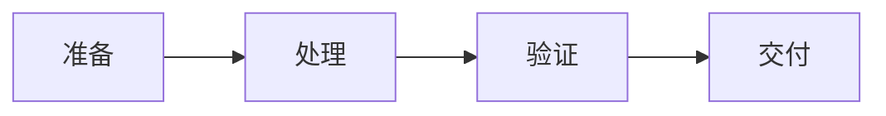

# 迭代器与生成器的调试与排错

> **领域**：Python核心 ｜ **模块**：迭代器与生成器 ｜ **难度**：高级 ｜ **类型**：调试排错

## 导读

本章属于 **Python核心** 教程的 **迭代器与生成器** 模块，难度为 **高级**。阅读重点在于建立清晰的概念模型与工程判断能力，而非死记细节。

## 核心概念

Python 以可读性与丰富标准库著称，3.12 持续优化性能与类型系统，是数据、Web、自动化等多场景的主流语言。

在 **Python核心** 体系中，**迭代器与生成器** 与上下游模块形成协作。技术栈以 **Python 3.12** 为核心（Python），生态包括 pip, venv, pytest。

「迭代器与生成器」是该领域的核心知识模块，理解其原理与边界是工程实践的基础。

### 概念精讲

**迭代器与生成器的基本概念与定义**

从流程出发：一次完整调用或生命周期经历哪些阶段。 在 迭代器与生成器 语境下，这一点直接影响设计决策与故障排查思路。

**迭代器与生成器在Python核心中的作用与地位**

从数据出发：输入输出是什么格式，状态如何变迁。 在 迭代器与生成器 语境下，这一点直接影响设计决策与故障排查思路。

**迭代器与生成器的核心数据结构**

从关系出发：它与上下游模块的依赖与接口契约。 在 迭代器与生成器 语境下，这一点直接影响设计决策与故障排查思路。

**迭代器与生成器的关键算法与流程**

从实践出发：典型应用场景与反模式（不该用的场景）。 在 迭代器与生成器 语境下，这一点直接影响设计决策与故障排查思路。

**迭代器与生成器与其他模块的关系**

从演进出发：历史上为何出现、未来可能如何变化。 在 迭代器与生成器 语境下，这一点直接影响设计决策与故障排查思路。

## 架构与流程

以下框图帮助你在宏观层面把握模块协作关系与处理流向：

## 深度讲解

### 工具链

日志（结构化+上下文 ID）、断点调试、分布式追踪、Profiler/火焰图。

### 调试纪律

先明确预期行为，再查差异。保留最小复现用例作回归。

### 与监控联动

调试发现的盲点应反哺告警规则，让同类问题下次主动暴露。

### 落地检查清单

- **理解迭代器与生成器的设计思想与适用场景**：落地时需明确验收标准与回滚方案。
- **掌握迭代器与生成器的核心API与配置项**：落地时需明确验收标准与回滚方案。
- **分析迭代器与生成器的源码实现与调用流程**：落地时需明确验收标准与回滚方案。
- **了解迭代器与生成器的性能特点与瓶颈**：落地时需明确验收标准与回滚方案。

### 常见误区与应对

**误区：对迭代器与生成器的概念理解不深入导致误用**

**应对**：回到官方定义画一张概念图，与同事讲解一遍，确保能用自己的话复述。

**误区：忽略迭代器与生成器的性能边界与限制条件**

**应对**：用 Profiler 或压测建立基线，对比优化前后数据，避免凭感觉优化。

**误区：迭代器与生成器配置不当引发的问题**

**应对**：核对环境变量、配置文件与部署清单是否一致，使用配置 diff 工具排查。

**误区：缺乏对迭代器与生成器底层原理的理解**

**应对**：阅读官方文档与一篇深度文章，结合小实验验证理解。

**误区：迭代器与生成器与其他模块集成时的兼容性问题**

**应对**：列出依赖版本矩阵，在 CI 中跑集成测试覆盖主要组合。

### 最佳实践

1. **遵循迭代器与生成器的官方推荐用法与规范** — 落地方式：写入团队 Wiki 并纳入 Code Review 检查项。

2. **在理解原理的基础上合理使用迭代器与生成器** — 落地方式：配置静态检查或 CI 规则自动拦截违规写法。

3. **建立完善的迭代器与生成器监控与告警机制** — 落地方式：在新人 onboarding 中作为必修内容讲解。

4. **编写充分的测试用例覆盖迭代器与生成器的各种场景** — 落地方式：每季度回顾一次，对照社区最佳实践更新。

5. **持续关注迭代器与生成器的版本更新与最佳实践演进** — 落地方式：用真实项目案例演示正确与错误对比。

### 本章小结

学完本章，你应能：

- 说清 **迭代器与生成器的调试与排错** 在 Python核心/迭代器与生成器 中的定位。
- 描述核心流程与关键概念，能用自己的话复述。
- 识别常见误区并采取预防与排查手段。
- 在项目中做出与场景匹配的工程决策。

类型：**调试排错**。建议完成小练习或复盘笔记，将阅读转化为能力。

## 延伸学习

建议结合以下同模块章节继续阅读，构建完整知识链：

- 迭代器与生成器的设计思想与演进
- 迭代器与生成器的底层原理剖析

### 参考资料

- Python核心官方文档 - 迭代器与生成器章节
- 《Python核心权威指南》相关章节
- 迭代器与生成器源码实现与注释
- Python核心社区最佳实践文章
- 迭代器与生成器相关技术博客与教程

---
*章节 ID: 122 ｜ 领域: Python核心 ｜ 版本: 2.0*