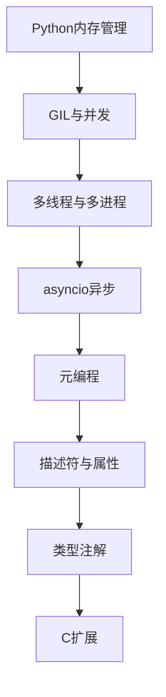

# Python高级 学习指南

> **分类**：编程语言 ｜ **技术生态**：见正文

## 领域定位

Python高级 是当前技术生态中的重要方向。

系统学习 Python高级 需兼顾原理与工程实践，本指南按模块组织章节，由浅入深。

建议结合官方文档与社区主流工具链同步学习。

## 学习目标

- 系统掌握 Python高级 核心模块与协作关系
- 能独立分析常见问题并给出可验证的解决方案
- 能在真实项目中做出合理的技术选型与架构决策
- 能阅读官方文档与源码定位关键实现路径

## 前置知识

- 无硬性前置，按章节难度循序渐进即可

## 学习路径

1. **Python内存管理**
2. **GIL与并发**
3. **多线程与多进程**
4. **asyncio异步**
5. **元编程**
6. **描述符与属性**
7. **类型注解**
8. **C扩展**

## 模块体系

- **Python内存管理**
- **GIL与并发**
- **多线程与多进程**
- **asyncio异步**
- **元编程**
- **描述符与属性**
- **类型注解**
- **C扩展**
- **性能分析与优化**
- **设计模式**
- **函数式编程**
- **数据处理**
- **Web开发基础**
- **测试与调试**
- **Python高级技巧**

## 难度分布

| 入门 | 24 | 20% |
| 实战 | 24 | 20% |
| 进阶 | 32 | 26% |
| 高级 | 40 | 33% |

## 章节索引

### Python内存管理

- [Python内存管理核心概念与原理](chapters/001-Python内存管理核心概念与原理.md) ｜ 入门
- [Python内存管理的实现机制详解](chapters/002-Python内存管理的实现机制详解.md) ｜ 入门
- [Python内存管理的关键技术点](chapters/003-Python内存管理的关键技术点.md) ｜ 入门
- [Python内存管理的源码级分析](chapters/004-Python内存管理的源码级分析.md) ｜ 入门
- [Python内存管理的配置与使用](chapters/005-Python内存管理的配置与使用.md) ｜ 入门
- [Python内存管理的常见问题与解决方案](chapters/006-Python内存管理的常见问题与解决方案.md) ｜ 入门
- [Python内存管理的性能优化技巧](chapters/007-Python内存管理的性能优化技巧.md) ｜ 入门
- [Python内存管理的最佳实践指南](chapters/008-Python内存管理的最佳实践指南.md) ｜ 入门

### GIL与并发

- [GIL与并发核心概念与原理](chapters/009-GIL与并发核心概念与原理.md) ｜ 入门
- [GIL与并发的实现机制详解](chapters/010-GIL与并发的实现机制详解.md) ｜ 入门
- [GIL与并发的关键技术点](chapters/011-GIL与并发的关键技术点.md) ｜ 入门
- [GIL与并发的源码级分析](chapters/012-GIL与并发的源码级分析.md) ｜ 入门
- [GIL与并发的配置与使用](chapters/013-GIL与并发的配置与使用.md) ｜ 入门
- [GIL与并发的常见问题与解决方案](chapters/014-GIL与并发的常见问题与解决方案.md) ｜ 入门
- [GIL与并发的性能优化技巧](chapters/015-GIL与并发的性能优化技巧.md) ｜ 入门
- [GIL与并发的最佳实践指南](chapters/016-GIL与并发的最佳实践指南.md) ｜ 入门

### 多线程与多进程

- [多线程与多进程核心概念与原理](chapters/017-多线程与多进程核心概念与原理.md) ｜ 入门
- [多线程与多进程的实现机制详解](chapters/018-多线程与多进程的实现机制详解.md) ｜ 入门
- [多线程与多进程的关键技术点](chapters/019-多线程与多进程的关键技术点.md) ｜ 入门
- [多线程与多进程的源码级分析](chapters/020-多线程与多进程的源码级分析.md) ｜ 入门
- [多线程与多进程的配置与使用](chapters/021-多线程与多进程的配置与使用.md) ｜ 入门
- [多线程与多进程的常见问题与解决方案](chapters/022-多线程与多进程的常见问题与解决方案.md) ｜ 入门
- [多线程与多进程的性能优化技巧](chapters/023-多线程与多进程的性能优化技巧.md) ｜ 入门
- [多线程与多进程的最佳实践指南](chapters/024-多线程与多进程的最佳实践指南.md) ｜ 入门

### asyncio异步

- [asyncio异步核心概念与原理](chapters/025-asyncio异步核心概念与原理.md) ｜ 进阶
- [asyncio异步的实现机制详解](chapters/026-asyncio异步的实现机制详解.md) ｜ 进阶
- [asyncio异步的关键技术点](chapters/027-asyncio异步的关键技术点.md) ｜ 进阶
- [asyncio异步的源码级分析](chapters/028-asyncio异步的源码级分析.md) ｜ 进阶
- [asyncio异步的配置与使用](chapters/029-asyncio异步的配置与使用.md) ｜ 进阶
- [asyncio异步的常见问题与解决方案](chapters/030-asyncio异步的常见问题与解决方案.md) ｜ 进阶
- [asyncio异步的性能优化技巧](chapters/031-asyncio异步的性能优化技巧.md) ｜ 进阶
- [asyncio异步的最佳实践指南](chapters/032-asyncio异步的最佳实践指南.md) ｜ 进阶

### 元编程

- [元编程核心概念与原理](chapters/033-元编程核心概念与原理.md) ｜ 进阶
- [元编程的实现机制详解](chapters/034-元编程的实现机制详解.md) ｜ 进阶
- [元编程的关键技术点](chapters/035-元编程的关键技术点.md) ｜ 进阶
- [元编程的源码级分析](chapters/036-元编程的源码级分析.md) ｜ 进阶
- [元编程的配置与使用](chapters/037-元编程的配置与使用.md) ｜ 进阶
- [元编程的常见问题与解决方案](chapters/038-元编程的常见问题与解决方案.md) ｜ 进阶
- [元编程的性能优化技巧](chapters/039-元编程的性能优化技巧.md) ｜ 进阶
- [元编程的最佳实践指南](chapters/040-元编程的最佳实践指南.md) ｜ 进阶

### 描述符与属性

- [描述符与属性核心概念与原理](chapters/041-描述符与属性核心概念与原理.md) ｜ 进阶
- [描述符与属性的实现机制详解](chapters/042-描述符与属性的实现机制详解.md) ｜ 进阶
- [描述符与属性的关键技术点](chapters/043-描述符与属性的关键技术点.md) ｜ 进阶
- [描述符与属性的源码级分析](chapters/044-描述符与属性的源码级分析.md) ｜ 进阶
- [描述符与属性的配置与使用](chapters/045-描述符与属性的配置与使用.md) ｜ 进阶
- [描述符与属性的常见问题与解决方案](chapters/046-描述符与属性的常见问题与解决方案.md) ｜ 进阶
- [描述符与属性的性能优化技巧](chapters/047-描述符与属性的性能优化技巧.md) ｜ 进阶
- [描述符与属性的最佳实践指南](chapters/048-描述符与属性的最佳实践指南.md) ｜ 进阶

### 类型注解

- [类型注解核心概念与原理](chapters/049-类型注解核心概念与原理.md) ｜ 进阶
- [类型注解的实现机制详解](chapters/050-类型注解的实现机制详解.md) ｜ 进阶
- [类型注解的关键技术点](chapters/051-类型注解的关键技术点.md) ｜ 进阶
- [类型注解的源码级分析](chapters/052-类型注解的源码级分析.md) ｜ 进阶
- [类型注解的配置与使用](chapters/053-类型注解的配置与使用.md) ｜ 进阶
- [类型注解的常见问题与解决方案](chapters/054-类型注解的常见问题与解决方案.md) ｜ 进阶
- [类型注解的性能优化技巧](chapters/055-类型注解的性能优化技巧.md) ｜ 进阶
- [类型注解的最佳实践指南](chapters/056-类型注解的最佳实践指南.md) ｜ 进阶

### C扩展

- [C扩展核心概念与原理](chapters/057-C扩展核心概念与原理.md) ｜ 高级
- [C扩展的实现机制详解](chapters/058-C扩展的实现机制详解.md) ｜ 高级
- [C扩展的关键技术点](chapters/059-C扩展的关键技术点.md) ｜ 高级
- [C扩展的源码级分析](chapters/060-C扩展的源码级分析.md) ｜ 高级
- [C扩展的配置与使用](chapters/061-C扩展的配置与使用.md) ｜ 高级
- [C扩展的常见问题与解决方案](chapters/062-C扩展的常见问题与解决方案.md) ｜ 高级
- [C扩展的性能优化技巧](chapters/063-C扩展的性能优化技巧.md) ｜ 高级
- [C扩展的最佳实践指南](chapters/064-C扩展的最佳实践指南.md) ｜ 高级

### 性能分析与优化

- [性能分析与优化核心概念与原理](chapters/065-性能分析与优化核心概念与原理.md) ｜ 高级
- [性能分析与优化的实现机制详解](chapters/066-性能分析与优化的实现机制详解.md) ｜ 高级
- [性能分析与优化的关键技术点](chapters/067-性能分析与优化的关键技术点.md) ｜ 高级
- [性能分析与优化的源码级分析](chapters/068-性能分析与优化的源码级分析.md) ｜ 高级
- [性能分析与优化的配置与使用](chapters/069-性能分析与优化的配置与使用.md) ｜ 高级
- [性能分析与优化的常见问题与解决方案](chapters/070-性能分析与优化的常见问题与解决方案.md) ｜ 高级
- [性能分析与优化的性能优化技巧](chapters/071-性能分析与优化的性能优化技巧.md) ｜ 高级
- [性能分析与优化的最佳实践指南](chapters/072-性能分析与优化的最佳实践指南.md) ｜ 高级

### 设计模式

- [设计模式核心概念与原理](chapters/073-设计模式核心概念与原理.md) ｜ 高级
- [设计模式的实现机制详解](chapters/074-设计模式的实现机制详解.md) ｜ 高级
- [设计模式的关键技术点](chapters/075-设计模式的关键技术点.md) ｜ 高级
- [设计模式的源码级分析](chapters/076-设计模式的源码级分析.md) ｜ 高级
- [设计模式的配置与使用](chapters/077-设计模式的配置与使用.md) ｜ 高级
- [设计模式的常见问题与解决方案](chapters/078-设计模式的常见问题与解决方案.md) ｜ 高级
- [设计模式的性能优化技巧](chapters/079-设计模式的性能优化技巧.md) ｜ 高级
- [设计模式的最佳实践指南](chapters/080-设计模式的最佳实践指南.md) ｜ 高级

### 函数式编程

- [函数式编程核心概念与原理](chapters/081-函数式编程核心概念与原理.md) ｜ 高级
- [函数式编程的实现机制详解](chapters/082-函数式编程的实现机制详解.md) ｜ 高级
- [函数式编程的关键技术点](chapters/083-函数式编程的关键技术点.md) ｜ 高级
- [函数式编程的源码级分析](chapters/084-函数式编程的源码级分析.md) ｜ 高级
- [函数式编程的配置与使用](chapters/085-函数式编程的配置与使用.md) ｜ 高级
- [函数式编程的常见问题与解决方案](chapters/086-函数式编程的常见问题与解决方案.md) ｜ 高级
- [函数式编程的性能优化技巧](chapters/087-函数式编程的性能优化技巧.md) ｜ 高级
- [函数式编程的最佳实践指南](chapters/088-函数式编程的最佳实践指南.md) ｜ 高级

### 数据处理

- [数据处理核心概念与原理](chapters/089-数据处理核心概念与原理.md) ｜ 高级
- [数据处理的实现机制详解](chapters/090-数据处理的实现机制详解.md) ｜ 高级
- [数据处理的关键技术点](chapters/091-数据处理的关键技术点.md) ｜ 高级
- [数据处理的源码级分析](chapters/092-数据处理的源码级分析.md) ｜ 高级
- [数据处理的配置与使用](chapters/093-数据处理的配置与使用.md) ｜ 高级
- [数据处理的常见问题与解决方案](chapters/094-数据处理的常见问题与解决方案.md) ｜ 高级
- [数据处理的性能优化技巧](chapters/095-数据处理的性能优化技巧.md) ｜ 高级
- [数据处理的最佳实践指南](chapters/096-数据处理的最佳实践指南.md) ｜ 高级

### Web开发基础

- [Web开发基础核心概念与原理](chapters/097-Web开发基础核心概念与原理.md) ｜ 实战
- [Web开发基础的实现机制详解](chapters/098-Web开发基础的实现机制详解.md) ｜ 实战
- [Web开发基础的关键技术点](chapters/099-Web开发基础的关键技术点.md) ｜ 实战
- [Web开发基础的源码级分析](chapters/100-Web开发基础的源码级分析.md) ｜ 实战
- [Web开发基础的配置与使用](chapters/101-Web开发基础的配置与使用.md) ｜ 实战
- [Web开发基础的常见问题与解决方案](chapters/102-Web开发基础的常见问题与解决方案.md) ｜ 实战
- [Web开发基础的性能优化技巧](chapters/103-Web开发基础的性能优化技巧.md) ｜ 实战
- [Web开发基础的最佳实践指南](chapters/104-Web开发基础的最佳实践指南.md) ｜ 实战

### 测试与调试

- [测试与调试核心概念与原理](chapters/105-测试与调试核心概念与原理.md) ｜ 实战
- [测试与调试的实现机制详解](chapters/106-测试与调试的实现机制详解.md) ｜ 实战
- [测试与调试的关键技术点](chapters/107-测试与调试的关键技术点.md) ｜ 实战
- [测试与调试的源码级分析](chapters/108-测试与调试的源码级分析.md) ｜ 实战
- [测试与调试的配置与使用](chapters/109-测试与调试的配置与使用.md) ｜ 实战
- [测试与调试的常见问题与解决方案](chapters/110-测试与调试的常见问题与解决方案.md) ｜ 实战
- [测试与调试的性能优化技巧](chapters/111-测试与调试的性能优化技巧.md) ｜ 实战
- [测试与调试的最佳实践指南](chapters/112-测试与调试的最佳实践指南.md) ｜ 实战

### Python高级技巧

- [Python高级技巧核心概念与原理](chapters/113-Python高级技巧核心概念与原理.md) ｜ 实战
- [Python高级技巧的实现机制详解](chapters/114-Python高级技巧的实现机制详解.md) ｜ 实战
- [Python高级技巧的关键技术点](chapters/115-Python高级技巧的关键技术点.md) ｜ 实战
- [Python高级技巧的源码级分析](chapters/116-Python高级技巧的源码级分析.md) ｜ 实战
- [Python高级技巧的配置与使用](chapters/117-Python高级技巧的配置与使用.md) ｜ 实战
- [Python高级技巧的常见问题与解决方案](chapters/118-Python高级技巧的常见问题与解决方案.md) ｜ 实战
- [Python高级技巧的性能优化技巧](chapters/119-Python高级技巧的性能优化技巧.md) ｜ 实战
- [Python高级技巧的最佳实践指南](chapters/120-Python高级技巧的最佳实践指南.md) ｜ 实战

---
*领域: Python高级*