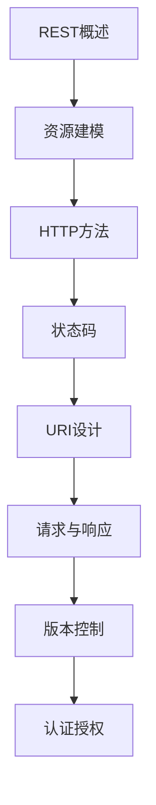

# RESTful API 学习指南

> **分类**：后端开发 ｜ **章节总数**：100 ｜ **技术栈**：RESTful API

## 领域概述

RESTful API是后端开发领域的重要技术方向，本系列从基础到高级逐步深入，涵盖17个核心模块：REST概述、资源建模、HTTP方法、状态码、URI设计等。每个知识点作为独立章节，包含原理讲解、实现要点、常见陷阱和最佳实践，配合源码分析和架构图，帮助读者建立完整的RESTful API知识体系。

本教程基于 **通用** 与 **RESTful API** 生态编写，涵盖 行业标准工具链 等主流工具与框架。每章独立成篇，文字精炼、逻辑清晰，适合系统学习与按需查阅。

## 你将学到什么

完成本系列后，你将能够：

- 系统理解 **RESTful API** 的核心概念与模块划分。
- 按难度递进掌握从入门到实战的完整知识路径。
- 在工程实践中做出合理的技术判断与问题排查。
- 通过章节索引快速定位所需知识点。

## 前置知识

- 编程基础
- 数据结构
- 计算机基础
- 后端开发基础概念

## 推荐学习路径

1. **REST概述**
2. **资源建模**
3. **HTTP方法**
4. **状态码**
5. **URI设计**
6. **请求与响应**
7. **版本控制**
8. **认证授权**

## 模块体系

本领域按以下模块组织，难度由浅入深：

- **REST概述**
- **资源建模**
- **HTTP方法**
- **状态码**
- **URI设计**
- **请求与响应**
- **版本控制**
- **认证授权**
- **分页**
- **过滤排序**
- **错误处理**
- **API文档**
- **API测试**
- **性能优化**
- **安全**
- **HATEOAS**
- **REST最佳实践**

## 难度分布

| 难度 | 章节数 | 占比 |
|------|--------|------|
| 入门 | 24 | 24% |
| 实战 | 22 | 22% |
| 进阶 | 24 | 24% |
| 高级 | 30 | 30% |

## 章节索引

点击章节标题进入对应教程：

### REST概述

- [REST概述核心概念与原理](chapters/001-REST概述核心概念与原理.md) ｜ 入门
- [REST概述的实现机制详解](chapters/002-REST概述的实现机制详解.md) ｜ 入门
- [REST概述的关键技术点](chapters/003-REST概述的关键技术点.md) ｜ 入门
- [REST概述的源码级分析](chapters/004-REST概述的源码级分析.md) ｜ 入门
- [REST概述的配置与使用](chapters/005-REST概述的配置与使用.md) ｜ 入门
- [REST概述的常见问题与解决方案](chapters/006-REST概述的常见问题与解决方案.md) ｜ 入门

### 资源建模

- [资源建模核心概念与原理](chapters/007-资源建模核心概念与原理.md) ｜ 入门
- [资源建模的实现机制详解](chapters/008-资源建模的实现机制详解.md) ｜ 入门
- [资源建模的关键技术点](chapters/009-资源建模的关键技术点.md) ｜ 入门
- [资源建模的源码级分析](chapters/010-资源建模的源码级分析.md) ｜ 入门
- [资源建模的配置与使用](chapters/011-资源建模的配置与使用.md) ｜ 入门
- [资源建模的常见问题与解决方案](chapters/012-资源建模的常见问题与解决方案.md) ｜ 入门

### HTTP方法

- [HTTP方法核心概念与原理](chapters/013-HTTP方法核心概念与原理.md) ｜ 入门
- [HTTP方法的实现机制详解](chapters/014-HTTP方法的实现机制详解.md) ｜ 入门
- [HTTP方法的关键技术点](chapters/015-HTTP方法的关键技术点.md) ｜ 入门
- [HTTP方法的源码级分析](chapters/016-HTTP方法的源码级分析.md) ｜ 入门
- [HTTP方法的配置与使用](chapters/017-HTTP方法的配置与使用.md) ｜ 入门
- [HTTP方法的常见问题与解决方案](chapters/018-HTTP方法的常见问题与解决方案.md) ｜ 入门

### 状态码

- [状态码核心概念与原理](chapters/019-状态码核心概念与原理.md) ｜ 入门
- [状态码的实现机制详解](chapters/020-状态码的实现机制详解.md) ｜ 入门
- [状态码的关键技术点](chapters/021-状态码的关键技术点.md) ｜ 入门
- [状态码的源码级分析](chapters/022-状态码的源码级分析.md) ｜ 入门
- [状态码的配置与使用](chapters/023-状态码的配置与使用.md) ｜ 入门
- [状态码的常见问题与解决方案](chapters/024-状态码的常见问题与解决方案.md) ｜ 入门

### URI设计

- [URI设计核心概念与原理](chapters/025-URI设计核心概念与原理.md) ｜ 进阶
- [URI设计的实现机制详解](chapters/026-URI设计的实现机制详解.md) ｜ 进阶
- [URI设计的关键技术点](chapters/027-URI设计的关键技术点.md) ｜ 进阶
- [URI设计的源码级分析](chapters/028-URI设计的源码级分析.md) ｜ 进阶
- [URI设计的配置与使用](chapters/029-URI设计的配置与使用.md) ｜ 进阶
- [URI设计的常见问题与解决方案](chapters/030-URI设计的常见问题与解决方案.md) ｜ 进阶

### 请求与响应

- [请求与响应核心概念与原理](chapters/031-请求与响应核心概念与原理.md) ｜ 进阶
- [请求与响应的实现机制详解](chapters/032-请求与响应的实现机制详解.md) ｜ 进阶
- [请求与响应的关键技术点](chapters/033-请求与响应的关键技术点.md) ｜ 进阶
- [请求与响应的源码级分析](chapters/034-请求与响应的源码级分析.md) ｜ 进阶
- [请求与响应的配置与使用](chapters/035-请求与响应的配置与使用.md) ｜ 进阶
- [请求与响应的常见问题与解决方案](chapters/036-请求与响应的常见问题与解决方案.md) ｜ 进阶

### 版本控制

- [版本控制核心概念与原理](chapters/037-版本控制核心概念与原理.md) ｜ 进阶
- [版本控制的实现机制详解](chapters/038-版本控制的实现机制详解.md) ｜ 进阶
- [版本控制的关键技术点](chapters/039-版本控制的关键技术点.md) ｜ 进阶
- [版本控制的源码级分析](chapters/040-版本控制的源码级分析.md) ｜ 进阶
- [版本控制的配置与使用](chapters/041-版本控制的配置与使用.md) ｜ 进阶
- [版本控制的常见问题与解决方案](chapters/042-版本控制的常见问题与解决方案.md) ｜ 进阶

### 认证授权

- [认证授权核心概念与原理](chapters/043-认证授权核心概念与原理.md) ｜ 进阶
- [认证授权的实现机制详解](chapters/044-认证授权的实现机制详解.md) ｜ 进阶
- [认证授权的关键技术点](chapters/045-认证授权的关键技术点.md) ｜ 进阶
- [认证授权的源码级分析](chapters/046-认证授权的源码级分析.md) ｜ 进阶
- [认证授权的配置与使用](chapters/047-认证授权的配置与使用.md) ｜ 进阶
- [认证授权的常见问题与解决方案](chapters/048-认证授权的常见问题与解决方案.md) ｜ 进阶

### 分页

- [分页核心概念与原理](chapters/049-分页核心概念与原理.md) ｜ 高级
- [分页的实现机制详解](chapters/050-分页的实现机制详解.md) ｜ 高级
- [分页的关键技术点](chapters/051-分页的关键技术点.md) ｜ 高级
- [分页的源码级分析](chapters/052-分页的源码级分析.md) ｜ 高级
- [分页的配置与使用](chapters/053-分页的配置与使用.md) ｜ 高级
- [分页的常见问题与解决方案](chapters/054-分页的常见问题与解决方案.md) ｜ 高级

### 过滤排序

- [过滤排序核心概念与原理](chapters/055-过滤排序核心概念与原理.md) ｜ 高级
- [过滤排序的实现机制详解](chapters/056-过滤排序的实现机制详解.md) ｜ 高级
- [过滤排序的关键技术点](chapters/057-过滤排序的关键技术点.md) ｜ 高级
- [过滤排序的源码级分析](chapters/058-过滤排序的源码级分析.md) ｜ 高级
- [过滤排序的配置与使用](chapters/059-过滤排序的配置与使用.md) ｜ 高级
- [过滤排序的常见问题与解决方案](chapters/060-过滤排序的常见问题与解决方案.md) ｜ 高级

### 错误处理

- [错误处理核心概念与原理](chapters/061-错误处理核心概念与原理.md) ｜ 高级
- [错误处理的实现机制详解](chapters/062-错误处理的实现机制详解.md) ｜ 高级
- [错误处理的关键技术点](chapters/063-错误处理的关键技术点.md) ｜ 高级
- [错误处理的源码级分析](chapters/064-错误处理的源码级分析.md) ｜ 高级
- [错误处理的配置与使用](chapters/065-错误处理的配置与使用.md) ｜ 高级
- [错误处理的常见问题与解决方案](chapters/066-错误处理的常见问题与解决方案.md) ｜ 高级

### API文档

- [API文档核心概念与原理](chapters/067-API文档核心概念与原理.md) ｜ 高级
- [API文档的实现机制详解](chapters/068-API文档的实现机制详解.md) ｜ 高级
- [API文档的关键技术点](chapters/069-API文档的关键技术点.md) ｜ 高级
- [API文档的源码级分析](chapters/070-API文档的源码级分析.md) ｜ 高级
- [API文档的配置与使用](chapters/071-API文档的配置与使用.md) ｜ 高级
- [API文档的常见问题与解决方案](chapters/072-API文档的常见问题与解决方案.md) ｜ 高级

### API测试

- [API测试核心概念与原理](chapters/073-API测试核心概念与原理.md) ｜ 高级
- [API测试的实现机制详解](chapters/074-API测试的实现机制详解.md) ｜ 高级
- [API测试的关键技术点](chapters/075-API测试的关键技术点.md) ｜ 高级
- [API测试的源码级分析](chapters/076-API测试的源码级分析.md) ｜ 高级
- [API测试的配置与使用](chapters/077-API测试的配置与使用.md) ｜ 高级
- [API测试的常见问题与解决方案](chapters/078-API测试的常见问题与解决方案.md) ｜ 高级

### 性能优化

- [性能优化核心概念与原理](chapters/079-性能优化核心概念与原理.md) ｜ 实战
- [性能优化的实现机制详解](chapters/080-性能优化的实现机制详解.md) ｜ 实战
- [性能优化的关键技术点](chapters/081-性能优化的关键技术点.md) ｜ 实战
- [性能优化的源码级分析](chapters/082-性能优化的源码级分析.md) ｜ 实战
- [性能优化的配置与使用](chapters/083-性能优化的配置与使用.md) ｜ 实战
- [性能优化的常见问题与解决方案](chapters/084-性能优化的常见问题与解决方案.md) ｜ 实战

### 安全

- [安全核心概念与原理](chapters/085-安全核心概念与原理.md) ｜ 实战
- [安全的实现机制详解](chapters/086-安全的实现机制详解.md) ｜ 实战
- [安全的关键技术点](chapters/087-安全的关键技术点.md) ｜ 实战
- [安全的源码级分析](chapters/088-安全的源码级分析.md) ｜ 实战
- [安全的配置与使用](chapters/089-安全的配置与使用.md) ｜ 实战
- [安全的常见问题与解决方案](chapters/090-安全的常见问题与解决方案.md) ｜ 实战

### HATEOAS

- [HATEOAS核心概念与原理](chapters/091-HATEOAS核心概念与原理.md) ｜ 实战
- [HATEOAS的实现机制详解](chapters/092-HATEOAS的实现机制详解.md) ｜ 实战
- [HATEOAS的关键技术点](chapters/093-HATEOAS的关键技术点.md) ｜ 实战
- [HATEOAS的源码级分析](chapters/094-HATEOAS的源码级分析.md) ｜ 实战
- [HATEOAS的配置与使用](chapters/095-HATEOAS的配置与使用.md) ｜ 实战

### REST最佳实践

- [REST最佳实践核心概念与原理](chapters/096-REST最佳实践核心概念与原理.md) ｜ 实战
- [REST最佳实践的实现机制详解](chapters/097-REST最佳实践的实现机制详解.md) ｜ 实战
- [REST最佳实践的关键技术点](chapters/098-REST最佳实践的关键技术点.md) ｜ 实战
- [REST最佳实践的源码级分析](chapters/099-REST最佳实践的源码级分析.md) ｜ 实战
- [REST最佳实践的配置与使用](chapters/100-REST最佳实践的配置与使用.md) ｜ 实战

## 学习方法建议

1. **先读概述再读章节**：用本指南建立全局地图，避免迷失在细节中。
2. **按模块递进**：同一模块内章节有前后关联，顺序阅读效果更好。
3. **主动复述**：每章读完后，用三五句话概括「是什么、为什么、怎么用」。
4. **关联阅读**：利用章节底部的「延伸学习」在同模块内构建知识网络。
5. **对照官方文档**：本教程提供结构化视角，细节以官方文档为准。

---
*领域: RESTful API ｜ 版本: 2.0 ｜ 共 100 章*