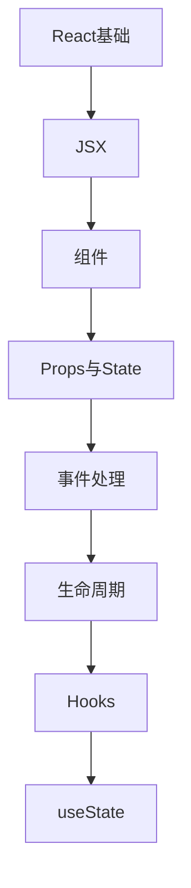

# React 学习指南

> **分类**：前端开发 ｜ **章节总数**：200 ｜ **技术栈**：React 18+

## 领域概述

React是前端开发领域的重要技术方向，本系列从基础到高级逐步深入，涵盖17个核心模块：React基础、JSX、组件、Props与State、事件处理等。每个知识点作为独立章节，包含原理讲解、实现要点、常见陷阱和最佳实践，配合源码分析和架构图，帮助读者建立完整的React知识体系。

本教程基于 **JavaScript/TypeScript** 与 **React 18+** 生态编写，涵盖 Vite, React Router, Redux/Zustand 等主流工具与框架。每章独立成篇，文字精炼、逻辑清晰，适合系统学习与按需查阅。

## 你将学到什么

完成本系列后，你将能够：

- 系统理解 **React** 的核心概念与模块划分。
- 按难度递进掌握从入门到实战的完整知识路径。
- 在工程实践中做出合理的技术判断与问题排查。
- 通过章节索引快速定位所需知识点。

## 前置知识

- 编程基础
- 数据结构
- 计算机基础
- 前端开发基础概念

## 推荐学习路径

1. **React基础**
2. **JSX**
3. **组件**
4. **Props与State**
5. **事件处理**
6. **生命周期**
7. **Hooks**
8. **useState**

## 模块体系

本领域按以下模块组织，难度由浅入深：

- **React基础**
- **JSX**
- **组件**
- **Props与State**
- **事件处理**
- **生命周期**
- **Hooks**
- **useState**
- **useEffect**
- **自定义Hook**
- **Context**
- **性能优化**
- **路由**
- **状态管理**
- **服务端渲染**
- **React测试**
- **React最佳实践**

## 难度分布

| 难度 | 章节数 | 占比 |
|------|--------|------|
| 入门 | 48 | 24% |
| 实战 | 44 | 22% |
| 进阶 | 48 | 24% |
| 高级 | 60 | 30% |

## 章节索引

点击章节标题进入对应教程：

### React基础

- [React基础核心概念与原理](chapters/001-React基础核心概念与原理.md) ｜ 入门
- [React基础的实现机制详解](chapters/002-React基础的实现机制详解.md) ｜ 入门
- [React基础的关键技术点](chapters/003-React基础的关键技术点.md) ｜ 入门
- [React基础的源码级分析](chapters/004-React基础的源码级分析.md) ｜ 入门
- [React基础的配置与使用](chapters/005-React基础的配置与使用.md) ｜ 入门
- [React基础的常见问题与解决方案](chapters/006-React基础的常见问题与解决方案.md) ｜ 入门
- [React基础的性能优化技巧](chapters/007-React基础的性能优化技巧.md) ｜ 入门
- [React基础的最佳实践指南](chapters/008-React基础的最佳实践指南.md) ｜ 入门
- [React基础的高级应用场景](chapters/009-React基础的高级应用场景.md) ｜ 入门
- [React基础的实战案例分析](chapters/010-React基础的实战案例分析.md) ｜ 入门
- [React基础的设计思想与演进](chapters/011-React基础的设计思想与演进.md) ｜ 入门
- [React基础的底层原理剖析](chapters/012-React基础的底层原理剖析.md) ｜ 入门

### JSX

- [JSX核心概念与原理](chapters/013-JSX核心概念与原理.md) ｜ 入门
- [JSX的实现机制详解](chapters/014-JSX的实现机制详解.md) ｜ 入门
- [JSX的关键技术点](chapters/015-JSX的关键技术点.md) ｜ 入门
- [JSX的源码级分析](chapters/016-JSX的源码级分析.md) ｜ 入门
- [JSX的配置与使用](chapters/017-JSX的配置与使用.md) ｜ 入门
- [JSX的常见问题与解决方案](chapters/018-JSX的常见问题与解决方案.md) ｜ 入门
- [JSX的性能优化技巧](chapters/019-JSX的性能优化技巧.md) ｜ 入门
- [JSX的最佳实践指南](chapters/020-JSX的最佳实践指南.md) ｜ 入门
- [JSX的高级应用场景](chapters/021-JSX的高级应用场景.md) ｜ 入门
- [JSX的实战案例分析](chapters/022-JSX的实战案例分析.md) ｜ 入门
- [JSX的设计思想与演进](chapters/023-JSX的设计思想与演进.md) ｜ 入门
- [JSX的底层原理剖析](chapters/024-JSX的底层原理剖析.md) ｜ 入门

### 组件

- [组件核心概念与原理](chapters/025-组件核心概念与原理.md) ｜ 入门
- [组件的实现机制详解](chapters/026-组件的实现机制详解.md) ｜ 入门
- [组件的关键技术点](chapters/027-组件的关键技术点.md) ｜ 入门
- [组件的源码级分析](chapters/028-组件的源码级分析.md) ｜ 入门
- [组件的配置与使用](chapters/029-组件的配置与使用.md) ｜ 入门
- [组件的常见问题与解决方案](chapters/030-组件的常见问题与解决方案.md) ｜ 入门
- [组件的性能优化技巧](chapters/031-组件的性能优化技巧.md) ｜ 入门
- [组件的最佳实践指南](chapters/032-组件的最佳实践指南.md) ｜ 入门
- [组件的高级应用场景](chapters/033-组件的高级应用场景.md) ｜ 入门
- [组件的实战案例分析](chapters/034-组件的实战案例分析.md) ｜ 入门
- [组件的设计思想与演进](chapters/035-组件的设计思想与演进.md) ｜ 入门
- [组件的底层原理剖析](chapters/036-组件的底层原理剖析.md) ｜ 入门

### Props与State

- [Props与State核心概念与原理](chapters/037-Props与State核心概念与原理.md) ｜ 入门
- [Props与State的实现机制详解](chapters/038-Props与State的实现机制详解.md) ｜ 入门
- [Props与State的关键技术点](chapters/039-Props与State的关键技术点.md) ｜ 入门
- [Props与State的源码级分析](chapters/040-Props与State的源码级分析.md) ｜ 入门
- [Props与State的配置与使用](chapters/041-Props与State的配置与使用.md) ｜ 入门
- [Props与State的常见问题与解决方案](chapters/042-Props与State的常见问题与解决方案.md) ｜ 入门
- [Props与State的性能优化技巧](chapters/043-Props与State的性能优化技巧.md) ｜ 入门
- [Props与State的最佳实践指南](chapters/044-Props与State的最佳实践指南.md) ｜ 入门
- [Props与State的高级应用场景](chapters/045-Props与State的高级应用场景.md) ｜ 入门
- [Props与State的实战案例分析](chapters/046-Props与State的实战案例分析.md) ｜ 入门
- [Props与State的设计思想与演进](chapters/047-Props与State的设计思想与演进.md) ｜ 入门
- [Props与State的底层原理剖析](chapters/048-Props与State的底层原理剖析.md) ｜ 入门

### 事件处理

- [事件处理核心概念与原理](chapters/049-事件处理核心概念与原理.md) ｜ 进阶
- [事件处理的实现机制详解](chapters/050-事件处理的实现机制详解.md) ｜ 进阶
- [事件处理的关键技术点](chapters/051-事件处理的关键技术点.md) ｜ 进阶
- [事件处理的源码级分析](chapters/052-事件处理的源码级分析.md) ｜ 进阶
- [事件处理的配置与使用](chapters/053-事件处理的配置与使用.md) ｜ 进阶
- [事件处理的常见问题与解决方案](chapters/054-事件处理的常见问题与解决方案.md) ｜ 进阶
- [事件处理的性能优化技巧](chapters/055-事件处理的性能优化技巧.md) ｜ 进阶
- [事件处理的最佳实践指南](chapters/056-事件处理的最佳实践指南.md) ｜ 进阶
- [事件处理的高级应用场景](chapters/057-事件处理的高级应用场景.md) ｜ 进阶
- [事件处理的实战案例分析](chapters/058-事件处理的实战案例分析.md) ｜ 进阶
- [事件处理的设计思想与演进](chapters/059-事件处理的设计思想与演进.md) ｜ 进阶
- [事件处理的底层原理剖析](chapters/060-事件处理的底层原理剖析.md) ｜ 进阶

### 生命周期

- [生命周期核心概念与原理](chapters/061-生命周期核心概念与原理.md) ｜ 进阶
- [生命周期的实现机制详解](chapters/062-生命周期的实现机制详解.md) ｜ 进阶
- [生命周期的关键技术点](chapters/063-生命周期的关键技术点.md) ｜ 进阶
- [生命周期的源码级分析](chapters/064-生命周期的源码级分析.md) ｜ 进阶
- [生命周期的配置与使用](chapters/065-生命周期的配置与使用.md) ｜ 进阶
- [生命周期的常见问题与解决方案](chapters/066-生命周期的常见问题与解决方案.md) ｜ 进阶
- [生命周期的性能优化技巧](chapters/067-生命周期的性能优化技巧.md) ｜ 进阶
- [生命周期的最佳实践指南](chapters/068-生命周期的最佳实践指南.md) ｜ 进阶
- [生命周期的高级应用场景](chapters/069-生命周期的高级应用场景.md) ｜ 进阶
- [生命周期的实战案例分析](chapters/070-生命周期的实战案例分析.md) ｜ 进阶
- [生命周期的设计思想与演进](chapters/071-生命周期的设计思想与演进.md) ｜ 进阶
- [生命周期的底层原理剖析](chapters/072-生命周期的底层原理剖析.md) ｜ 进阶

### Hooks

- [Hooks核心概念与原理](chapters/073-Hooks核心概念与原理.md) ｜ 进阶
- [Hooks的实现机制详解](chapters/074-Hooks的实现机制详解.md) ｜ 进阶
- [Hooks的关键技术点](chapters/075-Hooks的关键技术点.md) ｜ 进阶
- [Hooks的源码级分析](chapters/076-Hooks的源码级分析.md) ｜ 进阶
- [Hooks的配置与使用](chapters/077-Hooks的配置与使用.md) ｜ 进阶
- [Hooks的常见问题与解决方案](chapters/078-Hooks的常见问题与解决方案.md) ｜ 进阶
- [Hooks的性能优化技巧](chapters/079-Hooks的性能优化技巧.md) ｜ 进阶
- [Hooks的最佳实践指南](chapters/080-Hooks的最佳实践指南.md) ｜ 进阶
- [Hooks的高级应用场景](chapters/081-Hooks的高级应用场景.md) ｜ 进阶
- [Hooks的实战案例分析](chapters/082-Hooks的实战案例分析.md) ｜ 进阶
- [Hooks的设计思想与演进](chapters/083-Hooks的设计思想与演进.md) ｜ 进阶
- [Hooks的底层原理剖析](chapters/084-Hooks的底层原理剖析.md) ｜ 进阶

### useState

- [useState核心概念与原理](chapters/085-useState核心概念与原理.md) ｜ 进阶
- [useState的实现机制详解](chapters/086-useState的实现机制详解.md) ｜ 进阶
- [useState的关键技术点](chapters/087-useState的关键技术点.md) ｜ 进阶
- [useState的源码级分析](chapters/088-useState的源码级分析.md) ｜ 进阶
- [useState的配置与使用](chapters/089-useState的配置与使用.md) ｜ 进阶
- [useState的常见问题与解决方案](chapters/090-useState的常见问题与解决方案.md) ｜ 进阶
- [useState的性能优化技巧](chapters/091-useState的性能优化技巧.md) ｜ 进阶
- [useState的最佳实践指南](chapters/092-useState的最佳实践指南.md) ｜ 进阶
- [useState的高级应用场景](chapters/093-useState的高级应用场景.md) ｜ 进阶
- [useState的实战案例分析](chapters/094-useState的实战案例分析.md) ｜ 进阶
- [useState的设计思想与演进](chapters/095-useState的设计思想与演进.md) ｜ 进阶
- [useState的底层原理剖析](chapters/096-useState的底层原理剖析.md) ｜ 进阶

### useEffect

- [useEffect核心概念与原理](chapters/097-useEffect核心概念与原理.md) ｜ 高级
- [useEffect的实现机制详解](chapters/098-useEffect的实现机制详解.md) ｜ 高级
- [useEffect的关键技术点](chapters/099-useEffect的关键技术点.md) ｜ 高级
- [useEffect的源码级分析](chapters/100-useEffect的源码级分析.md) ｜ 高级
- [useEffect的配置与使用](chapters/101-useEffect的配置与使用.md) ｜ 高级
- [useEffect的常见问题与解决方案](chapters/102-useEffect的常见问题与解决方案.md) ｜ 高级
- [useEffect的性能优化技巧](chapters/103-useEffect的性能优化技巧.md) ｜ 高级
- [useEffect的最佳实践指南](chapters/104-useEffect的最佳实践指南.md) ｜ 高级
- [useEffect的高级应用场景](chapters/105-useEffect的高级应用场景.md) ｜ 高级
- [useEffect的实战案例分析](chapters/106-useEffect的实战案例分析.md) ｜ 高级
- [useEffect的设计思想与演进](chapters/107-useEffect的设计思想与演进.md) ｜ 高级
- [useEffect的底层原理剖析](chapters/108-useEffect的底层原理剖析.md) ｜ 高级

### 自定义Hook

- [自定义Hook核心概念与原理](chapters/109-自定义Hook核心概念与原理.md) ｜ 高级
- [自定义Hook的实现机制详解](chapters/110-自定义Hook的实现机制详解.md) ｜ 高级
- [自定义Hook的关键技术点](chapters/111-自定义Hook的关键技术点.md) ｜ 高级
- [自定义Hook的源码级分析](chapters/112-自定义Hook的源码级分析.md) ｜ 高级
- [自定义Hook的配置与使用](chapters/113-自定义Hook的配置与使用.md) ｜ 高级
- [自定义Hook的常见问题与解决方案](chapters/114-自定义Hook的常见问题与解决方案.md) ｜ 高级
- [自定义Hook的性能优化技巧](chapters/115-自定义Hook的性能优化技巧.md) ｜ 高级
- [自定义Hook的最佳实践指南](chapters/116-自定义Hook的最佳实践指南.md) ｜ 高级
- [自定义Hook的高级应用场景](chapters/117-自定义Hook的高级应用场景.md) ｜ 高级
- [自定义Hook的实战案例分析](chapters/118-自定义Hook的实战案例分析.md) ｜ 高级
- [自定义Hook的设计思想与演进](chapters/119-自定义Hook的设计思想与演进.md) ｜ 高级
- [自定义Hook的底层原理剖析](chapters/120-自定义Hook的底层原理剖析.md) ｜ 高级

### Context

- [Context核心概念与原理](chapters/121-Context核心概念与原理.md) ｜ 高级
- [Context的实现机制详解](chapters/122-Context的实现机制详解.md) ｜ 高级
- [Context的关键技术点](chapters/123-Context的关键技术点.md) ｜ 高级
- [Context的源码级分析](chapters/124-Context的源码级分析.md) ｜ 高级
- [Context的配置与使用](chapters/125-Context的配置与使用.md) ｜ 高级
- [Context的常见问题与解决方案](chapters/126-Context的常见问题与解决方案.md) ｜ 高级
- [Context的性能优化技巧](chapters/127-Context的性能优化技巧.md) ｜ 高级
- [Context的最佳实践指南](chapters/128-Context的最佳实践指南.md) ｜ 高级
- [Context的高级应用场景](chapters/129-Context的高级应用场景.md) ｜ 高级
- [Context的实战案例分析](chapters/130-Context的实战案例分析.md) ｜ 高级
- [Context的设计思想与演进](chapters/131-Context的设计思想与演进.md) ｜ 高级
- [Context的底层原理剖析](chapters/132-Context的底层原理剖析.md) ｜ 高级

### 性能优化

- [性能优化核心概念与原理](chapters/133-性能优化核心概念与原理.md) ｜ 高级
- [性能优化的实现机制详解](chapters/134-性能优化的实现机制详解.md) ｜ 高级
- [性能优化的关键技术点](chapters/135-性能优化的关键技术点.md) ｜ 高级
- [性能优化的源码级分析](chapters/136-性能优化的源码级分析.md) ｜ 高级
- [性能优化的配置与使用](chapters/137-性能优化的配置与使用.md) ｜ 高级
- [性能优化的常见问题与解决方案](chapters/138-性能优化的常见问题与解决方案.md) ｜ 高级
- [性能优化的性能优化技巧](chapters/139-性能优化的性能优化技巧.md) ｜ 高级
- [性能优化的最佳实践指南](chapters/140-性能优化的最佳实践指南.md) ｜ 高级
- [性能优化的高级应用场景](chapters/141-性能优化的高级应用场景.md) ｜ 高级
- [性能优化的实战案例分析](chapters/142-性能优化的实战案例分析.md) ｜ 高级
- [性能优化的设计思想与演进](chapters/143-性能优化的设计思想与演进.md) ｜ 高级
- [性能优化的底层原理剖析](chapters/144-性能优化的底层原理剖析.md) ｜ 高级

### 路由

- [路由核心概念与原理](chapters/145-路由核心概念与原理.md) ｜ 高级
- [路由的实现机制详解](chapters/146-路由的实现机制详解.md) ｜ 高级
- [路由的关键技术点](chapters/147-路由的关键技术点.md) ｜ 高级
- [路由的源码级分析](chapters/148-路由的源码级分析.md) ｜ 高级
- [路由的配置与使用](chapters/149-路由的配置与使用.md) ｜ 高级
- [路由的常见问题与解决方案](chapters/150-路由的常见问题与解决方案.md) ｜ 高级
- [路由的性能优化技巧](chapters/151-路由的性能优化技巧.md) ｜ 高级
- [路由的最佳实践指南](chapters/152-路由的最佳实践指南.md) ｜ 高级
- [路由的高级应用场景](chapters/153-路由的高级应用场景.md) ｜ 高级
- [路由的实战案例分析](chapters/154-路由的实战案例分析.md) ｜ 高级
- [路由的设计思想与演进](chapters/155-路由的设计思想与演进.md) ｜ 高级
- [路由的底层原理剖析](chapters/156-路由的底层原理剖析.md) ｜ 高级

### 状态管理

- [状态管理核心概念与原理](chapters/157-状态管理核心概念与原理.md) ｜ 实战
- [状态管理的实现机制详解](chapters/158-状态管理的实现机制详解.md) ｜ 实战
- [状态管理的关键技术点](chapters/159-状态管理的关键技术点.md) ｜ 实战
- [状态管理的源码级分析](chapters/160-状态管理的源码级分析.md) ｜ 实战
- [状态管理的配置与使用](chapters/161-状态管理的配置与使用.md) ｜ 实战
- [状态管理的常见问题与解决方案](chapters/162-状态管理的常见问题与解决方案.md) ｜ 实战
- [状态管理的性能优化技巧](chapters/163-状态管理的性能优化技巧.md) ｜ 实战
- [状态管理的最佳实践指南](chapters/164-状态管理的最佳实践指南.md) ｜ 实战
- [状态管理的高级应用场景](chapters/165-状态管理的高级应用场景.md) ｜ 实战
- [状态管理的实战案例分析](chapters/166-状态管理的实战案例分析.md) ｜ 实战
- [状态管理的设计思想与演进](chapters/167-状态管理的设计思想与演进.md) ｜ 实战

### 服务端渲染

- [服务端渲染核心概念与原理](chapters/168-服务端渲染核心概念与原理.md) ｜ 实战
- [服务端渲染的实现机制详解](chapters/169-服务端渲染的实现机制详解.md) ｜ 实战
- [服务端渲染的关键技术点](chapters/170-服务端渲染的关键技术点.md) ｜ 实战
- [服务端渲染的源码级分析](chapters/171-服务端渲染的源码级分析.md) ｜ 实战
- [服务端渲染的配置与使用](chapters/172-服务端渲染的配置与使用.md) ｜ 实战
- [服务端渲染的常见问题与解决方案](chapters/173-服务端渲染的常见问题与解决方案.md) ｜ 实战
- [服务端渲染的性能优化技巧](chapters/174-服务端渲染的性能优化技巧.md) ｜ 实战
- [服务端渲染的最佳实践指南](chapters/175-服务端渲染的最佳实践指南.md) ｜ 实战
- [服务端渲染的高级应用场景](chapters/176-服务端渲染的高级应用场景.md) ｜ 实战
- [服务端渲染的实战案例分析](chapters/177-服务端渲染的实战案例分析.md) ｜ 实战
- [服务端渲染的设计思想与演进](chapters/178-服务端渲染的设计思想与演进.md) ｜ 实战

### React测试

- [React测试核心概念与原理](chapters/179-React测试核心概念与原理.md) ｜ 实战
- [React测试的实现机制详解](chapters/180-React测试的实现机制详解.md) ｜ 实战
- [React测试的关键技术点](chapters/181-React测试的关键技术点.md) ｜ 实战
- [React测试的源码级分析](chapters/182-React测试的源码级分析.md) ｜ 实战
- [React测试的配置与使用](chapters/183-React测试的配置与使用.md) ｜ 实战
- [React测试的常见问题与解决方案](chapters/184-React测试的常见问题与解决方案.md) ｜ 实战
- [React测试的性能优化技巧](chapters/185-React测试的性能优化技巧.md) ｜ 实战
- [React测试的最佳实践指南](chapters/186-React测试的最佳实践指南.md) ｜ 实战
- [React测试的高级应用场景](chapters/187-React测试的高级应用场景.md) ｜ 实战
- [React测试的实战案例分析](chapters/188-React测试的实战案例分析.md) ｜ 实战
- [React测试的设计思想与演进](chapters/189-React测试的设计思想与演进.md) ｜ 实战

### React最佳实践

- [React最佳实践核心概念与原理](chapters/190-React最佳实践核心概念与原理.md) ｜ 实战
- [React最佳实践的实现机制详解](chapters/191-React最佳实践的实现机制详解.md) ｜ 实战
- [React最佳实践的关键技术点](chapters/192-React最佳实践的关键技术点.md) ｜ 实战
- [React最佳实践的源码级分析](chapters/193-React最佳实践的源码级分析.md) ｜ 实战
- [React最佳实践的配置与使用](chapters/194-React最佳实践的配置与使用.md) ｜ 实战
- [React最佳实践的常见问题与解决方案](chapters/195-React最佳实践的常见问题与解决方案.md) ｜ 实战
- [React最佳实践的性能优化技巧](chapters/196-React最佳实践的性能优化技巧.md) ｜ 实战
- [React最佳实践的最佳实践指南](chapters/197-React最佳实践的最佳实践指南.md) ｜ 实战
- [React最佳实践的高级应用场景](chapters/198-React最佳实践的高级应用场景.md) ｜ 实战
- [React最佳实践的实战案例分析](chapters/199-React最佳实践的实战案例分析.md) ｜ 实战
- [React最佳实践的设计思想与演进](chapters/200-React最佳实践的设计思想与演进.md) ｜ 实战

## 学习方法建议

1. **先读概述再读章节**：用本指南建立全局地图，避免迷失在细节中。
2. **按模块递进**：同一模块内章节有前后关联，顺序阅读效果更好。
3. **主动复述**：每章读完后，用三五句话概括「是什么、为什么、怎么用」。
4. **关联阅读**：利用章节底部的「延伸学习」在同模块内构建知识网络。
5. **对照官方文档**：本教程提供结构化视角，细节以官方文档为准。

---
*领域: React ｜ 版本: 2.0 ｜ 共 200 章*