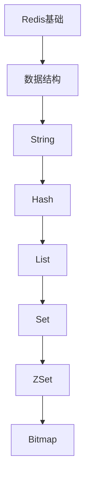

# Redis 学习指南

> **分类**：数据存储 ｜ **章节总数**：120 ｜ **技术栈**：Redis 7

## 领域概述

Redis是数据存储领域的重要技术方向，本系列从基础到高级逐步深入，涵盖20个核心模块：Redis基础、数据结构、String、Hash、List等。每个知识点作为独立章节，包含原理讲解、实现要点、常见陷阱和最佳实践，配合源码分析和架构图，帮助读者建立完整的Redis知识体系。

本教程基于 **多种** 与 **Redis 7** 生态编写，涵盖 Redis Stack, Sentinel, Cluster 等主流工具与框架。每章独立成篇，文字精炼、逻辑清晰，适合系统学习与按需查阅。

## 你将学到什么

完成本系列后，你将能够：

- 系统理解 **Redis** 的核心概念与模块划分。
- 按难度递进掌握从入门到实战的完整知识路径。
- 在工程实践中做出合理的技术判断与问题排查。
- 通过章节索引快速定位所需知识点。

## 前置知识

- 编程基础
- 数据结构
- 计算机基础
- 数据存储基础概念

## 推荐学习路径

1. **Redis基础**
2. **数据结构**
3. **String**
4. **Hash**
5. **List**
6. **Set**
7. **ZSet**
8. **Bitmap**

## 模块体系

本领域按以下模块组织，难度由浅入深：

- **Redis基础**
- **数据结构**
- **String**
- **Hash**
- **List**
- **Set**
- **ZSet**
- **Bitmap**
- **HyperLogLog**
- **Geo**
- **Stream**
- **持久化**
- **主从复制**
- **哨兵**
- **集群**
- **缓存设计**
- **分布式锁**
- **限流**
- **性能优化**
- **Redis最佳实践**

## 难度分布

| 难度 | 章节数 | 占比 |
|------|--------|------|
| 入门 | 24 | 20% |
| 实战 | 24 | 20% |
| 进阶 | 36 | 30% |
| 高级 | 36 | 30% |

## 章节索引

点击章节标题进入对应教程：

### Redis基础

- [Redis基础核心概念与原理](chapters/001-Redis基础核心概念与原理.md) ｜ 入门
- [Redis基础的实现机制详解](chapters/002-Redis基础的实现机制详解.md) ｜ 入门
- [Redis基础的关键技术点](chapters/003-Redis基础的关键技术点.md) ｜ 入门
- [Redis基础的源码级分析](chapters/004-Redis基础的源码级分析.md) ｜ 入门
- [Redis基础的配置与使用](chapters/005-Redis基础的配置与使用.md) ｜ 入门
- [Redis基础的常见问题与解决方案](chapters/006-Redis基础的常见问题与解决方案.md) ｜ 入门

### 数据结构

- [数据结构核心概念与原理](chapters/007-数据结构核心概念与原理.md) ｜ 入门
- [数据结构的实现机制详解](chapters/008-数据结构的实现机制详解.md) ｜ 入门
- [数据结构的关键技术点](chapters/009-数据结构的关键技术点.md) ｜ 入门
- [数据结构的源码级分析](chapters/010-数据结构的源码级分析.md) ｜ 入门
- [数据结构的配置与使用](chapters/011-数据结构的配置与使用.md) ｜ 入门
- [数据结构的常见问题与解决方案](chapters/012-数据结构的常见问题与解决方案.md) ｜ 入门

### String

- [String核心概念与原理](chapters/013-String核心概念与原理.md) ｜ 入门
- [String的实现机制详解](chapters/014-String的实现机制详解.md) ｜ 入门
- [String的关键技术点](chapters/015-String的关键技术点.md) ｜ 入门
- [String的源码级分析](chapters/016-String的源码级分析.md) ｜ 入门
- [String的配置与使用](chapters/017-String的配置与使用.md) ｜ 入门
- [String的常见问题与解决方案](chapters/018-String的常见问题与解决方案.md) ｜ 入门

### Hash

- [Hash核心概念与原理](chapters/019-Hash核心概念与原理.md) ｜ 入门
- [Hash的实现机制详解](chapters/020-Hash的实现机制详解.md) ｜ 入门
- [Hash的关键技术点](chapters/021-Hash的关键技术点.md) ｜ 入门
- [Hash的源码级分析](chapters/022-Hash的源码级分析.md) ｜ 入门
- [Hash的配置与使用](chapters/023-Hash的配置与使用.md) ｜ 入门
- [Hash的常见问题与解决方案](chapters/024-Hash的常见问题与解决方案.md) ｜ 入门

### List

- [List核心概念与原理](chapters/025-List核心概念与原理.md) ｜ 进阶
- [List的实现机制详解](chapters/026-List的实现机制详解.md) ｜ 进阶
- [List的关键技术点](chapters/027-List的关键技术点.md) ｜ 进阶
- [List的源码级分析](chapters/028-List的源码级分析.md) ｜ 进阶
- [List的配置与使用](chapters/029-List的配置与使用.md) ｜ 进阶
- [List的常见问题与解决方案](chapters/030-List的常见问题与解决方案.md) ｜ 进阶

### Set

- [Set核心概念与原理](chapters/031-Set核心概念与原理.md) ｜ 进阶
- [Set的实现机制详解](chapters/032-Set的实现机制详解.md) ｜ 进阶
- [Set的关键技术点](chapters/033-Set的关键技术点.md) ｜ 进阶
- [Set的源码级分析](chapters/034-Set的源码级分析.md) ｜ 进阶
- [Set的配置与使用](chapters/035-Set的配置与使用.md) ｜ 进阶
- [Set的常见问题与解决方案](chapters/036-Set的常见问题与解决方案.md) ｜ 进阶

### ZSet

- [ZSet核心概念与原理](chapters/037-ZSet核心概念与原理.md) ｜ 进阶
- [ZSet的实现机制详解](chapters/038-ZSet的实现机制详解.md) ｜ 进阶
- [ZSet的关键技术点](chapters/039-ZSet的关键技术点.md) ｜ 进阶
- [ZSet的源码级分析](chapters/040-ZSet的源码级分析.md) ｜ 进阶
- [ZSet的配置与使用](chapters/041-ZSet的配置与使用.md) ｜ 进阶
- [ZSet的常见问题与解决方案](chapters/042-ZSet的常见问题与解决方案.md) ｜ 进阶

### Bitmap

- [Bitmap核心概念与原理](chapters/043-Bitmap核心概念与原理.md) ｜ 进阶
- [Bitmap的实现机制详解](chapters/044-Bitmap的实现机制详解.md) ｜ 进阶
- [Bitmap的关键技术点](chapters/045-Bitmap的关键技术点.md) ｜ 进阶
- [Bitmap的源码级分析](chapters/046-Bitmap的源码级分析.md) ｜ 进阶
- [Bitmap的配置与使用](chapters/047-Bitmap的配置与使用.md) ｜ 进阶
- [Bitmap的常见问题与解决方案](chapters/048-Bitmap的常见问题与解决方案.md) ｜ 进阶

### HyperLogLog

- [HyperLogLog核心概念与原理](chapters/049-HyperLogLog核心概念与原理.md) ｜ 进阶
- [HyperLogLog的实现机制详解](chapters/050-HyperLogLog的实现机制详解.md) ｜ 进阶
- [HyperLogLog的关键技术点](chapters/051-HyperLogLog的关键技术点.md) ｜ 进阶
- [HyperLogLog的源码级分析](chapters/052-HyperLogLog的源码级分析.md) ｜ 进阶
- [HyperLogLog的配置与使用](chapters/053-HyperLogLog的配置与使用.md) ｜ 进阶
- [HyperLogLog的常见问题与解决方案](chapters/054-HyperLogLog的常见问题与解决方案.md) ｜ 进阶

### Geo

- [Geo核心概念与原理](chapters/055-Geo核心概念与原理.md) ｜ 进阶
- [Geo的实现机制详解](chapters/056-Geo的实现机制详解.md) ｜ 进阶
- [Geo的关键技术点](chapters/057-Geo的关键技术点.md) ｜ 进阶
- [Geo的源码级分析](chapters/058-Geo的源码级分析.md) ｜ 进阶
- [Geo的配置与使用](chapters/059-Geo的配置与使用.md) ｜ 进阶
- [Geo的常见问题与解决方案](chapters/060-Geo的常见问题与解决方案.md) ｜ 进阶

### Stream

- [Stream核心概念与原理](chapters/061-Stream核心概念与原理.md) ｜ 高级
- [Stream的实现机制详解](chapters/062-Stream的实现机制详解.md) ｜ 高级
- [Stream的关键技术点](chapters/063-Stream的关键技术点.md) ｜ 高级
- [Stream的源码级分析](chapters/064-Stream的源码级分析.md) ｜ 高级
- [Stream的配置与使用](chapters/065-Stream的配置与使用.md) ｜ 高级
- [Stream的常见问题与解决方案](chapters/066-Stream的常见问题与解决方案.md) ｜ 高级

### 持久化

- [持久化核心概念与原理](chapters/067-持久化核心概念与原理.md) ｜ 高级
- [持久化的实现机制详解](chapters/068-持久化的实现机制详解.md) ｜ 高级
- [持久化的关键技术点](chapters/069-持久化的关键技术点.md) ｜ 高级
- [持久化的源码级分析](chapters/070-持久化的源码级分析.md) ｜ 高级
- [持久化的配置与使用](chapters/071-持久化的配置与使用.md) ｜ 高级
- [持久化的常见问题与解决方案](chapters/072-持久化的常见问题与解决方案.md) ｜ 高级

### 主从复制

- [主从复制核心概念与原理](chapters/073-主从复制核心概念与原理.md) ｜ 高级
- [主从复制的实现机制详解](chapters/074-主从复制的实现机制详解.md) ｜ 高级
- [主从复制的关键技术点](chapters/075-主从复制的关键技术点.md) ｜ 高级
- [主从复制的源码级分析](chapters/076-主从复制的源码级分析.md) ｜ 高级
- [主从复制的配置与使用](chapters/077-主从复制的配置与使用.md) ｜ 高级
- [主从复制的常见问题与解决方案](chapters/078-主从复制的常见问题与解决方案.md) ｜ 高级

### 哨兵

- [哨兵核心概念与原理](chapters/079-哨兵核心概念与原理.md) ｜ 高级
- [哨兵的实现机制详解](chapters/080-哨兵的实现机制详解.md) ｜ 高级
- [哨兵的关键技术点](chapters/081-哨兵的关键技术点.md) ｜ 高级
- [哨兵的源码级分析](chapters/082-哨兵的源码级分析.md) ｜ 高级
- [哨兵的配置与使用](chapters/083-哨兵的配置与使用.md) ｜ 高级
- [哨兵的常见问题与解决方案](chapters/084-哨兵的常见问题与解决方案.md) ｜ 高级

### 集群

- [集群核心概念与原理](chapters/085-集群核心概念与原理.md) ｜ 高级
- [集群的实现机制详解](chapters/086-集群的实现机制详解.md) ｜ 高级
- [集群的关键技术点](chapters/087-集群的关键技术点.md) ｜ 高级
- [集群的源码级分析](chapters/088-集群的源码级分析.md) ｜ 高级
- [集群的配置与使用](chapters/089-集群的配置与使用.md) ｜ 高级
- [集群的常见问题与解决方案](chapters/090-集群的常见问题与解决方案.md) ｜ 高级

### 缓存设计

- [缓存设计核心概念与原理](chapters/091-缓存设计核心概念与原理.md) ｜ 高级
- [缓存设计的实现机制详解](chapters/092-缓存设计的实现机制详解.md) ｜ 高级
- [缓存设计的关键技术点](chapters/093-缓存设计的关键技术点.md) ｜ 高级
- [缓存设计的源码级分析](chapters/094-缓存设计的源码级分析.md) ｜ 高级
- [缓存设计的配置与使用](chapters/095-缓存设计的配置与使用.md) ｜ 高级
- [缓存设计的常见问题与解决方案](chapters/096-缓存设计的常见问题与解决方案.md) ｜ 高级

### 分布式锁

- [分布式锁核心概念与原理](chapters/097-分布式锁核心概念与原理.md) ｜ 实战
- [分布式锁的实现机制详解](chapters/098-分布式锁的实现机制详解.md) ｜ 实战
- [分布式锁的关键技术点](chapters/099-分布式锁的关键技术点.md) ｜ 实战
- [分布式锁的源码级分析](chapters/100-分布式锁的源码级分析.md) ｜ 实战
- [分布式锁的配置与使用](chapters/101-分布式锁的配置与使用.md) ｜ 实战
- [分布式锁的常见问题与解决方案](chapters/102-分布式锁的常见问题与解决方案.md) ｜ 实战

### 限流

- [限流核心概念与原理](chapters/103-限流核心概念与原理.md) ｜ 实战
- [限流的实现机制详解](chapters/104-限流的实现机制详解.md) ｜ 实战
- [限流的关键技术点](chapters/105-限流的关键技术点.md) ｜ 实战
- [限流的源码级分析](chapters/106-限流的源码级分析.md) ｜ 实战
- [限流的配置与使用](chapters/107-限流的配置与使用.md) ｜ 实战
- [限流的常见问题与解决方案](chapters/108-限流的常见问题与解决方案.md) ｜ 实战

### 性能优化

- [性能优化核心概念与原理](chapters/109-性能优化核心概念与原理.md) ｜ 实战
- [性能优化的实现机制详解](chapters/110-性能优化的实现机制详解.md) ｜ 实战
- [性能优化的关键技术点](chapters/111-性能优化的关键技术点.md) ｜ 实战
- [性能优化的源码级分析](chapters/112-性能优化的源码级分析.md) ｜ 实战
- [性能优化的配置与使用](chapters/113-性能优化的配置与使用.md) ｜ 实战
- [性能优化的常见问题与解决方案](chapters/114-性能优化的常见问题与解决方案.md) ｜ 实战

### Redis最佳实践

- [Redis最佳实践核心概念与原理](chapters/115-Redis最佳实践核心概念与原理.md) ｜ 实战
- [Redis最佳实践的实现机制详解](chapters/116-Redis最佳实践的实现机制详解.md) ｜ 实战
- [Redis最佳实践的关键技术点](chapters/117-Redis最佳实践的关键技术点.md) ｜ 实战
- [Redis最佳实践的源码级分析](chapters/118-Redis最佳实践的源码级分析.md) ｜ 实战
- [Redis最佳实践的配置与使用](chapters/119-Redis最佳实践的配置与使用.md) ｜ 实战
- [Redis最佳实践的常见问题与解决方案](chapters/120-Redis最佳实践的常见问题与解决方案.md) ｜ 实战

## 学习方法建议

1. **先读概述再读章节**：用本指南建立全局地图，避免迷失在细节中。
2. **按模块递进**：同一模块内章节有前后关联，顺序阅读效果更好。
3. **主动复述**：每章读完后，用三五句话概括「是什么、为什么、怎么用」。
4. **关联阅读**：利用章节底部的「延伸学习」在同模块内构建知识网络。
5. **对照官方文档**：本教程提供结构化视角，细节以官方文档为准。

---
*领域: Redis ｜ 版本: 2.0 ｜ 共 120 章*