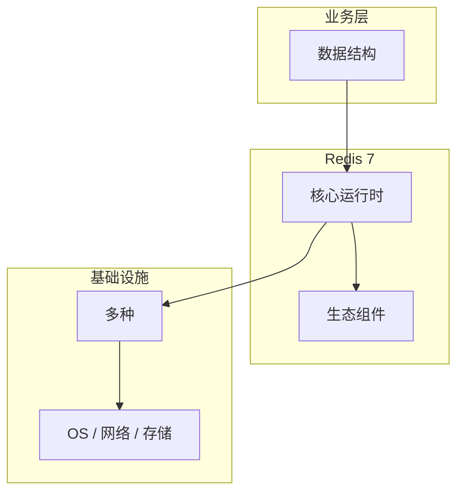

# 数据结构的实现机制详解

> **领域**：Redis ｜ **模块**：数据结构 ｜ **难度**：入门 ｜ **类型**：实现机制

## 导读

本章系统讲解 **Redis** 中 **数据结构** 的相关知识（实现机制）。本章聚焦 **数据结构** 的内部实现路径与关键数据结构，帮助从 API 用法深入到机制层。内容基于主流框架与工程实践撰写，不依赖过时概念堆砌。

## 核心知识

Redis 基于 **SDS**、**dict**、**quicklist**、**skiplist+dict** 等底层结构实现对外 API。所有操作在主线程单线程执行，保证命令原子性；6.0+ 多 IO 线程仅处理网络读写。

### 核心知识

**1. SDS 与 String**

简单动态字符串记录 len/free，O(1) 取长度；二进制安全，可存图片序列化。

**2. quicklist 与 List**

3.2+ List 为 ziplist 与 linkedlist 结合的 quicklist，平衡内存与插入性能。

**3. skiplist 与 ZSet**

有序集合同时维护 dict（member→score）与 skiplist（按 score 排序），范围查询 O(log N + M)。

## 架构与流程

## 技术详解

### 实现机制

命令表 `redisCommand` 绑定 proc 函数；事件循环 aeEventLoop 处理可读可写事件。

## 原理与实现

### 工作机制

命令表 `redisCommand` 绑定 proc 函数；事件循环 aeEventLoop 处理可读可写事件。

### 内部实现

对象系统 `redisObject` 含 type、encoding、ptr；encoding 随数据量自动转换（如 int→raw→embstr）。

## 性能、安全与排查

### 性能优化

大 key 拆分；避免 O(N) 命令阻塞主线程（KEYS、SMEMBERS 大集合）。

## 本章聚焦

阅读 **数据结构** 实现时，建议对照调用栈画出数据流：入口 API → 核心数据结构 → 系统调用或 I/O 边界，标注锁与共享状态位置。

### 常见误区与纠正

**热 key 单线程瓶颈**

单 key QPS 有上限，可用本地缓存或多副本拆分。

### 最佳实践

1. 用 SCAN 代替 KEYS
2. 监控 slowlog
3. 合理选择 encoding

## 巩固建议

建议结合 **Redis** 官方文档与小型实验，亲手验证 **数据结构** 的默认行为与边界条件；将本章要点整理为检查清单或 ADR，便于评审与团队 onboarding。

### 本章小结

学完本章，你应能独立说明 **数据结构** 在 Redis 中的角色，理解其核心机制，规避常见误区，并在项目中正确运用。

## 延伸学习

- 数据结构核心概念与原理
- 数据结构的关键技术点
- 数据结构的源码级分析
- 数据结构的配置与使用
- 数据结构的常见问题与解决方案

### 延伸阅读

- Redis 设计与实现
- Redis 官方命令文档

---
*章节 ID: 008 ｜ 领域: Redis*