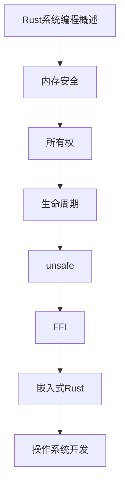

# Rust系统编程 学习指南

> **分类**：其他 ｜ **技术生态**：cargo, no_std, bindgen, wasm-pack, tokio, embedded-hal

## 领域定位

Rust 系统编程将内存安全与零成本抽象结合，适合操作系统、嵌入式、WebAssembly 与高性能服务。所有权、生命周期与 unsafe 块是系统级开发的核心概念。

面向有系统编程经验的开发者，深入 Rust 内存模型与 FFI。

本领域常用技术栈与工具包括：cargo, no_std, bindgen, wasm-pack, tokio, embedded-hal。

## 学习目标

- 在系统级代码中正确使用 unsafe 与 FFI
- 开发嵌入式 Rust 应用与驱动接口
- 编译 WebAssembly 模块供浏览器调用
- 参与操作系统或底层库的开源贡献

## 前置知识

- Rust 语言基础
- C 语言
- 操作系统
- 计算机体系结构

## 学习路径

1. **Rust系统编程概述**
2. **内存安全**
3. **所有权**
4. **生命周期**
5. **unsafe**
6. **FFI**
7. **嵌入式Rust**
8. **操作系统开发**

## 模块体系

- **Rust系统编程概述**
- **内存安全**
- **所有权**
- **生命周期**
- **unsafe**
- **FFI**
- **嵌入式Rust**
- **操作系统开发**
- **WebAssembly**
- **Rust系统编程最佳实践**

## 难度分布

| 入门 | 10 | 20% |
| 实战 | 10 | 20% |
| 进阶 | 15 | 30% |
| 高级 | 15 | 30% |

## 章节索引

### Rust系统编程概述

- [Rust系统编程概述核心概念与原理](chapters/001-Rust系统编程概述核心概念与原理.md) ｜ 入门
- [Rust系统编程概述的实现机制详解](chapters/002-Rust系统编程概述的实现机制详解.md) ｜ 入门
- [Rust系统编程概述的关键技术点](chapters/003-Rust系统编程概述的关键技术点.md) ｜ 入门
- [Rust系统编程概述的源码级分析](chapters/004-Rust系统编程概述的源码级分析.md) ｜ 入门
- [Rust系统编程概述的配置与使用](chapters/005-Rust系统编程概述的配置与使用.md) ｜ 入门

### 内存安全

- [内存安全核心概念与原理](chapters/006-内存安全核心概念与原理.md) ｜ 入门
- [内存安全的实现机制详解](chapters/007-内存安全的实现机制详解.md) ｜ 入门
- [内存安全的关键技术点](chapters/008-内存安全的关键技术点.md) ｜ 入门
- [内存安全的源码级分析](chapters/009-内存安全的源码级分析.md) ｜ 入门
- [内存安全的配置与使用](chapters/010-内存安全的配置与使用.md) ｜ 入门

### 所有权

- [所有权核心概念与原理](chapters/011-所有权核心概念与原理.md) ｜ 进阶
- [所有权的实现机制详解](chapters/012-所有权的实现机制详解.md) ｜ 进阶
- [所有权的关键技术点](chapters/013-所有权的关键技术点.md) ｜ 进阶
- [所有权的源码级分析](chapters/014-所有权的源码级分析.md) ｜ 进阶
- [所有权的配置与使用](chapters/015-所有权的配置与使用.md) ｜ 进阶

### 生命周期

- [生命周期核心概念与原理](chapters/016-生命周期核心概念与原理.md) ｜ 进阶
- [生命周期的实现机制详解](chapters/017-生命周期的实现机制详解.md) ｜ 进阶
- [生命周期的关键技术点](chapters/018-生命周期的关键技术点.md) ｜ 进阶
- [生命周期的源码级分析](chapters/019-生命周期的源码级分析.md) ｜ 进阶
- [生命周期的配置与使用](chapters/020-生命周期的配置与使用.md) ｜ 进阶

### unsafe

- [unsafe核心概念与原理](chapters/021-unsafe核心概念与原理.md) ｜ 进阶
- [unsafe的实现机制详解](chapters/022-unsafe的实现机制详解.md) ｜ 进阶
- [unsafe的关键技术点](chapters/023-unsafe的关键技术点.md) ｜ 进阶
- [unsafe的源码级分析](chapters/024-unsafe的源码级分析.md) ｜ 进阶
- [unsafe的配置与使用](chapters/025-unsafe的配置与使用.md) ｜ 进阶

### FFI

- [FFI核心概念与原理](chapters/026-FFI核心概念与原理.md) ｜ 高级
- [FFI的实现机制详解](chapters/027-FFI的实现机制详解.md) ｜ 高级
- [FFI的关键技术点](chapters/028-FFI的关键技术点.md) ｜ 高级
- [FFI的源码级分析](chapters/029-FFI的源码级分析.md) ｜ 高级
- [FFI的配置与使用](chapters/030-FFI的配置与使用.md) ｜ 高级

### 嵌入式Rust

- [嵌入式Rust核心概念与原理](chapters/031-嵌入式Rust核心概念与原理.md) ｜ 高级
- [嵌入式Rust的实现机制详解](chapters/032-嵌入式Rust的实现机制详解.md) ｜ 高级
- [嵌入式Rust的关键技术点](chapters/033-嵌入式Rust的关键技术点.md) ｜ 高级
- [嵌入式Rust的源码级分析](chapters/034-嵌入式Rust的源码级分析.md) ｜ 高级
- [嵌入式Rust的配置与使用](chapters/035-嵌入式Rust的配置与使用.md) ｜ 高级

### 操作系统开发

- [操作系统开发核心概念与原理](chapters/036-操作系统开发核心概念与原理.md) ｜ 高级
- [操作系统开发的实现机制详解](chapters/037-操作系统开发的实现机制详解.md) ｜ 高级
- [操作系统开发的关键技术点](chapters/038-操作系统开发的关键技术点.md) ｜ 高级
- [操作系统开发的源码级分析](chapters/039-操作系统开发的源码级分析.md) ｜ 高级
- [操作系统开发的配置与使用](chapters/040-操作系统开发的配置与使用.md) ｜ 高级

### WebAssembly

- [WebAssembly核心概念与原理](chapters/041-WebAssembly核心概念与原理.md) ｜ 实战
- [WebAssembly的实现机制详解](chapters/042-WebAssembly的实现机制详解.md) ｜ 实战
- [WebAssembly的关键技术点](chapters/043-WebAssembly的关键技术点.md) ｜ 实战
- [WebAssembly的源码级分析](chapters/044-WebAssembly的源码级分析.md) ｜ 实战
- [WebAssembly的配置与使用](chapters/045-WebAssembly的配置与使用.md) ｜ 实战

### Rust系统编程最佳实践

- [Rust系统编程最佳实践核心概念与原理](chapters/046-Rust系统编程最佳实践核心概念与原理.md) ｜ 实战
- [Rust系统编程最佳实践的实现机制详解](chapters/047-Rust系统编程最佳实践的实现机制详解.md) ｜ 实战
- [Rust系统编程最佳实践的关键技术点](chapters/048-Rust系统编程最佳实践的关键技术点.md) ｜ 实战
- [Rust系统编程最佳实践的源码级分析](chapters/049-Rust系统编程最佳实践的源码级分析.md) ｜ 实战
- [Rust系统编程最佳实践的配置与使用](chapters/050-Rust系统编程最佳实践的配置与使用.md) ｜ 实战

---
*领域: Rust系统编程*