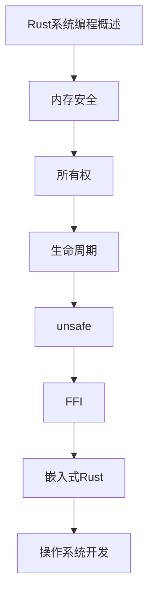

# Rust系统编程 学习指南

> **分类**：其他 ｜ **章节总数**：50 ｜ **技术栈**：Rust

## 领域概述

Rust系统编程是其他领域的重要技术方向，本系列从基础到高级逐步深入，涵盖10个核心模块：Rust系统编程概述、内存安全、所有权、生命周期、unsafe等。每个知识点作为独立章节，包含原理讲解、实现要点、常见陷阱和最佳实践，配合源码分析和架构图，帮助读者建立完整的Rust系统编程知识体系。

本教程基于 **Rust** 与 **Rust** 生态编写，涵盖 libc, nix, bindgen 等主流工具与框架。每章独立成篇，文字精炼、逻辑清晰，适合系统学习与按需查阅。

## 你将学到什么

完成本系列后，你将能够：

- 系统理解 **Rust系统编程** 的核心概念与模块划分。
- 按难度递进掌握从入门到实战的完整知识路径。
- 在工程实践中做出合理的技术判断与问题排查。
- 通过章节索引快速定位所需知识点。

## 前置知识

- 编程基础
- 数据结构
- 计算机基础
- 其他基础概念

## 推荐学习路径

1. **Rust系统编程概述**
2. **内存安全**
3. **所有权**
4. **生命周期**
5. **unsafe**
6. **FFI**
7. **嵌入式Rust**
8. **操作系统开发**

## 模块体系

本领域按以下模块组织，难度由浅入深：

- **Rust系统编程概述**
- **内存安全**
- **所有权**
- **生命周期**
- **unsafe**
- **FFI**
- **嵌入式Rust**
- **操作系统开发**
- **WebAssembly**
- **Rust系统编程最佳实践**

## 难度分布

| 难度 | 章节数 | 占比 |
|------|--------|------|
| 入门 | 10 | 20% |
| 实战 | 10 | 20% |
| 进阶 | 15 | 30% |
| 高级 | 15 | 30% |

## 章节索引

点击章节标题进入对应教程：

### Rust系统编程概述

- [Rust系统编程概述核心概念与原理](chapters/001-Rust系统编程概述核心概念与原理.md) ｜ 入门
- [Rust系统编程概述的实现机制详解](chapters/002-Rust系统编程概述的实现机制详解.md) ｜ 入门
- [Rust系统编程概述的关键技术点](chapters/003-Rust系统编程概述的关键技术点.md) ｜ 入门
- [Rust系统编程概述的源码级分析](chapters/004-Rust系统编程概述的源码级分析.md) ｜ 入门
- [Rust系统编程概述的配置与使用](chapters/005-Rust系统编程概述的配置与使用.md) ｜ 入门

### 内存安全

- [内存安全核心概念与原理](chapters/006-内存安全核心概念与原理.md) ｜ 入门
- [内存安全的实现机制详解](chapters/007-内存安全的实现机制详解.md) ｜ 入门
- [内存安全的关键技术点](chapters/008-内存安全的关键技术点.md) ｜ 入门
- [内存安全的源码级分析](chapters/009-内存安全的源码级分析.md) ｜ 入门
- [内存安全的配置与使用](chapters/010-内存安全的配置与使用.md) ｜ 入门

### 所有权

- [所有权核心概念与原理](chapters/011-所有权核心概念与原理.md) ｜ 进阶
- [所有权的实现机制详解](chapters/012-所有权的实现机制详解.md) ｜ 进阶
- [所有权的关键技术点](chapters/013-所有权的关键技术点.md) ｜ 进阶
- [所有权的源码级分析](chapters/014-所有权的源码级分析.md) ｜ 进阶
- [所有权的配置与使用](chapters/015-所有权的配置与使用.md) ｜ 进阶

### 生命周期

- [生命周期核心概念与原理](chapters/016-生命周期核心概念与原理.md) ｜ 进阶
- [生命周期的实现机制详解](chapters/017-生命周期的实现机制详解.md) ｜ 进阶
- [生命周期的关键技术点](chapters/018-生命周期的关键技术点.md) ｜ 进阶
- [生命周期的源码级分析](chapters/019-生命周期的源码级分析.md) ｜ 进阶
- [生命周期的配置与使用](chapters/020-生命周期的配置与使用.md) ｜ 进阶

### unsafe

- [unsafe核心概念与原理](chapters/021-unsafe核心概念与原理.md) ｜ 进阶
- [unsafe的实现机制详解](chapters/022-unsafe的实现机制详解.md) ｜ 进阶
- [unsafe的关键技术点](chapters/023-unsafe的关键技术点.md) ｜ 进阶
- [unsafe的源码级分析](chapters/024-unsafe的源码级分析.md) ｜ 进阶
- [unsafe的配置与使用](chapters/025-unsafe的配置与使用.md) ｜ 进阶

### FFI

- [FFI核心概念与原理](chapters/026-FFI核心概念与原理.md) ｜ 高级
- [FFI的实现机制详解](chapters/027-FFI的实现机制详解.md) ｜ 高级
- [FFI的关键技术点](chapters/028-FFI的关键技术点.md) ｜ 高级
- [FFI的源码级分析](chapters/029-FFI的源码级分析.md) ｜ 高级
- [FFI的配置与使用](chapters/030-FFI的配置与使用.md) ｜ 高级

### 嵌入式Rust

- [嵌入式Rust核心概念与原理](chapters/031-嵌入式Rust核心概念与原理.md) ｜ 高级
- [嵌入式Rust的实现机制详解](chapters/032-嵌入式Rust的实现机制详解.md) ｜ 高级
- [嵌入式Rust的关键技术点](chapters/033-嵌入式Rust的关键技术点.md) ｜ 高级
- [嵌入式Rust的源码级分析](chapters/034-嵌入式Rust的源码级分析.md) ｜ 高级
- [嵌入式Rust的配置与使用](chapters/035-嵌入式Rust的配置与使用.md) ｜ 高级

### 操作系统开发

- [操作系统开发核心概念与原理](chapters/036-操作系统开发核心概念与原理.md) ｜ 高级
- [操作系统开发的实现机制详解](chapters/037-操作系统开发的实现机制详解.md) ｜ 高级
- [操作系统开发的关键技术点](chapters/038-操作系统开发的关键技术点.md) ｜ 高级
- [操作系统开发的源码级分析](chapters/039-操作系统开发的源码级分析.md) ｜ 高级
- [操作系统开发的配置与使用](chapters/040-操作系统开发的配置与使用.md) ｜ 高级

### WebAssembly

- [WebAssembly核心概念与原理](chapters/041-WebAssembly核心概念与原理.md) ｜ 实战
- [WebAssembly的实现机制详解](chapters/042-WebAssembly的实现机制详解.md) ｜ 实战
- [WebAssembly的关键技术点](chapters/043-WebAssembly的关键技术点.md) ｜ 实战
- [WebAssembly的源码级分析](chapters/044-WebAssembly的源码级分析.md) ｜ 实战
- [WebAssembly的配置与使用](chapters/045-WebAssembly的配置与使用.md) ｜ 实战

### Rust系统编程最佳实践

- [Rust系统编程最佳实践核心概念与原理](chapters/046-Rust系统编程最佳实践核心概念与原理.md) ｜ 实战
- [Rust系统编程最佳实践的实现机制详解](chapters/047-Rust系统编程最佳实践的实现机制详解.md) ｜ 实战
- [Rust系统编程最佳实践的关键技术点](chapters/048-Rust系统编程最佳实践的关键技术点.md) ｜ 实战
- [Rust系统编程最佳实践的源码级分析](chapters/049-Rust系统编程最佳实践的源码级分析.md) ｜ 实战
- [Rust系统编程最佳实践的配置与使用](chapters/050-Rust系统编程最佳实践的配置与使用.md) ｜ 实战

## 学习方法建议

1. **先读概述再读章节**：用本指南建立全局地图，避免迷失在细节中。
2. **按模块递进**：同一模块内章节有前后关联，顺序阅读效果更好。
3. **主动复述**：每章读完后，用三五句话概括「是什么、为什么、怎么用」。
4. **关联阅读**：利用章节底部的「延伸学习」在同模块内构建知识网络。
5. **对照官方文档**：本教程提供结构化视角，细节以官方文档为准。

---
*领域: Rust系统编程 ｜ 版本: 2.0 ｜ 共 50 章*