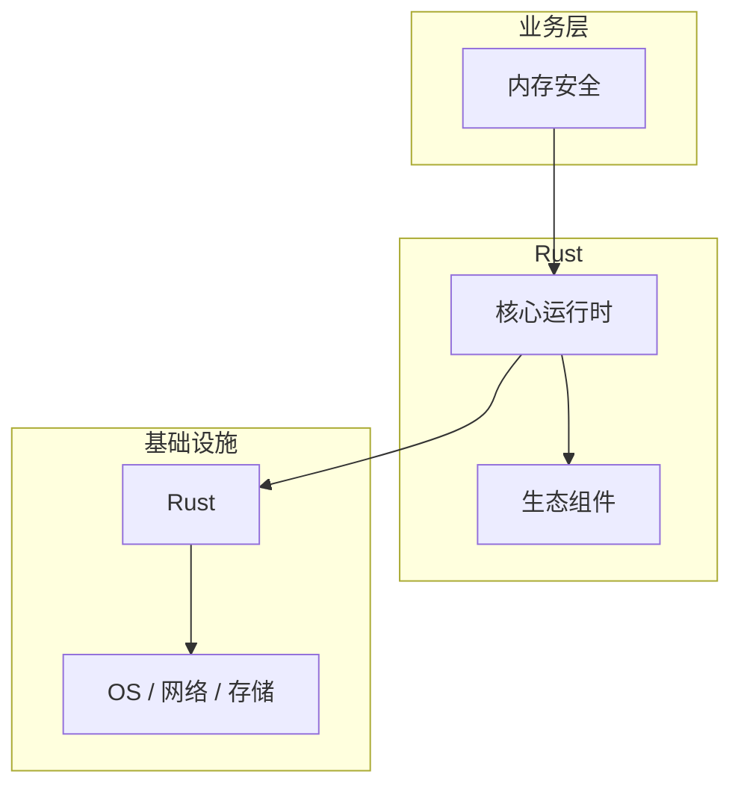

# 内存安全的关键技术点

> **领域**：Rust系统编程 ｜ **模块**：内存安全 ｜ **难度**：入门 ｜ **类型**：关键技术

## 导读

本章系统讲解 **Rust系统编程** 中 **内存安全** 的相关知识（关键技术）。本章归纳 **内存安全** 在生产环境中最常用、最易出错的关键技术点。内容基于主流框架与工程实践撰写，不依赖过时概念堆砌。

## 核心知识

**内存安全** 是 Rust系统编程 领域的核心主题。Rust 内存安全保证。本模块从原理与工程实践出发，帮助读者建立系统理解。

### 核心知识

**1. 编译期**

所有权系统编译期消除内存 bug。

**2. 无 GC**

无垃圾回收，确定性性能。

**3. 对比**

C 手动管理 vs Rust 编译器检查。

## 架构与流程

## 技术详解

### 关键技术

所有权规则 → 编译器检查 → 安全代码。

## 原理与实现

### 工作机制

所有权规则 → 编译器检查 → 安全代码。

### 内部实现

内存安全 的底层实现依赖 Rust系统编程 生态中的标准组件与协议，建议阅读官方规范文档。

## 操作流程与实践

### 操作流程

1. 理解 内存安全 概念 → 2. 学习标准用法 → 3. 动手实验 → 4. 分析案例 → 5. 总结最佳实践。

### 配置要点

配置 内存安全 时遵循官方推荐默认值，仅在理解影响后调整参数。

## 性能、安全与排查

### 性能优化

评估 内存安全 性能时建立基准测试，关注时间/空间复杂度或系统吞吐延迟指标。

### 安全注意

在 Rust系统编程 场景下注意输入校验、权限控制与敏感数据保护。

### 调试排错

排查 内存安全 问题时，结合日志、监控与最小复现用例逐步定位根因。

## 案例与选型

### 案例复盘

在典型 Rust系统编程 项目中，正确应用 内存安全 可显著提升系统质量与可维护性。

### 方案对比

选择 内存安全 方案时需对比多种替代方案的适用场景、性能与生态支持。

## 本章聚焦

**内存安全** 的关键技术往往集中在默认配置与边界行为；生产问题多源于「以为懂了」的细节，应用 checklist 逐项验证。

### 常见误区与纠正

**概念理解偏差**

对 内存安全 理解不全面导致误用，应回到官方文档重新梳理。

**忽视边界条件**

内存安全 在极端输入或高并发下行为可能不同，需充分测试。

**缺少监控**

未对 内存安全 关键指标监控，问题只能被动发现。

### 最佳实践

1. 遵循 Rust系统编程 领域 内存安全 的官方推荐实践
2. 为 内存安全 相关功能编写自动化测试
3. 关键配置纳入版本管理与变更审计
4. 生产部署前在接近真实环境验证

## 巩固建议

建议结合 **Rust系统编程** 官方文档与小型实验，亲手验证 **内存安全** 的默认行为与边界条件；将本章要点整理为检查清单或 ADR，便于评审与团队 onboarding。

### 本章小结

学完本章，你应能独立说明 **内存安全** 在 Rust系统编程 中的角色，理解其核心机制，规避常见误区，并在项目中正确运用。

## 延伸学习

- 内存安全核心概念与原理
- 内存安全的实现机制详解
- 内存安全的源码级分析
- 内存安全的配置与使用

### 延伸阅读

- Rust系统编程 官方文档 - 内存安全
- OWASP / NIST 相关指南（如适用）
- 权威书籍与 RFC 标准文档

---
*章节 ID: 008 ｜ 领域: Rust系统编程*