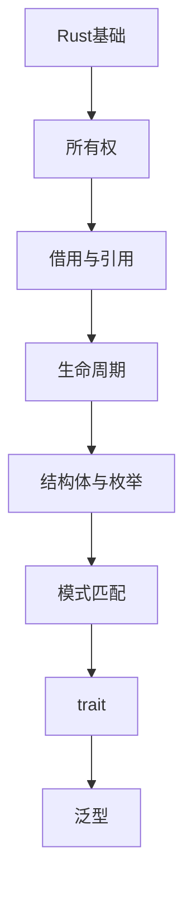

# Rust语言 学习指南

> **分类**：编程语言 ｜ **章节总数**：100 ｜ **技术栈**：Rust 2021

## 领域概述

Rust语言是编程语言领域的重要技术方向，本系列从基础到高级逐步深入，涵盖16个核心模块：Rust基础、所有权、借用与引用、生命周期、结构体与枚举等。每个知识点作为独立章节，包含原理讲解、实现要点、常见陷阱和最佳实践，配合源码分析和架构图，帮助读者建立完整的Rust语言知识体系。

本教程基于 **Rust** 与 **Rust 2021** 生态编写，涵盖 cargo, tokio, serde 等主流工具与框架。每章独立成篇，文字精炼、逻辑清晰，适合系统学习与按需查阅。

## 你将学到什么

完成本系列后，你将能够：

- 系统理解 **Rust语言** 的核心概念与模块划分。
- 按难度递进掌握从入门到实战的完整知识路径。
- 在工程实践中做出合理的技术判断与问题排查。
- 通过章节索引快速定位所需知识点。

## 前置知识

- 编程基础
- 数据结构
- 计算机基础
- 编程语言基础概念

## 推荐学习路径

1. **Rust基础**
2. **所有权**
3. **借用与引用**
4. **生命周期**
5. **结构体与枚举**
6. **模式匹配**
7. **trait**
8. **泛型**

## 模块体系

本领域按以下模块组织，难度由浅入深：

- **Rust基础**
- **所有权**
- **借用与引用**
- **生命周期**
- **结构体与枚举**
- **模式匹配**
- **trait**
- **泛型**
- **错误处理**
- **集合**
- **模块与包**
- **闭包与迭代器**
- **智能指针**
- **并发安全**
- **异步编程**
- **Rust最佳实践**

## 难度分布

| 难度 | 章节数 | 占比 |
|------|--------|------|
| 入门 | 21 | 21% |
| 实战 | 24 | 24% |
| 进阶 | 31 | 31% |
| 高级 | 24 | 24% |

## 章节索引

点击章节标题进入对应教程：

### Rust基础

- [Rust基础核心概念与原理](chapters/001-Rust基础核心概念与原理.md) ｜ 入门
- [Rust基础的实现机制详解](chapters/002-Rust基础的实现机制详解.md) ｜ 入门
- [Rust基础的关键技术点](chapters/003-Rust基础的关键技术点.md) ｜ 入门
- [Rust基础的源码级分析](chapters/004-Rust基础的源码级分析.md) ｜ 入门
- [Rust基础的配置与使用](chapters/005-Rust基础的配置与使用.md) ｜ 入门
- [Rust基础的常见问题与解决方案](chapters/006-Rust基础的常见问题与解决方案.md) ｜ 入门
- [Rust基础的性能优化技巧](chapters/007-Rust基础的性能优化技巧.md) ｜ 入门

### 所有权

- [所有权核心概念与原理](chapters/008-所有权核心概念与原理.md) ｜ 入门
- [所有权的实现机制详解](chapters/009-所有权的实现机制详解.md) ｜ 入门
- [所有权的关键技术点](chapters/010-所有权的关键技术点.md) ｜ 入门
- [所有权的源码级分析](chapters/011-所有权的源码级分析.md) ｜ 入门
- [所有权的配置与使用](chapters/012-所有权的配置与使用.md) ｜ 入门
- [所有权的常见问题与解决方案](chapters/013-所有权的常见问题与解决方案.md) ｜ 入门
- [所有权的性能优化技巧](chapters/014-所有权的性能优化技巧.md) ｜ 入门

### 借用与引用

- [借用与引用核心概念与原理](chapters/015-借用与引用核心概念与原理.md) ｜ 入门
- [借用与引用的实现机制详解](chapters/016-借用与引用的实现机制详解.md) ｜ 入门
- [借用与引用的关键技术点](chapters/017-借用与引用的关键技术点.md) ｜ 入门
- [借用与引用的源码级分析](chapters/018-借用与引用的源码级分析.md) ｜ 入门
- [借用与引用的配置与使用](chapters/019-借用与引用的配置与使用.md) ｜ 入门
- [借用与引用的常见问题与解决方案](chapters/020-借用与引用的常见问题与解决方案.md) ｜ 入门
- [借用与引用的性能优化技巧](chapters/021-借用与引用的性能优化技巧.md) ｜ 入门

### 生命周期

- [生命周期核心概念与原理](chapters/022-生命周期核心概念与原理.md) ｜ 进阶
- [生命周期的实现机制详解](chapters/023-生命周期的实现机制详解.md) ｜ 进阶
- [生命周期的关键技术点](chapters/024-生命周期的关键技术点.md) ｜ 进阶
- [生命周期的源码级分析](chapters/025-生命周期的源码级分析.md) ｜ 进阶
- [生命周期的配置与使用](chapters/026-生命周期的配置与使用.md) ｜ 进阶
- [生命周期的常见问题与解决方案](chapters/027-生命周期的常见问题与解决方案.md) ｜ 进阶
- [生命周期的性能优化技巧](chapters/028-生命周期的性能优化技巧.md) ｜ 进阶

### 结构体与枚举

- [结构体与枚举核心概念与原理](chapters/029-结构体与枚举核心概念与原理.md) ｜ 进阶
- [结构体与枚举的实现机制详解](chapters/030-结构体与枚举的实现机制详解.md) ｜ 进阶
- [结构体与枚举的关键技术点](chapters/031-结构体与枚举的关键技术点.md) ｜ 进阶
- [结构体与枚举的源码级分析](chapters/032-结构体与枚举的源码级分析.md) ｜ 进阶
- [结构体与枚举的配置与使用](chapters/033-结构体与枚举的配置与使用.md) ｜ 进阶
- [结构体与枚举的常见问题与解决方案](chapters/034-结构体与枚举的常见问题与解决方案.md) ｜ 进阶

### 模式匹配

- [模式匹配核心概念与原理](chapters/035-模式匹配核心概念与原理.md) ｜ 进阶
- [模式匹配的实现机制详解](chapters/036-模式匹配的实现机制详解.md) ｜ 进阶
- [模式匹配的关键技术点](chapters/037-模式匹配的关键技术点.md) ｜ 进阶
- [模式匹配的源码级分析](chapters/038-模式匹配的源码级分析.md) ｜ 进阶
- [模式匹配的配置与使用](chapters/039-模式匹配的配置与使用.md) ｜ 进阶
- [模式匹配的常见问题与解决方案](chapters/040-模式匹配的常见问题与解决方案.md) ｜ 进阶

### trait

- [trait核心概念与原理](chapters/041-trait核心概念与原理.md) ｜ 进阶
- [trait的实现机制详解](chapters/042-trait的实现机制详解.md) ｜ 进阶
- [trait的关键技术点](chapters/043-trait的关键技术点.md) ｜ 进阶
- [trait的源码级分析](chapters/044-trait的源码级分析.md) ｜ 进阶
- [trait的配置与使用](chapters/045-trait的配置与使用.md) ｜ 进阶
- [trait的常见问题与解决方案](chapters/046-trait的常见问题与解决方案.md) ｜ 进阶

### 泛型

- [泛型核心概念与原理](chapters/047-泛型核心概念与原理.md) ｜ 进阶
- [泛型的实现机制详解](chapters/048-泛型的实现机制详解.md) ｜ 进阶
- [泛型的关键技术点](chapters/049-泛型的关键技术点.md) ｜ 进阶
- [泛型的源码级分析](chapters/050-泛型的源码级分析.md) ｜ 进阶
- [泛型的配置与使用](chapters/051-泛型的配置与使用.md) ｜ 进阶
- [泛型的常见问题与解决方案](chapters/052-泛型的常见问题与解决方案.md) ｜ 进阶

### 错误处理

- [错误处理核心概念与原理](chapters/053-错误处理核心概念与原理.md) ｜ 高级
- [错误处理的实现机制详解](chapters/054-错误处理的实现机制详解.md) ｜ 高级
- [错误处理的关键技术点](chapters/055-错误处理的关键技术点.md) ｜ 高级
- [错误处理的源码级分析](chapters/056-错误处理的源码级分析.md) ｜ 高级
- [错误处理的配置与使用](chapters/057-错误处理的配置与使用.md) ｜ 高级
- [错误处理的常见问题与解决方案](chapters/058-错误处理的常见问题与解决方案.md) ｜ 高级

### 集合

- [集合核心概念与原理](chapters/059-集合核心概念与原理.md) ｜ 高级
- [集合的实现机制详解](chapters/060-集合的实现机制详解.md) ｜ 高级
- [集合的关键技术点](chapters/061-集合的关键技术点.md) ｜ 高级
- [集合的源码级分析](chapters/062-集合的源码级分析.md) ｜ 高级
- [集合的配置与使用](chapters/063-集合的配置与使用.md) ｜ 高级
- [集合的常见问题与解决方案](chapters/064-集合的常见问题与解决方案.md) ｜ 高级

### 模块与包

- [模块与包核心概念与原理](chapters/065-模块与包核心概念与原理.md) ｜ 高级
- [模块与包的实现机制详解](chapters/066-模块与包的实现机制详解.md) ｜ 高级
- [模块与包的关键技术点](chapters/067-模块与包的关键技术点.md) ｜ 高级
- [模块与包的源码级分析](chapters/068-模块与包的源码级分析.md) ｜ 高级
- [模块与包的配置与使用](chapters/069-模块与包的配置与使用.md) ｜ 高级
- [模块与包的常见问题与解决方案](chapters/070-模块与包的常见问题与解决方案.md) ｜ 高级

### 闭包与迭代器

- [闭包与迭代器核心概念与原理](chapters/071-闭包与迭代器核心概念与原理.md) ｜ 高级
- [闭包与迭代器的实现机制详解](chapters/072-闭包与迭代器的实现机制详解.md) ｜ 高级
- [闭包与迭代器的关键技术点](chapters/073-闭包与迭代器的关键技术点.md) ｜ 高级
- [闭包与迭代器的源码级分析](chapters/074-闭包与迭代器的源码级分析.md) ｜ 高级
- [闭包与迭代器的配置与使用](chapters/075-闭包与迭代器的配置与使用.md) ｜ 高级
- [闭包与迭代器的常见问题与解决方案](chapters/076-闭包与迭代器的常见问题与解决方案.md) ｜ 高级

### 智能指针

- [智能指针核心概念与原理](chapters/077-智能指针核心概念与原理.md) ｜ 实战
- [智能指针的实现机制详解](chapters/078-智能指针的实现机制详解.md) ｜ 实战
- [智能指针的关键技术点](chapters/079-智能指针的关键技术点.md) ｜ 实战
- [智能指针的源码级分析](chapters/080-智能指针的源码级分析.md) ｜ 实战
- [智能指针的配置与使用](chapters/081-智能指针的配置与使用.md) ｜ 实战
- [智能指针的常见问题与解决方案](chapters/082-智能指针的常见问题与解决方案.md) ｜ 实战

### 并发安全

- [并发安全核心概念与原理](chapters/083-并发安全核心概念与原理.md) ｜ 实战
- [并发安全的实现机制详解](chapters/084-并发安全的实现机制详解.md) ｜ 实战
- [并发安全的关键技术点](chapters/085-并发安全的关键技术点.md) ｜ 实战
- [并发安全的源码级分析](chapters/086-并发安全的源码级分析.md) ｜ 实战
- [并发安全的配置与使用](chapters/087-并发安全的配置与使用.md) ｜ 实战
- [并发安全的常见问题与解决方案](chapters/088-并发安全的常见问题与解决方案.md) ｜ 实战

### 异步编程

- [异步编程核心概念与原理](chapters/089-异步编程核心概念与原理.md) ｜ 实战
- [异步编程的实现机制详解](chapters/090-异步编程的实现机制详解.md) ｜ 实战
- [异步编程的关键技术点](chapters/091-异步编程的关键技术点.md) ｜ 实战
- [异步编程的源码级分析](chapters/092-异步编程的源码级分析.md) ｜ 实战
- [异步编程的配置与使用](chapters/093-异步编程的配置与使用.md) ｜ 实战
- [异步编程的常见问题与解决方案](chapters/094-异步编程的常见问题与解决方案.md) ｜ 实战

### Rust最佳实践

- [Rust最佳实践核心概念与原理](chapters/095-Rust最佳实践核心概念与原理.md) ｜ 实战
- [Rust最佳实践的实现机制详解](chapters/096-Rust最佳实践的实现机制详解.md) ｜ 实战
- [Rust最佳实践的关键技术点](chapters/097-Rust最佳实践的关键技术点.md) ｜ 实战
- [Rust最佳实践的源码级分析](chapters/098-Rust最佳实践的源码级分析.md) ｜ 实战
- [Rust最佳实践的配置与使用](chapters/099-Rust最佳实践的配置与使用.md) ｜ 实战
- [Rust最佳实践的常见问题与解决方案](chapters/100-Rust最佳实践的常见问题与解决方案.md) ｜ 实战

## 学习方法建议

1. **先读概述再读章节**：用本指南建立全局地图，避免迷失在细节中。
2. **按模块递进**：同一模块内章节有前后关联，顺序阅读效果更好。
3. **主动复述**：每章读完后，用三五句话概括「是什么、为什么、怎么用」。
4. **关联阅读**：利用章节底部的「延伸学习」在同模块内构建知识网络。
5. **对照官方文档**：本教程提供结构化视角，细节以官方文档为准。

---
*领域: Rust语言 ｜ 版本: 2.0 ｜ 共 100 章*