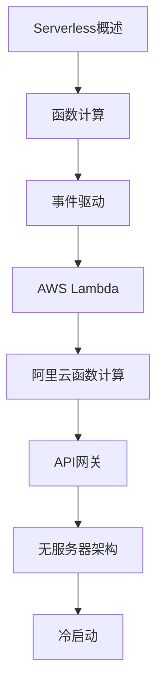

# Serverless 学习指南

> **分类**：后端开发 ｜ **章节总数**：80 ｜ **技术栈**：Serverless

## 领域概述

Serverless是后端开发领域的重要技术方向，本系列从基础到高级逐步深入，涵盖15个核心模块：Serverless概述、函数计算、事件驱动、AWS Lambda、阿里云函数计算等。每个知识点作为独立章节，包含原理讲解、实现要点、常见陷阱和最佳实践，配合源码分析和架构图，帮助读者建立完整的Serverless知识体系。

本教程基于 **通用** 与 **Serverless** 生态编写，涵盖 行业标准工具链 等主流工具与框架。每章独立成篇，文字精炼、逻辑清晰，适合系统学习与按需查阅。

## 你将学到什么

完成本系列后，你将能够：

- 系统理解 **Serverless** 的核心概念与模块划分。
- 按难度递进掌握从入门到实战的完整知识路径。
- 在工程实践中做出合理的技术判断与问题排查。
- 通过章节索引快速定位所需知识点。

## 前置知识

- 编程基础
- 数据结构
- 计算机基础
- 后端开发基础概念

## 推荐学习路径

1. **Serverless概述**
2. **函数计算**
3. **事件驱动**
4. **AWS Lambda**
5. **阿里云函数计算**
6. **API网关**
7. **无服务器架构**
8. **冷启动**

## 模块体系

本领域按以下模块组织，难度由浅入深：

- **Serverless概述**
- **函数计算**
- **事件驱动**
- **AWS Lambda**
- **阿里云函数计算**
- **API网关**
- **无服务器架构**
- **冷启动**
- **状态管理**
- **调试**
- **部署**
- **成本优化**
- **安全**
- **性能**
- **Serverless最佳实践**

## 难度分布

| 难度 | 章节数 | 占比 |
|------|--------|------|
| 入门 | 18 | 22% |
| 实战 | 15 | 18% |
| 进阶 | 22 | 27% |
| 高级 | 25 | 31% |

## 章节索引

点击章节标题进入对应教程：

### Serverless概述

- [Serverless概述核心概念与原理](chapters/001-Serverless概述核心概念与原理.md) ｜ 入门
- [Serverless概述的实现机制详解](chapters/002-Serverless概述的实现机制详解.md) ｜ 入门
- [Serverless概述的关键技术点](chapters/003-Serverless概述的关键技术点.md) ｜ 入门
- [Serverless概述的源码级分析](chapters/004-Serverless概述的源码级分析.md) ｜ 入门
- [Serverless概述的配置与使用](chapters/005-Serverless概述的配置与使用.md) ｜ 入门
- [Serverless概述的常见问题与解决方案](chapters/006-Serverless概述的常见问题与解决方案.md) ｜ 入门

### 函数计算

- [函数计算核心概念与原理](chapters/007-函数计算核心概念与原理.md) ｜ 入门
- [函数计算的实现机制详解](chapters/008-函数计算的实现机制详解.md) ｜ 入门
- [函数计算的关键技术点](chapters/009-函数计算的关键技术点.md) ｜ 入门
- [函数计算的源码级分析](chapters/010-函数计算的源码级分析.md) ｜ 入门
- [函数计算的配置与使用](chapters/011-函数计算的配置与使用.md) ｜ 入门
- [函数计算的常见问题与解决方案](chapters/012-函数计算的常见问题与解决方案.md) ｜ 入门

### 事件驱动

- [事件驱动核心概念与原理](chapters/013-事件驱动核心概念与原理.md) ｜ 入门
- [事件驱动的实现机制详解](chapters/014-事件驱动的实现机制详解.md) ｜ 入门
- [事件驱动的关键技术点](chapters/015-事件驱动的关键技术点.md) ｜ 入门
- [事件驱动的源码级分析](chapters/016-事件驱动的源码级分析.md) ｜ 入门
- [事件驱动的配置与使用](chapters/017-事件驱动的配置与使用.md) ｜ 入门
- [事件驱动的常见问题与解决方案](chapters/018-事件驱动的常见问题与解决方案.md) ｜ 入门

### AWS Lambda

- [AWS Lambda核心概念与原理](chapters/019-AWS-Lambda核心概念与原理.md) ｜ 进阶
- [AWS Lambda的实现机制详解](chapters/020-AWS-Lambda的实现机制详解.md) ｜ 进阶
- [AWS Lambda的关键技术点](chapters/021-AWS-Lambda的关键技术点.md) ｜ 进阶
- [AWS Lambda的源码级分析](chapters/022-AWS-Lambda的源码级分析.md) ｜ 进阶
- [AWS Lambda的配置与使用](chapters/023-AWS-Lambda的配置与使用.md) ｜ 进阶
- [AWS Lambda的常见问题与解决方案](chapters/024-AWS-Lambda的常见问题与解决方案.md) ｜ 进阶

### 阿里云函数计算

- [阿里云函数计算核心概念与原理](chapters/025-阿里云函数计算核心概念与原理.md) ｜ 进阶
- [阿里云函数计算的实现机制详解](chapters/026-阿里云函数计算的实现机制详解.md) ｜ 进阶
- [阿里云函数计算的关键技术点](chapters/027-阿里云函数计算的关键技术点.md) ｜ 进阶
- [阿里云函数计算的源码级分析](chapters/028-阿里云函数计算的源码级分析.md) ｜ 进阶
- [阿里云函数计算的配置与使用](chapters/029-阿里云函数计算的配置与使用.md) ｜ 进阶
- [阿里云函数计算的常见问题与解决方案](chapters/030-阿里云函数计算的常见问题与解决方案.md) ｜ 进阶

### API网关

- [API网关核心概念与原理](chapters/031-API网关核心概念与原理.md) ｜ 进阶
- [API网关的实现机制详解](chapters/032-API网关的实现机制详解.md) ｜ 进阶
- [API网关的关键技术点](chapters/033-API网关的关键技术点.md) ｜ 进阶
- [API网关的源码级分析](chapters/034-API网关的源码级分析.md) ｜ 进阶
- [API网关的配置与使用](chapters/035-API网关的配置与使用.md) ｜ 进阶

### 无服务器架构

- [无服务器架构核心概念与原理](chapters/036-无服务器架构核心概念与原理.md) ｜ 进阶
- [无服务器架构的实现机制详解](chapters/037-无服务器架构的实现机制详解.md) ｜ 进阶
- [无服务器架构的关键技术点](chapters/038-无服务器架构的关键技术点.md) ｜ 进阶
- [无服务器架构的源码级分析](chapters/039-无服务器架构的源码级分析.md) ｜ 进阶
- [无服务器架构的配置与使用](chapters/040-无服务器架构的配置与使用.md) ｜ 进阶

### 冷启动

- [冷启动核心概念与原理](chapters/041-冷启动核心概念与原理.md) ｜ 高级
- [冷启动的实现机制详解](chapters/042-冷启动的实现机制详解.md) ｜ 高级
- [冷启动的关键技术点](chapters/043-冷启动的关键技术点.md) ｜ 高级
- [冷启动的源码级分析](chapters/044-冷启动的源码级分析.md) ｜ 高级
- [冷启动的配置与使用](chapters/045-冷启动的配置与使用.md) ｜ 高级

### 状态管理

- [状态管理核心概念与原理](chapters/046-状态管理核心概念与原理.md) ｜ 高级
- [状态管理的实现机制详解](chapters/047-状态管理的实现机制详解.md) ｜ 高级
- [状态管理的关键技术点](chapters/048-状态管理的关键技术点.md) ｜ 高级
- [状态管理的源码级分析](chapters/049-状态管理的源码级分析.md) ｜ 高级
- [状态管理的配置与使用](chapters/050-状态管理的配置与使用.md) ｜ 高级

### 调试

- [调试核心概念与原理](chapters/051-调试核心概念与原理.md) ｜ 高级
- [调试的实现机制详解](chapters/052-调试的实现机制详解.md) ｜ 高级
- [调试的关键技术点](chapters/053-调试的关键技术点.md) ｜ 高级
- [调试的源码级分析](chapters/054-调试的源码级分析.md) ｜ 高级
- [调试的配置与使用](chapters/055-调试的配置与使用.md) ｜ 高级

### 部署

- [部署核心概念与原理](chapters/056-部署核心概念与原理.md) ｜ 高级
- [部署的实现机制详解](chapters/057-部署的实现机制详解.md) ｜ 高级
- [部署的关键技术点](chapters/058-部署的关键技术点.md) ｜ 高级
- [部署的源码级分析](chapters/059-部署的源码级分析.md) ｜ 高级
- [部署的配置与使用](chapters/060-部署的配置与使用.md) ｜ 高级

### 成本优化

- [成本优化核心概念与原理](chapters/061-成本优化核心概念与原理.md) ｜ 高级
- [成本优化的实现机制详解](chapters/062-成本优化的实现机制详解.md) ｜ 高级
- [成本优化的关键技术点](chapters/063-成本优化的关键技术点.md) ｜ 高级
- [成本优化的源码级分析](chapters/064-成本优化的源码级分析.md) ｜ 高级
- [成本优化的配置与使用](chapters/065-成本优化的配置与使用.md) ｜ 高级

### 安全

- [安全核心概念与原理](chapters/066-安全核心概念与原理.md) ｜ 实战
- [安全的实现机制详解](chapters/067-安全的实现机制详解.md) ｜ 实战
- [安全的关键技术点](chapters/068-安全的关键技术点.md) ｜ 实战
- [安全的源码级分析](chapters/069-安全的源码级分析.md) ｜ 实战
- [安全的配置与使用](chapters/070-安全的配置与使用.md) ｜ 实战

### 性能

- [性能核心概念与原理](chapters/071-性能核心概念与原理.md) ｜ 实战
- [性能的实现机制详解](chapters/072-性能的实现机制详解.md) ｜ 实战
- [性能的关键技术点](chapters/073-性能的关键技术点.md) ｜ 实战
- [性能的源码级分析](chapters/074-性能的源码级分析.md) ｜ 实战
- [性能的配置与使用](chapters/075-性能的配置与使用.md) ｜ 实战

### Serverless最佳实践

- [Serverless最佳实践核心概念与原理](chapters/076-Serverless最佳实践核心概念与原理.md) ｜ 实战
- [Serverless最佳实践的实现机制详解](chapters/077-Serverless最佳实践的实现机制详解.md) ｜ 实战
- [Serverless最佳实践的关键技术点](chapters/078-Serverless最佳实践的关键技术点.md) ｜ 实战
- [Serverless最佳实践的源码级分析](chapters/079-Serverless最佳实践的源码级分析.md) ｜ 实战
- [Serverless最佳实践的配置与使用](chapters/080-Serverless最佳实践的配置与使用.md) ｜ 实战

## 学习方法建议

1. **先读概述再读章节**：用本指南建立全局地图，避免迷失在细节中。
2. **按模块递进**：同一模块内章节有前后关联，顺序阅读效果更好。
3. **主动复述**：每章读完后，用三五句话概括「是什么、为什么、怎么用」。
4. **关联阅读**：利用章节底部的「延伸学习」在同模块内构建知识网络。
5. **对照官方文档**：本教程提供结构化视角，细节以官方文档为准。

---
*领域: Serverless ｜ 版本: 2.0 ｜ 共 80 章*