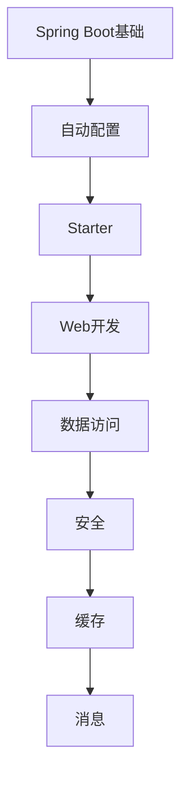

# Spring Boot 学习指南

> **分类**：后端开发 ｜ **技术生态**：Spring MVC、Spring Data、Spring Security、Spring Cloud、Micrometer

## 领域定位

Spring Boot 通过自动配置、Starter 依赖与内嵌容器，使 Spring 应用快速启动。Spring Boot 3 基于 Jakarta EE 9+ 与 Java 17，原生镜像支持 GraalVM。

从 Web、数据访问、Security 到 Actuator 监控与 Spring Cloud 微服务，面向 Java 企业级后端主流栈。

本领域常用技术栈与工具包括：Spring MVC、Spring Data、Spring Security、Spring Cloud、Micrometer。

## 学习目标

- 理解自动配置条件与扩展点
- 能构建 REST + JPA + Security 应用
- 能配置多环境与外部化配置
- 能集成 Actuator 与分布式组件

## 前置知识

- Java 基础
- Maven/Gradle
- HTTP 与 SQL

## 学习路径

1. **Spring Boot基础**
2. **自动配置**
3. **Starter**
4. **Web开发**
5. **数据访问**
6. **安全**
7. **缓存**
8. **消息**

## 模块体系

- **Spring Boot基础**
- **自动配置**
- **Starter**
- **Web开发**
- **数据访问**
- **安全**
- **缓存**
- **消息**
- **任务调度**
- **监控**
- **测试**
- **配置管理**
- **日志**
- **性能优化**
- **部署**
- **Spring Cloud**
- **Spring Boot最佳实践**

## 难度分布

| 入门 | 29 | 24% |
| 实战 | 28 | 23% |
| 进阶 | 28 | 23% |
| 高级 | 35 | 29% |

## 章节索引

### Spring Boot基础

- [Spring Boot基础核心概念与原理](chapters/001-Spring-Boot基础核心概念与原理.md) ｜ 入门
- [Spring Boot基础的实现机制详解](chapters/002-Spring-Boot基础的实现机制详解.md) ｜ 入门
- [Spring Boot基础的关键技术点](chapters/003-Spring-Boot基础的关键技术点.md) ｜ 入门
- [Spring Boot基础的源码级分析](chapters/004-Spring-Boot基础的源码级分析.md) ｜ 入门
- [Spring Boot基础的配置与使用](chapters/005-Spring-Boot基础的配置与使用.md) ｜ 入门
- [Spring Boot基础的常见问题与解决方案](chapters/006-Spring-Boot基础的常见问题与解决方案.md) ｜ 入门
- [Spring Boot基础的性能优化技巧](chapters/007-Spring-Boot基础的性能优化技巧.md) ｜ 入门
- [Spring Boot基础的最佳实践指南](chapters/008-Spring-Boot基础的最佳实践指南.md) ｜ 入门

### 自动配置

- [自动配置核心概念与原理](chapters/009-自动配置核心概念与原理.md) ｜ 入门
- [自动配置的实现机制详解](chapters/010-自动配置的实现机制详解.md) ｜ 入门
- [自动配置的关键技术点](chapters/011-自动配置的关键技术点.md) ｜ 入门
- [自动配置的源码级分析](chapters/012-自动配置的源码级分析.md) ｜ 入门
- [自动配置的配置与使用](chapters/013-自动配置的配置与使用.md) ｜ 入门
- [自动配置的常见问题与解决方案](chapters/014-自动配置的常见问题与解决方案.md) ｜ 入门
- [自动配置的性能优化技巧](chapters/015-自动配置的性能优化技巧.md) ｜ 入门

### Starter

- [Starter核心概念与原理](chapters/016-Starter核心概念与原理.md) ｜ 入门
- [Starter的实现机制详解](chapters/017-Starter的实现机制详解.md) ｜ 入门
- [Starter的关键技术点](chapters/018-Starter的关键技术点.md) ｜ 入门
- [Starter的源码级分析](chapters/019-Starter的源码级分析.md) ｜ 入门
- [Starter的配置与使用](chapters/020-Starter的配置与使用.md) ｜ 入门
- [Starter的常见问题与解决方案](chapters/021-Starter的常见问题与解决方案.md) ｜ 入门
- [Starter的性能优化技巧](chapters/022-Starter的性能优化技巧.md) ｜ 入门

### Web开发

- [Web开发核心概念与原理](chapters/023-Web开发核心概念与原理.md) ｜ 入门
- [Web开发的实现机制详解](chapters/024-Web开发的实现机制详解.md) ｜ 入门
- [Web开发的关键技术点](chapters/025-Web开发的关键技术点.md) ｜ 入门
- [Web开发的源码级分析](chapters/026-Web开发的源码级分析.md) ｜ 入门
- [Web开发的配置与使用](chapters/027-Web开发的配置与使用.md) ｜ 入门
- [Web开发的常见问题与解决方案](chapters/028-Web开发的常见问题与解决方案.md) ｜ 入门
- [Web开发的性能优化技巧](chapters/029-Web开发的性能优化技巧.md) ｜ 入门

### 数据访问

- [数据访问核心概念与原理](chapters/030-数据访问核心概念与原理.md) ｜ 进阶
- [数据访问的实现机制详解](chapters/031-数据访问的实现机制详解.md) ｜ 进阶
- [数据访问的关键技术点](chapters/032-数据访问的关键技术点.md) ｜ 进阶
- [数据访问的源码级分析](chapters/033-数据访问的源码级分析.md) ｜ 进阶
- [数据访问的配置与使用](chapters/034-数据访问的配置与使用.md) ｜ 进阶
- [数据访问的常见问题与解决方案](chapters/035-数据访问的常见问题与解决方案.md) ｜ 进阶
- [数据访问的性能优化技巧](chapters/036-数据访问的性能优化技巧.md) ｜ 进阶

### 安全

- [安全核心概念与原理](chapters/037-安全核心概念与原理.md) ｜ 进阶
- [安全的实现机制详解](chapters/038-安全的实现机制详解.md) ｜ 进阶
- [安全的关键技术点](chapters/039-安全的关键技术点.md) ｜ 进阶
- [安全的源码级分析](chapters/040-安全的源码级分析.md) ｜ 进阶
- [安全的配置与使用](chapters/041-安全的配置与使用.md) ｜ 进阶
- [安全的常见问题与解决方案](chapters/042-安全的常见问题与解决方案.md) ｜ 进阶
- [安全的性能优化技巧](chapters/043-安全的性能优化技巧.md) ｜ 进阶

### 缓存

- [缓存核心概念与原理](chapters/044-缓存核心概念与原理.md) ｜ 进阶
- [缓存的实现机制详解](chapters/045-缓存的实现机制详解.md) ｜ 进阶
- [缓存的关键技术点](chapters/046-缓存的关键技术点.md) ｜ 进阶
- [缓存的源码级分析](chapters/047-缓存的源码级分析.md) ｜ 进阶
- [缓存的配置与使用](chapters/048-缓存的配置与使用.md) ｜ 进阶
- [缓存的常见问题与解决方案](chapters/049-缓存的常见问题与解决方案.md) ｜ 进阶
- [缓存的性能优化技巧](chapters/050-缓存的性能优化技巧.md) ｜ 进阶

### 消息

- [消息核心概念与原理](chapters/051-消息核心概念与原理.md) ｜ 进阶
- [消息的实现机制详解](chapters/052-消息的实现机制详解.md) ｜ 进阶
- [消息的关键技术点](chapters/053-消息的关键技术点.md) ｜ 进阶
- [消息的源码级分析](chapters/054-消息的源码级分析.md) ｜ 进阶
- [消息的配置与使用](chapters/055-消息的配置与使用.md) ｜ 进阶
- [消息的常见问题与解决方案](chapters/056-消息的常见问题与解决方案.md) ｜ 进阶
- [消息的性能优化技巧](chapters/057-消息的性能优化技巧.md) ｜ 进阶

### 任务调度

- [任务调度核心概念与原理](chapters/058-任务调度核心概念与原理.md) ｜ 高级
- [任务调度的实现机制详解](chapters/059-任务调度的实现机制详解.md) ｜ 高级
- [任务调度的关键技术点](chapters/060-任务调度的关键技术点.md) ｜ 高级
- [任务调度的源码级分析](chapters/061-任务调度的源码级分析.md) ｜ 高级
- [任务调度的配置与使用](chapters/062-任务调度的配置与使用.md) ｜ 高级
- [任务调度的常见问题与解决方案](chapters/063-任务调度的常见问题与解决方案.md) ｜ 高级
- [任务调度的性能优化技巧](chapters/064-任务调度的性能优化技巧.md) ｜ 高级

### 监控

- [监控核心概念与原理](chapters/065-监控核心概念与原理.md) ｜ 高级
- [监控的实现机制详解](chapters/066-监控的实现机制详解.md) ｜ 高级
- [监控的关键技术点](chapters/067-监控的关键技术点.md) ｜ 高级
- [监控的源码级分析](chapters/068-监控的源码级分析.md) ｜ 高级
- [监控的配置与使用](chapters/069-监控的配置与使用.md) ｜ 高级
- [监控的常见问题与解决方案](chapters/070-监控的常见问题与解决方案.md) ｜ 高级
- [监控的性能优化技巧](chapters/071-监控的性能优化技巧.md) ｜ 高级

### 测试

- [测试核心概念与原理](chapters/072-测试核心概念与原理.md) ｜ 高级
- [测试的实现机制详解](chapters/073-测试的实现机制详解.md) ｜ 高级
- [测试的关键技术点](chapters/074-测试的关键技术点.md) ｜ 高级
- [测试的源码级分析](chapters/075-测试的源码级分析.md) ｜ 高级
- [测试的配置与使用](chapters/076-测试的配置与使用.md) ｜ 高级
- [测试的常见问题与解决方案](chapters/077-测试的常见问题与解决方案.md) ｜ 高级
- [测试的性能优化技巧](chapters/078-测试的性能优化技巧.md) ｜ 高级

### 配置管理

- [配置管理核心概念与原理](chapters/079-配置管理核心概念与原理.md) ｜ 高级
- [配置管理的实现机制详解](chapters/080-配置管理的实现机制详解.md) ｜ 高级
- [配置管理的关键技术点](chapters/081-配置管理的关键技术点.md) ｜ 高级
- [配置管理的源码级分析](chapters/082-配置管理的源码级分析.md) ｜ 高级
- [配置管理的配置与使用](chapters/083-配置管理的配置与使用.md) ｜ 高级
- [配置管理的常见问题与解决方案](chapters/084-配置管理的常见问题与解决方案.md) ｜ 高级
- [配置管理的性能优化技巧](chapters/085-配置管理的性能优化技巧.md) ｜ 高级

### 日志

- [日志核心概念与原理](chapters/086-日志核心概念与原理.md) ｜ 高级
- [日志的实现机制详解](chapters/087-日志的实现机制详解.md) ｜ 高级
- [日志的关键技术点](chapters/088-日志的关键技术点.md) ｜ 高级
- [日志的源码级分析](chapters/089-日志的源码级分析.md) ｜ 高级
- [日志的配置与使用](chapters/090-日志的配置与使用.md) ｜ 高级
- [日志的常见问题与解决方案](chapters/091-日志的常见问题与解决方案.md) ｜ 高级
- [日志的性能优化技巧](chapters/092-日志的性能优化技巧.md) ｜ 高级

### 性能优化

- [性能优化核心概念与原理](chapters/093-性能优化核心概念与原理.md) ｜ 实战
- [性能优化的实现机制详解](chapters/094-性能优化的实现机制详解.md) ｜ 实战
- [性能优化的关键技术点](chapters/095-性能优化的关键技术点.md) ｜ 实战
- [性能优化的源码级分析](chapters/096-性能优化的源码级分析.md) ｜ 实战
- [性能优化的配置与使用](chapters/097-性能优化的配置与使用.md) ｜ 实战
- [性能优化的常见问题与解决方案](chapters/098-性能优化的常见问题与解决方案.md) ｜ 实战
- [性能优化的性能优化技巧](chapters/099-性能优化的性能优化技巧.md) ｜ 实战

### 部署

- [部署核心概念与原理](chapters/100-部署核心概念与原理.md) ｜ 实战
- [部署的实现机制详解](chapters/101-部署的实现机制详解.md) ｜ 实战
- [部署的关键技术点](chapters/102-部署的关键技术点.md) ｜ 实战
- [部署的源码级分析](chapters/103-部署的源码级分析.md) ｜ 实战
- [部署的配置与使用](chapters/104-部署的配置与使用.md) ｜ 实战
- [部署的常见问题与解决方案](chapters/105-部署的常见问题与解决方案.md) ｜ 实战
- [部署的性能优化技巧](chapters/106-部署的性能优化技巧.md) ｜ 实战

### Spring Cloud

- [Spring Cloud核心概念与原理](chapters/107-Spring-Cloud核心概念与原理.md) ｜ 实战
- [Spring Cloud的实现机制详解](chapters/108-Spring-Cloud的实现机制详解.md) ｜ 实战
- [Spring Cloud的关键技术点](chapters/109-Spring-Cloud的关键技术点.md) ｜ 实战
- [Spring Cloud的源码级分析](chapters/110-Spring-Cloud的源码级分析.md) ｜ 实战
- [Spring Cloud的配置与使用](chapters/111-Spring-Cloud的配置与使用.md) ｜ 实战
- [Spring Cloud的常见问题与解决方案](chapters/112-Spring-Cloud的常见问题与解决方案.md) ｜ 实战
- [Spring Cloud的性能优化技巧](chapters/113-Spring-Cloud的性能优化技巧.md) ｜ 实战

### Spring Boot最佳实践

- [Spring Boot最佳实践核心概念与原理](chapters/114-Spring-Boot最佳实践核心概念与原理.md) ｜ 实战
- [Spring Boot最佳实践的实现机制详解](chapters/115-Spring-Boot最佳实践的实现机制详解.md) ｜ 实战
- [Spring Boot最佳实践的关键技术点](chapters/116-Spring-Boot最佳实践的关键技术点.md) ｜ 实战
- [Spring Boot最佳实践的源码级分析](chapters/117-Spring-Boot最佳实践的源码级分析.md) ｜ 实战
- [Spring Boot最佳实践的配置与使用](chapters/118-Spring-Boot最佳实践的配置与使用.md) ｜ 实战
- [Spring Boot最佳实践的常见问题与解决方案](chapters/119-Spring-Boot最佳实践的常见问题与解决方案.md) ｜ 实战
- [Spring Boot最佳实践的性能优化技巧](chapters/120-Spring-Boot最佳实践的性能优化技巧.md) ｜ 实战

---
*领域: Spring Boot*