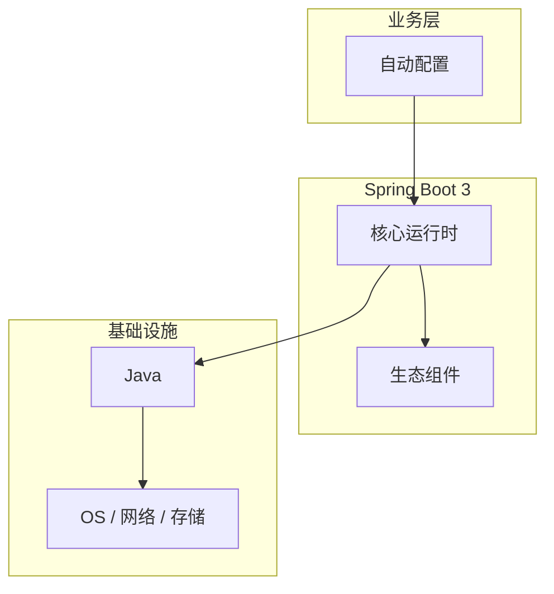

# 自动配置的性能优化技巧

> **领域**：Spring Boot ｜ **模块**：自动配置 ｜ **难度**：入门 ｜ **类型**：性能优化

## 导读

本章系统讲解 **Spring Boot** 中 **自动配置** 的相关知识（性能优化）。本章从度量指标、瓶颈定位与优化手段三方面讲解 **自动配置** 的性能议题。内容基于主流框架与工程实践撰写，不依赖过时概念堆砌。

## 核心知识

Spring Boot 自动配置通过 `@EnableAutoConfiguration` 导入 `AutoConfiguration.imports`，利用 **@Conditional** 系列注解按 classpath 与 property 条件注册 Bean。

### 核心知识

**1. spring.factories → AutoConfiguration.imports**

Boot 3 改用 `META-INF/spring/org.springframework.boot.autoconfigure.AutoConfiguration.imports` 列表。

**2. @ConditionalOnClass**

classpath 存在指定类时才生效，如 DataSourceAutoConfiguration 需 JDBC 驱动。

**3. ConfigurationProperties**

`@ConfigurationProperties(prefix="server")` 绑定 application.yml 到类型安全 POJO。

## 架构与流程

## 技术详解

### 性能优化

SpringApplication 启动 → 加载 Environment → 解析 auto-config 类 → 条件评估 → 注册 BeanDefinition。

## 原理与实现

### 工作机制

SpringApplication 启动 → 加载 Environment → 解析 auto-config 类 → 条件评估 → 注册 BeanDefinition。

### 内部实现

AutoConfigurationImportSelector 读取 imports 文件；@AutoConfigureBefore/After 控制顺序。

## 性能、安全与排查

### 调试排错

启动加 `--debug` 或 `logging.level.org.springframework.boot.autoconfigure=DEBUG` 查看条件报告。

## 本章聚焦

针对 **自动配置**，性能工作应「先度量后优化」：明确 P50/P95/P99 与资源占用基线，用 profiler/trace 定位热点，优先处理 I/O、锁竞争与算法复杂度问题，避免无数据支撑的微调。

### 常见误区与纠正

**Bean 重复定义**

自定义 Bean 与 auto-config 冲突，用 @Primary 或 exclude 排除。

### 最佳实践

1. 自定义配置放 @Configuration 并控制 @Order
2. 生产关闭 devtools

## 巩固建议

建议结合 **Spring Boot** 官方文档与小型实验，亲手验证 **自动配置** 的默认行为与边界条件；将本章要点整理为检查清单或 ADR，便于评审与团队 onboarding。

### 本章小结

学完本章，你应能独立说明 **自动配置** 在 Spring Boot 中的角色，理解其核心机制，规避常见误区，并在项目中正确运用。

## 延伸学习

- 自动配置核心概念与原理
- 自动配置的实现机制详解
- 自动配置的关键技术点
- 自动配置的源码级分析
- 自动配置的配置与使用

### 延伸阅读

- Spring Boot Reference - Auto-configuration

---
*章节 ID: 015 ｜ 领域: Spring Boot*