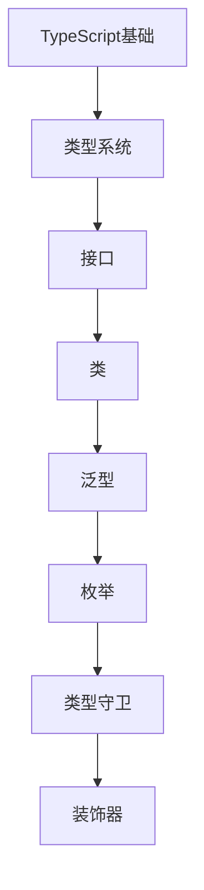

# TypeScript 学习指南

> **分类**：编程语言 ｜ **章节总数**：100 ｜ **技术栈**：TypeScript 5+

## 领域概述

TypeScript是编程语言领域的重要技术方向，本系列从基础到高级逐步深入，涵盖15个核心模块：TypeScript基础、类型系统、接口、类、泛型等。每个知识点作为独立章节，包含原理讲解、实现要点、常见陷阱和最佳实践，配合源码分析和架构图，帮助读者建立完整的TypeScript知识体系。

本教程基于 **TypeScript** 与 **TypeScript 5+** 生态编写，涵盖 tsconfig, tsc, ESLint 等主流工具与框架。每章独立成篇，文字精炼、逻辑清晰，适合系统学习与按需查阅。

## 你将学到什么

完成本系列后，你将能够：

- 系统理解 **TypeScript** 的核心概念与模块划分。
- 按难度递进掌握从入门到实战的完整知识路径。
- 在工程实践中做出合理的技术判断与问题排查。
- 通过章节索引快速定位所需知识点。

## 前置知识

- 编程基础
- 数据结构
- 计算机基础
- 编程语言基础概念

## 推荐学习路径

1. **TypeScript基础**
2. **类型系统**
3. **接口**
4. **类**
5. **泛型**
6. **枚举**
7. **类型守卫**
8. **装饰器**

## 模块体系

本领域按以下模块组织，难度由浅入深：

- **TypeScript基础**
- **类型系统**
- **接口**
- **类**
- **泛型**
- **枚举**
- **类型守卫**
- **装饰器**
- **模块**
- **命名空间**
- **tsconfig配置**
- **与JavaScript互操作**
- **类型体操**
- **工程化**
- **最佳实践**

## 难度分布

| 难度 | 章节数 | 占比 |
|------|--------|------|
| 入门 | 21 | 21% |
| 实战 | 18 | 18% |
| 进阶 | 28 | 28% |
| 高级 | 33 | 33% |

## 章节索引

点击章节标题进入对应教程：

### TypeScript基础

- [TypeScript基础核心概念与原理](chapters/001-TypeScript基础核心概念与原理.md) ｜ 入门
- [TypeScript基础的实现机制详解](chapters/002-TypeScript基础的实现机制详解.md) ｜ 入门
- [TypeScript基础的关键技术点](chapters/003-TypeScript基础的关键技术点.md) ｜ 入门
- [TypeScript基础的源码级分析](chapters/004-TypeScript基础的源码级分析.md) ｜ 入门
- [TypeScript基础的配置与使用](chapters/005-TypeScript基础的配置与使用.md) ｜ 入门
- [TypeScript基础的常见问题与解决方案](chapters/006-TypeScript基础的常见问题与解决方案.md) ｜ 入门
- [TypeScript基础的性能优化技巧](chapters/007-TypeScript基础的性能优化技巧.md) ｜ 入门

### 类型系统

- [类型系统核心概念与原理](chapters/008-类型系统核心概念与原理.md) ｜ 入门
- [类型系统的实现机制详解](chapters/009-类型系统的实现机制详解.md) ｜ 入门
- [类型系统的关键技术点](chapters/010-类型系统的关键技术点.md) ｜ 入门
- [类型系统的源码级分析](chapters/011-类型系统的源码级分析.md) ｜ 入门
- [类型系统的配置与使用](chapters/012-类型系统的配置与使用.md) ｜ 入门
- [类型系统的常见问题与解决方案](chapters/013-类型系统的常见问题与解决方案.md) ｜ 入门
- [类型系统的性能优化技巧](chapters/014-类型系统的性能优化技巧.md) ｜ 入门

### 接口

- [接口核心概念与原理](chapters/015-接口核心概念与原理.md) ｜ 入门
- [接口的实现机制详解](chapters/016-接口的实现机制详解.md) ｜ 入门
- [接口的关键技术点](chapters/017-接口的关键技术点.md) ｜ 入门
- [接口的源码级分析](chapters/018-接口的源码级分析.md) ｜ 入门
- [接口的配置与使用](chapters/019-接口的配置与使用.md) ｜ 入门
- [接口的常见问题与解决方案](chapters/020-接口的常见问题与解决方案.md) ｜ 入门
- [接口的性能优化技巧](chapters/021-接口的性能优化技巧.md) ｜ 入门

### 类

- [类核心概念与原理](chapters/022-类核心概念与原理.md) ｜ 进阶
- [类的实现机制详解](chapters/023-类的实现机制详解.md) ｜ 进阶
- [类的关键技术点](chapters/024-类的关键技术点.md) ｜ 进阶
- [类的源码级分析](chapters/025-类的源码级分析.md) ｜ 进阶
- [类的配置与使用](chapters/026-类的配置与使用.md) ｜ 进阶
- [类的常见问题与解决方案](chapters/027-类的常见问题与解决方案.md) ｜ 进阶
- [类的性能优化技巧](chapters/028-类的性能优化技巧.md) ｜ 进阶

### 泛型

- [泛型核心概念与原理](chapters/029-泛型核心概念与原理.md) ｜ 进阶
- [泛型的实现机制详解](chapters/030-泛型的实现机制详解.md) ｜ 进阶
- [泛型的关键技术点](chapters/031-泛型的关键技术点.md) ｜ 进阶
- [泛型的源码级分析](chapters/032-泛型的源码级分析.md) ｜ 进阶
- [泛型的配置与使用](chapters/033-泛型的配置与使用.md) ｜ 进阶
- [泛型的常见问题与解决方案](chapters/034-泛型的常见问题与解决方案.md) ｜ 进阶
- [泛型的性能优化技巧](chapters/035-泛型的性能优化技巧.md) ｜ 进阶

### 枚举

- [枚举核心概念与原理](chapters/036-枚举核心概念与原理.md) ｜ 进阶
- [枚举的实现机制详解](chapters/037-枚举的实现机制详解.md) ｜ 进阶
- [枚举的关键技术点](chapters/038-枚举的关键技术点.md) ｜ 进阶
- [枚举的源码级分析](chapters/039-枚举的源码级分析.md) ｜ 进阶
- [枚举的配置与使用](chapters/040-枚举的配置与使用.md) ｜ 进阶
- [枚举的常见问题与解决方案](chapters/041-枚举的常见问题与解决方案.md) ｜ 进阶
- [枚举的性能优化技巧](chapters/042-枚举的性能优化技巧.md) ｜ 进阶

### 类型守卫

- [类型守卫核心概念与原理](chapters/043-类型守卫核心概念与原理.md) ｜ 进阶
- [类型守卫的实现机制详解](chapters/044-类型守卫的实现机制详解.md) ｜ 进阶
- [类型守卫的关键技术点](chapters/045-类型守卫的关键技术点.md) ｜ 进阶
- [类型守卫的源码级分析](chapters/046-类型守卫的源码级分析.md) ｜ 进阶
- [类型守卫的配置与使用](chapters/047-类型守卫的配置与使用.md) ｜ 进阶
- [类型守卫的常见问题与解决方案](chapters/048-类型守卫的常见问题与解决方案.md) ｜ 进阶
- [类型守卫的性能优化技巧](chapters/049-类型守卫的性能优化技巧.md) ｜ 进阶

### 装饰器

- [装饰器核心概念与原理](chapters/050-装饰器核心概念与原理.md) ｜ 高级
- [装饰器的实现机制详解](chapters/051-装饰器的实现机制详解.md) ｜ 高级
- [装饰器的关键技术点](chapters/052-装饰器的关键技术点.md) ｜ 高级
- [装饰器的源码级分析](chapters/053-装饰器的源码级分析.md) ｜ 高级
- [装饰器的配置与使用](chapters/054-装饰器的配置与使用.md) ｜ 高级
- [装饰器的常见问题与解决方案](chapters/055-装饰器的常见问题与解决方案.md) ｜ 高级
- [装饰器的性能优化技巧](chapters/056-装饰器的性能优化技巧.md) ｜ 高级

### 模块

- [模块核心概念与原理](chapters/057-模块核心概念与原理.md) ｜ 高级
- [模块的实现机制详解](chapters/058-模块的实现机制详解.md) ｜ 高级
- [模块的关键技术点](chapters/059-模块的关键技术点.md) ｜ 高级
- [模块的源码级分析](chapters/060-模块的源码级分析.md) ｜ 高级
- [模块的配置与使用](chapters/061-模块的配置与使用.md) ｜ 高级
- [模块的常见问题与解决方案](chapters/062-模块的常见问题与解决方案.md) ｜ 高级
- [模块的性能优化技巧](chapters/063-模块的性能优化技巧.md) ｜ 高级

### 命名空间

- [命名空间核心概念与原理](chapters/064-命名空间核心概念与原理.md) ｜ 高级
- [命名空间的实现机制详解](chapters/065-命名空间的实现机制详解.md) ｜ 高级
- [命名空间的关键技术点](chapters/066-命名空间的关键技术点.md) ｜ 高级
- [命名空间的源码级分析](chapters/067-命名空间的源码级分析.md) ｜ 高级
- [命名空间的配置与使用](chapters/068-命名空间的配置与使用.md) ｜ 高级
- [命名空间的常见问题与解决方案](chapters/069-命名空间的常见问题与解决方案.md) ｜ 高级
- [命名空间的性能优化技巧](chapters/070-命名空间的性能优化技巧.md) ｜ 高级

### tsconfig配置

- [tsconfig配置核心概念与原理](chapters/071-tsconfig配置核心概念与原理.md) ｜ 高级
- [tsconfig配置的实现机制详解](chapters/072-tsconfig配置的实现机制详解.md) ｜ 高级
- [tsconfig配置的关键技术点](chapters/073-tsconfig配置的关键技术点.md) ｜ 高级
- [tsconfig配置的源码级分析](chapters/074-tsconfig配置的源码级分析.md) ｜ 高级
- [tsconfig配置的配置与使用](chapters/075-tsconfig配置的配置与使用.md) ｜ 高级
- [tsconfig配置的常见问题与解决方案](chapters/076-tsconfig配置的常见问题与解决方案.md) ｜ 高级

### 与JavaScript互操作

- [与JavaScript互操作核心概念与原理](chapters/077-与JavaScript互操作核心概念与原理.md) ｜ 高级
- [与JavaScript互操作的实现机制详解](chapters/078-与JavaScript互操作的实现机制详解.md) ｜ 高级
- [与JavaScript互操作的关键技术点](chapters/079-与JavaScript互操作的关键技术点.md) ｜ 高级
- [与JavaScript互操作的源码级分析](chapters/080-与JavaScript互操作的源码级分析.md) ｜ 高级
- [与JavaScript互操作的配置与使用](chapters/081-与JavaScript互操作的配置与使用.md) ｜ 高级
- [与JavaScript互操作的常见问题与解决方案](chapters/082-与JavaScript互操作的常见问题与解决方案.md) ｜ 高级

### 类型体操

- [类型体操核心概念与原理](chapters/083-类型体操核心概念与原理.md) ｜ 实战
- [类型体操的实现机制详解](chapters/084-类型体操的实现机制详解.md) ｜ 实战
- [类型体操的关键技术点](chapters/085-类型体操的关键技术点.md) ｜ 实战
- [类型体操的源码级分析](chapters/086-类型体操的源码级分析.md) ｜ 实战
- [类型体操的配置与使用](chapters/087-类型体操的配置与使用.md) ｜ 实战
- [类型体操的常见问题与解决方案](chapters/088-类型体操的常见问题与解决方案.md) ｜ 实战

### 工程化

- [工程化核心概念与原理](chapters/089-工程化核心概念与原理.md) ｜ 实战
- [工程化的实现机制详解](chapters/090-工程化的实现机制详解.md) ｜ 实战
- [工程化的关键技术点](chapters/091-工程化的关键技术点.md) ｜ 实战
- [工程化的源码级分析](chapters/092-工程化的源码级分析.md) ｜ 实战
- [工程化的配置与使用](chapters/093-工程化的配置与使用.md) ｜ 实战
- [工程化的常见问题与解决方案](chapters/094-工程化的常见问题与解决方案.md) ｜ 实战

### 最佳实践

- [最佳实践核心概念与原理](chapters/095-最佳实践核心概念与原理.md) ｜ 实战
- [最佳实践的实现机制详解](chapters/096-最佳实践的实现机制详解.md) ｜ 实战
- [最佳实践的关键技术点](chapters/097-最佳实践的关键技术点.md) ｜ 实战
- [最佳实践的源码级分析](chapters/098-最佳实践的源码级分析.md) ｜ 实战
- [最佳实践的配置与使用](chapters/099-最佳实践的配置与使用.md) ｜ 实战
- [最佳实践的常见问题与解决方案](chapters/100-最佳实践的常见问题与解决方案.md) ｜ 实战

## 学习方法建议

1. **先读概述再读章节**：用本指南建立全局地图，避免迷失在细节中。
2. **按模块递进**：同一模块内章节有前后关联，顺序阅读效果更好。
3. **主动复述**：每章读完后，用三五句话概括「是什么、为什么、怎么用」。
4. **关联阅读**：利用章节底部的「延伸学习」在同模块内构建知识网络。
5. **对照官方文档**：本教程提供结构化视角，细节以官方文档为准。

---
*领域: TypeScript ｜ 版本: 2.0 ｜ 共 100 章*