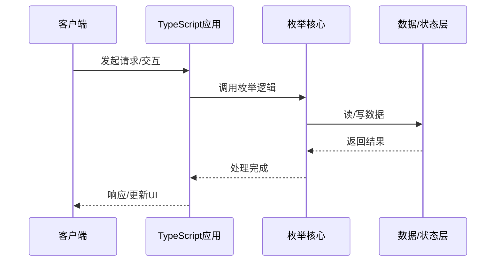

# 枚举的实现机制详解

> **领域**：TypeScript ｜ **模块**：枚举 ｜ **难度**：进阶 ｜ **类型**：实现机制

## 导读

本章属于 **TypeScript** 教程的 **枚举** 模块，难度为 **进阶**。阅读重点在于建立清晰的概念模型与工程判断能力，而非死记细节。

## 核心概念

TypeScript 为 JavaScript 添加静态类型，编译期捕获错误，大型前端与 Node 项目普遍采用 strict 模式提升可维护性。

在 **TypeScript** 体系中，**枚举** 与上下游模块形成协作。技术栈以 **TypeScript 5+** 为核心（TypeScript），生态包括 tsconfig, tsc, ESLint。

「枚举」是该领域的核心知识模块，理解其原理与边界是工程实践的基础。

### 概念精讲

**枚举的基本概念与定义**

从实践出发：典型应用场景与反模式（不该用的场景）。 在 枚举 语境下，这一点直接影响设计决策与故障排查思路。

**枚举在TypeScript中的作用与地位**

从演进出发：历史上为何出现、未来可能如何变化。 在 枚举 语境下，这一点直接影响设计决策与故障排查思路。

**枚举的核心数据结构**

从度量出发：如何评估它是否工作正常、性能是否达标。 在 枚举 语境下，这一点直接影响设计决策与故障排查思路。

**枚举的关键算法与流程**

从定义出发：它解决什么问题、不解决什么问题，边界在哪里。 在 枚举 语境下，这一点直接影响设计决策与故障排查思路。

**枚举与其他模块的关系**

从结构出发：核心组成部分是什么，彼此如何协作。 在 枚举 语境下，这一点直接影响设计决策与故障排查思路。

## 架构与流程

以下框图帮助你在宏观层面把握模块协作关系与处理流向：

## 深度讲解

### 调用链路

典型 枚举 调用五阶段：**接入**（校验与上下文）→ **路由**（分发）→ **执行**（TypeScript 5+ 核心逻辑）→ **提交**（写存储/回调）→ **收尾**（释放资源、记日志、返回响应）。

### 状态与生命周期

许多「偶发异常」源于状态转换时机错误——资源未就绪即操作，或清理前重复触发。建议对照生命周期图与日志时间线分析。

### 并发与一致性

多调用并发时需明确：共享可变状态、锁粒度、重试对一致性的影响。设计应预设最坏情况，而非假设「不会同时发生」。

### 落地检查清单

- **分析枚举的源码实现与调用流程**：落地时需明确验收标准与回滚方案。
- **了解枚举的性能特点与瓶颈**：落地时需明确验收标准与回滚方案。
- **掌握枚举的常见问题与排查方法**：落地时需明确验收标准与回滚方案。
- **理解枚举的安全注意事项**：落地时需明确验收标准与回滚方案。

### 常见误区与应对

**误区：对枚举的概念理解不深入导致误用**

**应对**：回到官方定义画一张概念图，与同事讲解一遍，确保能用自己的话复述。

**误区：忽略枚举的性能边界与限制条件**

**应对**：用 Profiler 或压测建立基线，对比优化前后数据，避免凭感觉优化。

**误区：枚举配置不当引发的问题**

**应对**：核对环境变量、配置文件与部署清单是否一致，使用配置 diff 工具排查。

**误区：缺乏对枚举底层原理的理解**

**应对**：阅读官方文档与一篇深度文章，结合小实验验证理解。

**误区：枚举与其他模块集成时的兼容性问题**

**应对**：列出依赖版本矩阵，在 CI 中跑集成测试覆盖主要组合。

### 最佳实践

1. **遵循枚举的官方推荐用法与规范** — 落地方式：写入团队 Wiki 并纳入 Code Review 检查项。

2. **在理解原理的基础上合理使用枚举** — 落地方式：配置静态检查或 CI 规则自动拦截违规写法。

3. **建立完善的枚举监控与告警机制** — 落地方式：在新人 onboarding 中作为必修内容讲解。

4. **编写充分的测试用例覆盖枚举的各种场景** — 落地方式：每季度回顾一次，对照社区最佳实践更新。

5. **持续关注枚举的版本更新与最佳实践演进** — 落地方式：用真实项目案例演示正确与错误对比。

### 本章小结

学完本章，你应能：

- 说清 **枚举的实现机制详解** 在 TypeScript/枚举 中的定位。
- 描述核心流程与关键概念，能用自己的话复述。
- 识别常见误区并采取预防与排查手段。
- 在项目中做出与场景匹配的工程决策。

类型：**实现机制**。建议完成小练习或复盘笔记，将阅读转化为能力。

## 延伸学习

建议结合以下同模块章节继续阅读，构建完整知识链：

- 枚举核心概念与原理
- 枚举的关键技术点
- 枚举的源码级分析

### 参考资料

- TypeScript官方文档 - 枚举章节
- 《TypeScript权威指南》相关章节
- 枚举源码实现与注释
- TypeScript社区最佳实践文章
- 枚举相关技术博客与教程

---
*章节 ID: 037 ｜ 领域: TypeScript ｜ 版本: 2.0*