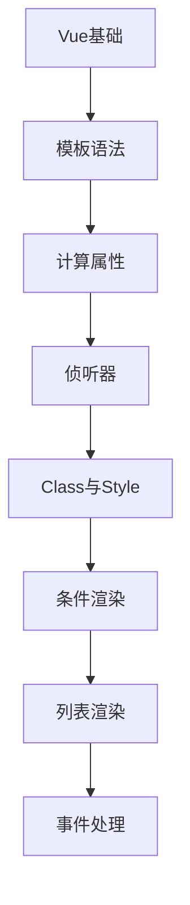

# Vue 学习指南

> **分类**：前端开发 ｜ **技术生态**：Vue 3、Vue Router 4、Pinia、Vite、Nuxt 3、VueUse

## 领域定位

Vue 3 以 Proxy 响应式与 Composition API 为核心，渐进式架构可按需引入 Router、Pinia。编译优化与 script setup 提升开发效率。

从模板与响应式原理到组件通信、Router、Pinia 与 Composition API，适合系统学习与工程落地。

本领域常用技术栈与工具包括：Vue 3、Vue Router 4、Pinia、Vite、Nuxt 3、VueUse。

## 学习目标

- 熟练使用组合式 API
- 理解 track/trigger 响应式
- 设计路由与 Pinia 方案
- Vue 3 工程化实践

## 前置知识

- JavaScript ES6+
- HTML/CSS
- 组件化思想

## 学习路径

1. **Vue基础**
2. **模板语法**
3. **计算属性**
4. **侦听器**
5. **Class与Style**
6. **条件渲染**
7. **列表渲染**
8. **事件处理**

## 模块体系

- **Vue基础**
- **模板语法**
- **计算属性**
- **侦听器**
- **Class与Style**
- **条件渲染**
- **列表渲染**
- **事件处理**
- **表单输入**
- **组件基础**
- **组件通信**
- **插槽**
- **生命周期**
- **Vue Router**
- **Pinia状态管理**
- **组合式API**
- **Vue3新特性**
- **Vue最佳实践**

## 难度分布

| 入门 | 28 | 23% |
| 实战 | 24 | 20% |
| 进阶 | 35 | 29% |
| 高级 | 33 | 27% |

## 章节索引

### Vue基础

- [Vue基础核心概念与原理](chapters/001-Vue基础核心概念与原理.md) ｜ 入门
- [Vue基础的实现机制详解](chapters/002-Vue基础的实现机制详解.md) ｜ 入门
- [Vue基础的关键技术点](chapters/003-Vue基础的关键技术点.md) ｜ 入门
- [Vue基础的源码级分析](chapters/004-Vue基础的源码级分析.md) ｜ 入门
- [Vue基础的配置与使用](chapters/005-Vue基础的配置与使用.md) ｜ 入门
- [Vue基础的常见问题与解决方案](chapters/006-Vue基础的常见问题与解决方案.md) ｜ 入门
- [Vue基础的性能优化技巧](chapters/007-Vue基础的性能优化技巧.md) ｜ 入门

### 模板语法

- [模板语法核心概念与原理](chapters/008-模板语法核心概念与原理.md) ｜ 入门
- [模板语法的实现机制详解](chapters/009-模板语法的实现机制详解.md) ｜ 入门
- [模板语法的关键技术点](chapters/010-模板语法的关键技术点.md) ｜ 入门
- [模板语法的源码级分析](chapters/011-模板语法的源码级分析.md) ｜ 入门
- [模板语法的配置与使用](chapters/012-模板语法的配置与使用.md) ｜ 入门
- [模板语法的常见问题与解决方案](chapters/013-模板语法的常见问题与解决方案.md) ｜ 入门
- [模板语法的性能优化技巧](chapters/014-模板语法的性能优化技巧.md) ｜ 入门

### 计算属性

- [计算属性核心概念与原理](chapters/015-计算属性核心概念与原理.md) ｜ 入门
- [计算属性的实现机制详解](chapters/016-计算属性的实现机制详解.md) ｜ 入门
- [计算属性的关键技术点](chapters/017-计算属性的关键技术点.md) ｜ 入门
- [计算属性的源码级分析](chapters/018-计算属性的源码级分析.md) ｜ 入门
- [计算属性的配置与使用](chapters/019-计算属性的配置与使用.md) ｜ 入门
- [计算属性的常见问题与解决方案](chapters/020-计算属性的常见问题与解决方案.md) ｜ 入门
- [计算属性的性能优化技巧](chapters/021-计算属性的性能优化技巧.md) ｜ 入门

### 侦听器

- [侦听器核心概念与原理](chapters/022-侦听器核心概念与原理.md) ｜ 入门
- [侦听器的实现机制详解](chapters/023-侦听器的实现机制详解.md) ｜ 入门
- [侦听器的关键技术点](chapters/024-侦听器的关键技术点.md) ｜ 入门
- [侦听器的源码级分析](chapters/025-侦听器的源码级分析.md) ｜ 入门
- [侦听器的配置与使用](chapters/026-侦听器的配置与使用.md) ｜ 入门
- [侦听器的常见问题与解决方案](chapters/027-侦听器的常见问题与解决方案.md) ｜ 入门
- [侦听器的性能优化技巧](chapters/028-侦听器的性能优化技巧.md) ｜ 入门

### Class与Style

- [Class与Style核心概念与原理](chapters/029-Class与Style核心概念与原理.md) ｜ 进阶
- [Class与Style的实现机制详解](chapters/030-Class与Style的实现机制详解.md) ｜ 进阶
- [Class与Style的关键技术点](chapters/031-Class与Style的关键技术点.md) ｜ 进阶
- [Class与Style的源码级分析](chapters/032-Class与Style的源码级分析.md) ｜ 进阶
- [Class与Style的配置与使用](chapters/033-Class与Style的配置与使用.md) ｜ 进阶
- [Class与Style的常见问题与解决方案](chapters/034-Class与Style的常见问题与解决方案.md) ｜ 进阶
- [Class与Style的性能优化技巧](chapters/035-Class与Style的性能优化技巧.md) ｜ 进阶

### 条件渲染

- [条件渲染核心概念与原理](chapters/036-条件渲染核心概念与原理.md) ｜ 进阶
- [条件渲染的实现机制详解](chapters/037-条件渲染的实现机制详解.md) ｜ 进阶
- [条件渲染的关键技术点](chapters/038-条件渲染的关键技术点.md) ｜ 进阶
- [条件渲染的源码级分析](chapters/039-条件渲染的源码级分析.md) ｜ 进阶
- [条件渲染的配置与使用](chapters/040-条件渲染的配置与使用.md) ｜ 进阶
- [条件渲染的常见问题与解决方案](chapters/041-条件渲染的常见问题与解决方案.md) ｜ 进阶
- [条件渲染的性能优化技巧](chapters/042-条件渲染的性能优化技巧.md) ｜ 进阶

### 列表渲染

- [列表渲染核心概念与原理](chapters/043-列表渲染核心概念与原理.md) ｜ 进阶
- [列表渲染的实现机制详解](chapters/044-列表渲染的实现机制详解.md) ｜ 进阶
- [列表渲染的关键技术点](chapters/045-列表渲染的关键技术点.md) ｜ 进阶
- [列表渲染的源码级分析](chapters/046-列表渲染的源码级分析.md) ｜ 进阶
- [列表渲染的配置与使用](chapters/047-列表渲染的配置与使用.md) ｜ 进阶
- [列表渲染的常见问题与解决方案](chapters/048-列表渲染的常见问题与解决方案.md) ｜ 进阶
- [列表渲染的性能优化技巧](chapters/049-列表渲染的性能优化技巧.md) ｜ 进阶

### 事件处理

- [事件处理核心概念与原理](chapters/050-事件处理核心概念与原理.md) ｜ 进阶
- [事件处理的实现机制详解](chapters/051-事件处理的实现机制详解.md) ｜ 进阶
- [事件处理的关键技术点](chapters/052-事件处理的关键技术点.md) ｜ 进阶
- [事件处理的源码级分析](chapters/053-事件处理的源码级分析.md) ｜ 进阶
- [事件处理的配置与使用](chapters/054-事件处理的配置与使用.md) ｜ 进阶
- [事件处理的常见问题与解决方案](chapters/055-事件处理的常见问题与解决方案.md) ｜ 进阶
- [事件处理的性能优化技巧](chapters/056-事件处理的性能优化技巧.md) ｜ 进阶

### 表单输入

- [表单输入核心概念与原理](chapters/057-表单输入核心概念与原理.md) ｜ 进阶
- [表单输入的实现机制详解](chapters/058-表单输入的实现机制详解.md) ｜ 进阶
- [表单输入的关键技术点](chapters/059-表单输入的关键技术点.md) ｜ 进阶
- [表单输入的源码级分析](chapters/060-表单输入的源码级分析.md) ｜ 进阶
- [表单输入的配置与使用](chapters/061-表单输入的配置与使用.md) ｜ 进阶
- [表单输入的常见问题与解决方案](chapters/062-表单输入的常见问题与解决方案.md) ｜ 进阶
- [表单输入的性能优化技巧](chapters/063-表单输入的性能优化技巧.md) ｜ 进阶

### 组件基础

- [组件基础核心概念与原理](chapters/064-组件基础核心概念与原理.md) ｜ 高级
- [组件基础的实现机制详解](chapters/065-组件基础的实现机制详解.md) ｜ 高级
- [组件基础的关键技术点](chapters/066-组件基础的关键技术点.md) ｜ 高级
- [组件基础的源码级分析](chapters/067-组件基础的源码级分析.md) ｜ 高级
- [组件基础的配置与使用](chapters/068-组件基础的配置与使用.md) ｜ 高级
- [组件基础的常见问题与解决方案](chapters/069-组件基础的常见问题与解决方案.md) ｜ 高级
- [组件基础的性能优化技巧](chapters/070-组件基础的性能优化技巧.md) ｜ 高级

### 组件通信

- [组件通信核心概念与原理](chapters/071-组件通信核心概念与原理.md) ｜ 高级
- [组件通信的实现机制详解](chapters/072-组件通信的实现机制详解.md) ｜ 高级
- [组件通信的关键技术点](chapters/073-组件通信的关键技术点.md) ｜ 高级
- [组件通信的源码级分析](chapters/074-组件通信的源码级分析.md) ｜ 高级
- [组件通信的配置与使用](chapters/075-组件通信的配置与使用.md) ｜ 高级
- [组件通信的常见问题与解决方案](chapters/076-组件通信的常见问题与解决方案.md) ｜ 高级
- [组件通信的性能优化技巧](chapters/077-组件通信的性能优化技巧.md) ｜ 高级

### 插槽

- [插槽核心概念与原理](chapters/078-插槽核心概念与原理.md) ｜ 高级
- [插槽的实现机制详解](chapters/079-插槽的实现机制详解.md) ｜ 高级
- [插槽的关键技术点](chapters/080-插槽的关键技术点.md) ｜ 高级
- [插槽的源码级分析](chapters/081-插槽的源码级分析.md) ｜ 高级
- [插槽的配置与使用](chapters/082-插槽的配置与使用.md) ｜ 高级
- [插槽的常见问题与解决方案](chapters/083-插槽的常见问题与解决方案.md) ｜ 高级
- [插槽的性能优化技巧](chapters/084-插槽的性能优化技巧.md) ｜ 高级

### 生命周期

- [生命周期核心概念与原理](chapters/085-生命周期核心概念与原理.md) ｜ 高级
- [生命周期的实现机制详解](chapters/086-生命周期的实现机制详解.md) ｜ 高级
- [生命周期的关键技术点](chapters/087-生命周期的关键技术点.md) ｜ 高级
- [生命周期的源码级分析](chapters/088-生命周期的源码级分析.md) ｜ 高级
- [生命周期的配置与使用](chapters/089-生命周期的配置与使用.md) ｜ 高级
- [生命周期的常见问题与解决方案](chapters/090-生命周期的常见问题与解决方案.md) ｜ 高级

### Vue Router

- [Vue Router核心概念与原理](chapters/091-Vue-Router核心概念与原理.md) ｜ 高级
- [Vue Router的实现机制详解](chapters/092-Vue-Router的实现机制详解.md) ｜ 高级
- [Vue Router的关键技术点](chapters/093-Vue-Router的关键技术点.md) ｜ 高级
- [Vue Router的源码级分析](chapters/094-Vue-Router的源码级分析.md) ｜ 高级
- [Vue Router的配置与使用](chapters/095-Vue-Router的配置与使用.md) ｜ 高级
- [Vue Router的常见问题与解决方案](chapters/096-Vue-Router的常见问题与解决方案.md) ｜ 高级

### Pinia状态管理

- [Pinia状态管理核心概念与原理](chapters/097-Pinia状态管理核心概念与原理.md) ｜ 实战
- [Pinia状态管理的实现机制详解](chapters/098-Pinia状态管理的实现机制详解.md) ｜ 实战
- [Pinia状态管理的关键技术点](chapters/099-Pinia状态管理的关键技术点.md) ｜ 实战
- [Pinia状态管理的源码级分析](chapters/100-Pinia状态管理的源码级分析.md) ｜ 实战
- [Pinia状态管理的配置与使用](chapters/101-Pinia状态管理的配置与使用.md) ｜ 实战
- [Pinia状态管理的常见问题与解决方案](chapters/102-Pinia状态管理的常见问题与解决方案.md) ｜ 实战

### 组合式API

- [组合式API核心概念与原理](chapters/103-组合式API核心概念与原理.md) ｜ 实战
- [组合式API的实现机制详解](chapters/104-组合式API的实现机制详解.md) ｜ 实战
- [组合式API的关键技术点](chapters/105-组合式API的关键技术点.md) ｜ 实战
- [组合式API的源码级分析](chapters/106-组合式API的源码级分析.md) ｜ 实战
- [组合式API的配置与使用](chapters/107-组合式API的配置与使用.md) ｜ 实战
- [组合式API的常见问题与解决方案](chapters/108-组合式API的常见问题与解决方案.md) ｜ 实战

### Vue3新特性

- [Vue3新特性核心概念与原理](chapters/109-Vue3新特性核心概念与原理.md) ｜ 实战
- [Vue3新特性的实现机制详解](chapters/110-Vue3新特性的实现机制详解.md) ｜ 实战
- [Vue3新特性的关键技术点](chapters/111-Vue3新特性的关键技术点.md) ｜ 实战
- [Vue3新特性的源码级分析](chapters/112-Vue3新特性的源码级分析.md) ｜ 实战
- [Vue3新特性的配置与使用](chapters/113-Vue3新特性的配置与使用.md) ｜ 实战
- [Vue3新特性的常见问题与解决方案](chapters/114-Vue3新特性的常见问题与解决方案.md) ｜ 实战

### Vue最佳实践

- [Vue最佳实践核心概念与原理](chapters/115-Vue最佳实践核心概念与原理.md) ｜ 实战
- [Vue最佳实践的实现机制详解](chapters/116-Vue最佳实践的实现机制详解.md) ｜ 实战
- [Vue最佳实践的关键技术点](chapters/117-Vue最佳实践的关键技术点.md) ｜ 实战
- [Vue最佳实践的源码级分析](chapters/118-Vue最佳实践的源码级分析.md) ｜ 实战
- [Vue最佳实践的配置与使用](chapters/119-Vue最佳实践的配置与使用.md) ｜ 实战
- [Vue最佳实践的常见问题与解决方案](chapters/120-Vue最佳实践的常见问题与解决方案.md) ｜ 实战

---
*领域: Vue*