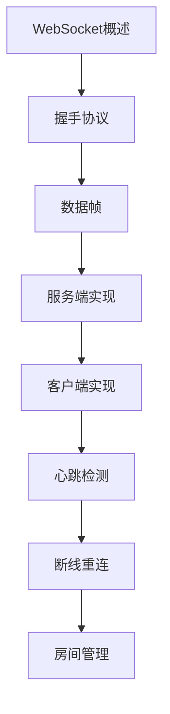

# WebSocket 学习指南

> **分类**：后端开发 ｜ **技术生态**：Socket.IO、Spring WebSocket、ws、Nginx proxy_http_version 1.1

## 领域定位

WebSocket 在单 TCP 连接上提供全双工通信，握手通过 HTTP Upgrade 完成。适用于聊天、协作编辑、行情推送等低延迟场景。

覆盖协议帧、心跳、房间广播、水平扩展与 Sticky Session，对比 SSE 与长轮询。

本领域常用技术栈与工具包括：Socket.IO、Spring WebSocket、ws、Nginx proxy_http_version 1.1。

## 学习目标

- 能实现服务端/客户端 WebSocket
- 能设计心跳与重连策略
- 能在负载均衡后扩展连接
- 能评估消息协议（JSON/Protobuf）

## 前置知识

- HTTP
- TCP 基础
- 异步编程

## 学习路径

1. **WebSocket概述**
2. **握手协议**
3. **数据帧**
4. **服务端实现**
5. **客户端实现**
6. **心跳检测**
7. **断线重连**
8. **房间管理**

## 模块体系

- **WebSocket概述**
- **握手协议**
- **数据帧**
- **服务端实现**
- **客户端实现**
- **心跳检测**
- **断线重连**
- **房间管理**
- **广播**
- **性能优化**
- **安全**
- **负载均衡**
- **WebSocket最佳实践**

## 难度分布

| 入门 | 15 | 25% |
| 实战 | 12 | 20% |
| 进阶 | 15 | 25% |
| 高级 | 18 | 30% |

## 章节索引

### WebSocket概述

- [WebSocket概述核心概念与原理](chapters/001-WebSocket概述核心概念与原理.md) ｜ 入门
- [WebSocket概述的实现机制详解](chapters/002-WebSocket概述的实现机制详解.md) ｜ 入门
- [WebSocket概述的关键技术点](chapters/003-WebSocket概述的关键技术点.md) ｜ 入门
- [WebSocket概述的源码级分析](chapters/004-WebSocket概述的源码级分析.md) ｜ 入门
- [WebSocket概述的配置与使用](chapters/005-WebSocket概述的配置与使用.md) ｜ 入门

### 握手协议

- [握手协议核心概念与原理](chapters/006-握手协议核心概念与原理.md) ｜ 入门
- [握手协议的实现机制详解](chapters/007-握手协议的实现机制详解.md) ｜ 入门
- [握手协议的关键技术点](chapters/008-握手协议的关键技术点.md) ｜ 入门
- [握手协议的源码级分析](chapters/009-握手协议的源码级分析.md) ｜ 入门
- [握手协议的配置与使用](chapters/010-握手协议的配置与使用.md) ｜ 入门

### 数据帧

- [数据帧核心概念与原理](chapters/011-数据帧核心概念与原理.md) ｜ 入门
- [数据帧的实现机制详解](chapters/012-数据帧的实现机制详解.md) ｜ 入门
- [数据帧的关键技术点](chapters/013-数据帧的关键技术点.md) ｜ 入门
- [数据帧的源码级分析](chapters/014-数据帧的源码级分析.md) ｜ 入门
- [数据帧的配置与使用](chapters/015-数据帧的配置与使用.md) ｜ 入门

### 服务端实现

- [服务端实现核心概念与原理](chapters/016-服务端实现核心概念与原理.md) ｜ 进阶
- [服务端实现的实现机制详解](chapters/017-服务端实现的实现机制详解.md) ｜ 进阶
- [服务端实现的关键技术点](chapters/018-服务端实现的关键技术点.md) ｜ 进阶
- [服务端实现的源码级分析](chapters/019-服务端实现的源码级分析.md) ｜ 进阶
- [服务端实现的配置与使用](chapters/020-服务端实现的配置与使用.md) ｜ 进阶

### 客户端实现

- [客户端实现核心概念与原理](chapters/021-客户端实现核心概念与原理.md) ｜ 进阶
- [客户端实现的实现机制详解](chapters/022-客户端实现的实现机制详解.md) ｜ 进阶
- [客户端实现的关键技术点](chapters/023-客户端实现的关键技术点.md) ｜ 进阶
- [客户端实现的源码级分析](chapters/024-客户端实现的源码级分析.md) ｜ 进阶
- [客户端实现的配置与使用](chapters/025-客户端实现的配置与使用.md) ｜ 进阶

### 心跳检测

- [心跳检测核心概念与原理](chapters/026-心跳检测核心概念与原理.md) ｜ 进阶
- [心跳检测的实现机制详解](chapters/027-心跳检测的实现机制详解.md) ｜ 进阶
- [心跳检测的关键技术点](chapters/028-心跳检测的关键技术点.md) ｜ 进阶
- [心跳检测的源码级分析](chapters/029-心跳检测的源码级分析.md) ｜ 进阶
- [心跳检测的配置与使用](chapters/030-心跳检测的配置与使用.md) ｜ 进阶

### 断线重连

- [断线重连核心概念与原理](chapters/031-断线重连核心概念与原理.md) ｜ 高级
- [断线重连的实现机制详解](chapters/032-断线重连的实现机制详解.md) ｜ 高级
- [断线重连的关键技术点](chapters/033-断线重连的关键技术点.md) ｜ 高级
- [断线重连的源码级分析](chapters/034-断线重连的源码级分析.md) ｜ 高级
- [断线重连的配置与使用](chapters/035-断线重连的配置与使用.md) ｜ 高级

### 房间管理

- [房间管理核心概念与原理](chapters/036-房间管理核心概念与原理.md) ｜ 高级
- [房间管理的实现机制详解](chapters/037-房间管理的实现机制详解.md) ｜ 高级
- [房间管理的关键技术点](chapters/038-房间管理的关键技术点.md) ｜ 高级
- [房间管理的源码级分析](chapters/039-房间管理的源码级分析.md) ｜ 高级
- [房间管理的配置与使用](chapters/040-房间管理的配置与使用.md) ｜ 高级

### 广播

- [广播核心概念与原理](chapters/041-广播核心概念与原理.md) ｜ 高级
- [广播的实现机制详解](chapters/042-广播的实现机制详解.md) ｜ 高级
- [广播的关键技术点](chapters/043-广播的关键技术点.md) ｜ 高级
- [广播的源码级分析](chapters/044-广播的源码级分析.md) ｜ 高级

### 性能优化

- [性能优化核心概念与原理](chapters/045-性能优化核心概念与原理.md) ｜ 高级
- [性能优化的实现机制详解](chapters/046-性能优化的实现机制详解.md) ｜ 高级
- [性能优化的关键技术点](chapters/047-性能优化的关键技术点.md) ｜ 高级
- [性能优化的源码级分析](chapters/048-性能优化的源码级分析.md) ｜ 高级

### 安全

- [安全核心概念与原理](chapters/049-安全核心概念与原理.md) ｜ 实战
- [安全的实现机制详解](chapters/050-安全的实现机制详解.md) ｜ 实战
- [安全的关键技术点](chapters/051-安全的关键技术点.md) ｜ 实战
- [安全的源码级分析](chapters/052-安全的源码级分析.md) ｜ 实战

### 负载均衡

- [负载均衡核心概念与原理](chapters/053-负载均衡核心概念与原理.md) ｜ 实战
- [负载均衡的实现机制详解](chapters/054-负载均衡的实现机制详解.md) ｜ 实战
- [负载均衡的关键技术点](chapters/055-负载均衡的关键技术点.md) ｜ 实战
- [负载均衡的源码级分析](chapters/056-负载均衡的源码级分析.md) ｜ 实战

### WebSocket最佳实践

- [WebSocket最佳实践核心概念与原理](chapters/057-WebSocket最佳实践核心概念与原理.md) ｜ 实战
- [WebSocket最佳实践的实现机制详解](chapters/058-WebSocket最佳实践的实现机制详解.md) ｜ 实战
- [WebSocket最佳实践的关键技术点](chapters/059-WebSocket最佳实践的关键技术点.md) ｜ 实战
- [WebSocket最佳实践的源码级分析](chapters/060-WebSocket最佳实践的源码级分析.md) ｜ 实战

---
*领域: WebSocket*