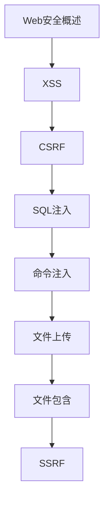

# Web安全 学习指南

> **分类**：安全 ｜ **章节总数**：120 ｜ **技术栈**：Web安全

> **学习声明**：本章内容仅供合法授权环境下的安全研究与防御建设，请遵守法律法规与组织安全政策，禁止对未授权系统开展测试。

## 领域概述

Web安全是安全领域的重要技术方向，本系列从基础到高级逐步深入，涵盖22个核心模块：Web安全概述、跨站脚本风险、跨站请求伪造风险、SQL 注入风险、命令注入等。每个知识点作为独立章节，包含原理讲解、实现要点、常见陷阱和最佳实践，配合源码分析和架构图，帮助读者建立完整的Web安全知识体系。

本教程基于 **通用** 与 **Web安全** 生态编写，涵盖 行业标准工具链 等主流工具与框架。每章独立成篇，文字精炼、逻辑清晰，适合系统学习与按需查阅。

## 你将学到什么

完成本系列后，你将能够：

- 系统理解 **Web安全** 的核心概念与模块划分。
- 按难度递进掌握从入门到实战的完整知识路径。
- 在工程实践中做出合理的技术判断与问题排查。
- 通过章节索引快速定位所需知识点。

## 前置知识

- 编程基础
- 数据结构
- 计算机基础
- 安全基础概念

## 推荐学习路径

1. **Web安全概述**
2. **XSS**
3. **CSRF**
4. **SQL注入**
5. **命令注入**
6. **文件上传**
7. **文件包含**
8. **SSRF**

## 模块体系

本领域按以下模块组织，难度由浅入深：

- **Web安全概述**
- **XSS**
- **CSRF**
- **SQL注入**
- **命令注入**
- **文件上传**
- **文件包含**
- **SSRF**
- **XXE**
- **反序列化**
- **越权**
- **逻辑漏洞**
- **会话管理**
- **认证安全**
- **CORS**
- **HTTPS**
- **CSP**
- **安全头**
- **WAF**
- **代码审计**
- **渗透测试**
- **Web安全最佳实践**

## 难度分布

| 难度 | 章节数 | 占比 |
|------|--------|------|
| 入门 | 30 | 25% |
| 实战 | 25 | 20% |
| 进阶 | 35 | 29% |
| 高级 | 30 | 25% |

## 章节索引

点击章节标题进入对应教程：

### Web安全概述

- [Web安全概述核心概念与原理](chapters/001-Web安全概述核心概念与原理.md) ｜ 入门
- [Web安全概述的实现机制详解](chapters/002-Web安全概述的实现机制详解.md) ｜ 入门
- [Web安全概述的关键技术点](chapters/003-Web安全概述的关键技术点.md) ｜ 入门
- [Web安全概述的源码级分析](chapters/004-Web安全概述的源码级分析.md) ｜ 入门
- [Web安全概述的配置与使用](chapters/005-Web安全概述的配置与使用.md) ｜ 入门
- [Web安全概述的常见问题与解决方案](chapters/006-Web安全概述的常见问题与解决方案.md) ｜ 入门

### XSS

- [跨站脚本风险核心概念与原理](chapters/007-跨站脚本风险核心概念与原理.md) ｜ 入门
- [跨站脚本风险的实现机制详解](chapters/008-跨站脚本风险的实现机制详解.md) ｜ 入门
- [跨站脚本风险的关键技术点](chapters/009-跨站脚本风险的关键技术点.md) ｜ 入门
- [跨站脚本风险的源码级分析](chapters/010-跨站脚本风险的源码级分析.md) ｜ 入门
- [跨站脚本风险的配置与使用](chapters/011-跨站脚本风险的配置与使用.md) ｜ 入门
- [跨站脚本风险的常见问题与解决方案](chapters/012-跨站脚本风险的常见问题与解决方案.md) ｜ 入门

### CSRF

- [跨站请求伪造风险核心概念与原理](chapters/013-跨站请求伪造风险核心概念与原理.md) ｜ 入门
- [跨站请求伪造风险的实现机制详解](chapters/014-跨站请求伪造风险的实现机制详解.md) ｜ 入门
- [跨站请求伪造风险的关键技术点](chapters/015-跨站请求伪造风险的关键技术点.md) ｜ 入门
- [跨站请求伪造风险的源码级分析](chapters/016-跨站请求伪造风险的源码级分析.md) ｜ 入门
- [跨站请求伪造风险的配置与使用](chapters/017-跨站请求伪造风险的配置与使用.md) ｜ 入门
- [跨站请求伪造风险的常见问题与解决方案](chapters/018-跨站请求伪造风险的常见问题与解决方案.md) ｜ 入门

### SQL注入

- [SQL 注入风险核心概念与原理](chapters/019-SQL-注入风险核心概念与原理.md) ｜ 入门
- [SQL 注入风险的实现机制详解](chapters/020-SQL-注入风险的实现机制详解.md) ｜ 入门
- [SQL 注入风险的关键技术点](chapters/021-SQL-注入风险的关键技术点.md) ｜ 入门
- [SQL 注入风险的源码级分析](chapters/022-SQL-注入风险的源码级分析.md) ｜ 入门
- [SQL 注入风险的配置与使用](chapters/023-SQL-注入风险的配置与使用.md) ｜ 入门
- [SQL 注入风险的常见问题与解决方案](chapters/024-SQL-注入风险的常见问题与解决方案.md) ｜ 入门

### 命令注入

- [命令注入核心概念与原理](chapters/025-命令注入核心概念与原理.md) ｜ 入门
- [命令注入的实现机制详解](chapters/026-命令注入的实现机制详解.md) ｜ 入门
- [命令注入的关键技术点](chapters/027-命令注入的关键技术点.md) ｜ 入门
- [命令注入的源码级分析](chapters/028-命令注入的源码级分析.md) ｜ 入门
- [命令注入的配置与使用](chapters/029-命令注入的配置与使用.md) ｜ 入门
- [命令注入的常见问题与解决方案](chapters/030-命令注入的常见问题与解决方案.md) ｜ 入门

### 文件上传

- [文件上传核心概念与原理](chapters/031-文件上传核心概念与原理.md) ｜ 进阶
- [文件上传的实现机制详解](chapters/032-文件上传的实现机制详解.md) ｜ 进阶
- [文件上传的关键技术点](chapters/033-文件上传的关键技术点.md) ｜ 进阶
- [文件上传的源码级分析](chapters/034-文件上传的源码级分析.md) ｜ 进阶
- [文件上传的配置与使用](chapters/035-文件上传的配置与使用.md) ｜ 进阶
- [文件上传的常见问题与解决方案](chapters/036-文件上传的常见问题与解决方案.md) ｜ 进阶

### 文件包含

- [文件包含核心概念与原理](chapters/037-文件包含核心概念与原理.md) ｜ 进阶
- [文件包含的实现机制详解](chapters/038-文件包含的实现机制详解.md) ｜ 进阶
- [文件包含的关键技术点](chapters/039-文件包含的关键技术点.md) ｜ 进阶
- [文件包含的源码级分析](chapters/040-文件包含的源码级分析.md) ｜ 进阶
- [文件包含的配置与使用](chapters/041-文件包含的配置与使用.md) ｜ 进阶
- [文件包含的常见问题与解决方案](chapters/042-文件包含的常见问题与解决方案.md) ｜ 进阶

### SSRF

- [SSRF核心概念与原理](chapters/043-SSRF核心概念与原理.md) ｜ 进阶
- [SSRF的实现机制详解](chapters/044-SSRF的实现机制详解.md) ｜ 进阶
- [SSRF的关键技术点](chapters/045-SSRF的关键技术点.md) ｜ 进阶
- [SSRF的源码级分析](chapters/046-SSRF的源码级分析.md) ｜ 进阶
- [SSRF的配置与使用](chapters/047-SSRF的配置与使用.md) ｜ 进阶
- [SSRF的常见问题与解决方案](chapters/048-SSRF的常见问题与解决方案.md) ｜ 进阶

### XXE

- [XXE核心概念与原理](chapters/049-XXE核心概念与原理.md) ｜ 进阶
- [XXE的实现机制详解](chapters/050-XXE的实现机制详解.md) ｜ 进阶
- [XXE的关键技术点](chapters/051-XXE的关键技术点.md) ｜ 进阶
- [XXE的源码级分析](chapters/052-XXE的源码级分析.md) ｜ 进阶
- [XXE的配置与使用](chapters/053-XXE的配置与使用.md) ｜ 进阶
- [XXE的常见问题与解决方案](chapters/054-XXE的常见问题与解决方案.md) ｜ 进阶

### 反序列化

- [反序列化核心概念与原理](chapters/055-反序列化核心概念与原理.md) ｜ 进阶
- [反序列化的实现机制详解](chapters/056-反序列化的实现机制详解.md) ｜ 进阶
- [反序列化的关键技术点](chapters/057-反序列化的关键技术点.md) ｜ 进阶
- [反序列化的源码级分析](chapters/058-反序列化的源码级分析.md) ｜ 进阶
- [反序列化的配置与使用](chapters/059-反序列化的配置与使用.md) ｜ 进阶
- [反序列化的常见问题与解决方案](chapters/060-反序列化的常见问题与解决方案.md) ｜ 进阶

### 越权

- [越权核心概念与原理](chapters/061-越权核心概念与原理.md) ｜ 进阶
- [越权的实现机制详解](chapters/062-越权的实现机制详解.md) ｜ 进阶
- [越权的关键技术点](chapters/063-越权的关键技术点.md) ｜ 进阶
- [越权的源码级分析](chapters/064-越权的源码级分析.md) ｜ 进阶
- [越权的配置与使用](chapters/065-越权的配置与使用.md) ｜ 进阶

### 逻辑漏洞

- [逻辑漏洞核心概念与原理](chapters/066-逻辑漏洞核心概念与原理.md) ｜ 高级
- [逻辑漏洞的实现机制详解](chapters/067-逻辑漏洞的实现机制详解.md) ｜ 高级
- [逻辑漏洞的关键技术点](chapters/068-逻辑漏洞的关键技术点.md) ｜ 高级
- [逻辑漏洞的源码级分析](chapters/069-逻辑漏洞的源码级分析.md) ｜ 高级
- [逻辑漏洞的配置与使用](chapters/070-逻辑漏洞的配置与使用.md) ｜ 高级

### 会话管理

- [会话管理核心概念与原理](chapters/071-会话管理核心概念与原理.md) ｜ 高级
- [会话管理的实现机制详解](chapters/072-会话管理的实现机制详解.md) ｜ 高级
- [会话管理的关键技术点](chapters/073-会话管理的关键技术点.md) ｜ 高级
- [会话管理的源码级分析](chapters/074-会话管理的源码级分析.md) ｜ 高级
- [会话管理的配置与使用](chapters/075-会话管理的配置与使用.md) ｜ 高级

### 认证安全

- [认证安全核心概念与原理](chapters/076-认证安全核心概念与原理.md) ｜ 高级
- [认证安全的实现机制详解](chapters/077-认证安全的实现机制详解.md) ｜ 高级
- [认证安全的关键技术点](chapters/078-认证安全的关键技术点.md) ｜ 高级
- [认证安全的源码级分析](chapters/079-认证安全的源码级分析.md) ｜ 高级
- [认证安全的配置与使用](chapters/080-认证安全的配置与使用.md) ｜ 高级

### CORS

- [CORS核心概念与原理](chapters/081-CORS核心概念与原理.md) ｜ 高级
- [CORS的实现机制详解](chapters/082-CORS的实现机制详解.md) ｜ 高级
- [CORS的关键技术点](chapters/083-CORS的关键技术点.md) ｜ 高级
- [CORS的源码级分析](chapters/084-CORS的源码级分析.md) ｜ 高级
- [CORS的配置与使用](chapters/085-CORS的配置与使用.md) ｜ 高级

### HTTPS

- [HTTPS核心概念与原理](chapters/086-HTTPS核心概念与原理.md) ｜ 高级
- [HTTPS的实现机制详解](chapters/087-HTTPS的实现机制详解.md) ｜ 高级
- [HTTPS的关键技术点](chapters/088-HTTPS的关键技术点.md) ｜ 高级
- [HTTPS的源码级分析](chapters/089-HTTPS的源码级分析.md) ｜ 高级
- [HTTPS的配置与使用](chapters/090-HTTPS的配置与使用.md) ｜ 高级

### CSP

- [CSP核心概念与原理](chapters/091-CSP核心概念与原理.md) ｜ 高级
- [CSP的实现机制详解](chapters/092-CSP的实现机制详解.md) ｜ 高级
- [CSP的关键技术点](chapters/093-CSP的关键技术点.md) ｜ 高级
- [CSP的源码级分析](chapters/094-CSP的源码级分析.md) ｜ 高级
- [CSP的配置与使用](chapters/095-CSP的配置与使用.md) ｜ 高级

### 安全头

- [安全头核心概念与原理](chapters/096-安全头核心概念与原理.md) ｜ 实战
- [安全头的实现机制详解](chapters/097-安全头的实现机制详解.md) ｜ 实战
- [安全头的关键技术点](chapters/098-安全头的关键技术点.md) ｜ 实战
- [安全头的源码级分析](chapters/099-安全头的源码级分析.md) ｜ 实战
- [安全头的配置与使用](chapters/100-安全头的配置与使用.md) ｜ 实战

### WAF

- [WAF核心概念与原理](chapters/101-WAF核心概念与原理.md) ｜ 实战
- [WAF的实现机制详解](chapters/102-WAF的实现机制详解.md) ｜ 实战
- [WAF的关键技术点](chapters/103-WAF的关键技术点.md) ｜ 实战
- [WAF的源码级分析](chapters/104-WAF的源码级分析.md) ｜ 实战
- [WAF的配置与使用](chapters/105-WAF的配置与使用.md) ｜ 实战

### 代码审计

- [代码审计核心概念与原理](chapters/106-代码审计核心概念与原理.md) ｜ 实战
- [代码审计的实现机制详解](chapters/107-代码审计的实现机制详解.md) ｜ 实战
- [代码审计的关键技术点](chapters/108-代码审计的关键技术点.md) ｜ 实战
- [代码审计的源码级分析](chapters/109-代码审计的源码级分析.md) ｜ 实战
- [代码审计的配置与使用](chapters/110-代码审计的配置与使用.md) ｜ 实战

### 渗透测试

- [授权安全评估测试核心概念与原理](chapters/111-授权安全评估测试核心概念与原理.md) ｜ 实战
- [授权安全评估测试的实现机制详解](chapters/112-授权安全评估测试的实现机制详解.md) ｜ 实战
- [授权安全评估测试的关键技术点](chapters/113-授权安全评估测试的关键技术点.md) ｜ 实战
- [授权安全评估测试的源码级分析](chapters/114-授权安全评估测试的源码级分析.md) ｜ 实战
- [授权安全评估测试的配置与使用](chapters/115-授权安全评估测试的配置与使用.md) ｜ 实战

### Web安全最佳实践

- [Web安全最佳实践核心概念与原理](chapters/116-Web安全最佳实践核心概念与原理.md) ｜ 实战
- [Web安全最佳实践的实现机制详解](chapters/117-Web安全最佳实践的实现机制详解.md) ｜ 实战
- [Web安全最佳实践的关键技术点](chapters/118-Web安全最佳实践的关键技术点.md) ｜ 实战
- [Web安全最佳实践的源码级分析](chapters/119-Web安全最佳实践的源码级分析.md) ｜ 实战
- [Web安全最佳实践的配置与使用](chapters/120-Web安全最佳实践的配置与使用.md) ｜ 实战

## 学习方法建议

1. **先读概述再读章节**：用本指南建立全局地图，避免迷失在细节中。
2. **按模块递进**：同一模块内章节有前后关联，顺序阅读效果更好。
3. **主动复述**：每章读完后，用三五句话概括「是什么、为什么、怎么用」。
4. **关联阅读**：利用章节底部的「延伸学习」在同模块内构建知识网络。
5. **对照官方文档**：本教程提供结构化视角，细节以官方文档为准。

---
*领域: Web安全 ｜ 版本: 2.0 ｜ 共 120 章*