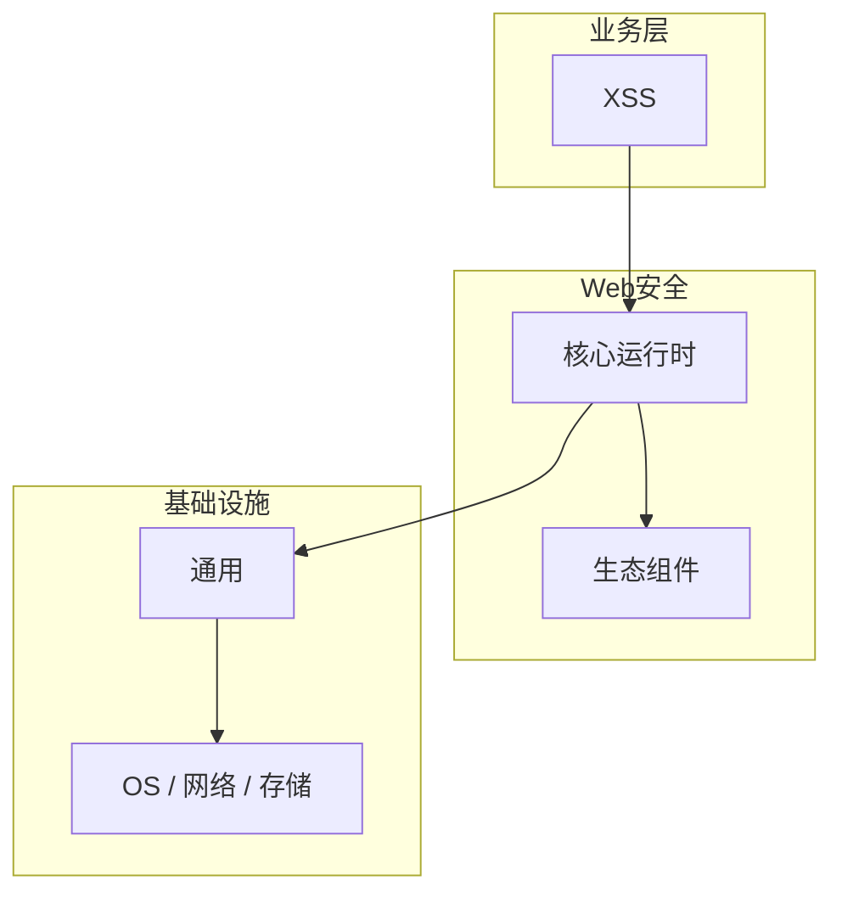

# 跨站脚本风险核心概念与原理

> **领域**：Web安全 ｜ **模块**：XSS ｜ **难度**：入门 ｜ **类型**：基础概念

> **学习声明**：本章内容仅供合法授权环境下的安全研究与防御建设，请遵守法律法规与组织安全政策，禁止对未授权系统开展测试。

## 导读

本章系统讲解 **Web安全** 中 **XSS** 的相关知识（基础概念）。本章建立 **XSS** 的概念模型与工作原理，是后续专题章节的基础。内容基于主流框架与工程实践撰写，不依赖过时概念堆砌。

## 核心知识

**XSS** 是 Web安全 领域的核心主题。跨站脚本（XSS）的三种类型与防御编码、CSP 策略。本模块从原理与工程实践出发，帮助读者建立系统理解。 本教程内容仅供合法授权的安全测试、防御加固与学术研究使用。未经授权对他人系统进行扫描、入侵或破坏属于违法行为。

### 核心知识

**1. 反射型 XSS**

恶意脚本通过 URL 参数注入，服务端未过滤直接回显。防御：输出编码 + 输入校验。

**2. 存储型 XSS**

恶意脚本持久化存储在数据库，所有访问用户受影响。防御：入库前 sanitize + CSP。

**3. DOM XSS**

纯客户端 JavaScript 不安全操作 DOM 导致。防御：避免 innerHTML，使用 textContent。

## 架构与流程

## 技术详解

### 基础理解

**XSS** 是 Web安全 领域的核心主题。跨站脚本（XSS）的三种类型与防御编码、CSP 策略。本模块从原理与工程实践出发，帮助读者建立系统理解。 本教程内容仅供合法授权的安全测试、防御加固与学术研究使用。未经授权对他人系统进行扫描、入侵或破坏属于违法行为。

1. 理解 XSS 概念 → 2. 学习标准用法 → 3. 动手实验 → 4. 分析案例 → 5. 总结最佳实践。

## 原理与实现

### 工作机制

攻击者注入脚本 → 浏览器执行 → 窃取 Cookie/Token 或篡改页面。HttpOnly Cookie 与 CSP 是核心防御。

### 内部实现

XSS 的底层实现依赖 Web安全 生态中的标准组件与协议，建议阅读官方规范文档。

## 操作流程与实践

### 操作流程

1. 理解 XSS 概念 → 2. 学习标准用法 → 3. 动手实验 → 4. 分析案例 → 5. 总结最佳实践。

### 配置要点

配置 XSS 时遵循官方推荐默认值，仅在理解影响后调整参数。

## 性能、安全与排查

### 性能优化

评估 XSS 性能时建立基准测试，关注时间/空间复杂度或系统吞吐延迟指标。

### 安全注意

防御视角：对所有用户输入做上下文相关编码（HTML/JS/URL），部署 Content-Security-Policy 限制脚本来源。

### 调试排错

排查 XSS 问题时，结合日志、监控与最小复现用例逐步定位根因。

## 案例与选型

### 案例复盘

在典型 Web安全 项目中，正确应用 XSS 可显著提升系统质量与可维护性。

### 方案对比

选择 XSS 方案时需对比多种替代方案的适用场景、性能与生态支持。

### 常见误区与纠正

**概念理解偏差**

对 XSS 理解不全面导致误用，应回到官方文档重新梳理。

**忽视边界条件**

XSS 在极端输入或高并发下行为可能不同，需充分测试。

**缺少监控**

未对 XSS 关键指标监控，问题只能被动发现。

### 最佳实践

1. 遵循 Web安全 领域 XSS 的官方推荐实践
2. 为 XSS 相关功能编写自动化测试
3. 关键配置纳入版本管理与变更审计
4. 生产部署前在接近真实环境验证

## 巩固建议

建议结合 **Web安全** 官方文档与小型实验，亲手验证 **XSS** 的默认行为与边界条件；将本章要点整理为检查清单或 ADR，便于评审与团队 onboarding。

### 本章小结

学完本章，你应能独立说明 **XSS** 在 Web安全 中的角色，理解其核心机制，规避常见误区，并在项目中正确运用。

## 延伸学习

- 跨站脚本风险的实现机制详解
- 跨站脚本风险的关键技术点
- 跨站脚本风险的源码级分析
- 跨站脚本风险的配置与使用
- 跨站脚本风险的常见问题与解决方案

### 延伸阅读

- Web安全 官方文档 - XSS
- OWASP / NIST 相关指南（如适用）
- 权威书籍与 RFC 标准文档

---
*章节 ID: 007 ｜ 领域: Web安全*