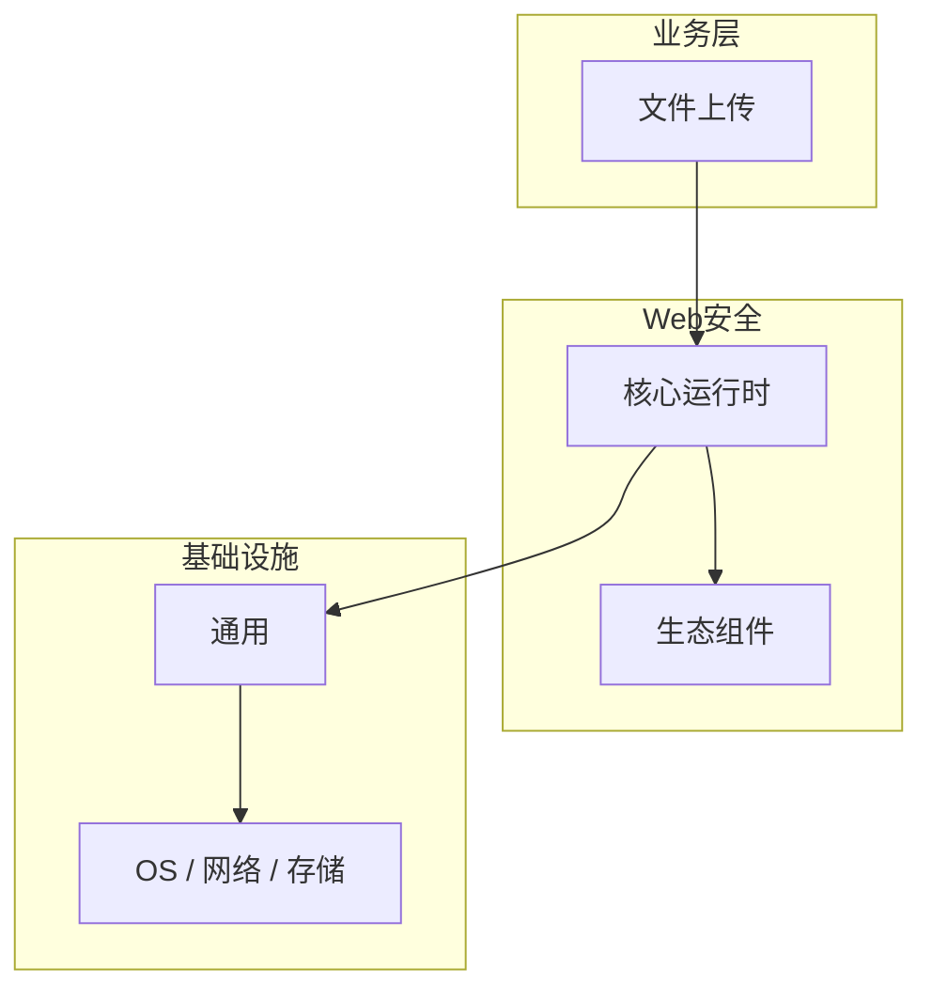

# 文件上传核心概念与原理

> **领域**：Web安全 ｜ **模块**：文件上传 ｜ **难度**：进阶 ｜ **类型**：基础概念

> **学习声明**：本章内容仅供合法授权环境下的安全研究与防御建设，请遵守法律法规与组织安全政策，禁止对未授权系统开展测试。

## 导读

本章系统讲解 **Web安全** 中 **文件上传** 的相关知识（基础概念）。本章建立 **文件上传** 的概念模型与工作原理，是后续专题章节的基础。内容基于主流框架与工程实践撰写，不依赖过时概念堆砌。

## 核心知识

**文件上传** 是 Web安全 领域的核心主题。不安全文件上传的类型校验、存储隔离与执行防护。本模块从原理与工程实践出发，帮助读者建立系统理解。 本教程内容仅供合法授权的安全测试、防御加固与学术研究使用。未经授权对他人系统进行扫描、入侵或破坏属于违法行为。

### 核心知识

**1. 风险**

上传 WebShell（.php/.jsp）获取服务器控制权。

**2. 防御**

白名单扩展名 + MIME 校验 + 重命名 + 存储到非 Web 目录 + 禁止执行。

**3. 内容检测**

Magic Number 校验文件头，不仅依赖扩展名。

## 架构与流程

## 技术详解

### 基础理解

**文件上传** 是 Web安全 领域的核心主题。不安全文件上传的类型校验、存储隔离与执行防护。本模块从原理与工程实践出发，帮助读者建立系统理解。 本教程内容仅供合法授权的安全测试、防御加固与学术研究使用。未经授权对他人系统进行扫描、入侵或破坏属于违法行为。

1. 理解 文件上传 概念 → 2. 学习标准用法 → 3. 动手实验 → 4. 分析案例 → 5. 总结最佳实践。

## 原理与实现

### 工作机制

上传 → 校验 → 存储（对象存储/CDN）→ 返回 URL。禁止在 Web 根目录存储可执行文件。

### 内部实现

文件上传 的底层实现依赖 Web安全 生态中的标准组件与协议，建议阅读官方规范文档。

## 操作流程与实践

### 操作流程

1. 理解 文件上传 概念 → 2. 学习标准用法 → 3. 动手实验 → 4. 分析案例 → 5. 总结最佳实践。

### 配置要点

配置 文件上传 时遵循官方推荐默认值，仅在理解影响后调整参数。

## 性能、安全与排查

### 性能优化

评估 文件上传 性能时建立基准测试，关注时间/空间复杂度或系统吞吐延迟指标。

### 安全注意

本教程内容仅供合法授权的安全测试、防御加固与学术研究使用。未经授权对他人系统进行扫描、入侵或破坏属于违法行为。

### 调试排错

排查 文件上传 问题时，结合日志、监控与最小复现用例逐步定位根因。

## 案例与选型

### 案例复盘

在典型 Web安全 项目中，正确应用 文件上传 可显著提升系统质量与可维护性。

### 方案对比

选择 文件上传 方案时需对比多种替代方案的适用场景、性能与生态支持。

### 常见误区与纠正

**概念理解偏差**

对 文件上传 理解不全面导致误用，应回到官方文档重新梳理。

**忽视边界条件**

文件上传 在极端输入或高并发下行为可能不同，需充分测试。

**缺少监控**

未对 文件上传 关键指标监控，问题只能被动发现。

### 最佳实践

1. 遵循 Web安全 领域 文件上传 的官方推荐实践
2. 为 文件上传 相关功能编写自动化测试
3. 关键配置纳入版本管理与变更审计
4. 生产部署前在接近真实环境验证

## 巩固建议

建议结合 **Web安全** 官方文档与小型实验，亲手验证 **文件上传** 的默认行为与边界条件；将本章要点整理为检查清单或 ADR，便于评审与团队 onboarding。

### 本章小结

学完本章，你应能独立说明 **文件上传** 在 Web安全 中的角色，理解其核心机制，规避常见误区，并在项目中正确运用。

## 延伸学习

- 文件上传的实现机制详解
- 文件上传的关键技术点
- 文件上传的源码级分析
- 文件上传的配置与使用
- 文件上传的常见问题与解决方案

### 延伸阅读

- Web安全 官方文档 - 文件上传
- OWASP / NIST 相关指南（如适用）
- 权威书籍与 RFC 标准文档

---
*章节 ID: 031 ｜ 领域: Web安全*