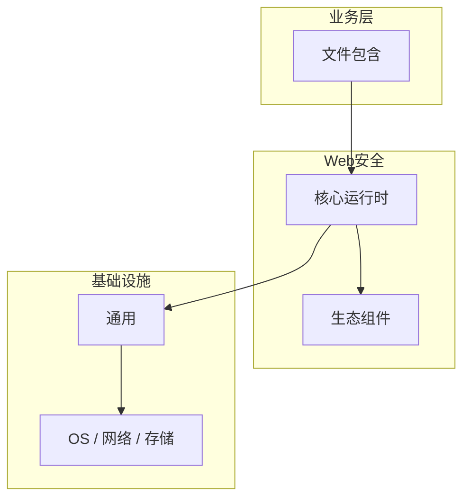

# 文件包含的关键技术点

> **领域**：Web安全 ｜ **模块**：文件包含 ｜ **难度**：进阶 ｜ **类型**：关键技术

> **学习声明**：本章内容仅供合法授权环境下的安全研究与防御建设，请遵守法律法规与组织安全政策，禁止对未授权系统开展测试。

## 导读

本章系统讲解 **Web安全** 中 **文件包含** 的相关知识（关键技术）。本章归纳 **文件包含** 在生产环境中最常用、最易出错的关键技术点。内容基于主流框架与工程实践撰写，不依赖过时概念堆砌。

## 核心知识

**文件包含** 是 Web安全 领域的核心主题。本地/远程文件包含（LFI/RFI）与路径规范化防御。本模块从原理与工程实践出发，帮助读者建立系统理解。 本教程内容仅供合法授权的安全测试、防御加固与学术研究使用。未经授权对他人系统进行扫描、入侵或破坏属于违法行为。

### 核心知识

**1. LFI**

通过 ../ 遍历读取服务器敏感文件（/etc/passwd）。

**2. RFI**

包含远程恶意脚本（PHP allow_url_include）。

**3. 防御**

禁止用户控制包含路径；使用白名单映射；关闭 allow_url_include。

## 架构与流程

## 技术详解

### 关键技术

include($user_input) → 攻击者传入 ../../etc/passwd → 敏感信息泄露。

## 原理与实现

### 工作机制

include($user_input) → 攻击者传入 ../../etc/passwd → 敏感信息泄露。

### 内部实现

文件包含 的底层实现依赖 Web安全 生态中的标准组件与协议，建议阅读官方规范文档。

## 操作流程与实践

### 操作流程

1. 理解 文件包含 概念 → 2. 学习标准用法 → 3. 动手实验 → 4. 分析案例 → 5. 总结最佳实践。

### 配置要点

配置 文件包含 时遵循官方推荐默认值，仅在理解影响后调整参数。

## 性能、安全与排查

### 性能优化

评估 文件包含 性能时建立基准测试，关注时间/空间复杂度或系统吞吐延迟指标。

### 安全注意

本教程内容仅供合法授权的安全测试、防御加固与学术研究使用。未经授权对他人系统进行扫描、入侵或破坏属于违法行为。

### 调试排错

排查 文件包含 问题时，结合日志、监控与最小复现用例逐步定位根因。

## 案例与选型

### 案例复盘

在典型 Web安全 项目中，正确应用 文件包含 可显著提升系统质量与可维护性。

### 方案对比

选择 文件包含 方案时需对比多种替代方案的适用场景、性能与生态支持。

## 本章聚焦

**文件包含** 的关键技术往往集中在默认配置与边界行为；生产问题多源于「以为懂了」的细节，应用 checklist 逐项验证。

### 常见误区与纠正

**概念理解偏差**

对 文件包含 理解不全面导致误用，应回到官方文档重新梳理。

**忽视边界条件**

文件包含 在极端输入或高并发下行为可能不同，需充分测试。

**缺少监控**

未对 文件包含 关键指标监控，问题只能被动发现。

### 最佳实践

1. 遵循 Web安全 领域 文件包含 的官方推荐实践
2. 为 文件包含 相关功能编写自动化测试
3. 关键配置纳入版本管理与变更审计
4. 生产部署前在接近真实环境验证

## 巩固建议

建议结合 **Web安全** 官方文档与小型实验，亲手验证 **文件包含** 的默认行为与边界条件；将本章要点整理为检查清单或 ADR，便于评审与团队 onboarding。

### 本章小结

学完本章，你应能独立说明 **文件包含** 在 Web安全 中的角色，理解其核心机制，规避常见误区，并在项目中正确运用。

## 延伸学习

- 文件包含核心概念与原理
- 文件包含的实现机制详解
- 文件包含的源码级分析
- 文件包含的配置与使用
- 文件包含的常见问题与解决方案

### 延伸阅读

- Web安全 官方文档 - 文件包含
- OWASP / NIST 相关指南（如适用）
- 权威书籍与 RFC 标准文档

---
*章节 ID: 039 ｜ 领域: Web安全*