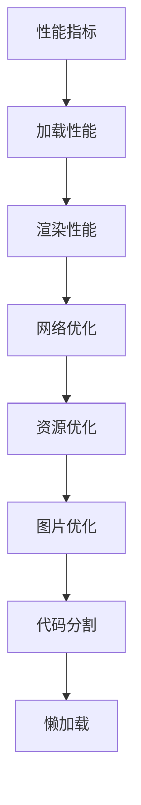

# Web性能优化 学习指南

> **分类**：前端开发 ｜ **章节总数**：100 ｜ **技术栈**：Web标准

## 领域概述

Web性能优化是前端开发领域的重要技术方向，本系列从基础到高级逐步深入，涵盖17个核心模块：性能指标、加载性能、渲染性能、网络优化、资源优化等。每个知识点作为独立章节，包含原理讲解、实现要点、常见陷阱和最佳实践，配合源码分析和架构图，帮助读者建立完整的Web性能优化知识体系。

本教程基于 **JavaScript** 与 **Web标准** 生态编写，涵盖 Lighthouse, Web Vitals 等主流工具与框架。每章独立成篇，文字精炼、逻辑清晰，适合系统学习与按需查阅。

## 你将学到什么

完成本系列后，你将能够：

- 系统理解 **Web性能优化** 的核心概念与模块划分。
- 按难度递进掌握从入门到实战的完整知识路径。
- 在工程实践中做出合理的技术判断与问题排查。
- 通过章节索引快速定位所需知识点。

## 前置知识

- 编程基础
- 数据结构
- 计算机基础
- 前端开发基础概念

## 推荐学习路径

1. **性能指标**
2. **加载性能**
3. **渲染性能**
4. **网络优化**
5. **资源优化**
6. **图片优化**
7. **代码分割**
8. **懒加载**

## 模块体系

本领域按以下模块组织，难度由浅入深：

- **性能指标**
- **加载性能**
- **渲染性能**
- **网络优化**
- **资源优化**
- **图片优化**
- **代码分割**
- **懒加载**
- **预加载**
- **缓存策略**
- **CDN**
- **HTTP/2与HTTP/3**
- **运行时优化**
- **性能监控**
- **性能预算**
- **Lighthouse**
- **性能优化最佳实践**

## 难度分布

| 难度 | 章节数 | 占比 |
|------|--------|------|
| 入门 | 24 | 24% |
| 实战 | 22 | 22% |
| 进阶 | 24 | 24% |
| 高级 | 30 | 30% |

## 章节索引

点击章节标题进入对应教程：

### 性能指标

- [性能指标核心概念与原理](chapters/001-性能指标核心概念与原理.md) ｜ 入门
- [性能指标的实现机制详解](chapters/002-性能指标的实现机制详解.md) ｜ 入门
- [性能指标的关键技术点](chapters/003-性能指标的关键技术点.md) ｜ 入门
- [性能指标的源码级分析](chapters/004-性能指标的源码级分析.md) ｜ 入门
- [性能指标的配置与使用](chapters/005-性能指标的配置与使用.md) ｜ 入门
- [性能指标的常见问题与解决方案](chapters/006-性能指标的常见问题与解决方案.md) ｜ 入门

### 加载性能

- [加载性能核心概念与原理](chapters/007-加载性能核心概念与原理.md) ｜ 入门
- [加载性能的实现机制详解](chapters/008-加载性能的实现机制详解.md) ｜ 入门
- [加载性能的关键技术点](chapters/009-加载性能的关键技术点.md) ｜ 入门
- [加载性能的源码级分析](chapters/010-加载性能的源码级分析.md) ｜ 入门
- [加载性能的配置与使用](chapters/011-加载性能的配置与使用.md) ｜ 入门
- [加载性能的常见问题与解决方案](chapters/012-加载性能的常见问题与解决方案.md) ｜ 入门

### 渲染性能

- [渲染性能核心概念与原理](chapters/013-渲染性能核心概念与原理.md) ｜ 入门
- [渲染性能的实现机制详解](chapters/014-渲染性能的实现机制详解.md) ｜ 入门
- [渲染性能的关键技术点](chapters/015-渲染性能的关键技术点.md) ｜ 入门
- [渲染性能的源码级分析](chapters/016-渲染性能的源码级分析.md) ｜ 入门
- [渲染性能的配置与使用](chapters/017-渲染性能的配置与使用.md) ｜ 入门
- [渲染性能的常见问题与解决方案](chapters/018-渲染性能的常见问题与解决方案.md) ｜ 入门

### 网络优化

- [网络优化核心概念与原理](chapters/019-网络优化核心概念与原理.md) ｜ 入门
- [网络优化的实现机制详解](chapters/020-网络优化的实现机制详解.md) ｜ 入门
- [网络优化的关键技术点](chapters/021-网络优化的关键技术点.md) ｜ 入门
- [网络优化的源码级分析](chapters/022-网络优化的源码级分析.md) ｜ 入门
- [网络优化的配置与使用](chapters/023-网络优化的配置与使用.md) ｜ 入门
- [网络优化的常见问题与解决方案](chapters/024-网络优化的常见问题与解决方案.md) ｜ 入门

### 资源优化

- [资源优化核心概念与原理](chapters/025-资源优化核心概念与原理.md) ｜ 进阶
- [资源优化的实现机制详解](chapters/026-资源优化的实现机制详解.md) ｜ 进阶
- [资源优化的关键技术点](chapters/027-资源优化的关键技术点.md) ｜ 进阶
- [资源优化的源码级分析](chapters/028-资源优化的源码级分析.md) ｜ 进阶
- [资源优化的配置与使用](chapters/029-资源优化的配置与使用.md) ｜ 进阶
- [资源优化的常见问题与解决方案](chapters/030-资源优化的常见问题与解决方案.md) ｜ 进阶

### 图片优化

- [图片优化核心概念与原理](chapters/031-图片优化核心概念与原理.md) ｜ 进阶
- [图片优化的实现机制详解](chapters/032-图片优化的实现机制详解.md) ｜ 进阶
- [图片优化的关键技术点](chapters/033-图片优化的关键技术点.md) ｜ 进阶
- [图片优化的源码级分析](chapters/034-图片优化的源码级分析.md) ｜ 进阶
- [图片优化的配置与使用](chapters/035-图片优化的配置与使用.md) ｜ 进阶
- [图片优化的常见问题与解决方案](chapters/036-图片优化的常见问题与解决方案.md) ｜ 进阶

### 代码分割

- [代码分割核心概念与原理](chapters/037-代码分割核心概念与原理.md) ｜ 进阶
- [代码分割的实现机制详解](chapters/038-代码分割的实现机制详解.md) ｜ 进阶
- [代码分割的关键技术点](chapters/039-代码分割的关键技术点.md) ｜ 进阶
- [代码分割的源码级分析](chapters/040-代码分割的源码级分析.md) ｜ 进阶
- [代码分割的配置与使用](chapters/041-代码分割的配置与使用.md) ｜ 进阶
- [代码分割的常见问题与解决方案](chapters/042-代码分割的常见问题与解决方案.md) ｜ 进阶

### 懒加载

- [懒加载核心概念与原理](chapters/043-懒加载核心概念与原理.md) ｜ 进阶
- [懒加载的实现机制详解](chapters/044-懒加载的实现机制详解.md) ｜ 进阶
- [懒加载的关键技术点](chapters/045-懒加载的关键技术点.md) ｜ 进阶
- [懒加载的源码级分析](chapters/046-懒加载的源码级分析.md) ｜ 进阶
- [懒加载的配置与使用](chapters/047-懒加载的配置与使用.md) ｜ 进阶
- [懒加载的常见问题与解决方案](chapters/048-懒加载的常见问题与解决方案.md) ｜ 进阶

### 预加载

- [预加载核心概念与原理](chapters/049-预加载核心概念与原理.md) ｜ 高级
- [预加载的实现机制详解](chapters/050-预加载的实现机制详解.md) ｜ 高级
- [预加载的关键技术点](chapters/051-预加载的关键技术点.md) ｜ 高级
- [预加载的源码级分析](chapters/052-预加载的源码级分析.md) ｜ 高级
- [预加载的配置与使用](chapters/053-预加载的配置与使用.md) ｜ 高级
- [预加载的常见问题与解决方案](chapters/054-预加载的常见问题与解决方案.md) ｜ 高级

### 缓存策略

- [缓存策略核心概念与原理](chapters/055-缓存策略核心概念与原理.md) ｜ 高级
- [缓存策略的实现机制详解](chapters/056-缓存策略的实现机制详解.md) ｜ 高级
- [缓存策略的关键技术点](chapters/057-缓存策略的关键技术点.md) ｜ 高级
- [缓存策略的源码级分析](chapters/058-缓存策略的源码级分析.md) ｜ 高级
- [缓存策略的配置与使用](chapters/059-缓存策略的配置与使用.md) ｜ 高级
- [缓存策略的常见问题与解决方案](chapters/060-缓存策略的常见问题与解决方案.md) ｜ 高级

### CDN

- [CDN核心概念与原理](chapters/061-CDN核心概念与原理.md) ｜ 高级
- [CDN的实现机制详解](chapters/062-CDN的实现机制详解.md) ｜ 高级
- [CDN的关键技术点](chapters/063-CDN的关键技术点.md) ｜ 高级
- [CDN的源码级分析](chapters/064-CDN的源码级分析.md) ｜ 高级
- [CDN的配置与使用](chapters/065-CDN的配置与使用.md) ｜ 高级
- [CDN的常见问题与解决方案](chapters/066-CDN的常见问题与解决方案.md) ｜ 高级

### HTTP/2与HTTP/3

- [HTTP/2与HTTP/3核心概念与原理](chapters/067-HTTP2与HTTP3核心概念与原理.md) ｜ 高级
- [HTTP/2与HTTP/3的实现机制详解](chapters/068-HTTP2与HTTP3的实现机制详解.md) ｜ 高级
- [HTTP/2与HTTP/3的关键技术点](chapters/069-HTTP2与HTTP3的关键技术点.md) ｜ 高级
- [HTTP/2与HTTP/3的源码级分析](chapters/070-HTTP2与HTTP3的源码级分析.md) ｜ 高级
- [HTTP/2与HTTP/3的配置与使用](chapters/071-HTTP2与HTTP3的配置与使用.md) ｜ 高级
- [HTTP/2与HTTP/3的常见问题与解决方案](chapters/072-HTTP2与HTTP3的常见问题与解决方案.md) ｜ 高级

### 运行时优化

- [运行时优化核心概念与原理](chapters/073-运行时优化核心概念与原理.md) ｜ 高级
- [运行时优化的实现机制详解](chapters/074-运行时优化的实现机制详解.md) ｜ 高级
- [运行时优化的关键技术点](chapters/075-运行时优化的关键技术点.md) ｜ 高级
- [运行时优化的源码级分析](chapters/076-运行时优化的源码级分析.md) ｜ 高级
- [运行时优化的配置与使用](chapters/077-运行时优化的配置与使用.md) ｜ 高级
- [运行时优化的常见问题与解决方案](chapters/078-运行时优化的常见问题与解决方案.md) ｜ 高级

### 性能监控

- [性能监控核心概念与原理](chapters/079-性能监控核心概念与原理.md) ｜ 实战
- [性能监控的实现机制详解](chapters/080-性能监控的实现机制详解.md) ｜ 实战
- [性能监控的关键技术点](chapters/081-性能监控的关键技术点.md) ｜ 实战
- [性能监控的源码级分析](chapters/082-性能监控的源码级分析.md) ｜ 实战
- [性能监控的配置与使用](chapters/083-性能监控的配置与使用.md) ｜ 实战
- [性能监控的常见问题与解决方案](chapters/084-性能监控的常见问题与解决方案.md) ｜ 实战

### 性能预算

- [性能预算核心概念与原理](chapters/085-性能预算核心概念与原理.md) ｜ 实战
- [性能预算的实现机制详解](chapters/086-性能预算的实现机制详解.md) ｜ 实战
- [性能预算的关键技术点](chapters/087-性能预算的关键技术点.md) ｜ 实战
- [性能预算的源码级分析](chapters/088-性能预算的源码级分析.md) ｜ 实战
- [性能预算的配置与使用](chapters/089-性能预算的配置与使用.md) ｜ 实战
- [性能预算的常见问题与解决方案](chapters/090-性能预算的常见问题与解决方案.md) ｜ 实战

### Lighthouse

- [Lighthouse核心概念与原理](chapters/091-Lighthouse核心概念与原理.md) ｜ 实战
- [Lighthouse的实现机制详解](chapters/092-Lighthouse的实现机制详解.md) ｜ 实战
- [Lighthouse的关键技术点](chapters/093-Lighthouse的关键技术点.md) ｜ 实战
- [Lighthouse的源码级分析](chapters/094-Lighthouse的源码级分析.md) ｜ 实战
- [Lighthouse的配置与使用](chapters/095-Lighthouse的配置与使用.md) ｜ 实战

### 性能优化最佳实践

- [性能优化最佳实践核心概念与原理](chapters/096-性能优化最佳实践核心概念与原理.md) ｜ 实战
- [性能优化最佳实践的实现机制详解](chapters/097-性能优化最佳实践的实现机制详解.md) ｜ 实战
- [性能优化最佳实践的关键技术点](chapters/098-性能优化最佳实践的关键技术点.md) ｜ 实战
- [性能优化最佳实践的源码级分析](chapters/099-性能优化最佳实践的源码级分析.md) ｜ 实战
- [性能优化最佳实践的配置与使用](chapters/100-性能优化最佳实践的配置与使用.md) ｜ 实战

## 学习方法建议

1. **先读概述再读章节**：用本指南建立全局地图，避免迷失在细节中。
2. **按模块递进**：同一模块内章节有前后关联，顺序阅读效果更好。
3. **主动复述**：每章读完后，用三五句话概括「是什么、为什么、怎么用」。
4. **关联阅读**：利用章节底部的「延伸学习」在同模块内构建知识网络。
5. **对照官方文档**：本教程提供结构化视角，细节以官方文档为准。

---
*领域: Web性能优化 ｜ 版本: 2.0 ｜ 共 100 章*