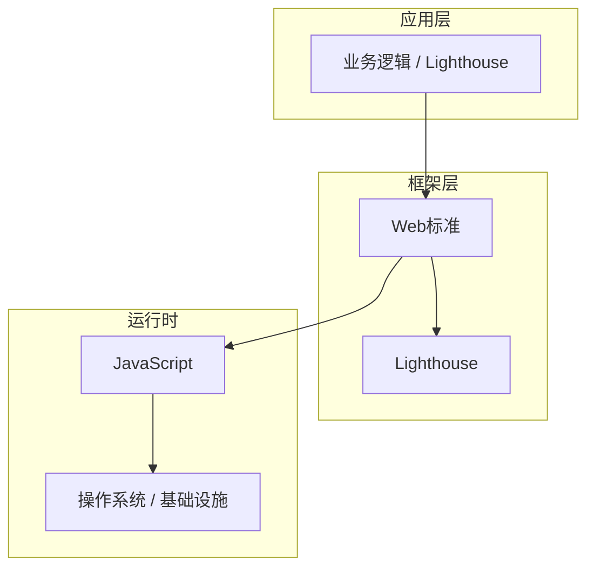

# Lighthouse核心概念与原理

> **领域**：Web性能优化 ｜ **模块**：Lighthouse ｜ **难度**：实战 ｜ **类型**：基础概念

## 导读

本章属于 **Web性能优化** 教程的 **Lighthouse** 模块，难度为 **实战**。阅读重点在于建立清晰的概念模型与工程判断能力，而非死记细节。

## 核心概念

Web 性能直接影响转化与留存，Core Web Vitals（LCP、INP、CLS）是 Google 提出的用户体验度量标准。

在 **Web性能优化** 体系中，**Lighthouse** 与上下游模块形成协作。技术栈以 **Web标准** 为核心（JavaScript），生态包括 Lighthouse, Web Vitals。

「Lighthouse」是该领域的核心知识模块，理解其原理与边界是工程实践的基础。

### 概念精讲

**Lighthouse的基本概念与定义**

从数据出发：输入输出是什么格式，状态如何变迁。 在 Lighthouse 语境下，这一点直接影响设计决策与故障排查思路。

**Lighthouse在Web性能优化中的作用与地位**

从关系出发：它与上下游模块的依赖与接口契约。 在 Lighthouse 语境下，这一点直接影响设计决策与故障排查思路。

**Lighthouse的核心数据结构**

从实践出发：典型应用场景与反模式（不该用的场景）。 在 Lighthouse 语境下，这一点直接影响设计决策与故障排查思路。

**Lighthouse的关键算法与流程**

从演进出发：历史上为何出现、未来可能如何变化。 在 Lighthouse 语境下，这一点直接影响设计决策与故障排查思路。

**Lighthouse与其他模块的关系**

从度量出发：如何评估它是否工作正常、性能是否达标。 在 Lighthouse 语境下，这一点直接影响设计决策与故障排查思路。

## 架构与流程

以下框图帮助你在宏观层面把握模块协作关系与处理流向：

## 深度讲解

### 为什么需要 Lighthouse

工程实践中，Lighthouse 解决的是「在 Web标准 约束下，如何可靠、可维护地完成特定职责」的问题。初学者常只记 API 而不理解动机——场景变化时便无法判断该不该用、怎么用。

### 核心原理

Lighthouse 的设计遵循：**职责单一**、**接口稳定**、**可观测**。在 **实战** 阶段，重点是把这三条映射到具体概念与操作上。

### 与周边模块的关系

向上为业务层提供能力；向下依赖运行时与基础设施。横向通过清晰的数据流或事件流衔接，避免循环依赖。

### 落地检查清单

- **理解Lighthouse的设计思想与适用场景**：落地时需明确验收标准与回滚方案。
- **掌握Lighthouse的核心API与配置项**：落地时需明确验收标准与回滚方案。
- **分析Lighthouse的源码实现与调用流程**：落地时需明确验收标准与回滚方案。
- **了解Lighthouse的性能特点与瓶颈**：落地时需明确验收标准与回滚方案。

### 常见误区与应对

**误区：对Lighthouse的概念理解不深入导致误用**

**应对**：回到官方定义画一张概念图，与同事讲解一遍，确保能用自己的话复述。

**误区：忽略Lighthouse的性能边界与限制条件**

**应对**：用 Profiler 或压测建立基线，对比优化前后数据，避免凭感觉优化。

**误区：Lighthouse配置不当引发的问题**

**应对**：核对环境变量、配置文件与部署清单是否一致，使用配置 diff 工具排查。

**误区：缺乏对Lighthouse底层原理的理解**

**应对**：阅读官方文档与一篇深度文章，结合小实验验证理解。

**误区：Lighthouse与其他模块集成时的兼容性问题**

**应对**：列出依赖版本矩阵，在 CI 中跑集成测试覆盖主要组合。

### 最佳实践

1. **遵循Lighthouse的官方推荐用法与规范** — 落地方式：写入团队 Wiki 并纳入 Code Review 检查项。

2. **在理解原理的基础上合理使用Lighthouse** — 落地方式：配置静态检查或 CI 规则自动拦截违规写法。

3. **建立完善的Lighthouse监控与告警机制** — 落地方式：在新人 onboarding 中作为必修内容讲解。

4. **编写充分的测试用例覆盖Lighthouse的各种场景** — 落地方式：每季度回顾一次，对照社区最佳实践更新。

5. **持续关注Lighthouse的版本更新与最佳实践演进** — 落地方式：用真实项目案例演示正确与错误对比。

### 本章小结

学完本章，你应能：

- 说清 **Lighthouse核心概念与原理** 在 Web性能优化/Lighthouse 中的定位。
- 描述核心流程与关键概念，能用自己的话复述。
- 识别常见误区并采取预防与排查手段。
- 在项目中做出与场景匹配的工程决策。

类型：**基础概念**。建议完成小练习或复盘笔记，将阅读转化为能力。

## 延伸学习

建议结合以下同模块章节继续阅读，构建完整知识链：

- Lighthouse的实现机制详解
- Lighthouse的关键技术点

### 参考资料

- Web性能优化官方文档 - Lighthouse章节
- 《Web性能优化权威指南》相关章节
- Lighthouse源码实现与注释
- Web性能优化社区最佳实践文章
- Lighthouse相关技术博客与教程

---
*章节 ID: 091 ｜ 领域: Web性能优化 ｜ 版本: 2.0*