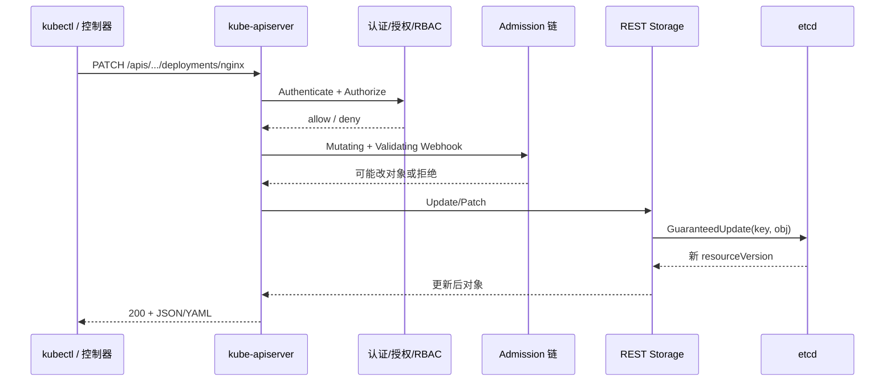
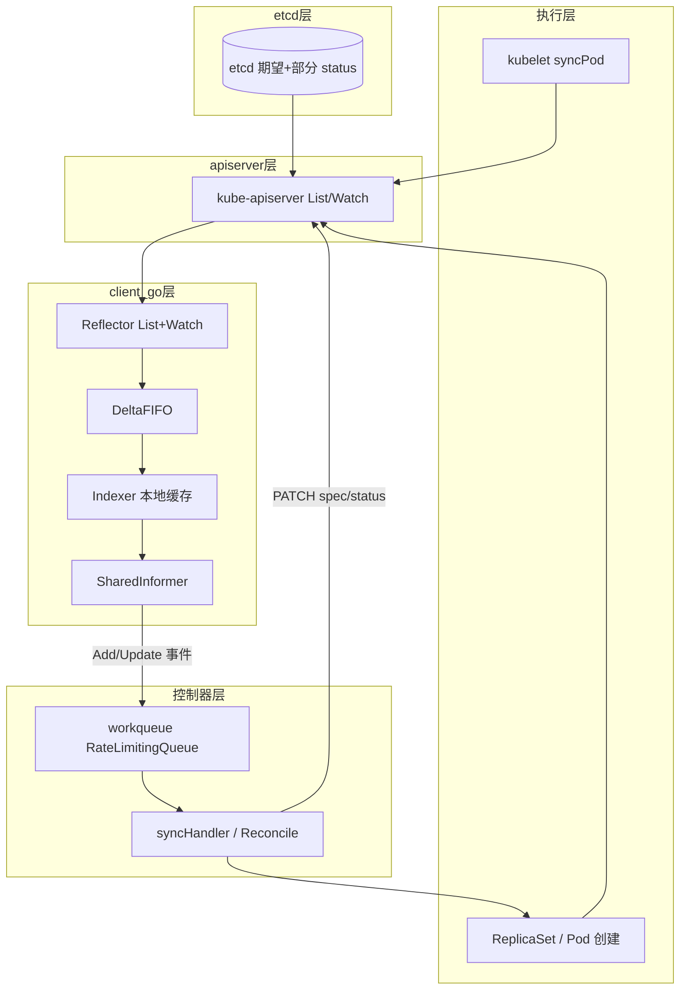

# kubectl apply 了却不生效？声明式 API、etcd 与控制器对账一条线讲透

`kubectl apply -f deploy.yaml` 返回 `configured`，`kubectl get deploy` 里 `READY` 仍是 `0/3`；改完 `replicas` 过一会儿又被改回去；同一 YAML 两人 apply 后字段互相覆盖——这些不是「K8s 抽风」，而是 **声明式 API 把期望状态写进 etcd → 控制器/Informer 异步对账 → 各组件写回 status** 这条链上某一环没按你想的方式工作。本文按 `kubernetes/kubernetes` 真实路径，从 API Object、REST 存储、apply/SSA、RBAC 到 Deployment 控制器 reconcile，串成可观测、可排障的闭环。

## 阅读地图

1. **第一层：声明式 API 与 API Object**——解决「期望状态存在哪、metadata/spec/status 各管什么、和 imperative 命令差在哪」。
2. **第二层：kube-apiserver 与 etcd**——解决「唯一写入口如何认证授权、对象如何持久化、resourceVersion 从哪来」。
3. **第三层：Informer 与 Controller reconcile**——解决「谁在读 etcd 变更、workqueue 如何驱动对账、为什么 status 不能靠 apply 直接改」。
4. **第四层：kubectl apply 与 Server-Side Apply**——解决「三路合并、last-applied-configuration、fieldManager 冲突怎么发生」。
5. **第五层：RBAC 与常见「已 apply 但不生效」排障**——解决「403/409、Finalizer、Admission、控制器未运行如何定位」。

## 源码锚点

| 路径 / 符号 | 作用 |
|-------------|------|
| `cmd/kube-apiserver/app/server.go` | apiserver 进程入口，组装 GenericAPIServer、REST 存储 |
| `staging/src/k8s.io/apiserver/pkg/server/genericapiserver.go` | `GenericAPIServer`：路由、handler 链、审计 |
| `staging/src/k8s.io/apiserver/pkg/endpoints/handlers/create.go` | POST 创建 handler |
| `staging/src/k8s.io/apiserver/pkg/endpoints/handlers/update.go` | PUT 全量更新 handler |
| `staging/src/k8s.io/apiserver/pkg/endpoints/handlers/patch.go` | PATCH（含 apply patch type）入口 |
| `staging/src/k8s.io/apiserver/pkg/endpoints/handlers/fieldmanager/` | Server-Side Apply 字段管理、`ManagedFields` |
| `staging/src/k8s.io/apiserver/pkg/registry/rest/rest.go` | `RESTStorage` 接口：`Create`/`Update`/`Get`/`Delete` |
| `pkg/registry/core/pod/storage/storage.go` | Pod REST 存储实现，挂接 etcd |
| `staging/src/k8s.io/apiserver/pkg/storage/etcd3/store.go` | etcd3 后端：`Create`/`GuaranteedUpdate` |
| `staging/src/k8s.io/client-go/tools/cache/reflector.go` | List-Watch 反射 etcd 变更到本地 cache |
| `staging/src/k8s.io/client-go/tools/cache/shared_informer.go` | SharedInformer：共享 Reflector + DeltaFIFO |
| `staging/src/k8s.io/client-go/util/workqueue/rate_limiting_queue.go` | 控制器侧限速队列 |
| `staging/src/k8s.io/kubectl/pkg/cmd/apply/apply.go` | `kubectl apply` 客户端逻辑 |
| `staging/src/k8s.io/kubectl/pkg/cmd/apply/apply_edit_last_applied.go` | 维护 `last-applied-configuration` 注解 |
| `pkg/controller/deployment/deployment_controller.go` | Deployment `syncDeployment` 对账 |
| `pkg/controller/replicaset/replica_set.go` | ReplicaSet 扩缩容对账 |
| `plugin/pkg/admission/` | Admission 插件链（Mutating/Validating） |
| `plugin/pkg/auth/authorizer/rbac/` | RBAC 授权实现 |

## 第一层：声明式 API 与 API Object

### 概念：期望状态 vs 观测状态

Kubernetes 的控制哲学是 **声明式（Declarative）**：你在 YAML 里写「我要什么」（`spec`），集群组件负责把现实世界调成那样，并把「现在怎样」（`status`）写回 API。与之相对，`kubectl run`/`kubectl scale` 等 **命令式（Imperative）** 调用是直接发「做某事」的 HTTP 请求，不保留完整期望状态历史。

每个 REST 资源对应一种 **API Object**，典型结构（以 Deployment 为例）：

```yaml
apiVersion: apps/v1
kind: Deployment
metadata:
  name: nginx
  namespace: default
  labels:
    app: nginx
  annotations:
    deployment.kubernetes.io/revision: "3"
spec:
  replicas: 3
  selector:
    matchLabels:
      app: nginx
  template:
    metadata:
      labels:
        app: nginx
    spec:
      containers:
      - name: nginx
        image: nginx:1.25
status:
  observedGeneration: 3
  replicas: 3
  readyReplicas: 3
  availableReplicas: 3
```

| 字段块 | 谁写 | 含义 |
|--------|------|------|
| `metadata` | 用户 + 系统 | 名称、namespace、labels、annotations、resourceVersion、uid |
| `spec` | 用户（及 SSA fieldManager） | **期望状态**，控制器读它并对账 |
| `status` | 控制器/kubelet 等 | **观测状态**，客户端 apply 不应依赖手写 |

`resourceVersion` 是 etcd 里的乐观锁版本号；并发 PUT/PATCH 冲突时会返回 HTTP 409，客户端需重试。`generation`（部分资源）在 `spec` 变更时递增，控制器用 `observedGeneration` 判断是否已处理最新 spec。

### 机制：REST 资源模型

apiserver 按 **Group/Version/Resource**（GVR）暴露 URL，例如：

```
GET  /apis/apps/v1/namespaces/default/deployments/nginx
POST /apis/apps/v1/namespaces/default/deployments
PATCH /apis/apps/v1/namespaces/default/deployments/nginx
```

内置资源在 `pkg/registry/` 下注册；CRD 在 `staging/src/k8s.io/apiextensions-apiserver/` 动态注册。所有持久化对象最终进 **etcd** 的 `/registry/...` 键空间（具体前缀以集群版本为准）。

### 与命令式 kubectl 的对照

```bash
# 命令式：直接 create/update，不维护 last-applied
kubectl create deployment nginx --image=nginx:1.25
kubectl scale deployment nginx --replicas=5

# 声明式：以文件为期望状态，可重复 apply
kubectl apply -f deployment.yaml
kubectl diff -f deployment.yaml    # 预览差异（需 server 支持）
```

`kubectl replace --force` 会删再建，UUID 变化，关联 Service/HP A 可能断裂——生产慎用。

## 第二层：kube-apiserver 与 etcd

### 概念：apiserver 是唯一控制面入口

Node 上的 kubelet、控制面的 scheduler/controller-manager 都 **只通过 apiserver** 读写对象，不直连 etcd（admin 排障除外）。这样认证、授权、准入、审计、版本转换都集中在一处。

### 调用链：一次 PATCH 如何落盘



### 源码：`GenericAPIServer` 与 REST Storage

apiserver 启动时在 `cmd/kube-apiserver/app/server.go` 里调用 `CreateServerChain`，把各资源的 `rest.Storage` 注册到路由。存储层实现 `staging/src/k8s.io/apiserver/pkg/registry/rest/rest.go` 中的接口，例如：

```go
// staging/src/k8s.io/apiserver/pkg/registry/rest/rest.go（接口摘要）
type Creater interface {
    Create(ctx context.Context, obj runtime.Object, ...) (runtime.Object, error)
}
type Updater interface {
    Update(ctx context.Context, name string, obj runtime.Object, ...) (runtime.Object, bool, error)
}
type Patcher interface {
    Patch(ctx context.Context, name string, pt types.PatchType, data []byte, ...) (runtime.Object, error)
}
```

etcd3 实现在 `staging/src/k8s.io/apiserver/pkg/storage/etcd3/store.go`，`GuaranteedUpdate` 在事务内读-改-写，保证 resourceVersion 单调递增。

### 配置与观测

```bash
# apiserver 健康（以实际 bind 地址为准）
curl -k https://127.0.0.1:6443/healthz
curl -k https://127.0.0.1:6443/livez?verbose

# 查看某对象在 etcd 中的键（需 etcdctl 证书，键路径因版本略有差异）
ETCDCTL_API=3 etcdctl \
  --endpoints=https://127.0.0.1:2379 \
  --cacert=/etc/kubernetes/pki/etcd/ca.crt \
  --cert=/etc/kubernetes/pki/etcd/server.crt \
  --key=/etc/kubernetes/pki/etcd/server.key \
  get /registry/deployments/default/nginx --prefix

# apiserver 审计日志（集群若启用 audit policy）
tail -f /var/log/kubernetes/audit.log
```

### 排障：写请求成功但对象不对

| 现象 | 常见原因 | 命令 |
|------|----------|------|
| 403 Forbidden | RBAC 或 webhook 拒绝 | `kubectl auth can-i patch deployments -n default --as=system:serviceaccount:...` |
| 409 Conflict | resourceVersion 过期 | 重新 get 再 patch；检查是否有多个控制器抢写 |
| 422 Invalid | Validating webhook / CRD schema | `kubectl apply -v=8` 看请求体；查 webhook 日志 |
| 对象被改回 | 另一 fieldManager 或 operator | `kubectl get deploy nginx -o yaml` 看 `managedFields` |

## 第三层：Informer 与 Controller reconcile

### 概念：异步对账环

用户改 `spec` 只更新了 etcd 里的期望状态。**Deployment controller**、**ReplicaSet controller**、**kubelet** 等各自 watch 相关资源，把「当前 spec」与「集群实际」比较，执行 create/update/delete，最后 **写 status**（或子资源 status）。

这是 **level-triggered**（电平触发）：即使错过一次 watch 事件，Informer  resync 周期也会再对账；不是 edge-triggered 一次性脚本。

### 模块分层



### 源码：Reflector → workqueue → sync

**Reflector**（`staging/src/k8s.io/client-go/tools/cache/reflector.go`）周期性 `List` 全量 + `Watch` 增量，把对象塞进 **DeltaFIFO**，Indexer 维护 namespace/name 索引。

控制器典型写法（Deployment 简化）：

```go
// pkg/controller/deployment/deployment_controller.go
func (dc *DeploymentController) syncDeployment(ctx context.Context, key string) error {
    // key = namespace/name
    // 1. 从 Informer cache 取 Deployment
    // 2. 算 ReplicaSet、滚动策略
    // 3. 创建/更新/删除 RS 与 Pod template
    // 4. 更新 Deployment status（replicas、conditions）
}
```

事件入队：

```go
// staging/src/k8s.io/client-go/util/workqueue/rate_limiting_queue.go
// Add / AddRateLimited / Forget
// 失败指数退避，避免坏对象打满 apiserver
```

### 重点：status 不是 apply 的目标

```bash
# 这样改 status 会被 apiserver 拒绝或忽略（子资源 status 有专门接口）
kubectl patch deployment nginx --type=merge -p '{"status":{"readyReplicas":99}}'
# 正确观测
kubectl get deployment nginx -o jsonpath='{.status.readyReplicas}'
```

业务容器 Ready 由 **kubelet 探针** 写 Pod status，Deployment 聚合到 `readyReplicas`——链路过长，apply 后秒级不变是常态。

### 观测控制器是否在跑

```bash
# 控制平面 Pod（静态 Pod 或 Deployment 视安装方式而定）
kubectl get pods -n kube-system -l component=kube-controller-manager
kubectl logs -n kube-system kube-controller-manager-master --tail=50

# 看 Deployment 事件
kubectl describe deployment nginx
kubectl get events -n default --field-selector involvedObject.name=nginx --sort-by='.lastTimestamp'
```

## 第四层：kubectl apply 与 Server-Side Apply

### 概念：客户端 apply 在做什么

`kubectl apply` 默认走 **PATCH**，类型为 `application/apply-patch+yaml` 或 strategic merge patch（内置类型）。核心思想：把本地 manifest 与 **上次 apply 留下的注解** `kubectl.kubernetes.io/last-applied-configuration` 以及 **当前 live 对象** 做三路合并，只发送差异字段。

源码入口：`staging/src/k8s.io/kubectl/pkg/cmd/apply/apply.go` 的 `ApplyOptions.Run()`。

### Server-Side Apply（SSA）

Kubernetes 1.18+ 起推广 **服务端 apply**：字段级 **fieldManager** 记录在 `metadata.managedFields`，冲突时 apiserver 可拒绝或强制接管。逻辑在 `staging/src/k8s.io/apiserver/pkg/endpoints/handlers/fieldmanager/`。

```bash
# 强制 SSA（kubectl 1.22+ 默认对多数资源）
kubectl apply -f deployment.yaml --server-side --field-manager=my-team

# 看谁在管哪些字段
kubectl get deployment nginx -o yaml | yq '.metadata.managedFields'

# 冲突时强制覆盖（慎用）
kubectl apply -f deployment.yaml --server-side --force-conflicts --field-manager=my-team
```

### 客户端 apply vs SSA 对照

| 维度 | 客户端 apply + last-applied | Server-Side Apply |
|------|----------------------------|-------------------|
| 字段归属 | 注解里整份 JSON | `managedFields` 按 manager 分字段 |
| 与 `kubectl edit` 混用 | 易三路合并混乱 | 非 managed 字段可能被其他 manager 保留 |
| GitOps（Argo/Flux） | 常改 fieldManager | 需统一 `--server-side` 与 manager 名 |
| 源码 | `apply_edit_last_applied.go` | `fieldmanager.go` + Patch handler |

### 可执行：验证 apply 实际发了什么

```bash
kubectl apply -f deployment.yaml -v=8 2>&1 | grep -E 'PATCH|POST|curl'
kubectl get deployment nginx -o json | jq '.metadata.annotations["kubectl.kubernetes.io/last-applied-configuration"]'
```

### 配置：kubeconfig 与上下文

```bash
kubectl config view --minify
kubectl config use-context prod-cluster
export KUBECONFIG=~/.kube/config:~/.kube/config-staging   # 多文件合并
```

## 第五层：RBAC 与「已 apply 但不生效」排障

### RBAC 在 apiserver 入口

请求路径：`Authenticate`（证书/Token/Webhook）→ `Authorizer`（RBAC 查 Role/ClusterRoleBinding）→ Admission → Storage。

```bash
# 当前用户能否 apply
kubectl auth can-i create deployments -n default
kubectl auth can-i patch deployments/nginx -n default

# 模拟某 SA
kubectl auth can-i list pods --as=system:serviceaccount:default:my-sa -n default

# 看谁有权限
kubectl get rolebinding,clusterrolebinding -A | grep my-sa
```

RBAC 源码：`plugin/pkg/auth/authorizer/rbac/`；REST 映射 verb：`get/list/watch/create/update/patch/delete` 等。

### 闭环排障：apply 成功 → 状态不变

按顺序执行，每层排除一类问题：

**步骤 1：确认 spec 真的变了**

```bash
kubectl get deployment nginx -o yaml | yq '.spec.replicas'
kubectl diff -f deployment.yaml
```

若 `spec` 未变，可能是 apply 到了错误 context/namespace，或 SSA 冲突被静默跳过（看 apply 输出与 managedFields）。

**步骤 2：看 generation 与 observedGeneration**

```bash
kubectl get deployment nginx -o jsonpath='gen={.metadata.generation} obs={.status.observedGeneration}{"\n"}'
```

`generation > observedGeneration` 说明 Deployment controller 尚未处理完或卡住。

**步骤 3：看 ReplicaSet 与 Pod**

```bash
kubectl get rs -l app=nginx --sort-by=.metadata.creationTimestamp
kubectl get pods -l app=nginx -o wide
kubectl describe pod -l app=nginx | tail -30
```

**步骤 4：Admission / Webhook**

```bash
kubectl get validatingwebhookconfigurations,mutatingwebhookconfigurations
# Pod 卡在 Pending/Creating 时查 webhook 超时
kubectl get events -A | grep -i webhook
```

**步骤 5：Finalizer 阻塞删除或更新**

```bash
kubectl get deployment nginx -o jsonpath='{.metadata.finalizers}'
# 需先解决 finalizer 对应控制器（如 ingress-lb 清理）
```

**步骤 6：控制器或 apiserver 异常**

```bash
kubectl get componentstatuses 2>/dev/null   # 老集群；新版本可能 deprecated
kubectl get --raw '/readyz?verbose' 2>/dev/null | head
kubectl logs -n kube-system -l component=kube-controller-manager --tail=100
```

### 场景表

| 症状 | 根因方向 | 关键证据 |
|------|----------|----------|
| apply 后 replicas 被改回 | HPA/VPA/Operator 与 apply 抢 spec | `kubectl get hpa`; managedFields manager 名 |
| READY 长期 0/3 | Pod 未 Ready，非 Deployment 问题 | `kubectl describe pod`; 探针/镜像拉取 |
| 配置改了容器 env 不生效 | 只改了 RS template，旧 Pod 未重建 | `kubectl rollout restart deployment/nginx` |
| 两人 apply 字段互删 | 客户端 apply 与 edit 混用 | 改 SSA + 统一 GitOps |
| 403 | RBAC | `kubectl auth can-i` |
| 一直 Terminating | finalizer | metadata.finalizers |

### Deployment 滚动更新与 spec 生效

```bash
kubectl rollout status deployment/nginx
kubectl rollout history deployment/nginx
kubectl rollout undo deployment/nginx --to-revision=2
```

控制器在 `pkg/controller/deployment/` 按 `strategy.type`（RollingUpdate/Recreate）创建新 RS、缩旧 RS；**Pod spec 变更不会原地改容器**，而是新 Pod + 删旧 Pod。

## 重点知识串讲：从 YAML 到 Running

```mermaid
flowchart LR
    YAML[本地 YAML] -->|kubectl apply PATCH| API[kube-apiserver]
    API --> ETCD[(etcd spec)]
    ETCD -->|Watch| DC[Deployment Controller]
    DC -->|Create/Update| RS[ReplicaSet]
    RS -->|Create| POD[Pod spec]
    POD -->|Watch| KL[kubelet]
    KL -->|CRI| RUN[容器 Running]
    RUN -->|Probe OK| ST[Pod status Ready]
    ST -->|聚合| DEP[Deployment status]
```



1. **声明式**：你只管 `spec`，`status` 是副产品。
2. **etcd**：唯一持久化真相源（控制面视角）。
3. **apiserver**：唯一 API 入口；RBAC/Admission 在此拦截。
4. **Informer + workqueue**：控制器可扩展、可重试的对账引擎。
5. **apply/SSA**：多协作方写同一对象时的字段归属机制。
6. **排障**：先 spec 是否写入 → controller generation → Pod 事件 → 节点/kubelet。

## 附录：常用 kubectl 与调试命令

```bash
# 导出 live 对象去掉 status/noise
kubectl get deployment nginx -o yaml > live.yaml

# 干跑创建（1.19+ server dry-run）
kubectl apply -f deployment.yaml --dry-run=server

# 看 API 支持的资源
kubectl api-resources | grep deployments

# 追踪单资源变更
kubectl get deployment nginx -w

# 强制删除卡死对象（最后手段）
kubectl patch deployment nginx -p '{"metadata":{"finalizers":null}}' --type=merge
```

## 附录：API Object 版本与存储版本

同一资源可能有多个 `apiVersion`（如 `extensions/v1beta1` 已废弃，应使用 `apps/v1`）。apiserver 内部有 **storage version** 与 **conversion**（`staging/src/k8s.io/apiserver/pkg/storage/storagecodec.go`），etcd 里存的可能是内部版本，读时转成用户请求的 version。

```bash
kubectl explain deployment.spec.strategy
kubectl explain pod.spec.containers.livenessProbe
```

## 附录：Lease 与控制器选主

`kube-controller-manager` 多副本时通过 **Leader Election**（`staging/src/k8s.io/client-go/tools/leaderelection/`）抢 `Lease` 对象，只有 leader 跑 sync。若 leader 失联，备节点接管；短暂双 leader 可能导致重复事件，但 level-triggered reconcile 最终一致。

```bash
kubectl get lease -n kube-system
kubectl describe lease kube-controller-manager -n kube-system
```

## 附录：ResourceQuota 与 LimitRange 对 apply 的间接影响

apply 只改对象；**ResourceQuota** 可能在 Admission 阶段拒绝 Pod 创建，表现为 Deployment READY 不涨：

```bash
kubectl get resourcequota -n default
kubectl describe resourcequota
kubectl get limitrange -n default
```

## 附录：命名空间与作用域

Namespaced 资源：`deployments`、`pods`、`services`。Cluster  scope：`nodes`、`clusterroles`、`persistentvolumes`。apply 时 `metadata.namespace` 必须与 `-n` 一致，否则对象进错 namespace，表现为「改了但没效果」。

```bash
kubectl get deployment nginx -n default -o jsonpath='{.metadata.namespace}{"\n"}'
kubectl config set-context --current --namespace=default
```

## 附录：Watch 断线与 relist

Reflector watch 超时或 apiserver 重启后会 **relist** 全量。大集群 list 成本高，可通过 `--watch-cache`（apiserver 侧）减轻 etcd 压力。控制器延迟在 relist 期间可能略增，属正常；持续不同步才查 controller-manager 日志。

## 附录：Condition 与 Deployment Progressing

Deployment `status.conditions` 中 `Progressing`、`Available` 由控制器维护：

```bash
kubectl get deployment nginx -o jsonpath='{range .status.conditions[*]}{.type}={.status} {.reason}{"\n"}{end}'
```

`Progressing=False` 且 `Reason=ProgressDeadlineExceeded` 表示滚动超时，查 Pod 事件与 `spec.progressDeadlineSeconds`。

## 附录：OwnerReference 与级联删除

ReplicaSet 的 `ownerReferences` 指向 Deployment；Pod 指向 ReplicaSet。`kubectl delete deployment` 默认 **Background** 级联删 RS/Pod。孤儿 Pod 多因 RS 被删但 Pod 的 owner 已清——用 `kubectl get pod -o yaml | yq '.metadata.ownerReferences'` 查。

## 附录：Annotation vs Label

**Label** 参与 selector，影响 Service/NetworkPolicy。**Annotation** 不参与选择，常放 `last-applied-configuration`、Prometheus scrape 配置。误删 annotation 会导致下次 apply 三路合并异常。

## 附录：Impersonation 调试 RBAC

```bash
kubectl create deployment test --image=nginx --dry-run=server \
  --as=system:serviceaccount:app:deployer -n app
```

## 附录：Aggregated API 与 CRD

CRD 定义在 `CustomResourceDefinition`，由 **apiextensions-apiserver** 注册；CR 的 apply 路径与内置资源相同，但可能没有 strategic merge patch，apply 行为以文档为准。

```bash
kubectl get crd
kubectl apply -f my-crd-instance.yaml --server-side
```

## 附录：etcd  compaction 与 defrag（运维边界）

etcd 历史版本压缩后，过旧的 resourceVersion watch 可能失效，触发 relist。运维在成员变更、defrag 时需按官方 runbook 操作；apiserver 报 `Too large resource version` 类错误时查 etcd 与 apiserver 版本匹配（以发行版为准）。

## 附录：本地缓存与 `--cache-dir`

kubectl 客户端不跑 Informer；控制器/Informer 在 controller-manager 进程内。区分 **客户端 apply** 与 **控制器 cache**，排障时不要假设 kubectl get 与 controller 同一瞬间视图（etcd 一致但 watch 有毫秒~秒级延迟）。

## 附录：Patch 类型速查

| PatchType | 用途 |
|-----------|------|
| StrategicMergePatch | 内置类型 merge 数组策略 |
| MergePatch | JSON merge RFC7386 |
| JSONPatch | RFC6902 |
| ApplyPatch | SSA / apply 专用 |

源码：`staging/src/k8s.io/apiserver/pkg/endpoints/handlers/patch.go` 内按 Content-Type 分支。

## 附录：Sync 周期与 `minResyncPeriod`

Informer 可选 resync 周期，定期把 cache 全量 key 丢进 workqueue 再 sync，防止 watch 丢事件。Deployment 默认 resync 约 10 小时量级（以源码 `pkg/controller/deployment/config` 为准），所以 **偶尔** 靠 resync 修复漂移，不能替代正确的 spec 更新。

## 附录：HorizontalPodAutoscaler 改 spec 的典型冲突

```bash
kubectl get hpa
kubectl describe hpa nginx
```

HPA controller 改 Deployment `spec.replicas`；你用 apply 改 replicas 会被 HPA 在下个 loop 改回。应改 HPA `maxReplicas` 或删 HPA。

## 附录：VPA（若安装）

Vertical Pod Autoscaler 可能改 Pod resource requests，与固定 resource 的 manifest 冲突；看 `managedFields` 中 manager 是否为 `vpa-updater`（以集群是否安装 VPA 为准）。

## 附录：kube-apiserver 请求限流

`--max-requests-inflight`、`--max-mutating-requests-inflight` 限流时 apply 可能 429；客户端 kubectl 会重试。大规模 GitOps 需调 apiserver 标志或拆多个 shard（以版本为准）。

## 附录：审计与 tracing

启用 **API Priority and Fairness**（APF）后，controller 与 kubectl 分不同 FlowSchema，防止 controller 风暴饿死用户请求。观测：

```bash
kubectl get flowschema,prioritylevelconfiguration
kubectl get --raw /metrics | grep apiserver_flowcontrol
```

## 附录：典型 Deployment 控制器事件流

1. 用户 apply → Deployment spec 更新 → generation++  
2. Deployment controller sync → 创建新 RS（revision annotation）  
3. RS controller sync → 创建 Pod  
4. scheduler bind → Pod spec.nodeName  
5. kubelet syncPod → 容器启动  
6. probe 成功 → Pod Ready → RS status → Deployment status  

任何一环失败，`kubectl get deploy` 的 READY 都不会满。

## 附录：使用 `kubectl replace` 的边界

`replace` 要求完整 object 且 resourceVersion 匹配；适合 CI 全量替换，不适合多人协作字段级合并。与 apply 混用同一对象极易 409 或字段丢失。

## 附录：Subresource

Pod 的 `/status`、`/eviction`、`/exec` 等是 **subresource**，单独 RBAC verb（如 `pods/status`）。只改 spec 的 apply 不走 status subresource；kubelet 更新 status 走 `UpdateStatus` 或 PATCH status。

```bash
kubectl auth can-i update pods/status -n default
```

## 附录：Defaulting 与 Conversion Webhook

Mutating admission 可能在对象持久化前补默认值（如 `spec.replicas: 1`）。`kubectl get -o yaml` 看到的可能是 default 后结果，与原始文件不完全一致，属正常。

## 附录：Namespace termination

Namespace 处于 `Terminating` 时，内部资源 apply 可能卡住；查 `kubectl get ns xxx -o yaml` 的 `spec.finalizers` 与 namespace controller 日志。

## 附录：总结性对照表

| 环节 | 存储/执行位置 | 主要源码 |
|------|---------------|----------|
| 期望 spec | etcd | `etcd3/store.go` |
| API 入口 | kube-apiserver | `handlers/*.go` |
| 对账 | controller-manager | `pkg/controller/*` |
| 本地视图 | Informer cache | `client-go/tools/cache` |
| 声明式 CLI | kubectl | `kubectl/pkg/cmd/apply` |
| 字段冲突 | SSA fieldManager | `handlers/fieldmanager` |

排障口诀：**先 etcd/spec，再 controller 事件，再 Pod/节点**；apply 只是链路的起点，不是终点。
